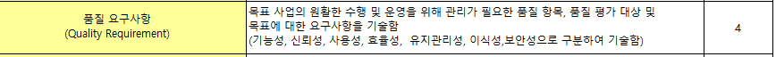
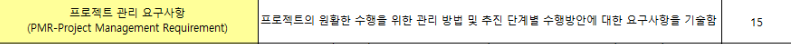
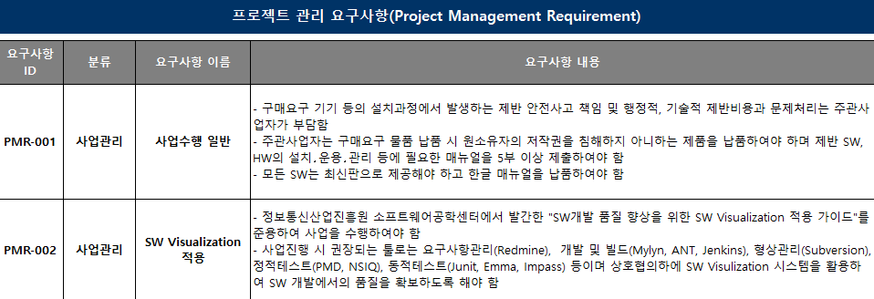
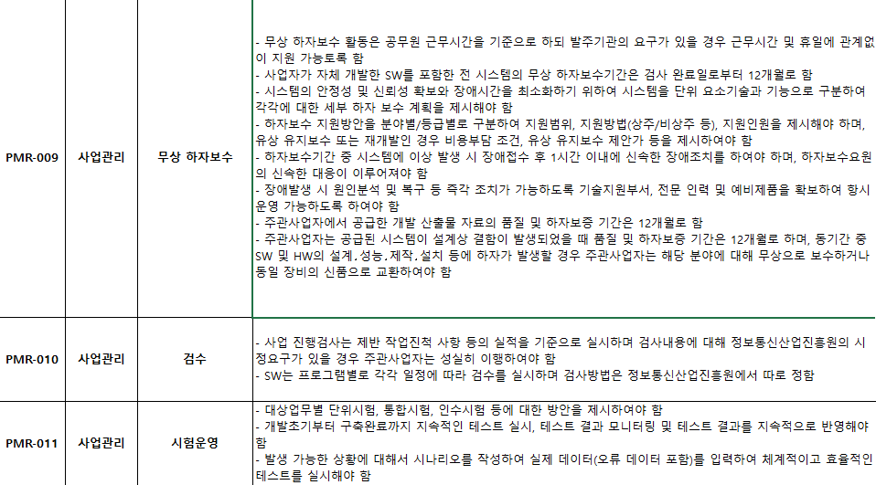
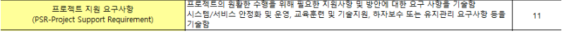

# 200416_W3D1_요구사항정의서 마무리

## 전 시간 복습

개발프로세스 = 분석,설계,시험,구현 이 주요 프로세스이며

전체는 7가지가 있다. (개발준비,분석,설계,구현,시험,전개,인도)

특히 주요 4단계 프로세스 중에서도 분석, 설계 2가지 프로세스가 가장 중요함.

분석,설계 쪽에 좀 더 중점을 둠

## 각 분야에서 가장 중요한 문서

### 분석 - 요구사항 정의서, 요구사항 추적표

#####  - 분석단계에서 가장 중요한 문서

그 다음 중요한 문서는 유스케이스 명세서.

### 설계 - 소프트웨어 아키텍쳐 설계(설계서) , 사용자 인터페이스 설계,  ERD

## 요구사항 정의서 이어서

정련 -> 확정

주요 요구사항 4가지 - 기능,데이터,보안,성능 만 나와있지만

사실 이 4가지 보다 훨씬 많은 경우가 많다 

but 이 4가지가 가장 중요하기 때문에 정의서에서는 4가지를 반드시 다 명시해야한다.

## 요구사항 정의서

2015년 예시

PDF - 교과서 적인 표본

엑셀 - 

#### 5.보안 요구사항 @

보안 요구사항은 

목표시스템의 데이터가 1번

기능이 2번

운영 접근이 3번이다.

데이터는 암호화 등으로 데이터 보안을 강화하는 것을 의미하며, 

기능과 운영접근은 사용자들을 분류하는 것을 의미함.

보안을 진단하기 위해선

이러한 요건이 필요하다.

##### 기술자경력신고 or 기사자격증으로 자신의 경력을 증명할 수 있다.

-> 이직,취업시 유리 , 한국 소프트웨어 협회에서 경력자 등록을 함

##### 시큐어 코딩

보안 설계를 위한 시큐어 코딩을 개발단개부터 실행할 경우 추후 고치는 것 보다 30배 절감 효과가 있다.

ex)

##### 보안 가이드라인

#### 6.품질 요구사항

ex) 

소프트웨어의 품질이 좋으냐 나쁘냐를 가르는 요구사항.

#### 7.제약사항

사전에 파악된 하면 안되는 제약 사항들,

업무나 법률, 기술 등으로 지켜야 하는 제약조건들을 명시하면서 제한을 한다.

ex)

웹접근성 -> 웹접근성지침을 준수한다는 마크를 받아오라는 의미임.

그 외에 개발 표준을 준수한다던가 특정 기술을 만족해야한다는 등 제약조건 들을 다룸. 

#### 8. 프로젝트 관리 요구사항

1) 제반 비용과 문제처리의 책임은 주관 사업자

2) 형상관리는 모듈, 버전을 지속적으로 관리하는 것을 의미.

3) 계획서 제출

4) 각종 계획 보고

9) 개발 완료 후에도 문제가 생길 수 있으므로 1년정도는 무상으로 보수를 해줘야함.

10) 검수 = 검사 같은 의미 일정 기간마다 검수를 함

따로정함 -> 미리 정해야함

11) 프로젝트가 끝나기 전 or 시간적 여유가 있을 때 시험적으로 운영을 해보는 것

12) 일정을 초과할 경우 지연과 관련된 벌금을 내야함.

진도 보고서 -> 검수에서도 사용됨 

15) 프로젝트 진행 중 개발자가 퇴사할 경우가 가장 큰 리스크

#### 9.  프로젝트 지원 요구사항

관리요구사항은 보통 한국정보화진흥원의 사업정보관리방법론에 잘 나와있다.

ㅡㅡㅡ 

지원요구사항 : 메인은 아닌데 서브로 필요한 요구사항들을 제시하는 항목,

교육훈련이나 운영, 보수 등등을 요구사항 정의서에 기술한다.

하자보수는 보통 프로젝트 완료일로부터 1년 정도 사업 담당 회사가 담당한다.

1년 내에 결점이 발견되면 사업자가 보상을 해야한다.

유지보수는 오늘 날 별도의 유지보수 계약을 맺는 형태로 바뀌었다.

ex)

@시스템 개발이 끝나면 저작권은 발주자가 갖게 된다.

8,9) 메뉴얼을 따로 작성하여 제출해야함.

10) 메뉴얼 + 교육을 따로 해야함.

교육의 경우 외부 교육으로 돌리는 경우도 꽤 있음.

#### @SW 관련 직종 임금

업무분석가가 매우 높음

