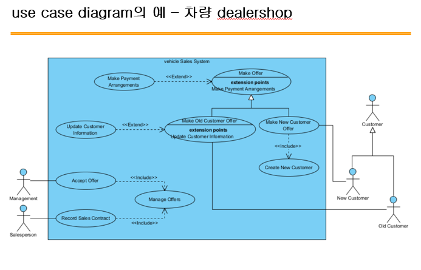
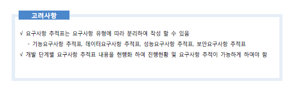
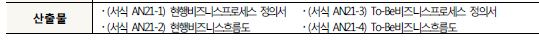

# 200422_W4D1_유스케이스,분석단계마무리

분석단계의 요구사항 정의서 -> 유스케이스 로 넘어감.

## **수행사**(**개발자**)가 소프트웨어를 개발하는 이유

#### 고객이 해결이 필요한 문제가 있기 때문

이 문제를 해결할 수 있는 적절한 솔루션(SW, 사람 등등)이 없을 경우

#### 고객이 솔루션을 못 찾을 경우 새롭게 개발하는 방법을 선택

고객 자신이 직접 개발능력을 보유하지 않을 경우 수행사(개발자) 위임

#### 수행사(개발자)는 고객의 문제를 충분히 이해하는가?

domain knowledge의 중요성, 경험의 중요성
인터뷰와 요구사항정의서를 작성
그러나 이 단계를 종료했다고 해서 개발을 할 수 있을 것 같지는 않다.

##### 아직 real world(고객의 문제)가 `사이버 환경`으로 정의되지 않았기 때문(A,추상화)

#### Modeling : (A)가 모델링

고객과 개발자, 개발자와 개발자 상호간에 의사소통을 위한 수단(이해관계자)
모델링을 할 때 사용하는 도구(언어)가 UML(Unified Modeling Language)
Modeling Language는 (A)를 수행할 때 그래픽으로 결과를 보여주는 시각적언어

#### 정리 : 

##### 실제 문제(real world) -> 코딩으로 구현(cyber world)를 하는 것이 추상화이다.

##### 이때 이 추상화를 도와주는 도구가 바로 UML이다.

#### UML의 실행 단계는?

요구사항 정의서가 완료된 후

## 실제 사용되는 유스케이스의 종류는?

##### class, activity, sequence, use case, state machine 

이 5가지의 다이어그램이 가장 많이 쓰인다.

#### 현재 우리 교과서는 이 많은 UML 중에 Use Case 하나만을 요구함.

#### 14개의 UML 다이어그램 중 하나

- 14개의 다이어그램 중 무엇을 작성할 것인가는 `프로젝트 계획 단계의 테일러링` 단계에서 결정

- 사용자(end user) 관점에서 개발해야 하는 시스템을 설계(design)하는 데 최적

-  `요구사항 정의서`에서 추출 → 시스템의 기능적 요구사항(functional requirement)만 표현

- 다른 요구사항의 예  : business rules, QoS requirements, implementation constraints

- use cases, actors, systems 사이의 관계를 요약하여 표현

## 유스케이스 다이어그램의 구성

이러한 하나의 그림을 유스케이스 다이어그램이라 하고

가운대 원 하나 하나(handle message 같은)를 유스케이스라 한다.

#### 유스케이스 다이어그램은 

#### Actor , Association , Use Case, System Boundary 4가지로 구성되어있다.

Actor는 사용자 한 명이 될 수도 있고 접근 기계도 될 수 있다.

#### 액터(Actors)

시스템 밖에서 시스템과 상호작용하는 모든 것(사람, 다른 시스템 등등)
Actor를 추출하는 능력이 중요

#### Actor를 추출하는데 유용한 팁

Who uses the system?
Who installs the system? - 사업을 누가 초기화 하는가
Who starts up the system? - 누가 시작하는가 
Who maintains the system? - 유지보수는 누가?
Who shuts down the system? - 시스템을 끝내는 사람은 누가? -> 위의 사진의 파란색 네모 안의 시스템
What other systems use this system? - 다른 시스템이 이용하는가?
Who gets information from this system? - 누가 정보를 사용하는가?
Who provides information to the system? - 누가 정보를 입력하는가
Does anything happen automatically at a present time? - 어떨 때 자동으로 실행되는가?

#### 입력을 수행하는 Actor, 출력을 수행하는 Actor, 둘 다 수행하는 Actor

#### use cases

시스템이 수행하는 기능, use case가 모여 시스템을 구성
시스템과 Actor와의 의사소통 담당

#### use case를 추출하는데 유용한 팁

What **functions** will the actor want from the system?

Does the system store information? What actors will **create, read, update or delete** this information?

- ##### create, read, update or delete function을 찾아야함.

Does the system need to **notify** an actor about changes in the internal state?

- 알려주는 functions

Are there any external events the system must know about? What actor **informs** the system of those events?

- 통지해주는 기능

## 유스케이스 관계의 종류 - 3가지 

### 1.포함 관계	

ex) 책을 빌리기 위해서는 책이 있는지 체크를 하고, 예약이 되어있는지 체크를 한 후에 빌려줘야 한다.

### 2.확장 관계

포함 관계의 반대 방향 화살표

특정 케이스에서 추가적으로 실행되는, **선택에 따른** 유스케이스

### 3.일반화 관계

ex) 책번호로 검색 , 작가로 검색 둘 다 검색 기능의 기능을 이어받는 유스케이스임.

즉, 자식 부모 관계임

#### 서로 보강해주는 관계

## ex)

중고차 판매의 유스케이스 다이어그램

일반화된 부모,자식 관계

## **use case modeling** **과정**

##### 1. **Actor** **찾기**

##### 2. **use case** **찾기**

##### 3. **use case** **상세화** **:**

- **시스템의 동작 오류와 예외조건까지 상세화**

  

##### 4. **Actor** **와** **use case** **사이의 관계 규정**

- **Include Relationship Extension Relationship Generalization Relationship**

  

##### 5. **비기능적인 요구사항 찾기**

- ##### 시스템의 성능, 문서화, 자원, 품질 등의 요구 사항

## 그 외 다이어그램 예시

### 시퀀스

시스템의 흐름을 다룸

### 클래스

변수들(클래스)과 변수들의 관계를 다룸

### 컴포넌트

구성자들과 어떻게 interface 하는가를 다룸.

각각의 component들이 어떤 action을 하는지를 메세지 기반으로 다루는 다이어그램

#### 유스케이스 실제 예시

## 분석 단계 흐름

요구사항 분석 -> 수집 -> 정의 -> 유스케이스 기술 -> 추적 순임.

유스케이스를 했으니 이제 요구사항 추적으로 넘어감.

## 요구사항 추적

#### 요구사항 추적표 예시 

### 업무 데이터 분석

초기에 업무분석을 잘해서 요구사항 정의서만 잘 정의하면 흐름이 매우 편해진다.

이후에는 개발 실력에 따라 다름

### 업무분석 

산출물은 4가지가 있음.

### 데이터 분석

현행표준사전정의서?

-> 특정 단어는 어떤 단어로 정의하는 등 모두가 사용하는 단어를 통일시킴

ex) CO2와 이산화탄소 중 이산화탄소만을 사용한다. 

### 아키텍쳐 분석

30 - 사업에 필요한 아키텍처들을 분석하고 설계함

### 현행아키텍처 분석

현재 가지고 있는 아키텍처들을 분석함,

ex) 오라클 라이센스 , 한글 , 워드 라이센스 등등

### 총괄 테스트 계획

추후 테스트를 할 계획서를 작성함.

단계별 테스트 : 분석,설계,구현,시험,전개 단계에서 시행하는 테스트가 각각 다름.

##### 테스터에 관한 정보

#### TTA 아카데미 

- 소프트웨어 테스트, 품질에 대한 교육을 시행하는 곳(30만원 정도)

엔지니어에 대한 교육임.

### 분석단계 산출물 점검 - 매우 중요한 파트

이 파트가 사용자 요구사항을 받는 마지막 단계임.

그러므로 여기서 요구사항들을 다 받아두고 검토한 뒤, 더이상의 요구조건들을 받는 걸 끝내야 한다.

## 중간고사 관련?

다음시간에 지난 중간고사 문제 풀이,

다다음 시간에 오프라인 강의가 된다면 현강으로 중간고사,

## 책  소개

에이미 추아 - 제국의 미래 

로마,스페인,네덜란드 등 한 때 세계를 지배하는 국가들에 대해 다룬 책

독후감 요구는 X