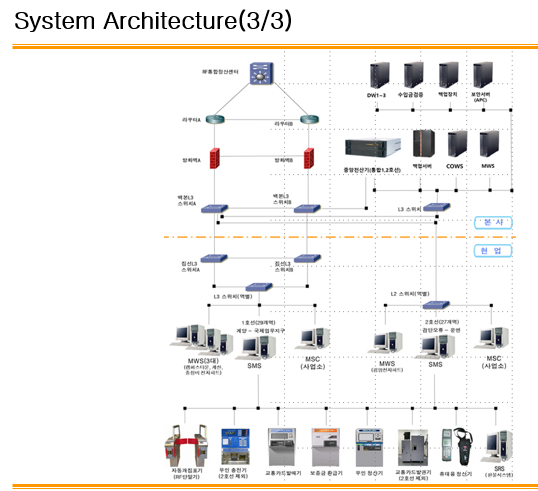
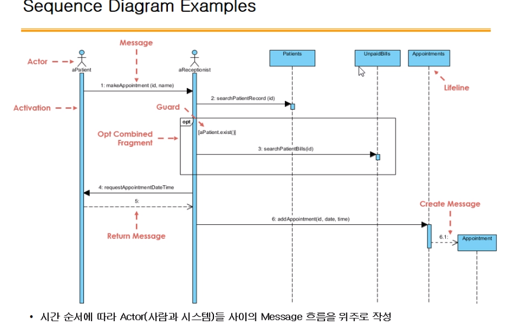

# 200506_W6D1_설계단계

전자정부 프로세스 7단계 중

분석 설계 구현 시험 단계가 가장 중요하고

그 중에서도 분석, 설계가 가장 중요함.

# 설계 단계의 흐름?

그동안 해온 것들은 시스템의 아키텍처

이제 배울 것은 소프트웨어의 아키텍처.

## 전자정부의 소프트웨어 3가지 종류

1.전자정부 프레임워크

공통된 분야 및 서비스.

2.구매하는 소프트웨어

-DBMS, Office 등등

3.개발예정 소프트웨어

-우리가 만들 예정의 소프트웨어

## 소프트웨어 아키텍처

우리가 만들 예정의 소프트웨어 + 관련 모든 소프트웨어에 대한 설계서

## 시스템 아키텍처

소프트웨어 아키텍처는 개발 예정의 소프트웨어 한정의 아키텍처이다.

시스템 아키텍처는 전체, 하드웨어나 네트워크 등 모든 것을 다룸.

네트워크 ,서버 등등 모든 것을 다룸

## 어플리케이션 설계(DE20)

## Sequence Diagram Examples

사람만 액터가 아니라 위의 직사각형들도 다 액터에 속함.

## Class Diagram

시퀀스와 클래스만 있어도 불안정하지만 소프트웨어 개발이 가능.

## 분석단계와 설계단계에서의 클래스 다이어그램 차이점

분석 - 개념적인 부분을 추상적으로

설계 - 실제 데이터 항목의 이름 등, 자세하게

## 화면설계서 (사용자 인터페이스 설계)

특정 경우에 대해서 자세하게 표시 해야함.

ex) 이름의 길이는 최소2, 외국인 대응 가능하게

## 클래스와 컴포넌트의 차이

클래스는 기술, 컴포넌트는 실제 구현한 코드

## 컴포넌트 설계서

각각 업무 컴포넌트, 데이터 컴퓨넌트 등등으로 항목 별로 나눔.

설계서 간 상호작용은 복잡하므로 다루지 않음,

## 인터페이스 설계서

인터페이스 설계서는 매우 자세하게 설정해야한다.

ex)어떤 버튼을 누르면 어떤 기능이 되고 ~

## 배치(batch) 설계

일괄 처리(batch)가 필요한 부분을 설계.

배치의 반댓말은 

#### 실시간

시급하지 않으나 데이터 양이 많을 경우 배치를 사용하여 데이터를 일괄처리한다.

ex) 교통카드 정산, 일괄처리 등등

## 웹 구성 설계

사용자 인터페이스 설계(DE 22)와 유사함.

앞단에 사용자 인터페이스 설계(UI)를 했다면 스킵해도 상관 없음.

## DB설계 - DE30

전체 흐름도

## 개념DB모델설계(ERD)

ERD란?

#### ERD : Entity들 간의 관계를 표현한 모델 

하나의 A는 하나의 B로 구성되어 있다 -> 1:1 관계

하나의 A는 하나 이상의 B로 구성되어 있다 -> B가 여러개, 1:다 관계

그 밑의 O 모양은 없거나 있거나

실제 구현과 달리 설계할 때는 다:다 도 분해해서 만든다.

Ex) 공공 주차장 DB

Ex2)  주차장 DB2 (화살표가 없음, 독립 테이블)

## 논리 DB 설계

## 물리 DB 설계

## DFD 설계

데이터의 흐름을 다루는 파트

앞의 논리 ,물리 설계 보다 꽤 중요한 파트이다.

데이터의 흐름을 볼 줄 알고 , DFD를 그릴 줄 알아야함.

DE35는 스킵

## 데이터 전환 설계 - DE40

전체 흐름

데이터 전환은 왜 하는가?

DB의 유지 비용이 너무 높다거나 데이터들을 수용하지 못 하거나, 등등 

데이터 전환은 잘 일어나지 않지만, 

필요하더라도 실행하기가 힘든 편이다.

## 데이터 전환/검증 계획

어떻게 전환을 할 것인가 등을 계획하는 파트

## 데이터 정비 계획

과거 데이터들, 품질이 떨어지는 데이터들을 어떻게 관리 할 것인가에 대한 계획을 하는 파트

## 설계 단계 테스트 계획 - DE50

테스트에 대한 계획과 시나리오 등을 작성함.

## 설계 단계 점검 - DE60

##### 이 점검 까지가 딱 끝나면 TFT의 업무는 거의 사라진다.

##### 그리고 추가 요구사항, 변경사항을 이 단계 이후로는 받으면 안됨.

## 전체 설계 단계 점검

설계단계 마무리