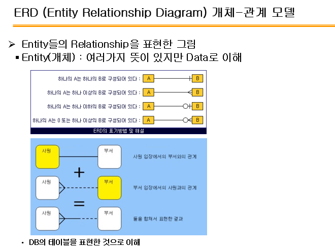

# 200513_W7D1_수업리뷰

##### 오늘은 수업 전체를 리뷰 하고, 그 후에 수업을 어떤식으로 진행할지를 의논

#### 시험은 5월20일 수요일

#### 오전10시-11시 대면강의로

전자정부 프로세스 7단계 중

분석 설계 구현 시험 단계가 가장 중요하고

그 중에서도 분석, 설계가 가장 중요함.

## EA = enterprise Architecture

공공기관에서 일을 하게 되면 알아두어야함.

전체적인 설계도 개념

## 테일러링

양복재단하는 것과 같은 의미

구축사업의 규모나 기간 사업특성등을 고려하여 발주자와 개발자가 개발 범위를 협의하는 것.

능숙한 PM일수록 한쪽에게 유리하게 협상을 해옴

소프트웨어 개발방법론뿐만 아니라

운영방법론

폐기방법론 등등 다양한 방법론이 있음.

운영방법론은

정보시스템 구축운영지침 제45조임(표준산출물)

## 기획단계에서 가장 중요한 것은?

#### 예산 확보

전자정부사업은 나라에서 돈을 내는 것 이기 때문에 적절한 예산을 받아내는 것이 중요함.

예산은 국회에서 10월 정도에 결정함.

늦어지면 11월말정도

## 프로젝트란?

한정된 시간과 한정된 비용으로 완성시키는 목표

#### 요구사항정의서에서 기능요구사항이 가장 중요.

시스템 아키텍처를 보고 이해할 수 있어야함.

그릴 수 있거나 문제점을 파악할 수 있으면 더 베스트

#### 배치시스템의 반댓말?

온라인,실시간 시스템

## ERD 

매우 중요한 개념.

M:M은 개발이 불가능하므로 

1:M, M:1을 만들고 연결해야함.