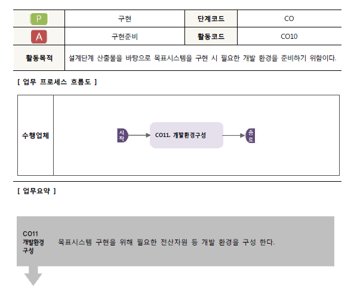
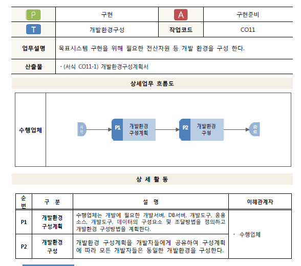
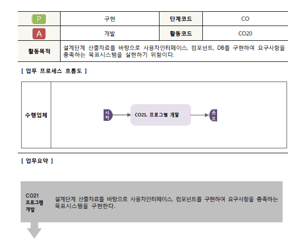
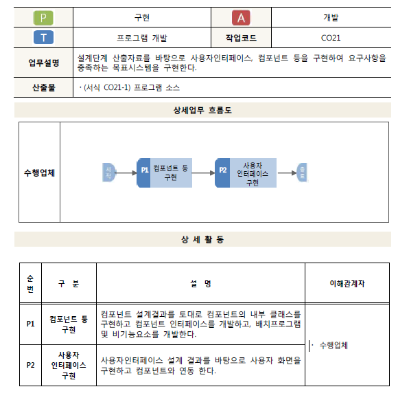
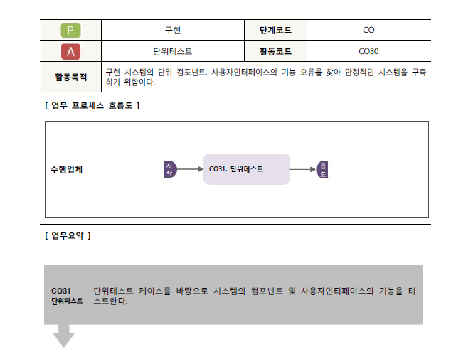
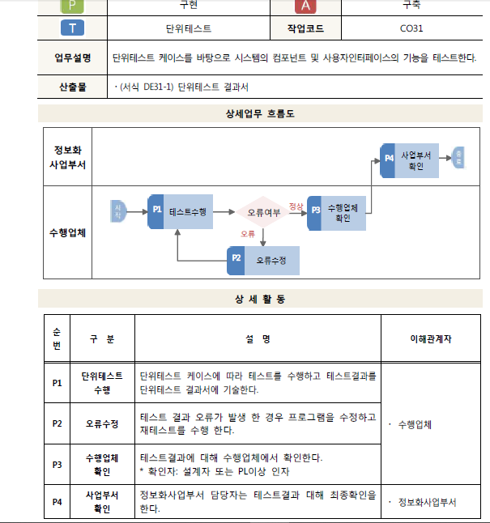
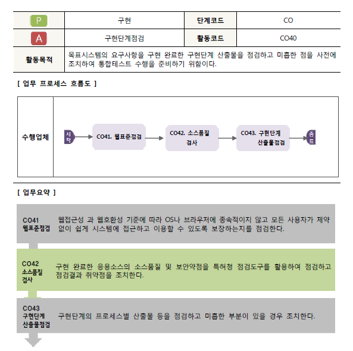
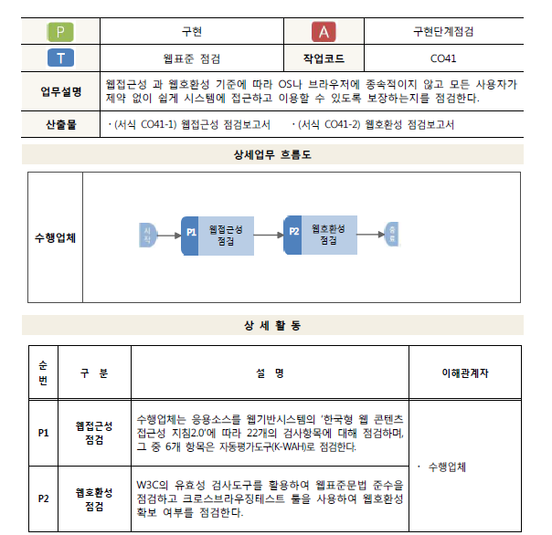
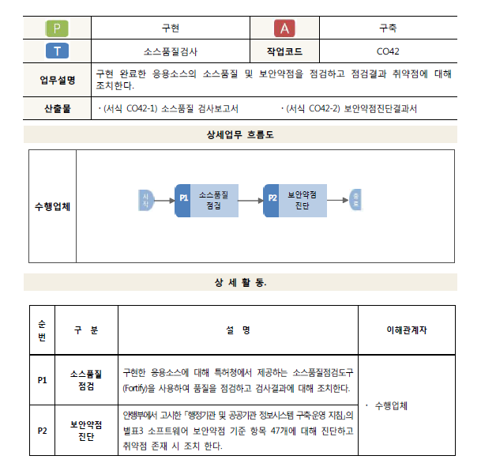
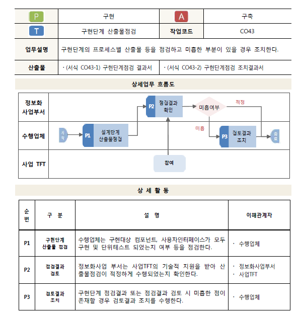

# 200528_W9D1_구현

우리가 실제 프로젝트를 구현하는 것이 아니기 때문에 구현은 하루만에 짧게 다룰 수 있음

구현에 관련되서는 프로젝트 매니저가 담당함

프로젝트 매니저는 인력, 환경관리를 함

## 구현준비 - CO10

## 개발환경구성 - CO11

서버, 소프트웨어, 개발장비 등등 필요한 환경을 구성함

개발 후의 저작권은 발주사에게 있음

## 개발 - CO20

거의 몇 개월간 개발에 몰두하는 과정

많은 시간을 투자하며 프로젝트 진행 과정 중 많은 부분을 차지함

## 프로그램 개발 - CO21

내부 프로그램 코딩 과정

## 단위 테스트 - CO30

시스템 검증 및 오류 검출 과정

테스트를 통해 완성 되었는지를 체크함

## 단위 테스트 - CO31

## 구현단계점검 - CO40

단위 테스트가 끝난 후, 실제 설계와 맞게 구현 되었는지를 점검하는 파트

## 웹표준 점검 - CO41

웹사이트의 기준을 잘 따랐는지를 점검

표준 XML, HTML, CSS 문법을 준수했는지

레이아웃 , 동작 , 플러그인 호환성은 확보 했는지 등등

## 소스품질검사 - CO42

소스코드의 품질을 검사하는 과정

## 구현단계 산출물 점검 - CO43

구현의 마무리 단계,

이 이후의 과정은 거의 일주일 정도만에 끝이 난다.

#### 감리와 감사의 차이?

감리는 프로젝트만을 체크

감사는 일 전체를 체크

IT하는 입장에서는 거의 감리를 함.