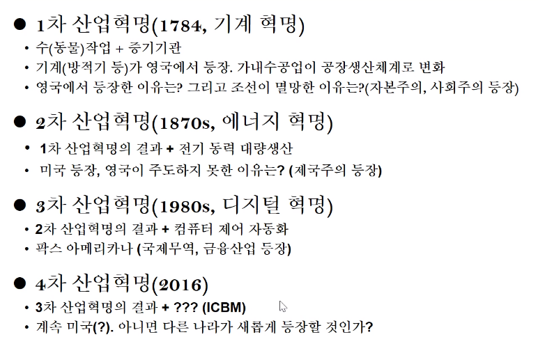
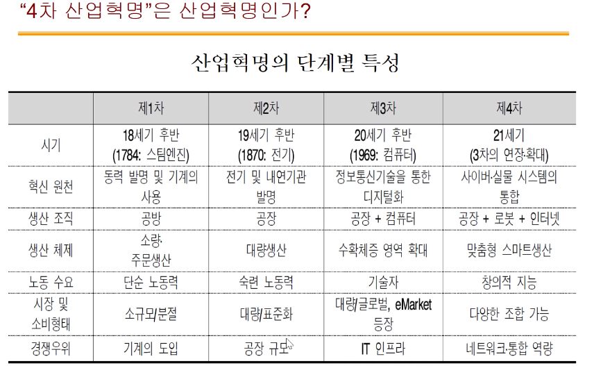

## 시험대비-기말2

## 시험대비-기말

  가트너가 제시하는 2020년 10대 전략 기술 트렌드는 ▲초자동화(Hyperautomation) ▲다중 경험(Multiexperience) ▲전문성의 민주화(Democratization of Expertise) ▲인간 증강(Human Augmentation) ▲투명성 및 추적성(Transparency and Traceability) ▲자율권을 가진 엣지(The Empowered Edge) ▲분산형 클라우드(Distributed Cloud) ▲자율 사물(Autonomous Things) ▲실용적 블록체인(Practical Blockchain) ▲인공지능 보안(AI Security)이다. 

**초자동화**
초자동화(Hyperautomation)는 다수의 머신러닝(ML), 패키징 된 소프트웨어, 자동화 툴을 결합시켜 업무를 수행하는 것이다. 초자동화는 광범위한 툴 뿐만 아니라 자동화 자체의 모든 단계를 아우르는 개념이다. 여기에는 감지, 분석, 설계, 자동화, 측정, 모니터링, 재평가 등이 포함된다. 초자동화는 주로 자동화 매커니즘의 범위, 매커니즘 간의 관계, 매커니즘이 결합되고 조직화되는 방법 등을 이해하는 데 초점을 맞춘다.

**다중 경험**
사용자 경험은 2028년까지 디지털 세상에 대한 사용자들의 인식, 디지털 세상과 사용자들의 상호 작용 방식에 있어 크게 변화할 것이다. 대화형 플랫폼은 사람들이 디지털 세상과 상호 작용하는 방식을 바꾸고 있다. 또, 가상 현실(VR), 증강 현실(AR), 혼합 현실(MR)은 사람들이 디지털 세상을 인식하는 방식을 바꾸고 있다. 인식 및 상호 작용 모델에 있어서 이러한 변화는 미래 다중 센서 경험, 다중 모드 경험을 이끌어 낸다.

**전문성의 민주화**
민주화(Democratization)는 추가적인 값비싼 훈련을 요구하지 않으면서도 극히 단순화된 경험을 통해 사람들에게 머신러닝, 앱 개발 등의 기술 전문 지식이나 판매 프로세스, 경제 분석 등 사업 분야 전문 지식을 제공하는 것에 초점이 맞춰져 있다. 시민 개발이나 노코드 모델의 발달과 더불어 시민 데이터 사이언티스트, 시민 인티그레이터 등의 ‘시민 접근(citizen access)’이 등장한 것은 전문 기술 민주화의 사례로 볼 수 있다.

가트너는 2023년까지 민주화의 4가지 핵심 요소가 가속화될 것으로 예상한다. 데이터 및 분석의 민주화, 개발의 민주화, 설계의 민주화, 지식의 민주화가 이에 해당한다. 데이터 및 분석의 민주화는 전문 개발자 커뮤니티를 대상으로 확장하는 데이터 사이언티스트들을 대상으로 하는 툴을 의미하고, 개발의 민주화는 맞춤 개발된 애플리케이션에서 활용할 수 있는 AI 툴을 의미한다. 

**인간 증강**
인간 증강(Human augmentation)은 기술이 인간 경험의 필수적인 부분으로서 어떻게 인간의 인식과 신체에 향상점을 제공할 수 있는지를 탐구한다. 물리적 증강은 인간의 몸에 웨어러블 디바이스와 같은 기술 요소를 심어 타고난 신체적 기능을 변화시킴으로써 인간을 향상시킨다. 인식적 증강은 전통적인 컴퓨터 시스템과 스마트 공간 내 새로운 다중 경험 인터페이스 상의 정보를 평가하고 애플리케이션을 활용하면서 이뤄질 수 있다. 개개인들이 개인적 향상을 추구하게 됨에 따라 향후 10년 간 인간 신체 및 인식의 증강 수준을 높이는 것은 일반적인 일이 될 것이다. 이는 새로운 ‘소비자화(consumerization)’ 효과를 만들어 직원들이 개인의 향상점을 활용 및 확대해 업무 환경을 향상시키도록 할 것이다.

**투명성 및 추적성**
점점 더 많은 소비자들이 개인 정보의 가치를 인식하고, 이에 대한 통제를 요구하고 있다. 기업들은 개인 데이터 보호와 관리의 위험이 증가하고 있음을 자각하고 있으며, 정부는 이를 확실히 하기 위해 강력한 규제를 시행하고 있다. 투명성과 추적성은 이러한 디지털 윤리와 개인정보 보호의 요구를 충족하는 데 중요한 요소다.

투명성과 추적성은 규제 요구사항을 충족하고, 인공지능(AI)과 기타 첨단 기술 사용에 대한 윤리적인 접근 방식을 보존하며, 기업 내 사라져가는 신뢰를 회복하기 위해 고안된 다양한 태도, 행동, 지원 기술, 관행 등을 지칭한다. 기업들은 투명성과 신뢰 관행을 구축하면서 인공지능 및 머신러닝 영역, 개인 데이터 보호, 소유 및 제어 영역, 윤리적 설계의 영역 등 세 가지 영역에 초점을 맞춰야 한다.

**자율권을 가진 엣지**
엣지 컴퓨팅(Edge Computing)은 정보 처리, 콘텐츠 수집 및 전달이 해당 정보의 출처, 보관 장소, 소비자에 인접한 곳에서 처리되는 컴퓨팅 토폴로지(topology)다. 엣지 컴퓨팅은 지연 시간을 줄이기 위해 트래픽과 프로세싱을 로컬에서 처리하려고 하고, 엣지의 기능을 활용하려고 하며, 엣지에서의 더 큰 자율성을 가능케하고자 한다.

**분산형 클라우드**
분산형 클라우드(Distributed cloud)는 퍼블릭 클라우드 서비스가 다양한 장소에 배포되는 것이다. 이때 퍼블릭 클라우드 서비스의 기존 제공 업체는 서비스의 운영, 거버넌스, 업데이트 및 개발에 대한 책임을 진다. 분산형 클라우드는 대부분의 퍼블릭 클라우드 서비스의 중앙화 모델에 상당한 변화를 주며, 새로운 클라우드 컴퓨팅 시대를 견인할 것이다.

**자율 사물**
자율 사물(Autonomous things)은 인간이 수행하던 기능들을 자동화하는 데 AI를 활용하는 실제 디바이스다. 자율 사물은 대부분 로봇, 드론, 자율주행차, 자율주행선, 가전제품 등의 형태로 구현된다. 이러한 디바이스의 자동화는 엄격한 프로그래밍 모델들이 제공하는 자동화를 뛰어넘는 수준으로, AI를 활용해 주변 환경 및 사람들과 보다 자연스럽게 상호 작용하는 고급 행동을 구현한다. 기술력이 향상되고 규제가 허용되며 사회적 수용이 증가함에 따라, 점점 더 많은 자율 사물이 통제되지 않는 공공 장소에 배치될 것이다.

**실용적 블록체인**
블록체인(Blockchain)은 신뢰 구축, 투명성 제공, 비즈니스 생태계 간 가치 교환 구현, 잠재적 비용 절감, 거래 합의 시간 단축, 현금 흐름 개선 등을 통해 산업을 재구성할 수 있는 잠재력을 가진 기술이다. 자산의 출처를 추적할 수 있어 위조품 사기의 가능성이 현저히 줄어든다. 또한, 자산 추적은 공급망 전반에서 식품에 대해 추적해 오염 발생 지점을 보다 쉽게 찾을 수 있도록 하거나 개별 부품을 추적하여 제품 리콜을 지원하는 등 다양한 영역에서 가치를 제공한다. 블록체인이 잠재력을 가진 또 다른 영역은 신원 관리 분야다. 스마트 계약은 사건이 특정 액션을 촉발할 수 있는 블록체인으로 프로그래밍 될 수 있다. 예를 들자면, 상품을 받으면 지불이 이뤄지는 식이다.

**인공지능 보안**
인공지능과 머신러닝은 다양한 사용 사례에 걸쳐 인간의 의사결정을 향상시키는 데 지속적으로 활용될 것이다. 이는 초자동화를 구현하는 수많은 기회를 만들어내고 자율 사물을 활용해 비즈니스 전환을 이뤄낼 수 있지만, 보안 팀과 위험 분야 리더들에게는 새로운 중요 과제를 제시한다. IoT, 클라우드 컴퓨팅, 마이크로서비스 및 스마트 공간 내 고도로 연결된 시스템들로 인해 공격 가능한 포인트가 광범위하게 늘어나기 때문이다. 보안 및 위기 관리 리더들은 AI 기반 시스템 보호, AI를 활용한 보안 방어 향상, 공격자의 범죄 목적 AI 사용 예측 등 세 가지 주요 영역에 초점을 맞춰야 한다.

  

## 시험대비-중간

1.개발방법론 표준 프로세스 단계 7개를 기술하시오. (10점)

개발준비 -> 분석 -> 설계 -> 구현 -> 시험 -> 전개 -> 인도

분석, 설계 단계가 가장 중요하다.

2.방법론 테일러링에 대하여 기술하시오. (10점)

사업 담당자와 합의를 통해 어떤 프로세스를 뺄지 넣을지 에 대한 상의를 하는 것을 의미한다.

보통 개발준비단계에서 이루어지며 합의 후 테일러링 결과서를 제출해야한다.

3.사업TFT 구성 시 고려사항을 기술하고, 시험단계 시 TFT의 역할은 무엇인가? (10점)

TFT란. **태스크 포스 팀**(Task Force Team) 으로 사업을 위한 임시 팀을 구성하는 것을 말한다.

보통 그 팀의 핵심 담당자는 TFT팀에 잘 들어오지 않으려 하기 때문에 구성계획서에 TFT 운영에 대한 규칙을 따로 기술하는 것이 좋다.

고려사항 3가지

TFT 구성계획서에는구성원, 운영절차 및 운영 방법 등을포함해야함

TFT 구성원은 정보화사업부서, 수행업체, 관련부서, 정보화 품질관리 담당자로 함

통상 TFT 회의 개최는 이슈사항이 발생하거나 TFT 지원이 필요한 경우 사업 담당자의 요청에 따라 비정기적으로 수행하며, 개발 단계 별 점검 및 전개 단계 수행 시 기술적인 지원을 함.

4.PM, PMO, 감리, 전자정부, EA 용어에 관하여 기술하시오. (각 10점)

->용어 정리

PM : 프로젝트 매니저 프로젝트를 수주하는 입장에서 프로젝트 전체의 책임을 갖는 사람.

개발,설계,공간 확보 등 다양한 업무를 소화함, 

PMO : 프로젝트 매니저 Officer 

즉 전자정부 사업 관리자, PM은 사업관리자

발주자 입장에서 사업을 관리 하는 사람. (PM은 수주자 입장)

감리 : 프로젝트 발주자에게 관리, 감독 업무를 위탁받아 프로젝트의 전반적 사항을 종합적으로 점검하고 문제점을 개선하도록 하는 것이다. 감리 자격이 있는 사람만 가능.

전자정부 : 정보기술을 활용하여 행정기관 및 공공기관의 업무를 전자화 하여 전체적인 행정업무를 효율적으로 수행하는 정부를 말함.

EA : 일명 전자정부아키텍처.

조직 전체의 구성요소들을 통합적으로 분석한 뒤 이들 간의 관계를 구조적으로 정리, 최적화하기 위한 방법을 말한다.

5.데이터요구사항 중 DB 통합 요구사항 정의에서 데이터 연계방안에 관하여 기술하시오. (10점)

Data.co.kr의 공공 데이터 사이트를 활용하여 오픈API를 통해 데이터 연계, 통합을 하는 것이 좋음.

6.보안요구사항 중 보안지침준수 요구사항에서 제시하는 보안지침에 관하여 기술하시오. (10점) 

발주사에서 개발사에게 요구하는 보안 관련 사항들을 의미함.

소프트웨어 개발 보안가이드

소프트웨어 보안약점 진단 가이드

시큐어 코딩 가이드

어플리케이션 보안 가이드 등 이 있음.

#### 0408 질의응답 :

 중간고사는 어떤방식?

아직 미결정, 

가능하면 필기고사로 시험을 보려고 함.

작년의 중간고사는 미리10문제를 알려주고 그 중에서 5문제를 출시했는데, 

학교에서 오프라인 시험을 금지하면 다른 방식을 알려줌.

#### 0422 질의응답 :

다음시간에 지난 중간고사 문제 풀이,

다다음 시간에 오프라인 강의가 된다면 현강으로 중간고사,

