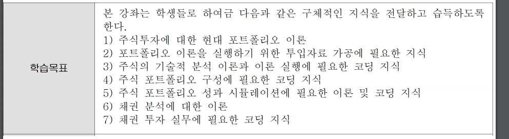
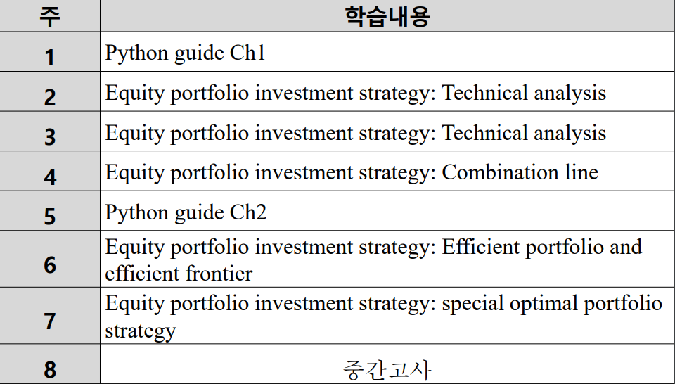
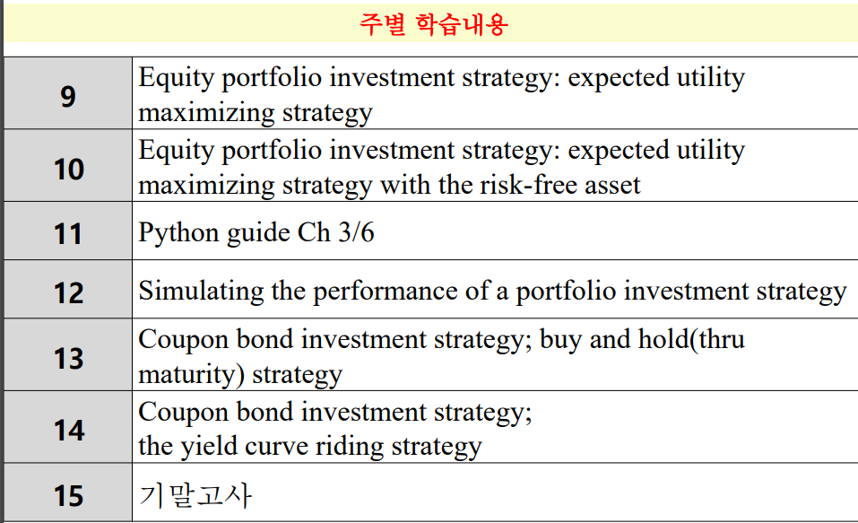
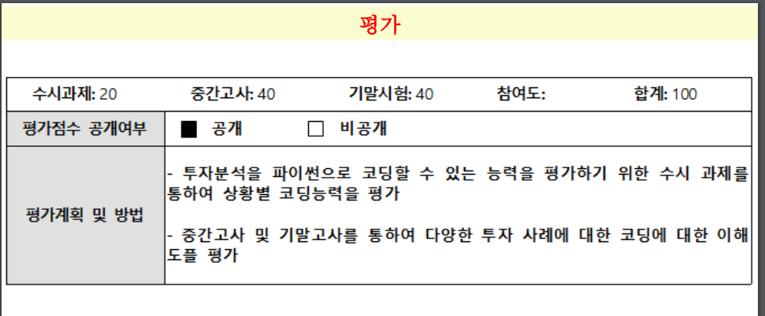

# 200317-W1D1-알고리즘투자전략

주식, 채권에 대한 옵션등을 공부하고 파이썬을 통한 구현이 목표.

Numpy, pandas, cypy등등의 라이브러리를 다루게됨.

교수님 강의실 : 409 / 월,화,수

주식투자에 대해서 먼저 다룬 뒤, 채권에 대한 전략도 다루게 된다.

## 학습목표

포트폴리오? : 주식의 분산투자에 관한 이론이나 모델 

4) 가 이 과목의 하이라이트.

현대 포트폴리오 이론을 어떻게 코드로 구현을 할 것인가?

강의자료 pdf 인쇄해서 가지고 다니길 추천

## 학습계획

강의계획 2-3주의 기술적분석에서는 가장 유용한? 4개 정도의 이론을 다루게 됨.

4주차부터 본격적으로 MPT(Modern Portforlio Theory) 이론을 다루게 된다.

6주차 부터 배우는 Efficient portfolio는 MPT 이론의 핵심.

7주차에 배우는 optimal portfolio는 최적의 포트폴리오 이론. 

ex) 주식 품목 3개 정도가 있을 때 , 안정성/수익성 같은 특정 목표에 따라 최적의 포트폴리오가 다르다.

일반적인 투자자들의 목표는 '효용의 극대화'

효용성을 극대화 할 수 있는 전략이 일반적인 투자 전략. 

-> 9-10주차 기대효용 알고리즘.(이 과목의 궁극적인 목표)

그 후에는 시뮬레이션, 테스트(12주차)

13-14주차에는 채권 투자 전략을 배움. 수익률 곡선타기, 구매 및 hold, 이자율 예측 등등

buy and hold strategy 는 주식의 수익률 예상 같은 간단한 이론.

## 평가

이번 학기는 개인 과제! : 20%

개인 과제이기 때문에 난이도 낮춤.

온라인에서 강의했던 내용들은 4월달에 실강을 하게 되면 다시 리뷰를 해줌.