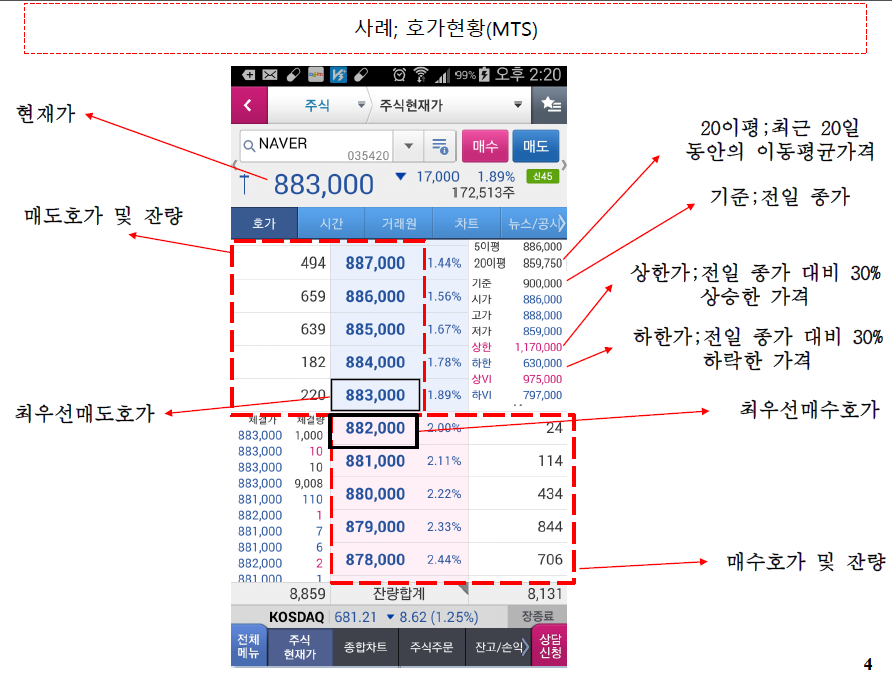
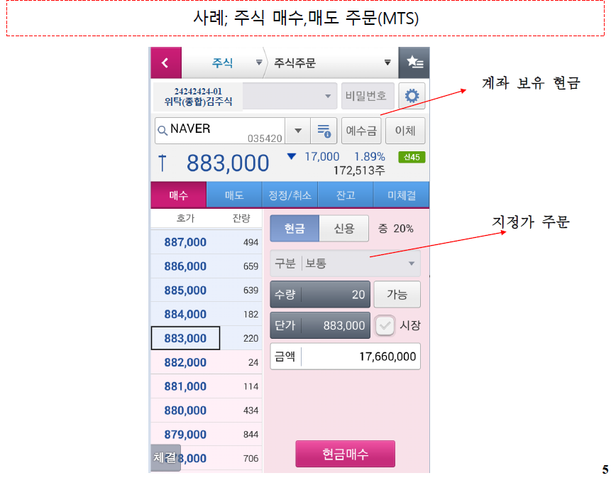

# 200318-W1D2-알고리즘투자전략

## CH 1-1 주식의 기술적 분석

##### Equity portfolio investment strategy: Technical analysis

이론이나 논리가 아닌 경험으로 주식을 분석하는 기법

(실무에서는 많이 사용하지만, 신뢰할만한 방법은 아님.)

## 주식이란? (Equity, stock)

##### 주식(stock);기업의자본금을공급한대가로기업이주주에게발행하는유가증권

•주주:**배당청구권**과 회사청산시**잔여재산분배청구권**을보유

주주들은 배당금, 즉 이익, 배당청구권이있다.

##### •주식의유통;

-상장주식;발행된주식은증권시장(한국거래소,KoreaStockExchange)에상장되어투자자간에자유롭게거래됨

상장되었다 = 거래가 가능하다. / 거래가 가능한 기업 -> 상장기업

거래가 되기 때문에 가격이 형성됨, 신뢰할 수 있음

-비상장주식:장외거래(개인간거래)를통하여거래됨

(보통으론 살 수 없다. 이 과목에선 비상장주식을 다루지 않음.)

거래가 이루어지지 않기 때문에 가격을 신뢰하기 힘들다.

##### •보통주(commonstock)

-이익배당,잔여재산분배(기업청산시)에관하여표준이되는주식

(우선주 라는 주식도 있지만 우리는 다루지 않음. 우선주는 배당청구권과 잔여재산 분배 청구권에서 우선을 가지고 있는 품목, 가격을 설명하기 힘들다. / 일반적으로 보통주가 우선주보다 비쌈)

##### •공매도(Short Selling)

-주식을차입하여차입한주식을매도하는거래행위
-이후주식으로상환(매수를 해서 갚아야함)

차입은 빌려온다라는 의미. 즉 주식을 사지 않고 빌려와서 매도를 하는 행위,

공은 空(빌공) 한자.

주식을 빌려오는 행위를 '대주' 라고 함.

개인은 공매도가 불가능하고, 기업이나 외국인 투자자들(개인X, 외국투자회사)이 많이함.

공매도는 주식의 가격이 떨어질 때 하면 좋다.

**공매도는 왜 개인이 할 수 없는가?** -> 개인은 주가의 흐름 파악 등에 취약할 수 밖에 없기 때문에 공매를 허용하게 되면 손해가 매우 크기 때문에, 개인 투자자 보호를 위해 개인 공매도를 막아놓았다.

## 한국거래소(Korea Exchange, www.krx.co.kr)

##### •주식(채권,ETF, ELW,선물, 옵션)이발행/유통(매매)되는거래소

주식 뿐만 아니라 채권, ETF 등등도 거래함.

##### •주식시장(유가증권시장, 코스닥시장)과선물시장등으로구분

시장은 유가증권시장, 코스닥시장 2개가 있다.

##### •주식매매방식및결제;

-**자유경쟁매매**; 주식매수주문과매도주문을매순간비교하여거래를체결하고가격이형성되는매매방식(**가격우선, 시간우선등**)

매수주문 = 산다는 의사를 거래소에 전달.

**가격우선** : 매수주문은 비싸게 사는 사람에게 우선권, 매도주문은 싸게 파는 사람에게 우선권

**시간우선** : 가격이 같은 수준에서 매수와 매도 주문이 들어와 있다면 먼저 들어와 있는 주문에다가 우선구너을 준다.

-매수주문과매도주문시가격을지정하는방식(지정가주문)이일반적인주문방법

-매매가체결되면 주식과 주식대금은 매매일로부터 **2 영업일**에결제

(목요일에 매매가 체결되면 2일(금,월)이 지난 월요일에 결제됨.)

##### •대형주

-유가증권시장;시가총액상위100개주식

-코스닥;시가총액상위100개주식

즉 시가총액 100위 안에 드는 주식을 대형주라고 한다.

대형주는 경기가 회복되거나 악화될때 바로 반영이 된다.

##### •중.소형주;시가총액100위이하주식

중 소형주는 투자를 해서 성공하기가 힘듬. -> 대형주 위주로 투자를 하게 된다.

## 주식 예시 - 거래소 화면

과거 네이버의 매매가는 883,000 이지만 이 가격에 바로 팔 수 있다는 것은 아님.

878,000에 사겠다(매수호가)고 제시한 사람이 706개(잔량)이 존재하고, 

883,000에 팔겠다고 하는 사람이 220개가 있다.

하지만 매수의 경우 가장 비싸게 사겠다고 하는 사람에게 우선권을 주는 '가격우선'이 있기 때문에 882,000이 가장 먼저 매수권을 가지게 된다. 

매도의 경우 가장 싸게 팔겠다고 하는 883,000에 매도 우선권이 주어진다.

매도 잔량 : 8,859

팔겠다는 주식의 수가 8,859

매수 잔량 : 8,131

사겠다는 주식의 수가 8,131

#### 이동평균 (이번 강의에서 매우 중요)

5이평, 20이평 : 5일, 20일간의 가격 변동 평균

왜 이동 평균인가? 예를 들어 10일을 기준으로 하면 5~10일이지만, 

11일이 되면 6~11일 간의 평균이기 때문에 평균이 이동을 하게 된다.(Moving average)

##### 보통은 종가를 기준으로 함.

**상,하한가** : 다음 날 가격이 바뀔 수 있는 최대, 최저 가격 (30%)

상/하한가 규제의 목적은 개인 투자자 보호에 있다.

**시가, 종가** : **당일** 주식 시장은 9시~3시30분까지 운영이 되는데, 

시장이 열리자마자(9시) 거래 된 가격이 **시가**(open price)

시장이 닫힐 때(3시 30분) 거래 된 가격이 **종가**(close price)

**고가, 저가** : **당일** 가장 높고 낮았던 가격을 알려줌. 

(3시 30분 전이면 고가, 저가, 종가가 확정되지 않은 상황.)

고가 : 그 날 가장 높았던 가격 (high price)

저가 : 그 날 가장 낮았던 가격 (low price)

## 주식 예시 - 주문 화면

**예수금** : 내 계좌에 현재 있는 금액

**구분 ** : 보통이 디폴트, 지정가 주문을 하겠다는 의미.

**지정가** : 실제 거래를 할 땐 구분-보통이 지정가를 의미한다.

882,000원 지정가의 의미는 매수하는 입장에선 최대 882,000에 구매를 해달라는 의미고 그 이하의 가격으로 구매를 해도 된다는 의미이다.

매도하는 입장에선 최소 882,000에 판매를 해달라는 의미고, 그 이상으로 판매를 해도 된다는 의미.

즉 지정가는 Limit의 의미를 가지고 있다.

**손절매** : 앞으로 주가가 더욱 하락할 것으로 예상하여 가지고 있는 주식을 매입 가격 이하로 손해를 감수하고 파는 것.

증권회사에서 신용으로 구매한 주식일 경우, 일정 금액 이하로 가격이 떨어지면 강제로 처분해버린다.

##### 신용거래보단 개인 현금 거래를 추천하는 이유.

