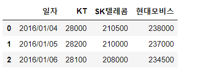

# 200324_W2D1_Pandas 기초 가이드

## Pandas

Pandas란?

1차원 배열과 데이터프레임을 다루는 라이브러리 

## 1.배열 - Series

컬럼 내부 값은 정수,문자열,실수 등등 어떤 값이 들어와도 상관 없다.

data와 함께 Index값을 가지고 있다. 

Index는 0번부터 시작, 자동으로 생성

Index를 임의로 바꿀 수 **있다.**

## 2.데이터프레임 - Data Frame

Series와 다른 점? : 데이터 프레임은 변수명(열 레이블)이 존재한다.

integers, strings, floating point numbers,날짜형 등 다양한 데이터 타입이 올 수 있다.

행의 번호는 인덱스로 표시가 되고, 열의 내용은 열 레이블로 알아볼 수 있다.

엑셀 데이터를 사용할 때는 Pandas를 통해 데이터프레임이나 시리즈로 변경을 해준 뒤 사용할 수 있다.

### 데이터프레임의 생성

2차원 리스트와 배열을 직접 요소를 넣어주어 생성을 하는 방법.

열 레이블(변수명)을 설정하기 위해서는 .columns를 사용한다.

##### 빈 데이터프레임을 만들 때는 pd.DataFrame() 안에 매개변수를 아무것도 주지 않을 경우 빈 데이터프레임을 만들 수 있다. 

(데이터프레임을 직접 만드는 경우는 많이 없지만 빈 데이터 프레임은 종종 쓰인다.)

### 데이터프레임의 생성 2 - 딕셔너리 형태

데이터프레임을 만들때는 '열이름' : list 같은 딕셔너리 형태로도 만들어 줄 수 있다.

### 데이터프레임의 생성 3 - 엑셀 데이터 읽기

엑셀 데이터를 읽을 때에는 read_excel(위치) 명령어.

sheet가 하나밖에 없을 때는 sheet_name옵션이 필요 없다.

### 데이터 프레임의 유용한 명령어

head는 데이터를 앞에서 순서대로 가져와준다.

tail 명령어는 뒤에서 데이터를 순서대로 가져와준다.

sample은 랜덤으로 데이터를 가져와준다.

각 명령어들뒤에 number를 입력하지 않으면 default로 5개를 출력해준다.

### 데이터 프레임 데이터 변경

데이터프레임 내부에 있는 데이터(여기서는 사원번호)를 인덱스로 지정을 하고 싶을 때는

**set_index** 명령어를 사용한다.

인덱스로 사용하고 싶은 열 레이블을 '열 레이블' 같은 식의 매개변수로 주면 된다.

여기서 "데이터" 와 "데이터2"가 각각 다른 데이터 프레임으로 존재한다.

만약 "데이터" 라는 이름의 데이터 프레임에 덮어씌우고 싶다면 inplace=True 옵션을 주면 된다.

#### *주식 그래프 그릴 때 팁

이러한 데이터에서 index를 '일자'로 주게 되면 나중에 그래프를 그릴때 편리하다.

## 주가 API 활용하기

이 데이터 생성하기 1은 안됨.

dataReader 대신 yfinance를 사용한다.

설치 방법은 pip install yfinance

설치 화면

yfinance를 사용하기 위해선 '주식코드' 가 필요하다.

주식코드는 6자리의 정수 + 2자리의 영단어 로 이루어져있다.

주식코드는 구글,네이버에서 쉽게 검색가능하다.

현재 열 레이블이 5개가 있는데 이 중 우리는 종가만을 다룰 예정.

SKT 같이 특정 주식 1개만이 아니라 여러개의 주식 데이터를 다룰 수도 있다.

