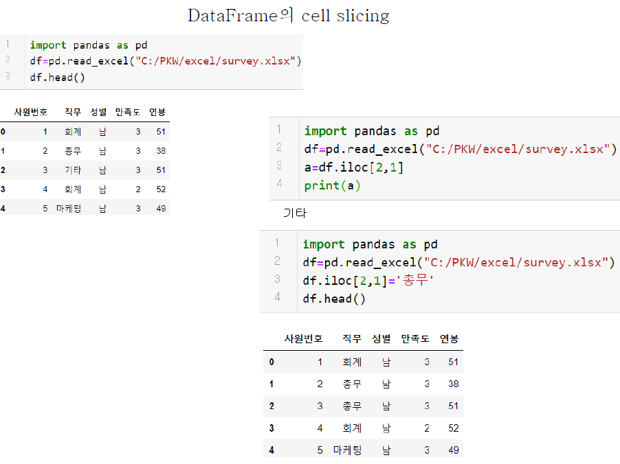
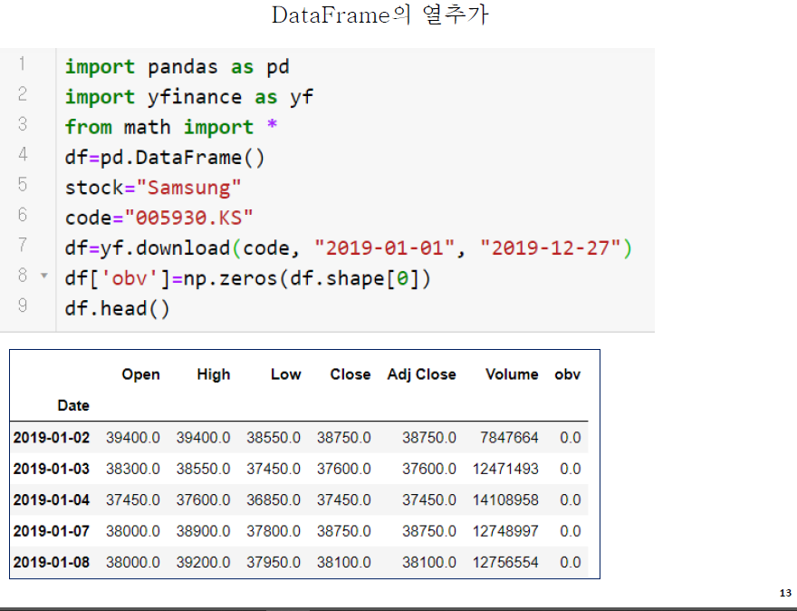
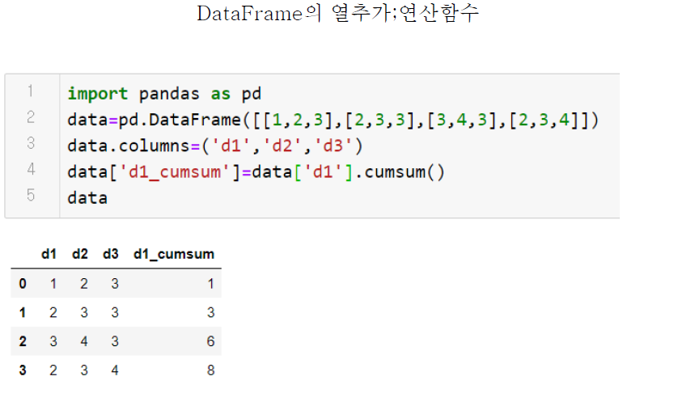
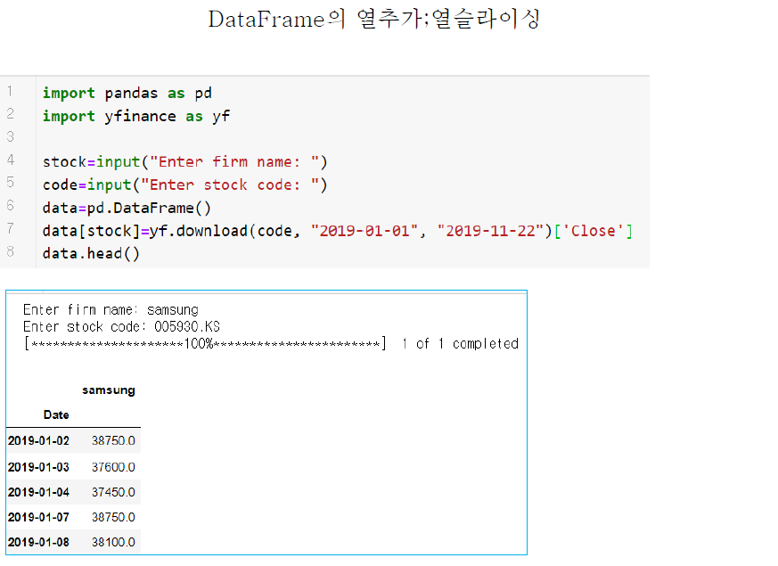
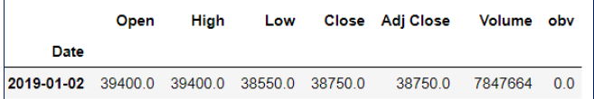

# 200325_W2D2_데이터프레임 다루기

### 데이터 프레임의 열 슬라이싱(세로)

df['열이름'] 으로 슬라이싱을 하게 되면 **결과값은 시리즈**가된다.

### 데이터 프레임의 셀 슬라이싱

iloc[행위치,열위치] 를 사용하면 데이터프레임의 해당 위치에 있는 값을 출력하거나 변경할 수 있다.

### 데이터 프레임의 열추가

yfinance에서 가져온 데이터프레임에 obv라는 열을 하나 추가시켰다.

np.zeros(df.shape[0]) 이라는 명령어를 사용하기 위해서는 

import numpy as np 라는 구문 필요하다.

원래 모양은

 

이다.

### 데이터 프레임의 열 추가(열 내부 연산)

df['열이름'] = df['열a']+df['열b'] 같은 방법으로 새로운 열을 추가하고 그 내용을 열 내부 연산 값으로 채울 수 있다.

### 열 연산 함수 - 누적합

cumsum 은 반복해서 합을 구하는 **누적합** 연산 방식이다.

d1의 값인 1+2+3+2 = 8 이므로 마지막 d1_cumsum의 값 역시 8이 나온다.

## 열 슬라이싱을 이용한 열추가 - 중요!

이러한 데이터의 형식에서 종가(close)만을 꺼내오기 위해서 슬라이싱을 한 뒤, 열 네임을 samsung으로 바꿔주었다.

원래 데이터 형식 :

## 그래프 그리기

title은 그래프 이름, legend는 범례를 표시하느냐 마느냐를 옵션으로 주는 기능이다.