# 200325_W2D2_데이터프레임 다루기, MACD(ch1.1)


### 데이터 프레임의 열 슬라이싱(세로)

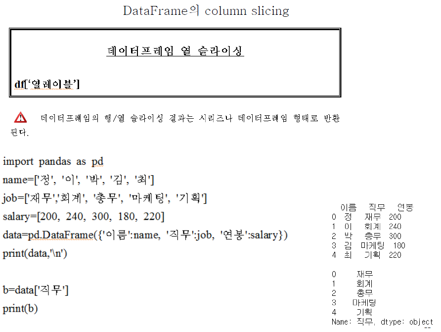


df['열이름'] 으로 슬라이싱을 하게 되면 **결과값은 시리즈**가된다.


### 데이터 프레임의 셀 슬라이싱

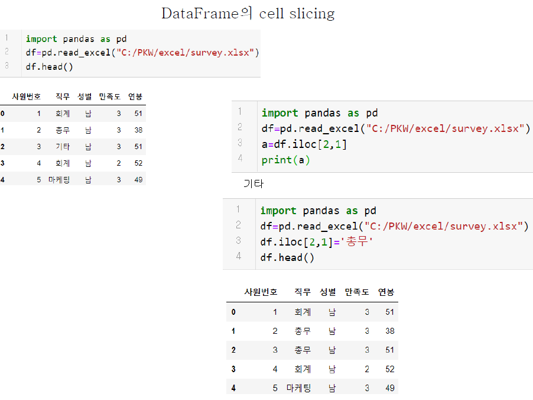


iloc[행위치,열위치] 를 사용하면 데이터프레임의 해당 위치에 있는 값을 출력하거나 변경할 수 있다.


### 데이터 프레임의 열추가

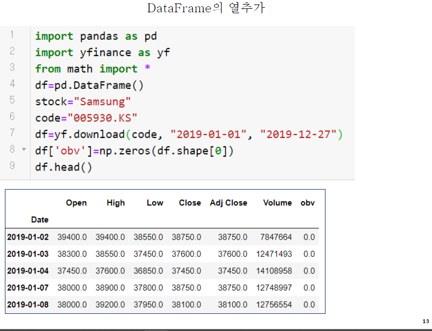

yfinance에서 가져온 데이터프레임에 obv라는 열을 하나 추가시켰다.


np.zeros(df.shape[0]) 이라는 명령어를 사용하기 위해서는 

import numpy as np 라는 구문 필요하다.


원래 모양은

 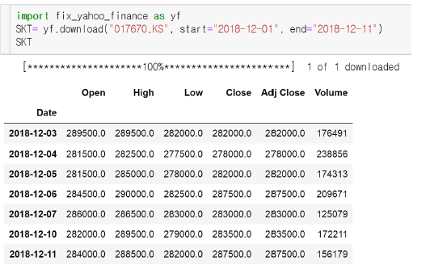

이다.


### 데이터 프레임의 열 추가(열 내부 연산)


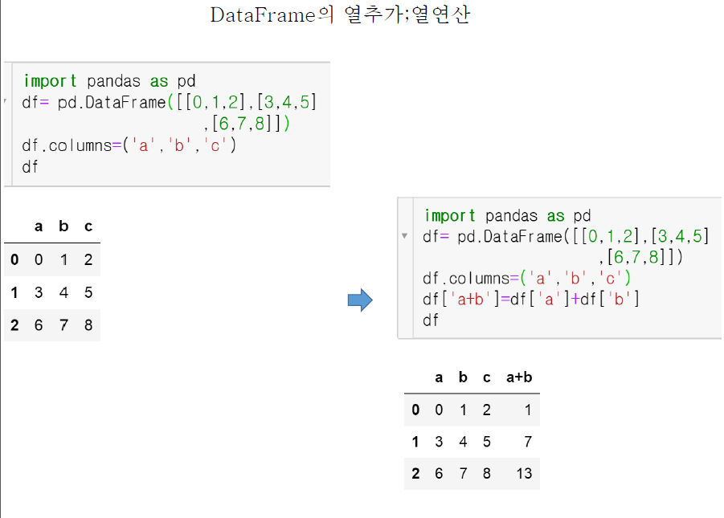


df['열이름'] = df['열a']+df['열b'] 같은 방법으로 새로운 열을 추가하고 그 내용을 열 내부 연산 값으로 채울 수 있다.


### 열 연산 함수 - 누적합


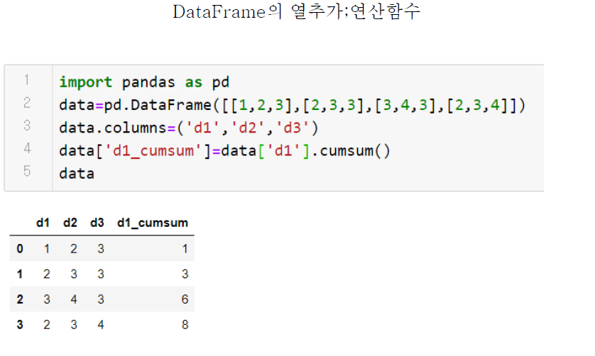


cumsum 은 반복해서 합을 구하는 **누적합** 연산 방식이다.


d1의 값인 1+2+3+2 = 8 이므로 마지막 d1_cumsum의 값 역시 8이 나온다.


## 열 슬라이싱을 이용한 열추가 - 중요!

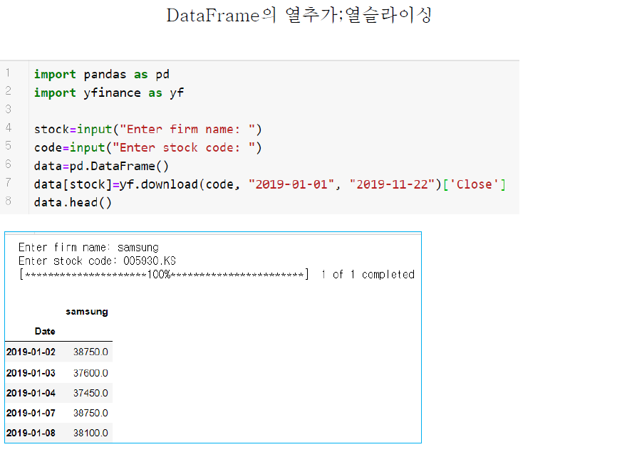


이러한 데이터의 형식에서 종가(close)만을 꺼내오기 위해서 슬라이싱을 한 뒤, 열 네임을 samsung으로 바꿔주었다.


원래 데이터 형식 :

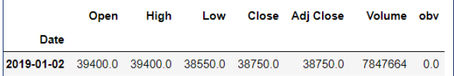


## 그래프 그리기

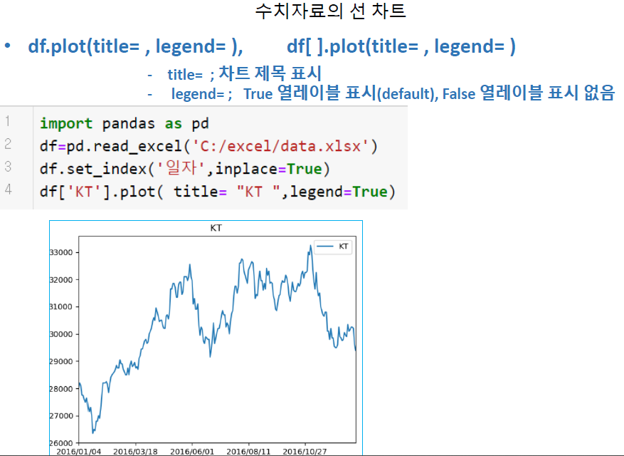


title은 그래프 이름, legend는 범례를 표시하느냐 마느냐를 옵션으로 주는 기능이다.


## 이동평균 계산하기

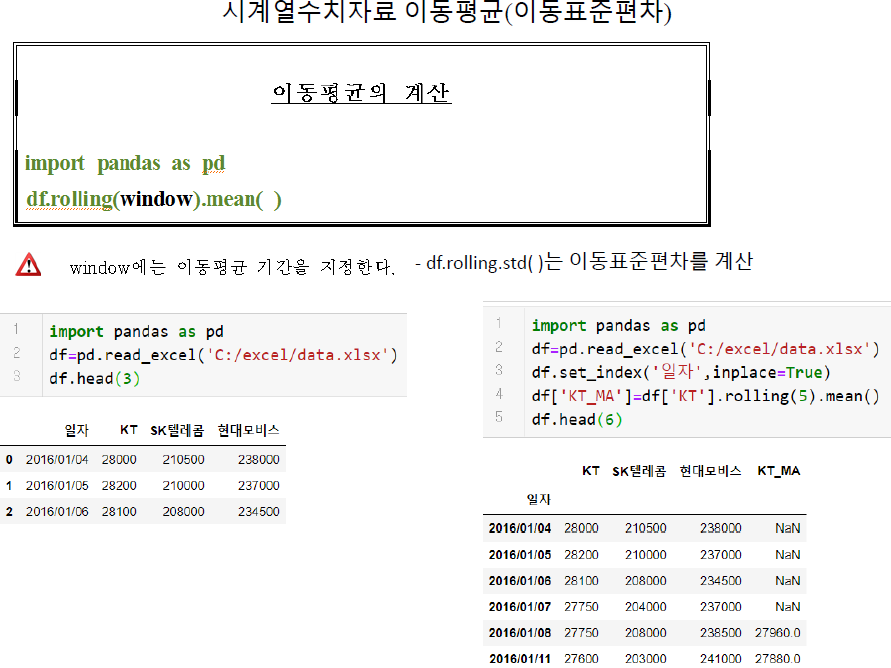


.rolling 을 사용하면 해당숫자만큼의 이동평균을 계산한다.


여기서 NaN은 결측치로, 이동평균을 계산할 값이 없기 때문에 Missing Value가 된다.


이러한 NaN은 나중에 그래프를 그릴 때 귀찮아지므로 삭제시켜주는 것이 좋다.


## 결측치(NaN) 삭제

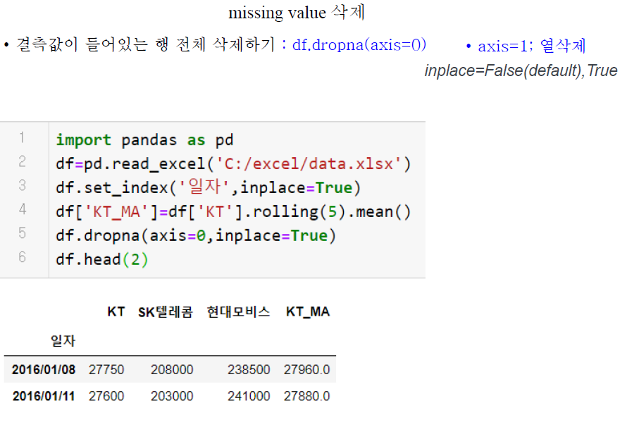


dropna 명령어를 통해 제거한다. 

axis=0 을 할 경우 nan가 있는 행을 제거, axis=1을 하면 nan가 있는 열을 제거한다.


axis = 0 은 결측치가 있는 행을 제거 (디폴트, 옵션을 안 줄경우 기본으로 0이 된다.)

axis = 1은 결측치가 있는 열을 제거(세로를 제거)


## 차분계산

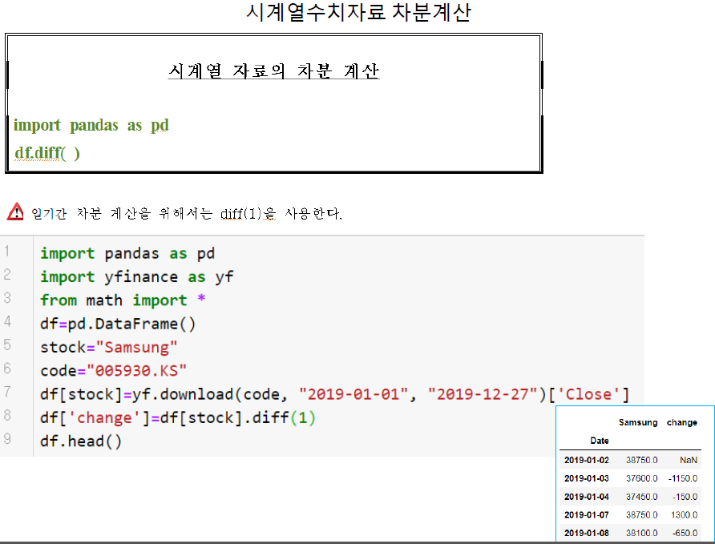


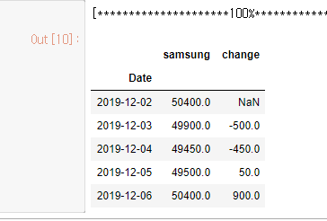


전 날짜와 비교를 해서 +나 -를 계산해준다.


Lamda함수는 1-1 pdf 과정이 끝난 뒤에.


## pdf 파일의 ch 1-1

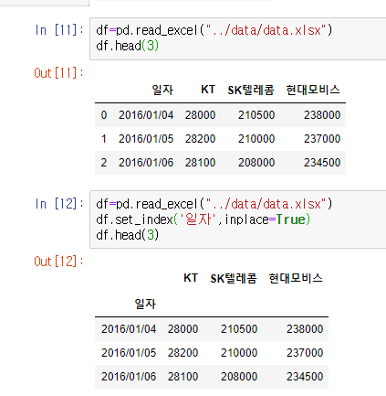

엑셀 파일을 불러온 뒤, 일자를 index로 준다.


## 1-1 선차트

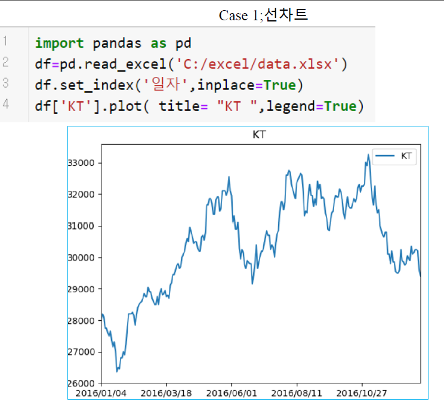


.plot 을 이용, 그래프를 그려주었다.


### @ matplot을 사용하기 위해선 폰트설정을 해주어야한다.

```
import matplotlib.pyplot as plt
import platform

path = "c:/Windows/Fonts/malgun.ttf"
from matplotlib import font_manager, rc
if platform.system() == "Darwin":
    rc('font', family='AppleGothic')
elif platform.system() == "Windows":
    font_name = font_manager.FontProperties(fname=path).get_name()
    rc('font', family=font_name)
else:
    print('Unknown System... sorry~~~')
    
%matplotlib inline
```


## 이동평균

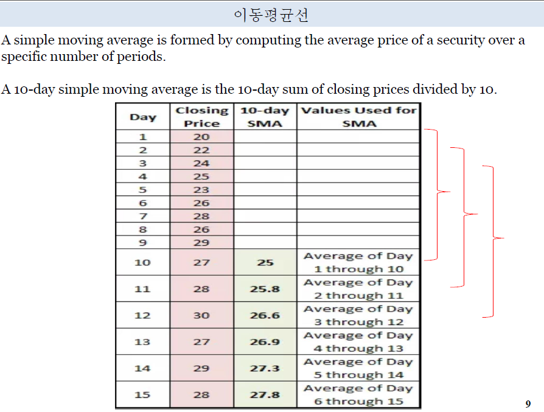


이동평균은 해당 날짜로부터의 평균 값을 계산하는 방법으로, 위의 사진을 참고하면 알기 쉽다.

10일은 1-10

11일은 2-11

12일은 3-12

....

이런식이다.


Pandas의 rolling 기능으로 이동평균을 구할때는 Simple moving average이다.


## 1-1 이동평균 구하기


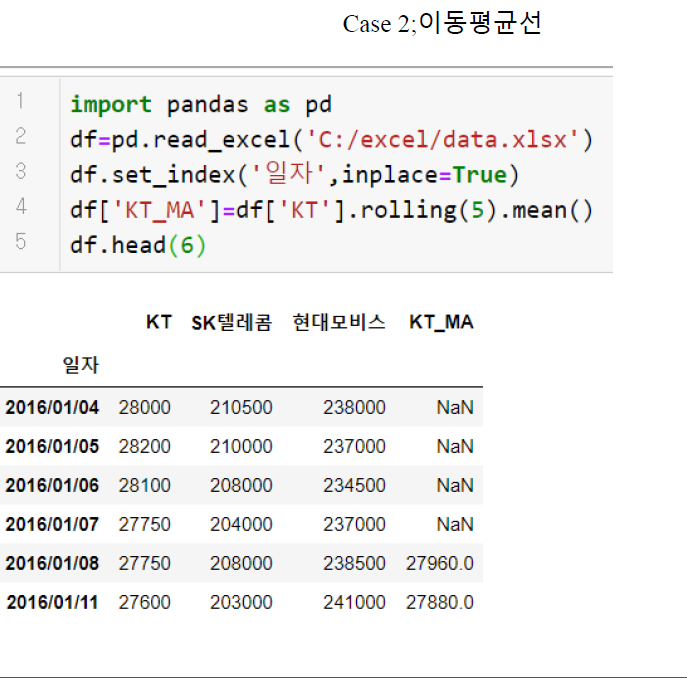


이제 여기서 결측치(NaN)를 없애보자.


### 결측치없애기

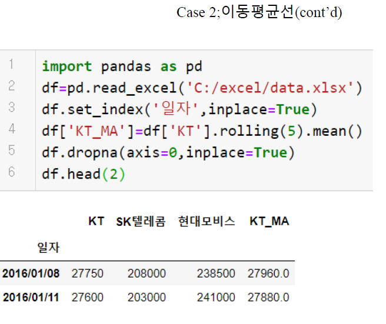


dropna 명령어를 통해 KT_MA의 nan값을 제거하였다.


axis = 0 은 결측치가 있는 행을 제거 (디폴트)

axis = 1은 결측치가 있는 열을 제거(세로를 제거)


실제 실습 결과 :


## KT와 KT 이동평균의 그래프


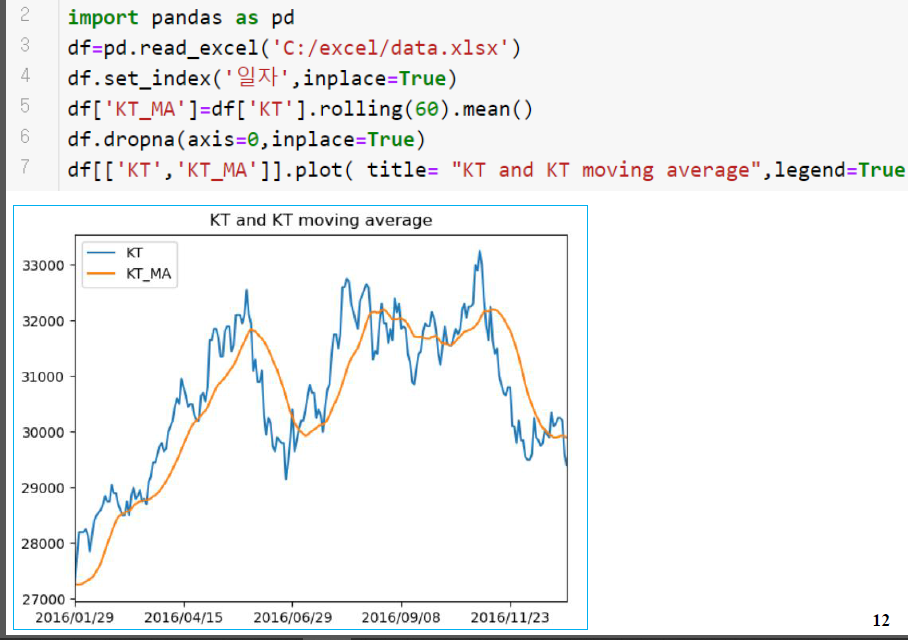


df[].plot에서 대괄호 안에 또 [kt,kt_ma]를 넣어주어야한다.


##### 즉 kt와 kt_ma 두개의 열을 슬라이싱 할 때에는 리스트 안에 넣어주고 슬라이싱을 해야한다.


## 장-단기 이동평균 구하기

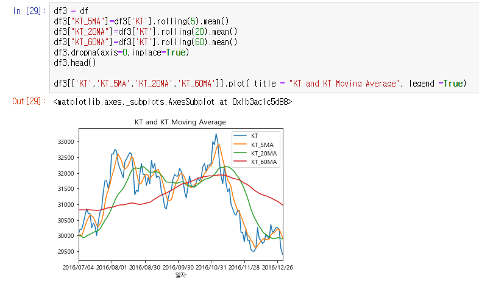

5일, 20일, 60일 기준의 이동평균을 그래프로 확인하였다.


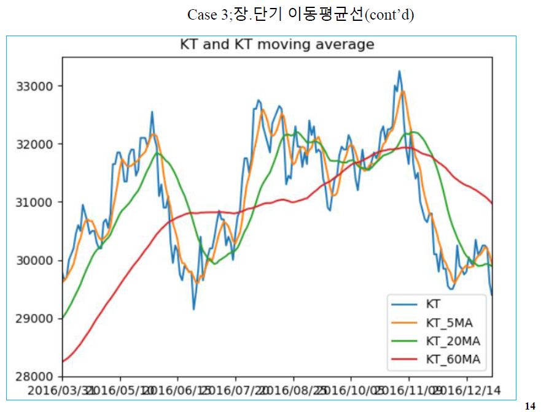


초보적인 기술 분석으로는

단기 이동 평균이 장기 이동 평균을 넘어거나 더 떨어지는 경우를 통해 값의 상승, 하락을 예상할 수 있다.


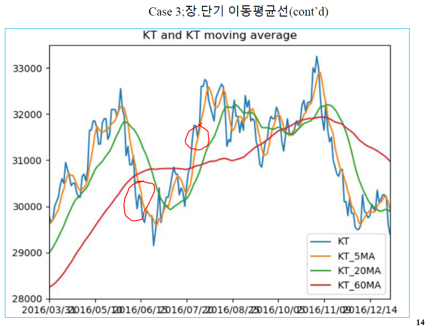


예시를 들면 저 두 부분.


## MACD

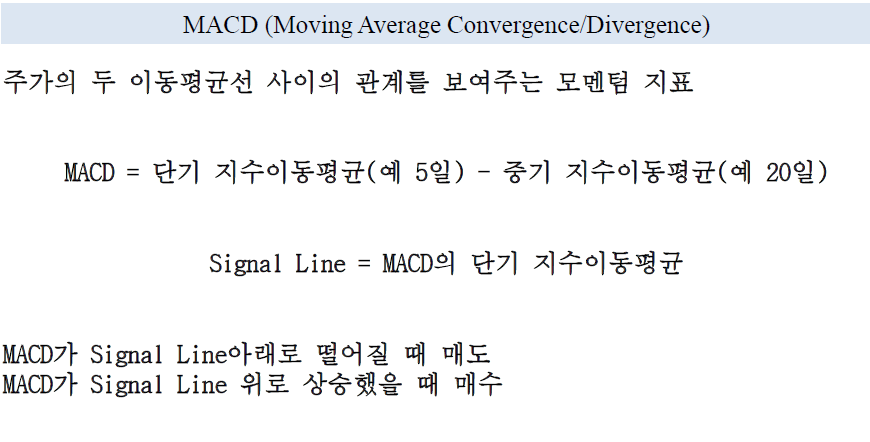


위에서 말한 이동평균 사이의 값들을 계산한  지표.


MACD가 Signal LIne 기준으로 위 아래를 갈때 매수,매도를 하는 것이 중요하다.


실습 :

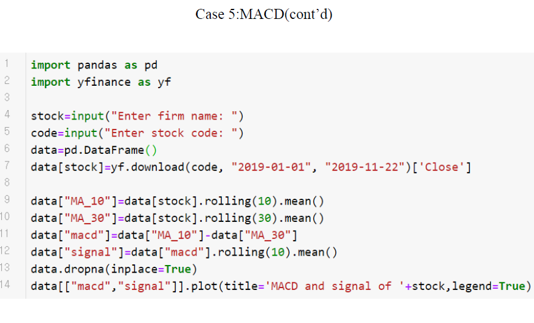


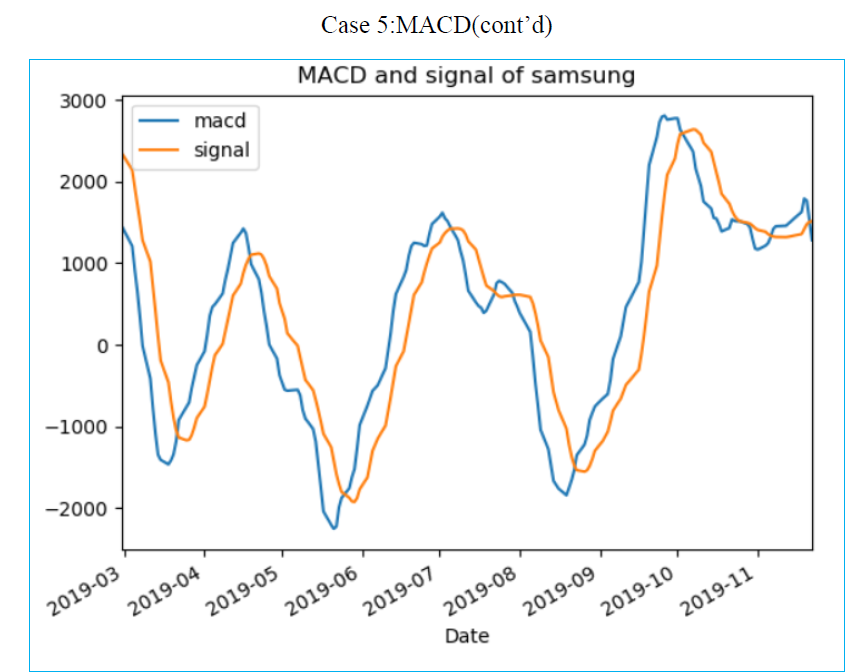


2019-04가 매수지점,

2019-05가 매도지점 


이러한 기술적 분석은 과거의 데이터를 이용해서 계산할 경우 매우 잘 맞아 떨어지지만 현실의 주식을 예상할 때 사용하면 결과가 잘 나오지 않는다.

(실시간이라고 할 경우 signal line을 넘었다고 해서,  앞으로 쭉 상승을 할지, 아니면 하락을 할 지 모르기 때문이다.)