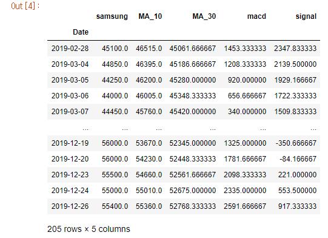

# 200331_W3D1_RSI(ch1.2),lambda함수

## 전에 한거 리뷰

MACD란?

ex)  

각각의 매수 매도 지점.

## 1-2 Equity portfolio investment strategy: Technical analysis

RSI가 70% 이상이면 과매수,

RSI가 30% 이하이면 과매도 이다.

## 소스코드

먼저 차이를 구한다.

(.diff)

.diff에 조건문을 넣어서 U와 D를 구해주어야한다.

lambda 함수를 사용하여 x>=0이면 x를, 다른 값이면 0을 넣는 식으로 U를 구하고

반대 형식으로 D를 구함.

## @lambda 함수 (익명함수)

익명함수 f를 만들어서 

리스트 x를 for문으로 돌려준 뒤, 리스트x의 요소들 중 음수인 값을 0으로 바꿔주는 함수이다.

## lambda의 응용

이런 식으로 성별 값을 0,1로 바꾸는 등 특정 값들을 apply로 바꿀 수 있다.