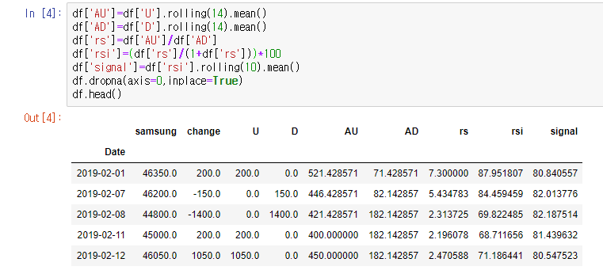

# 200401_W3D2_RSI,OBV,ADI(ch1.2)

## RSI(Relative Strength Index)리뷰

## 소스 코딩

전날 종가를 기준으로 차이를 구한 뒤, 양의 값은 U에, 음의 값은 D에 저장.

U와 D의 14일치 이동평균을 구한다.

결과 : 

RSI 그래프 그리기

그래프 보는 법 :

기준 선을 정하고 signal이 감소 추세이고 특정 선을 넘어 상승하면 매도, 특정 선을 넘어 하락하면 매수 같은 방식으로 하면 된다.

## OBV(On Balance Volume)

거래량으로 주가 추세를 확인하거나 앞으로의 반전을 예측하는 지표.

계산 공식은 매우 간단함 .

#### 종가를 기준으로

당일 > 전일일 경우 + 거래량

같으면 +0

당일 < 전일일경우 - 거래량

## 소스 코딩

change는 기술적 분석에서 만들어 두는 게 편함.

이제 OBV 칼럼을 만들어야 하는데 OBV의 초기값은 어떻게 할 것인가?

초기값 = 당일의 거래량 = 7847664

1월3일은 종가가 더 낮으므로 거래량을 마이너스 해주면 된다. OBV = 7847664 -12471493

종가를 비교하는 방법? -> change 칼럼.

In[13]은 df.shape[0]은 (240,7)과 같은 형태의 첫번째 항목 즉, 모든 컬럼에 0값을 넣어준다 라는 의미다.

obv값을 수동으로 업데이트 해준다.

조건문과 반복문을 이용해서 obv를 전부 업데이트 해준다.

 (range가 1부터 시작하는 이유는? 첫날의 obv를 수동으로 업데이트 해주었기 때문.)

#### range의 이해

투플을 생성해준다. 1,df.shape[0]은 1,243을 의미한다.

즉 1,2,3,4,5.....243 까지의 반복을 의미

obv의 추세

##### obv의 사용방법 : 추세확인

주가가 오르고 obv도 오르면 상승추세가 계속 된다는 의미.

주가와 obv가 같이 하락 -> 하락추세 

주가상승, obv하락 -> 추세의 반전 가능성 주가가 하락으로 전환될 시그널

주가하락, obv상승 -> 추세 반전, 주가가 상승으로 전환될 시그널

전체 코드 :

## ADI 지표 (Accumulation/Distribution Indicator)

A/D 계산 = 전날의 A/D에 CMFV를 더해준다. (=누적합)

CMFV = Current Money Flow Volumn 

(종가-저가) - (고가-종가)

ㅡㅡㅡㅡㅡㅡㅡㅡㅡㅡㅡ          *  거래량

(고가-저가)

### 소스 코딩

##### AD의 사용 방법? OBV와 동일.

주가가 오르고 ad도 오르면 상승추세가 계속 된다는 의미.

주가와 ADL(AD line, 그래프 선을 설명하기 위해서 L이라 표현)가 같이 하락 -> 하락추세 

주가상승, ADL하락 -> 추세의 반전 가능성 주가가 하락으로 전환될 시그널

주가하락, ADL상승 -> 추세 반전, 주가가 상승으로 전환될 시그널

## 정리

### RSI : 매수와 매도의 추세를 알아보기 위한 지표

### OBV : 가격 추세와 주가의 반전 추세를 알아보기 위한 지표

(종가를 이용함)

### ADI : 가격 추세와 주가의 반전 추세를 알아보기 위한 지표2

(저가,고가,종가,거래량을 이용함)

이러한 지표는 중,소형주 보다는 대형주의 추세를 파악하는데 도움이 된다.

## 차이 

### OBV

obv 차트는 전일의 obv값에 주가가 상승한 날의 거래량을 더하고 주가가 하락한 날의 거래량을 감하는 단순한 방법으로 작성된다.

  OBV(On Balance Volume)는 단순하게 상승한 날의 거래량은 더하고, 하락한 날의 거래량은 차감한 누적 값을 차트에 표시하는 지표이다.

### ADI

 이에 반하여 A.D.Line은 종가의 (+),(-) 여부 보다는 종가와 시가의 대비, 또는 종가와 중가의 대비를 통하여 거래량의 가감 여부를 결정하는 것이다.

  OBV는 전일 종가보다 금일 종가가 상승하면 오늘 거래량을 더하고 반대로 하락하면 오늘 거래량을 빼주어 누적 계산을 하지만 AD지표는 **당일 주가 변동폭의 중간 값에 대한 종가의 비율을 당일 거래량에 곱한 수치**를 누적 계산한 것이다. 

  **AD지표도 증가 추세라면 시장의 매집 국면으로 매수 신호로 판단하고, 감소 추세이면 분산 국면으로 매도 신호로 판단**