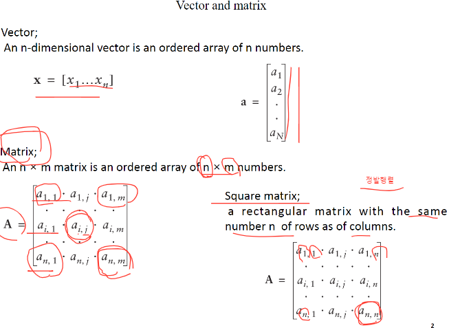

# 200407_W4D1_포트폴리오 전략 - Combination line

##### ch2.

MPT(Modern Portfolio Theory)

현대 포트폴리오 이론

포트폴리오란 무엇인가?

투자자의 금액이 복수의 주식들에 분산되어 투자되어있는 금융자산.

ex) A라는 사람의 포트폴리오는 삼성전자1000만,엘지500만,SK300만 에 투자되어있다.

#### Comblination Line : 조합선

포트폴리오가 중요한 이유.

과거에 배운 개별주식의 분석은 단지 과거만 보는 것이기 때문에 기술적인 요소가 없지만

현대 포트폴리오 이론은 복합적이기 때문에 매우 합리적인 과정임.

Optimal Portfolio : 각각의 목적에 맞는 최적의 목표.

투자자들이 가지고 있는 목적이 따라 달라진다.

Expected Return Model : 기대 수익 모델

특정 주식에서 객관적인 관점에서 1년 정도 지난 뒤에 기대할 수 있는 예상 수익.

MPT의 가장 기본적인 출발점이자 중요한 것은. 기대 수익 모델(ERP)을 가지고 있고, 예측할 수 있어야 한다.

variance covariance matrix model (분산 공분산 행렬 모형) : 

포트폴리오는 주식들이 합쳐진 복합적인 모델인데, 그 주식들의 상호작용을 계산하는 모형,모델

#### 2장에서는 기대수익률과 분산공분산을 다룸.

MPT의 출발점은 ?

기대수익률을 계산하는 모형은 많이 있지만, 우리는 그 중에서도 실습을 위해 가장 단순한 모형을 사용함.

기대수익률이 잘못된 값이 입력되면 결과값도 잘못된 값이 나오게 됨.

### historical average returns : 과거 평균 수익모델

ex) 300일 간의 종가 데이터를 모아서 300으로 나눠준 값.

과거의 주가 데이터를 얻어오는 것은 매우 쉬운 일임.

24분 스탑

39분 복귀

### 공분산 구하기

I와 J, 두 주식을 비교해서 공분산을 구함.

시그마 ij = 주식 i와 j의 공분산

41분 다시 ㄱ ㅠ

49 ㄹㄹ

정발행렬 : 행과 열의 수가 같은 matrix,  Square matrix라고함.

### 분산 공분산 행렬

위에서 구한 분산, 공분산을 이용해서 행렬을 만든다.

주식1의 분산을 왼쪽맨위. 주식n의 분산을 오른쪽 맨 아래로 해서

모든 주식의 분산을 왼쪽위에서 오른쪽 아래 대각선 방향에 위치시킨다.

11 12 13 14... 1n 등의 공분산은 첫번째 줄에 위치시킨다. (1과2의 공분산, 1과3의 공분산..)

정리 : 가로 1줄은 1에 대한 다른 주식들의 공분산

2줄은 2에 대한 주식들의 공분산

왼쪽위에서 오른쪽 아래의 대각선은 주식 1,2,3,.... n 의 분산들

녹강 봐서 추가할거. 

14분. MPT의 출발점은?

분산 구하기.