# 200408_W4D2_기대수익률,행렬곱

주식 n 에 대하여 행렬을 만들고 그 행렬을 시그마로 표현한다.

대각선 오른쪽 아래 방향은 주식 n 의 분산을 의미하고 

세로 가로 값들은 각각 주식 n의 공분산을 의미한다.

첫번째 행의 공분산 값과 첫번째 열의 공분산 값은 같다 -> 대칭 행렬 

ex) 1,2의공분산과 2,1의 공분산은 같다.

분산,공분산의 개념공식은 이해만 하면 됨, (사용해서 계산할 것이 아님)

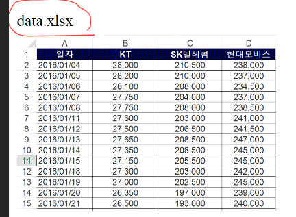

data 엑셀파일,

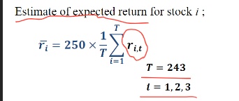

종가데이터는 총 243개 있다.

첫 날 수익률은 200/28000이 된다.

## python guide ch2로 이동

## pct_change

변화율, 증감율을 계산해주는 함수, 

분산을 구하는데 

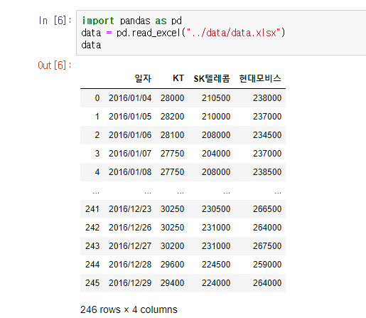

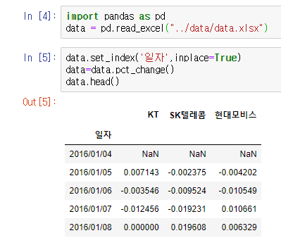

이런식으로 값을 수익률로 바꿔주고, index를 일자로 바꿔준다.

## mean, cov, con - 평균/분산/공분산을 위한 함수

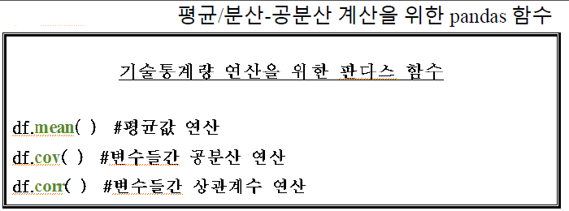

## 평균

mean(axis=0)에서 axis=0은 행의 평균을 구한다는 의미임. (세로)

axis=0은 디폴트이므로 생략 가능

현재 시리즈인 m을 nupmy 행렬로 바꿔주어야 한다.

그때 사용하는 함수가 values 함수.

## 공분산

cov 함수를 사용하면 전체 행렬의 공분산을 얻을 수 있다.

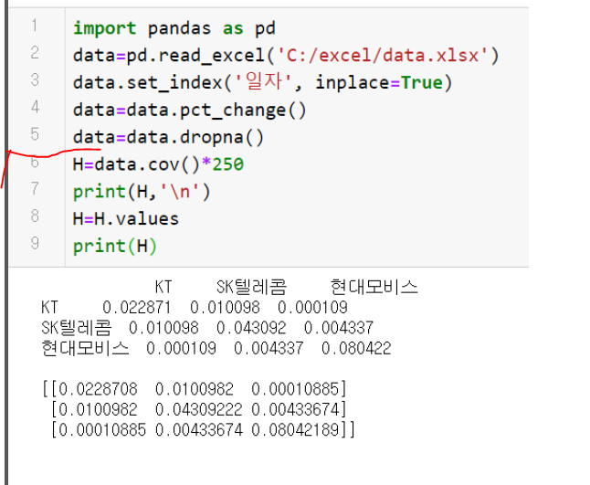

.cov * 250을 입력해주면 전체 행렬에 대한 공분산이 나온다.

H를 print 해주면 데이터 프레임이 나옴.

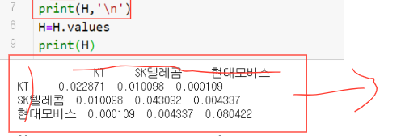

이러한 데이터프레임을 H.values를 이용하여 nupmy 배열로 바꿔준다.

이 형태가 numpy배열 (인덱스,열레이블이 사라지고 자료값만 나옴)

### ch2로 다시 이동 - 9p

정리 : 

1.주식 종가 데이터를 얻어야 한다. (일정기간동안의)

2.수익률을 계산한다.(pct_change)

3.결측치를 제거한다.(dropna)

4.공분산을 계산한다(.cov)

5.numpy배열로 바꿔준다.(.values)

MPT 이론 중간점검

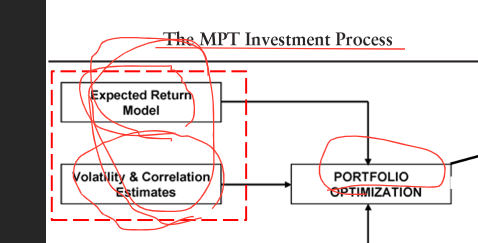

기대수익률모델 + 분산 공분산 측정 -> 포트폴리오 최적화 

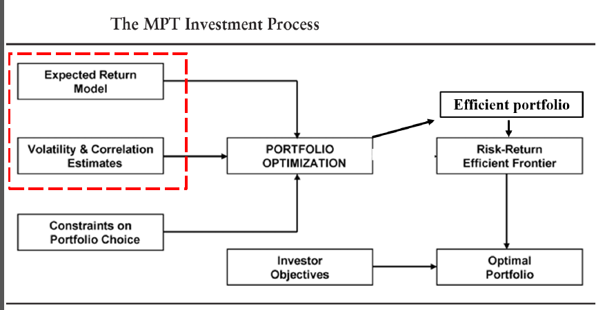

최종 목적은 최적 포트폴리오를 만드는 것이다.(Optimal Portfolio)

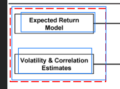

현재 과거수익률을 가지고 기대 수익 모델을 만들었고, 공분산 분산도 측정하였다.

이제 남은건 포트폴리오 최적화(portfolio optimization)이다.

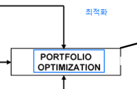

@우리가 포트폴리오를 배우는 이유?

-> combination line(조합선)

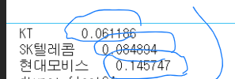

이 세 주식의 수익률을 이용하여 포트폴리오를 만들 것이다.

포트폴리오의 수익률 계산

E(Ri)는 주식i의 기대수익률

xi는 주식 i의 투자 가중치(0이면 투자X, 1이면 그 주식에 올인)

투자가중치는 0~1 사이다.

전체식 : 주식A(투자가중치 * 기대수익률) + 주식B (투자가중치 * 기대수익률) + 주식C(투자가중치 * 기대수익률)의 합.

주식의 수가 3가지라더라도 투자가중치를 어떻게 주느냐에 따라 다른 포트폴리오가 나오므로 포트폴리오의 가짓수는 무한대이다.

but, 투자가중치의 합은 항상 1이어야 한다.

이론적으로 투자가중치의 최고값은 1이상이 될 수 잇다. (숏 세일로 다른 투자가중치가 음수이고, 총합이 1을 유지하는 경우에만)

ex) (1.2 -0.1 - 0.1) = 1

포트폴리오의 공분산

위의 식은 너무 복잡해서 안 씀.

투자가중치를 행벡터, 열 벡터로 가지는 [x1....xn] 행렬을 만듬 (2개)

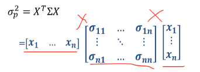

행벡터 [x1...xn] * 공분산 행렬 * 열벡터 [x1...xn]  = 포트폴리오의 공분산(Variance of an n-stock portfolio)

행렬간의 곱셈이 까다롭지만, 우리는 파이썬으로 간단하게 해결할 것임.

#### 행렬 곱은 어떻게 이루어지는가?

-> 파이썬가이드2의 2,3P

#### 행렬 곱의 조건

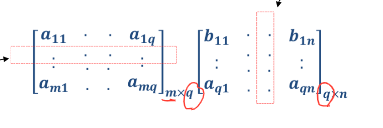

앞에 곱해지는 행렬의 행의 갯수와

뒤에 곱해지는 행렬의 열의 갯수가 같다면 행렬 곱이 이루어진다.

즉 3X2 행렬과 2X3 행렬의 곱은 이루어진다.

#### 그럼 행렬 곱은 어떻게 이루어지는가?

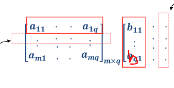

앞의 행렬의 행과

뒤의 행렬의 열을 곱해준다.

이렇게 다 곱해준 값이 새로운 행렬의 하나의 요소가 된다.

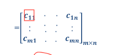

##### 계산식은 파이썬이 거의 다 알아서 해줌. 원리만 이해

행렬곱 예시

첫번째거만 계산하면  0.2x0.1 + 

0.3*0.01 

+0.4*0.03

+0.1*0.05 = 0.04

시리즈 데이터를 for 문으로 돌리는건 매우 비효율 적이기 때문에

numpy 배열 데이터로 만들어서 계산을 하면 코딩이 매우 효율적으로 처리됨.

numpy는 모든 데이터가 배열로 처리되기 때문에, 사용하기 위해서 전환이 필요함.