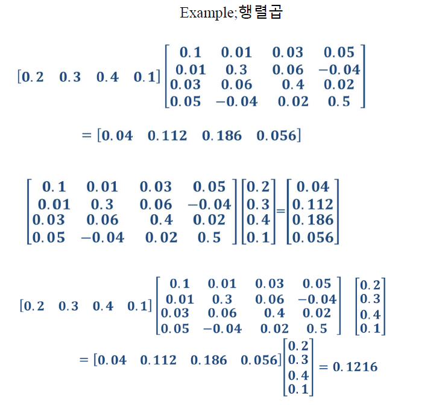
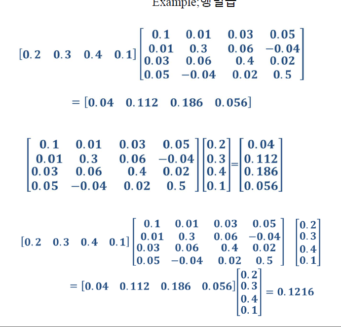

# 200414_W5D1_Numpy 행렬곱

## 전에 한 거

행렬곱 예시

첫번째거만 계산하면  0.2x0.1 + 

0.3*0.01 

+0.4*0.03

+0.1*0.05 = 0.04

시리즈 데이터를 for 문으로 돌리는건 매우 비효율 적이기 때문에

numpy 배열 데이터로 만들어서 계산을 하면 코딩이 매우 효율적으로 처리됨.

numpy는 모든 데이터가 배열로 처리되기 때문에, 사용하기 위해서 전환이 필요함.

## Numpy와 Array(배열)

### 배열 만드는법

### 배열 연산 - 요소별

### 배열 연산 - 배열간

## 행렬곱 - 중요

1차원 배열은 행벡터 or 열벡터 이며,  완전한 벡터(n,n)로 취급되지 않는다.

#### 배열곱의 규칙

앞의 배열의 열의 갯수와 (세로)

뒤의 배열의 행의 갯수(가로)가 서로 같아야 한다.

ex)

#### 배열곱 주의사항

1차원 배열은 배열곱에 사용할 수 없음 - 요소의 갯수가 달라짐 ex) (3,) (4,)

but 앞의 배열의 열의 갯수와 (세로) 뒤의 배열의 행의 갯수(가로)가 서로 같을 경우에는 가능.

#### 예시

#### 예시2

왜 14가 나오는가?

a와b를 행렬곱하면 1차원 배열이 나옴. 

1차원 배열 * a 를 다시 곱함 -> 단수 가 나옴. 

[1,2,3] * [1,2,3] = 1+4+9 

= 14