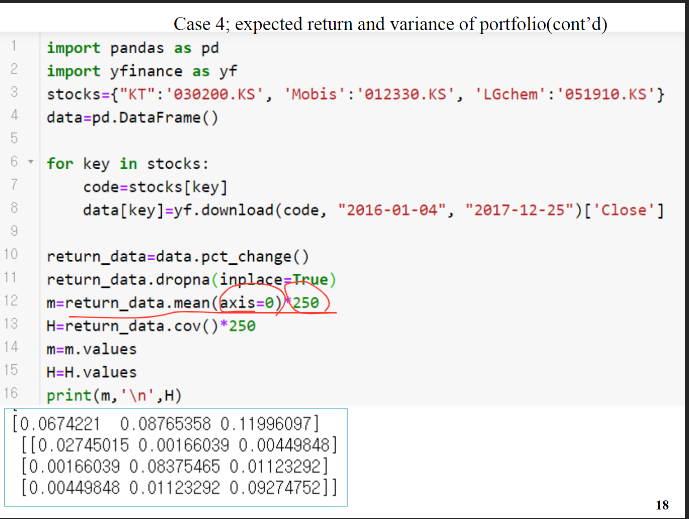

# 200421_W6D1_ 포트폴리오와 조합선

## 기대수익률 계산하기

E(기대수익률) 은 전체 합(xi) * 가중치E(Ri)를 곱한다.

투자 가중치는 합이 1이되어야한다.

## 예시1

w : 투자 가중치, 합이 1이 되어야함.

H : 주식 분산,공분산

E : 기대수익률 

기대수익률 : 주식 1,2의 행렬곱

## 예시2

w : 투자 가중치, 합이 1이 되어야함.

H : 주식 분산,공분산

E : 기대수익률 

기대수익률 : 주식 1,2의 행렬곱

## 예시3

0.2,0.3,0.5가 투자 가중치

## 예시4

실제 주식데이터를 받아서 계산

data.pct_change로 해당 주식의 기대수익률을 구해줌.

결측치를 제거하고

평균을 구하고 *250

공분산을 구해준다. *250

윗 부분이 평균, 아래가 공분산 행렬

투자가중치를 0.5,0.3,0.2를 줌

기대수익률  : 투자가중치 * 행렬 평균 m 

var : 투자가중치 * 분산 공분산 행렬의 행렬곱 

결과 : 

## 조합선(combination line)

주식1과 주식2가 있을 때, 

x축은 표준편차, y축(세로)는 기대수익률인 그래프에서

투자가중치를 변경하면 결과값이 계속 달라진다.

이때 포트폴리오의 모든 경우의 수를 그래프로 그리면 이와 같이 포물선이 된다.

위의 빨간 동그라미는 주식1을 short sale했을 경우고 (투자 가중치가 x1=0, x2=1)

아래는 주식2를 short sale을 한 경우다.  (투자 가중치가 x1=1, x2=0)

평균적인 그래프는 가운데 파란 선 (기대수익률이 0~1사이)

이 포물선이 우리에게 시사하는 점이 중요함.

표준편차는 수익률의 범위

표준편차는 작을수록 좋다.(높을수록 손실 위험이 커짐)

주식1과 주식2를 이용하여 단일 주식 구매보다 위험율(표준편차)를 낮추는 것을 위험 감소 효과라고 한다.

포트폴리오는 기본적으로 주식 하나에 올인하는 것 보다 기대수익, 리스크 측면에서 훨씬 유리하다.

이러한 효과를 단적으로 보여주는 것이 바로 **조합선**이다.

##### short sale의 경우는? -> 다음시간에

short sale을 해도 유리함

#### 이번학기는 중간고사 X, 과제로 대체

질문은 pkw@korea.ac.kr 로