# 200422_W6D2_조합선2+효율적포트폴리오

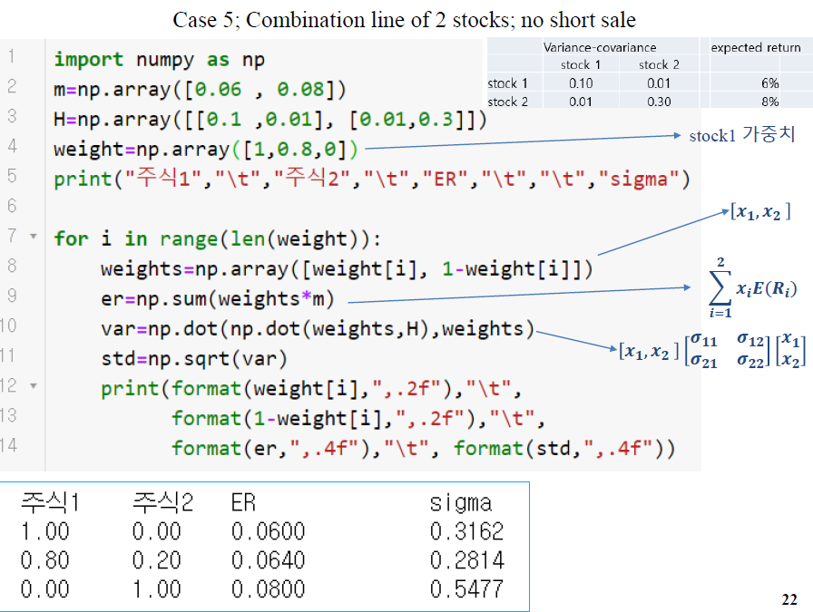

m : 기대수익률

H : 분산,공분산

weight = 가중치

len(weight) = for문을 3번 돌림

weights = [1.0, 0] ,[ 0.8, 0.2 ], [0, 1.0] 의 가중치 배열

er = 가중치 * 기대수익률 

var = (가중치 * 분산공분산) * 가중치

std = var의 표준편차

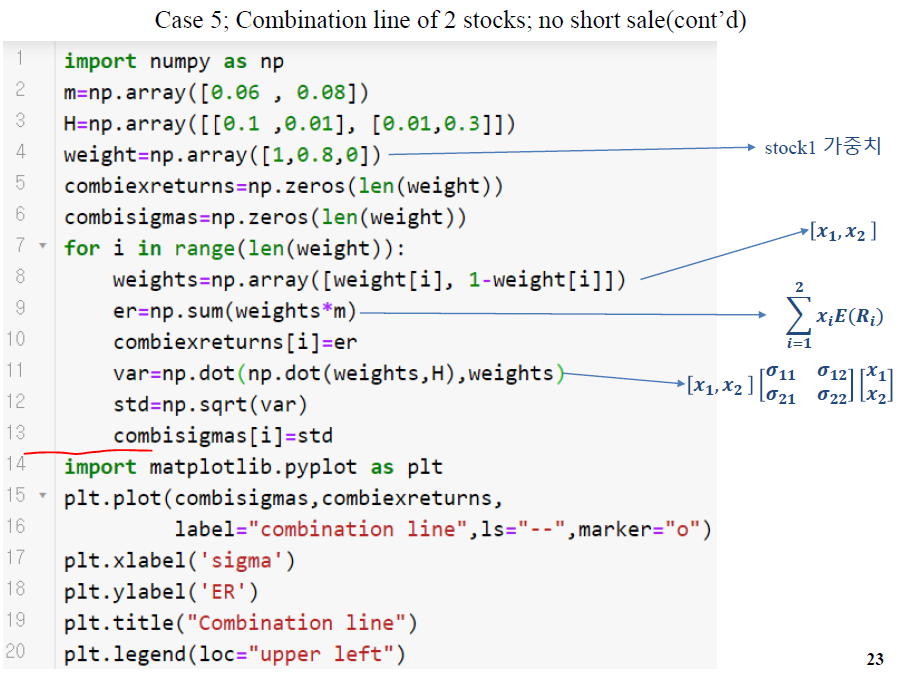

그래프 그리기 전의 결과값 (위의 빨간선 까지) : 

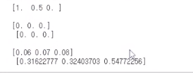

그래프 : 

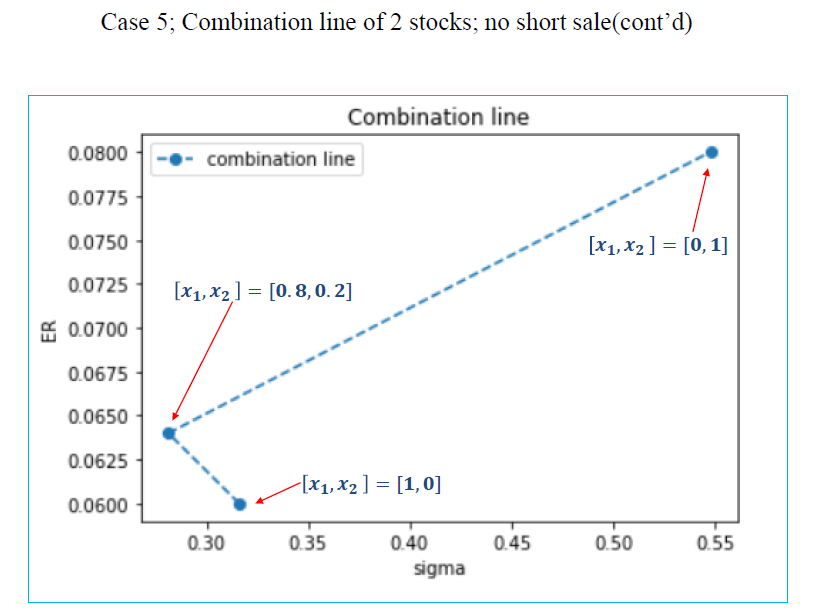

x1,x2 = 1,0은 x1에 올인

x1,x2 = 0,1은 x2에 올인

#### 포트폴리오 갯수를 늘릴 경우

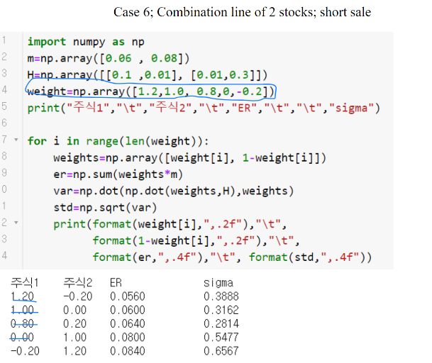

포트폴리오를 3개에서 5개로 늘렸다.

그래프 그리기 : (과정은 똑같음)

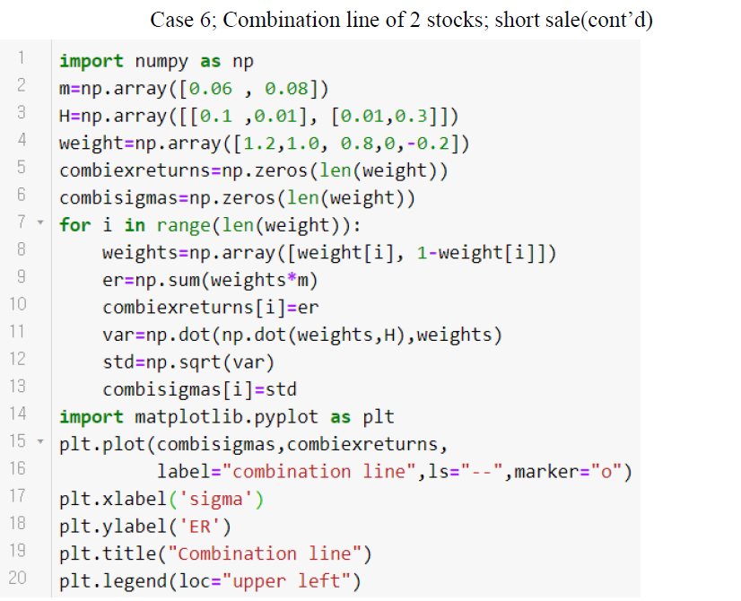

그래프 : 

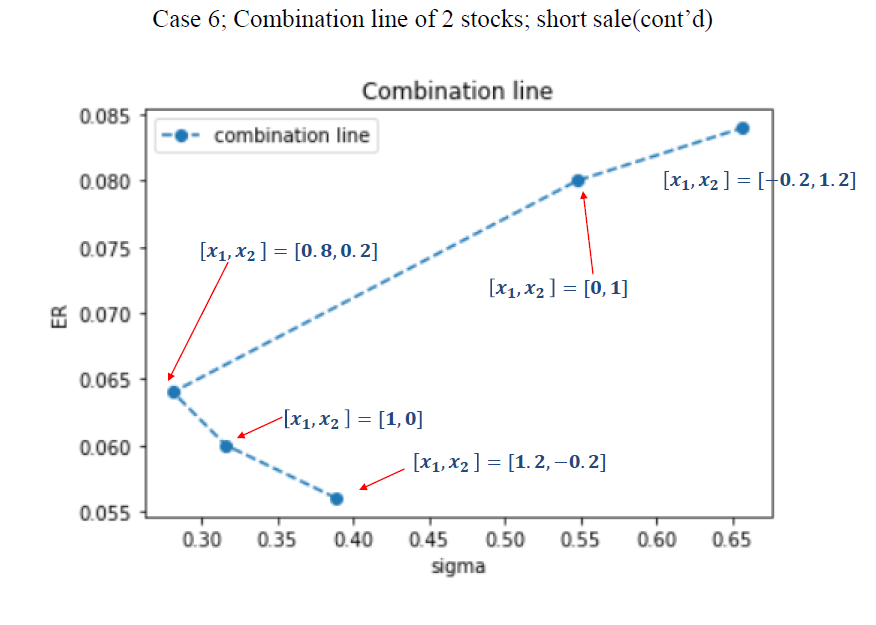

-0.2는 숏세일 , 

##### 아직은 점을 연결한 것이지 조합선이 아님

#### 포트폴리오 갯수를 30개까지 늘리기

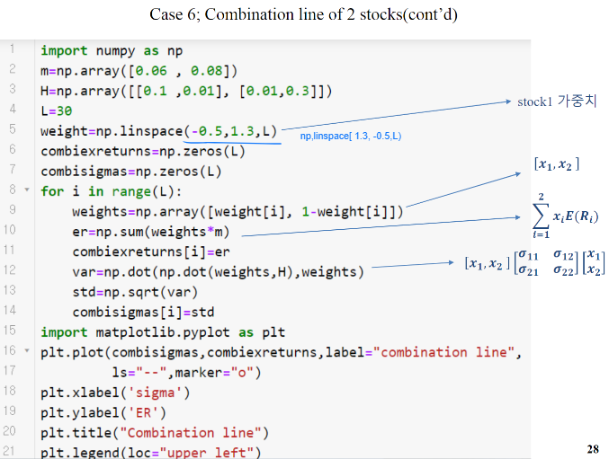

-0.5 ~ 1.3 사이의 포트폴리오 30개를 만들어서 같은 과정을 반복해줌.

##### 그래프 : 

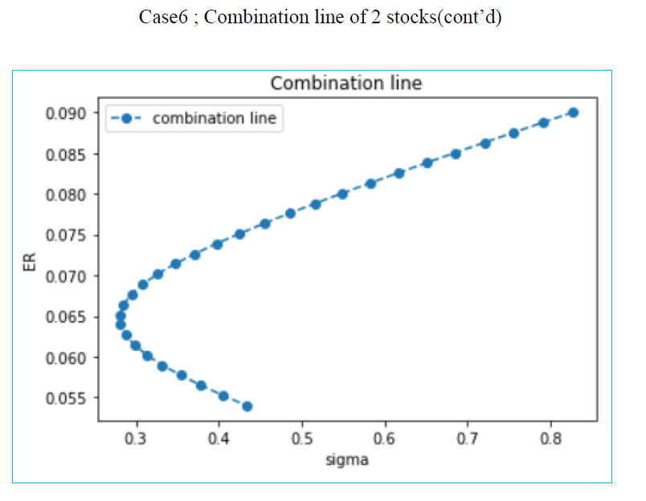

x축(sigma)는 표준편차, 변동성이고(낮을수록 안전성 높음)

y축(ER)은 기대수익률, 수익성이다.

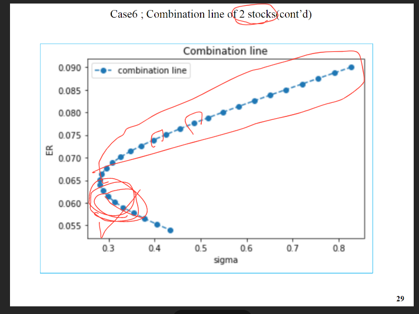

4장에서 어느 포트폴리오에 투자하는 것을 다시 배우긴 하지만

통상적으로 위의 빨간 원 안에 있는 것들을 투자하는 것이 좋음.

#### 주식 3개의 포트폴리오

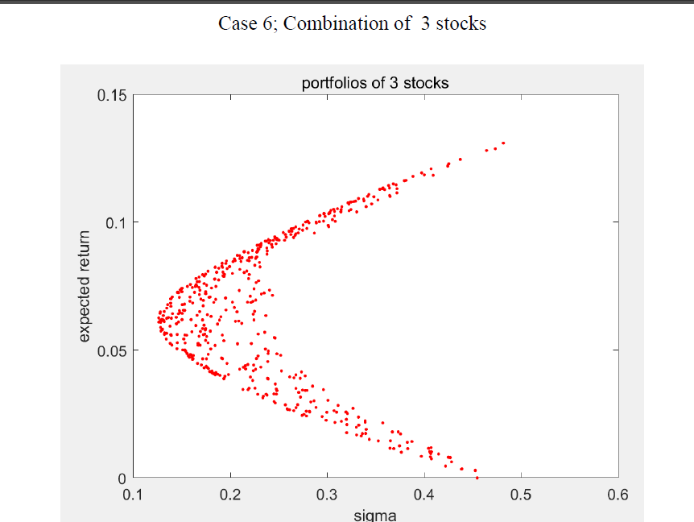

여기서는 어느 부분을 투자해야 하는가?

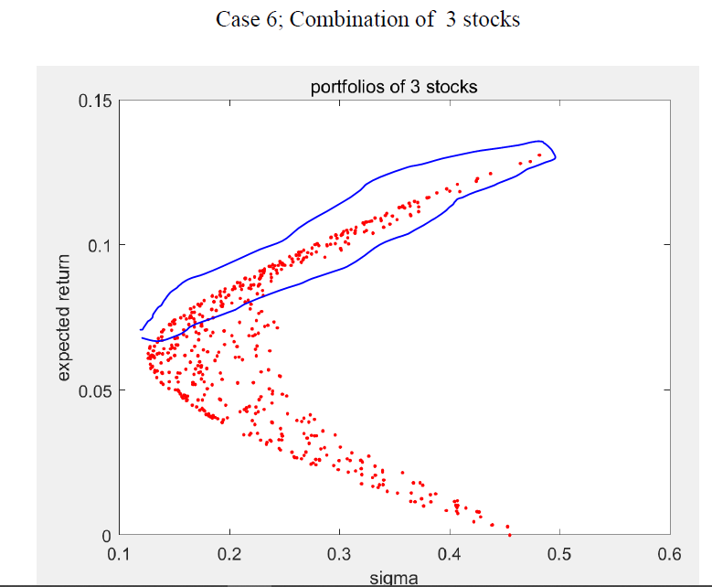

역시 경계선 상 위에 있는 부분임.

그럼 경계선 위의 포트폴리오를 어떻게 찾아낼 것 인가? 

-> 3장에서 해결

## ch3. 효율적인 포트폴리오

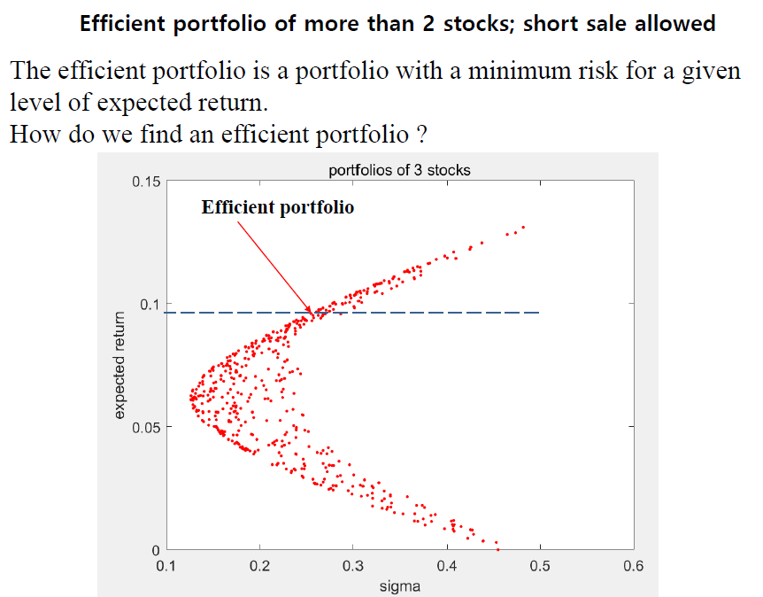

위험성이 낮고 기대수익률이 높은 지점의 포트폴리오 = Efficient portfolio

그럼 이러한 Efficient portfolio는 어떻게 찾을 것 인가?

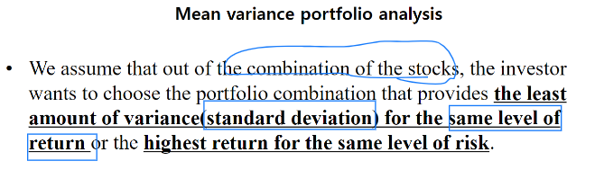

#### 표준편차가 같다면 가장 높은 기대수익률을 가진 것을 고른다.

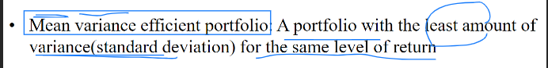

#### 기대 수익률이 같다면, 표준편차가 가장 낮은 것을 고른다.

#### -> Mean(기대수익률) variance(표준편차) portfolio 

#### -> 평균분산 효율적 포트폴리오

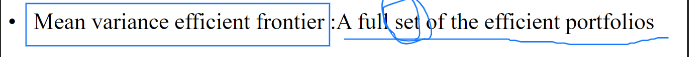

##### Mean variance efficient frontier : 가장자리에 있는 포트폴리오들의 집합

ex)

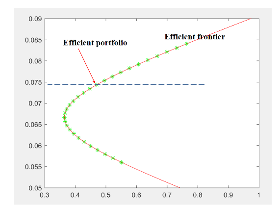

2개의 포트폴리오로 만들어진 콤비네이션 라인은 모두가 frontier라인.

3개의 경우에는 아래와 같음.

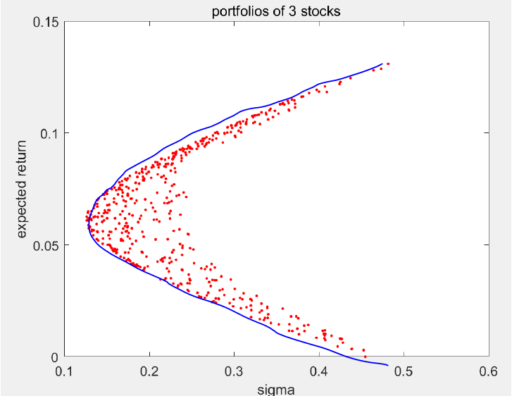

frontier를 선택해 투자하는 것이 좋음.

## 포트폴리오 최적화

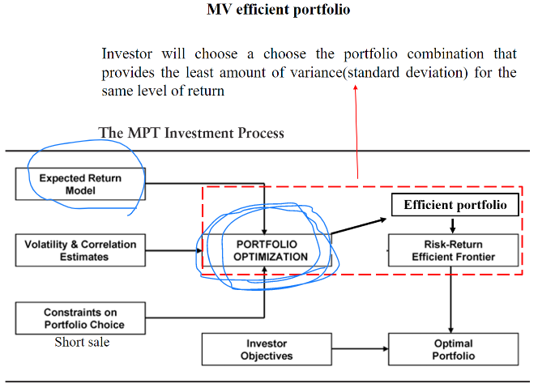

Efficient portfolio 를 찾아내는 과정.

#### 규칙1.

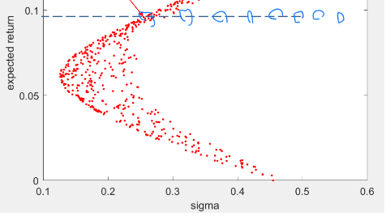

기대수익률이 같다면 가장 왼쪽의(안전성이 높은) 포트폴리오

공식 : 

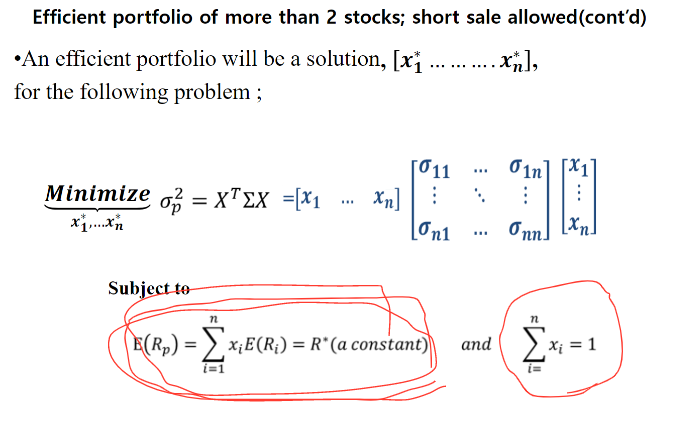

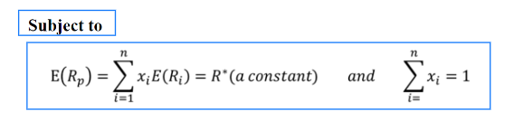

기대 수익률이 일정할 때, 

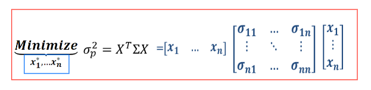

분산을 최소화 하는 공식 

 (표준편차가 가장 작다는 것은 분산이 가장 작다는 것을 의미)

이 공식에서 R*을 왼쪽으로 이항.

1도 왼쪽으로 이항

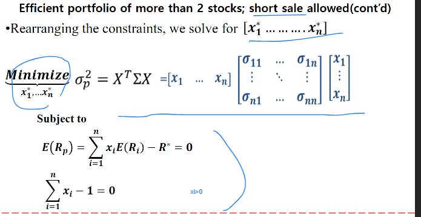

그럼 = 0의 식이 나온다.

## SciPy (싸이파이, 파이썬의 공학 계산 라이브러리)

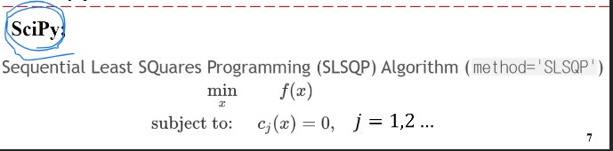

## 문제 리뷰

1 - 1장에서 배운 기술적 지표

볼린져 밴드를 구하는 것

2- 스토퍼 k계산?

3- obv 계산

4-분산공분산행렬 계산, 표준편차/기대수익률 계산

#### 실행결과 캡쳐 +  코드를 한글에 복사