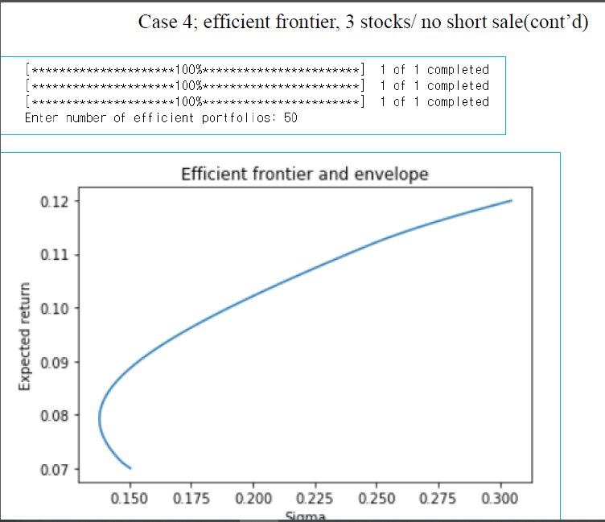

# 200429_W7D2_Efficient frontier(ch3마무리)

## 가중치 계산

4개의 주식이 가장 효율적인 가중치를 계산함.

lambda x 가 [x1,x2,x3,x4]의 배열

var이 

cons는 제약조건 constraint

x0는 초기값 (0,0,0,0)도 가능

## 결과 값

전체 :

##### 결과 가중치 x

##### 이 x 배열을 빼내는 것이 가장 중요함.

분산은 fun

분산식

## 기대수익률 계산

우리가 찾은 값은?

기대수익률 0.07에서의 **가장 최적화된 값**(가장 왼쪽)

이러한 최적값들의 모음을 Efficient frontier 라 한다.

## 타겟수익률

0.09,0.092,0.095의 타겟 수익률을 설정하고 계산한 결과

## 그래프 그리기-Efficient frontier

L=30을 줌

결과 : 

## 숏세일이 없는 Efficient frontier

결과 :

