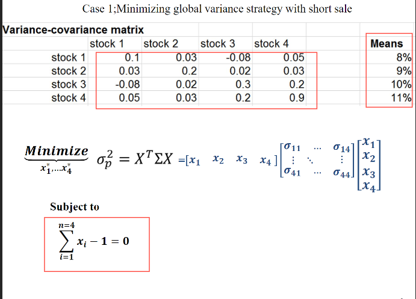
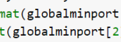

# 200506_W8D1_optimal portfolio(ch4~)

과제2

주로 2-3장의 문제

#### 1번

(1)

##### 곡선을 먼저 그림(조합선)

그 다음에 4개의 효율적 포트폴리오를 조합선 상에 좌표로 표시되도록

사례 노트에 있음

프로덕트 마크업기능 써야함

(2)

효율적 포트폴리오에서 개별 주식을 표시함

개별 주식의 효율적 포트폴리오

#### 2번

주식1개 추가 - 3개로

(1)

공매도가 가능한 경우

(2)

불가능한 경우

(4)

효율적 경계선 긋기

## 4장 - optimal portfolio - 최적의 포트폴리오 찾기

주식이 2개면 조합선 자체가 효율적 프론티어가 된다.

투자자는 목적에 맞게 원하는 포트폴리오를 고르면 된다.

주식 2개 이상일 때

최적의 포트폴리오는 목적에 따라 다르다.

ex) 안정성 , 수익성 등등

Global -> 표준편차로 대체가능

효율적 프론티어 상에서 표준편차, 분산을 최소화 시켜주는 포트폴리오

##### 즉 risk를 최소화 하는 투자자에게 최적의 포트폴리오

표준편차 대략 14%, 기대수익률 8%

투자 가중치 1로 만듬

표준편차가 가장 작은 것을 찾음.

네 주식의 합이 1이 되어야 한다.

## 실습 - 숏세일 가능

결과 : 

## 실습 - 숏세일 X

## 4-2 Roy`s safety

이 조건을 만족하는 경우가 바로 안전한 포트폴리오

확률을 최소화 시켜주면 왼쪽으로 값이 가게 됨.

Rl = 최저 수익률 3%

E(Rp) = 기대수익률

0p = 표준편차

## Roy의 안전전략이란?

80만원짜리 포트폴리오로 원금을 훼손하지 않고 3만원의 이익을 내고 싶을 때,

A,B,C 세개의 포트폴리오 중 어떤 것을 선택해야하나

최소수익률은 3.75%

3만/80만

## 실습 - Roy의 안전전략

## @@@ 12페이지 오타

변수명은 royport임 

이거 아님

