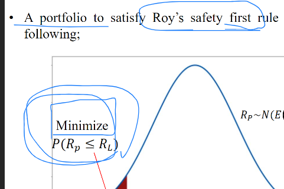
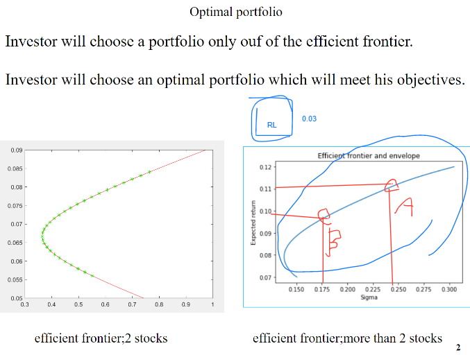
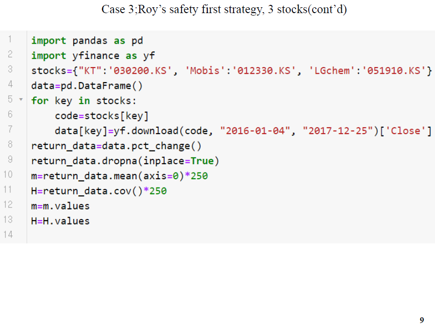
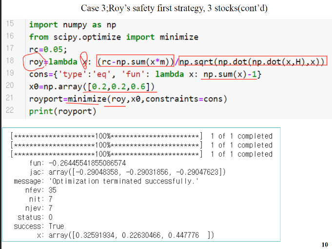
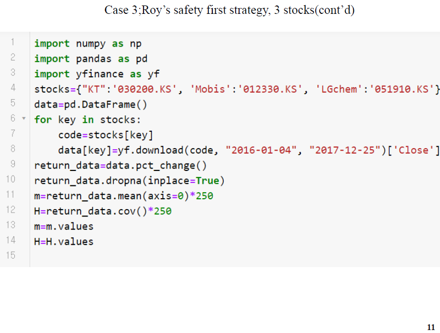
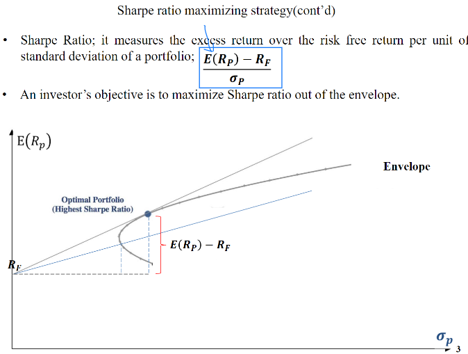
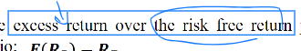
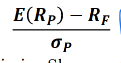

# 200512_W9D1_Roy`s safety 마무리, Sharpe ratio

## 4-2 Roy`s safety 로이의 안전전략

이 조건을 만족하는 경우가 바로 안전한 포트폴리오

확률을 최소화 시켜주면 왼쪽으로 값이 가게 됨.

Rl = 최저 수익률 3%

E(Rp) = 기대수익률

0p = 표준편차

## Roy의 안전전략이란?

80만원짜리 포트폴리오로 원금을 훼손하지 않고 3만원의 이익을 내고 싶을 때,

A,B,C 세개의 포트폴리오 중 어떤 것을 선택해야하나

최소수익률은 3.75%

3만/80만

## 공식

3개의 주식으로 안전한 투자가중치를 계산하는 과정.

최저 기준의 투자 수익률을 설정해줘야 함.

## 실습 - Roy의 안전전략

##### 최저 기준의 투자 수익률 : 0.05,

roy라는 익명 함수를 만들어줌.

최저 투자수익률 - 포트폴리오의 기대수익률을 뺌.

cons : 딕셔너리, 투자가중치가 총합 1이 되게 하는 제약조건

x0은 0,0,0 줘도 되고 아무렇게나 줘도 됨

fun : 목적 함수를 가질 때의 최적화 값(별로 의미 없음)

## @@@ 12페이지 오타

변수명은 royport임 

이거 아님

각 주식들의 투자가중치를 출력

## no short sale의 경우

바운더리를 설정해주면 된다.

투자가중치 합이 1이고

0보다 크거나 같으면서 합이 1이 되도록.

## 16P 오타

globalminport가 아니라

royport임

## 17p 오타

원래 답

숏세일 허용 안한 상태의 로이 포트폴리오

 투자 가중치 + 기대수익률 + 표준편차

실제pdf 의 17p는 오타임.

이거 아님

## pdf4-3 - 특정한 경우의 포트폴리오를 찾아내는 전략

-> 샤프 포트폴리오

샤프 비율을 극대화 시켜주는 전략임.

## 샤프 레시오 목적 함수

파란 네모가 공식.

무 위험 수익률을 계산함.

지금까지 우리가 다룬 주식들은 **위험자산**

무위험자산은 정기예금, 국고채 등등

6장정도까지는 위험자산을 다룸.

정기예금 이자율

국고채 수익률 등등은 나중에

위험률 리턴을 넘는 기대 수익률 -> 주식을 투자하는 이유

표준편차로 나누어 주었기 때문에 위험률은 다 똑같고

excess return이 각각 0.3 , 0.5 인 sharpe ratio가 있다면

0.5가 더 높은 수익률을 보유하고 있다는 의미임.

#### 정리 : E(Rp) = excess return

Rf = Risk free return per unit

이 그림에서 Rf에서 시작하는 기울기 : Sharpe ratio를 극대화 시켜주는 포트폴리오

##### (Sharpe portfolio)

기울기가 가장 높을수록 안전함.

접선이 생기는 부분이 가장 각도가 큰 기울기가 생긴다.

이러한 기울기가 가장 큰 값을 찾기 위해서는?

이 식을 최대화 시켜줄 수 있는 값을 찾으면 됨.