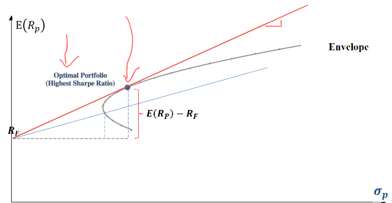
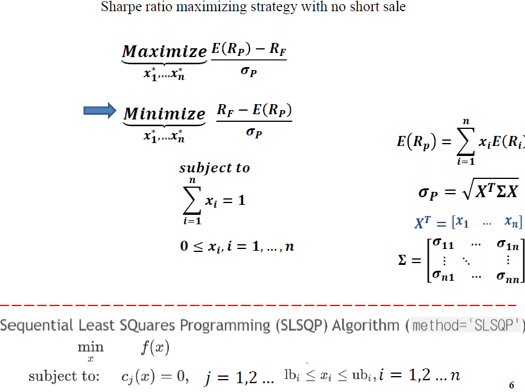
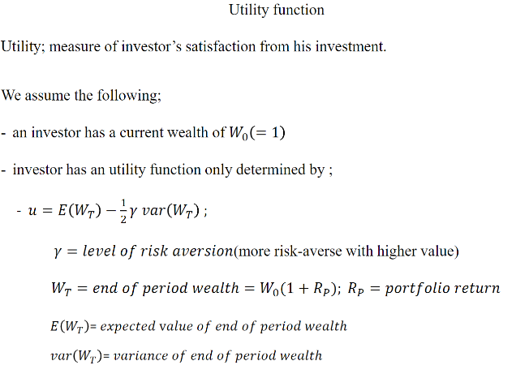
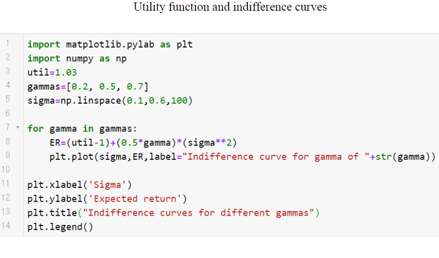

# 200513_W9D2_Sharp ratio

## pdf4-3 - 특정한 경우의 포트폴리오를 찾아내는 전략

-> 샤프 포트폴리오

샤프 비율을 극대화 시켜주는 전략임.

## 샤프 레시오 목적 함수

#### 샤프 포트폴리오란? 효율적 포트폴리오에 접선을 이루는 선 

파란 네모가 공식.

무 위험 수익률을 계산함.

지금까지 우리가 다룬 주식들은 **위험자산**

무위험자산은 정기예금, 국고채 등등

6장정도까지는 위험자산을 다룸.

정기예금 이자율

국고채 수익률 등등은 나중에

위험률 리턴을 넘는 기대 수익률 -> 주식을 투자하는 이유

표준편차로 나누어 주었기 때문에 위험률은 다 똑같고

excess return이 각각 0.3 , 0.5 인 sharpe ratio가 있다면

0.5가 더 높은 수익률을 보유하고 있다는 의미임.

#### 정리 : E(Rp) = excess return

Rf = Risk free return per unit

이 그림에서 Rf에서 시작하는 기울기 : Sharpe ratio를 극대화 시켜주는 포트폴리오

##### (Sharpe portfolio)

기울기가 가장 높을수록 안전함.

접선이 생기는 부분이 가장 각도가 큰 기울기가 생긴다.

이러한 기울기가 가장 큰 값을 찾기 위해서는?

이 식을 최대화 시켜줄 수 있는 값을 찾으면 됨.

## 공식

#### 투자 가중치 합이 1

## 코딩 - 샤프 포트폴리오, no short sale

엑셀 데이터 파일 사용

결과: (솔루션 프린트)

## 코딩2

@short sale을 허용하려면? -> Limits변수를 제거하면됨.

결과 :

## 기대 효용 극대화 전략 - ch5

(주식만 고려, 안전자산 고려 X)

risky assets = 주식

risk free = 무위험자산, 안전자산

## 효율적 포트폴리오와 비교

파란색 동그라미친 곡선이 효율적 포트폴리오.

효율적 포트폴리오와 무차별곡선(Indifference Curve)가 만나는 점이 바로

효용함수를 극대화 시켜줄 수 있는 지점.

## 효용,만족도 정의

투자자의 투자 만족도를 계산하는 과정

-> 결국 수익률임

투자에 대한 만족도의 측청치가 Utility가 됨.

즉 투자의 효용은 투자의 결과에 의해서 정의된다.

W0 = 기초 투자자산

Wt = 일정기간동안의 투자 후의 자산

Rp = 수익률

ex) 기초자산 1억, 수익률10% 이면 

1년후 기초자산 + 10%

Wt가 1억1천만이됨.

E(Wt)는 Wt의 기대값

제산의 크기의 기대값, 분산이 효용,만족도를 정의

Y(감마) = 위험회피 정도  (risk aversion), 위험회피 성향

위험 회피성향은 개인에 따라 다름 

감마가 클수록 위험을 회피하는 성향이 높은 사람을 뜻함.

높은 위험도가 있으면 높은 기대수익률로 커버를 해준다. (그러나 보통은 위험한 포트폴리오를 싫어함)

#### 상세 공식 :

내 재산의 분산(Wt)은 포트폴리오의 분산(Rp)가 됨

Rp = 수익률, return of portfolio

E(Rp) = 기대수익률

## 무차별곡선

무차별 곡선은 효용함수로부터 파생이 된다.

@효용함수 공식

만약 효용의 값을 1.3같이 일정 값으로 픽스 시킨다면?

u* = 픽스시킨 효용함수

이러면 1 + 뒤의 공식이 0.3ㅇ이 되고

E(Rp)만 따로 공식으로 바꿀 수도 있다. (전부 이항)

이항 결과

E(Rp) 기대수익률의 공식이 완성됨.

## 코딩 - 무차별곡선

감마를 0.2로 설정해줌.

고정시킨 효용함수는 1.03

U*이 1.03인 무차별곡선

이 부분은 표준편차가 0.2이고 기대수익률이 0.035인 포트폴리오나

표준편차 0.4 , 기대수익률 0.046 의 포트폴리오들은 각각 표준편차, 기대수익률은 다르지만 

효용성은 모두 같다.

#### 즉, 이 곡선의 모든 포트폴리오는 투자자들에게 같은 수준의(1.3) 효용을 가져다 주는 서로 다른 포트폴리오들이다.

@

이 행렬곱은 어떻게 작동되는가?

##### Numpy의 브로드캐스팅

브로드캐스팅이 되어 자동으로 a가 b와 같은 행렬의 형태가 되어 작동함

즉 1차원배열인 sigma와 상수 gamma를 곱해도 정상 작동함.

## 무차별곡선 반복

평행한 무차별 곡선들이 그려졌다.

높은 위치의 곡선일수록 효용성이 높다.

우리의 목표는? 효율이 가장 높은 포트폴리오를 선택해야함

-> 1.07의 효용성 그래프를 택해야함.

무차별 곡선들 위에 존재하는 포트폴리오들은 효용성은 높지만

실제로 존재하기가 힘든 포트폴리오들이다.

그러므로 우리는 효율적 포트폴리오와 만날 수 있는 무차별 곡선을 선택하여

효율적포트폴리오와 무차별곡선이 접하는 부분을 찾아서 투자해야한다.

-> 효용 극대화를 원하는 사람들에게 optimal portfolio가 됨.

## 실습 - 감마(위험회피의 정도)를 다르게 한 그래프 그리기

결과 :

평행한 그래프가 아닌, 굴곡이 달라진 그래프들이 생김.

