# 200519_W10D1_Optimal portfolio with risky asset(ch5 끝)

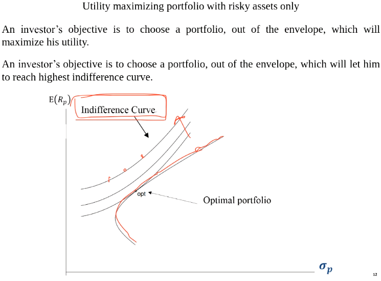

우리의 목표는?

많은 무차별 곡선들(Indifference Curve) 사이에서

##### 효율을 극대화 시키는 포트폴리오 (optimal portfolio)를 찾는 것

## 목적 함수

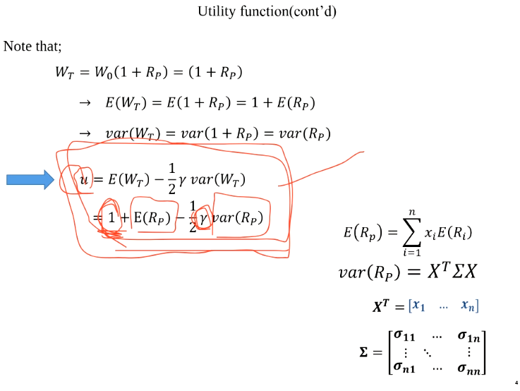

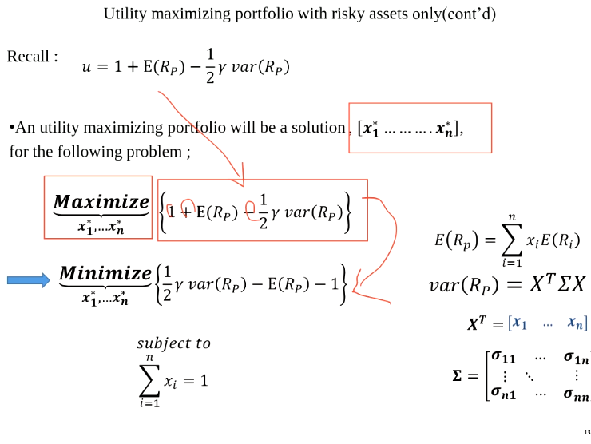

Recall 식에서 값을 그대로 전개하면 최대값, 

반대로 넘겨서 전개하면 최소값이 나온다.

## 실습

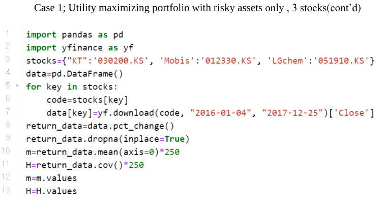

KT, 모비스 ,LG화학의  3주식 데이터를 사용

평균값과 분산공분산 행렬을 values함수를 통해서 만들어줌.

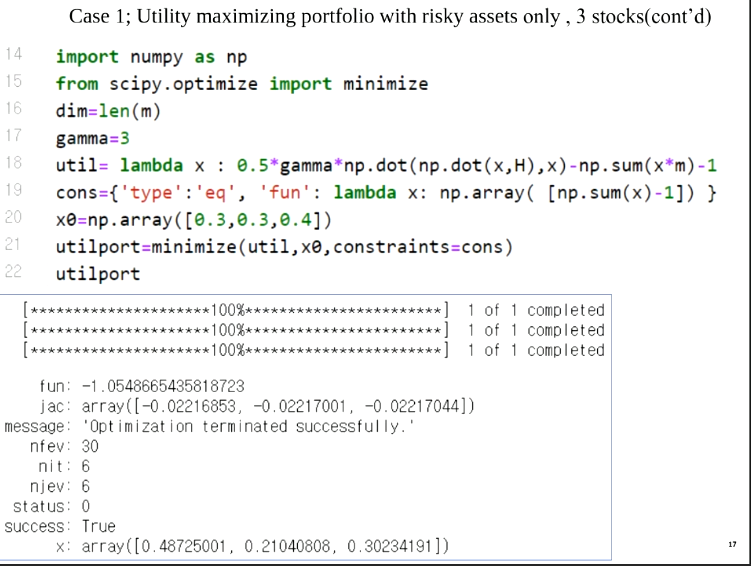

numpy와 scipy를 import해서 minimize함수를 사용

우리의 목적 함수는?

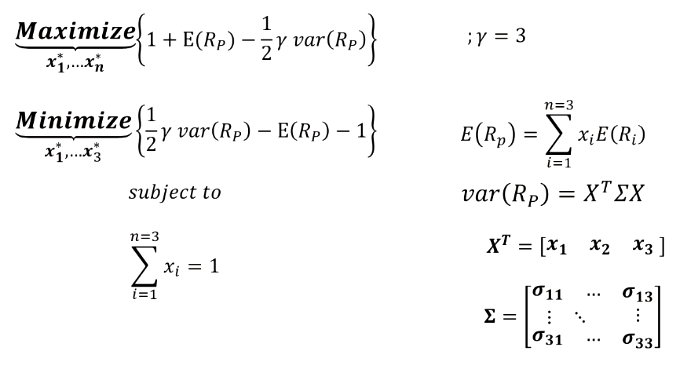

최소화이기 때문에 1/2 감마 ~~~ 부분

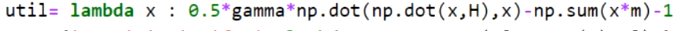

이 부분을 의미한다.

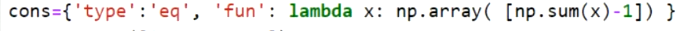

제약조건 -> 투자가중치의 합이 1이다.

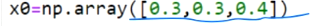

초기값은 맘대로 줘도 됨.

결과 :

3 주식의 효율적 포트폴리오의 투자 가중치를 구함.

## 실습2

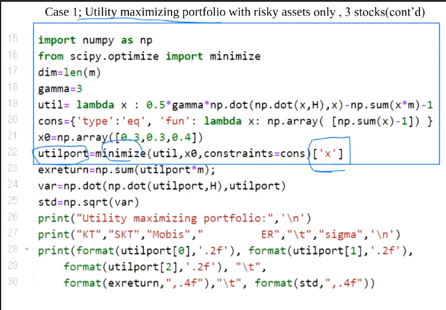

위에서 구한 utilport의 x값을 이용해서 기대수익률, 표준편차를 구함.

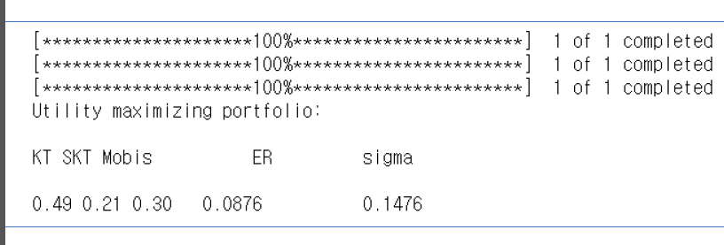

@주식 이름은 오타임.

@원래는 KT 모비스, LG화학

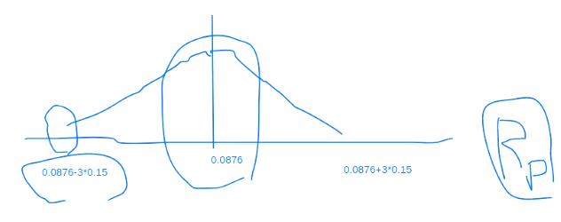

그래프로 보면 대충 이런 느낌.

평균 기대 수익률은 0.0876% 이지만, 표준편차로 인해 어느쪽으로 이동될지는 모른다는 의미.

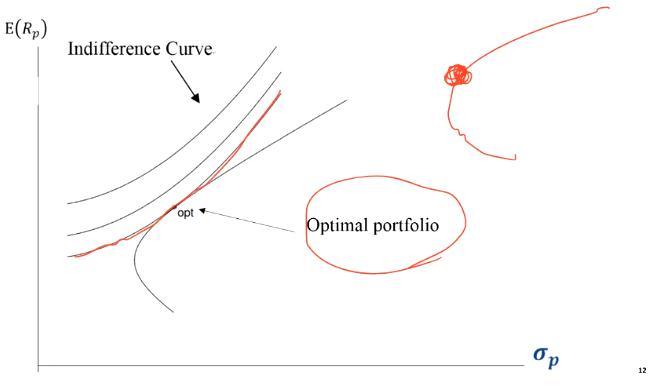

우리는 현재 이 지점을 찾아 낸 것임.

무차별 곡선과 최적화 포트폴리오가 만나는 부분

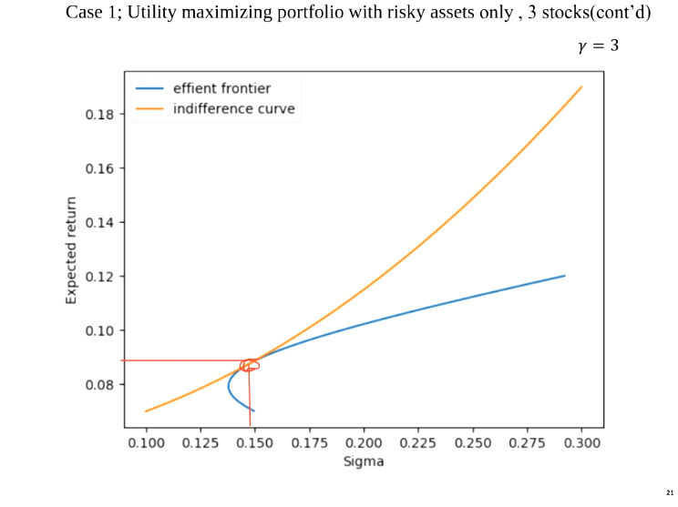

그래프로 확인

노란색이 무차별곡선

파란색이 효율적 포트폴리오

빨간색 점이 두 곡선이 접하는 optimal portfolio

#### @ 이 그래프 그리는 부분 나중에 과제

#### 지금까지의 실습은 주식들만을 가지고 포트폴리오를 구성(무위험 자산 제외)

##### 감마(=위험을 회피하는 정도)에 따른 결과값 계산

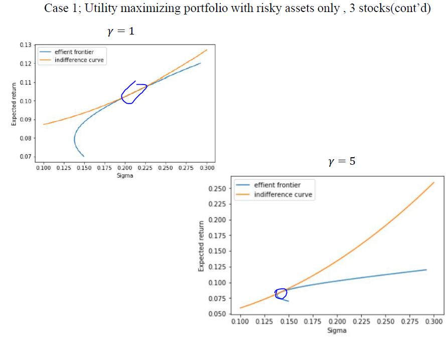

위의 그림은 감마 3, 이 두 사진은 감마 1 , 5 

위험 회피 정도가 낮은(1) 사람은 표준편차가 높으면서 수익률이 높은 것을 선택하고(접점)

위험 회피 정도가 높은(5) 사람은 수익률이 낮더라도 낮은 시그마를 가지고 있는 부분을 선택함.

#### 지금까지는 숏세일 허용

숏세일을 금지시키려면?

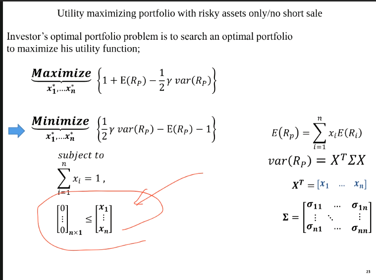

바운드 조건만 주면 됨.

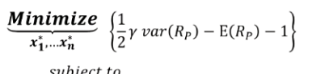

목적함수는 효용함수에서 부호만 바꾼 것,

-> 옵티멀 포트폴리오

risky free 에셋을 다룬 optimal portfolio는 6장에서 진행