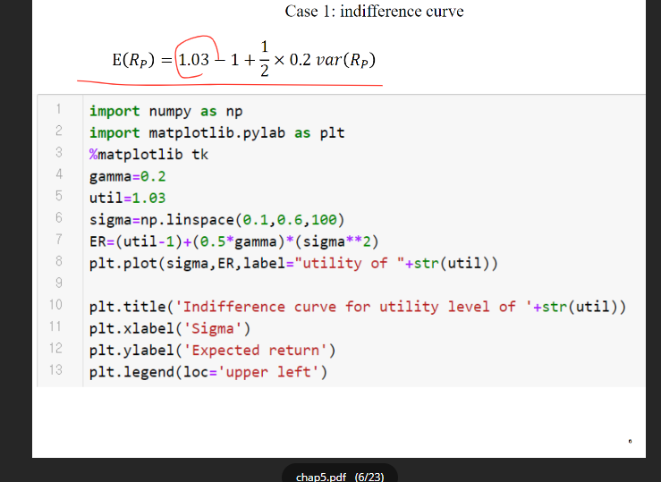

# 200527_W11D2_무위험 자산 효용 극대화 포트폴리오 (ch6-2 끝)

## 식 정리 

## 실습

마켓포트폴리오 확인

#### 파이썬 가이드 ch6으로 이동

## 함수 극대화, 극소화 문제

scipy를 활용하면 극대화, 극소화 문제를 보다 쉽게 풀 수 있다.

## 다시 ch6-2로 이동

목적함수 세타M을 구함.

이러한 세타M을 이용하여 별도로 기대 수익률, 분산, 효용성을 구해야함.

## 기대수익률, 분산, 효용성 계산

위의 실습과 동일 과정 실행

그 후 계산

TB는 국고채

22% 정도는 국고채에 투자하고 나머지는 세 주식에 나눠서 투자한 경우가 

최적의 포트폴리오가 됨.

위험회피 계수가 4인 사람으로 계산한 값.

1년 간 기대 수익률이 7% 정도임

표준편차가 약 11%이기 때문에

평균은 7%고, 최대는 40% , 최저는 -26%

## 최적포트폴리오 그래프 그리기

#### 미리 결과

대충 저 빨간 선이 만나는 지점.

CAL은 국고채로만 만든 경우

@감마(위험회피정도)를 다르게 하면 최적 포트폴리오도 달라짐.

아래부터 그림 그리기 코드

위에서 했던 코드 반복

탄젠트 포트폴리오를 찾아내고

CAL을 계산

위에서 계산한 탄젠트 포트폴리오를 이용하여 최적화 포트폴리오를 구한 뒤, 

무차별 곡선 그래프를 그려줌

### @@무차별 곡선 그리는 식-ch5

#### 기말고사는 24일 수요일에 오프라인으로

시험 형식은 샘플(작년 문제)을 보고 참고

코딩하는 과정을 잘 이해했는지를 파악하는 시험

이론 ㄴㄴ

ch7은 채권을 다룸

채권투자전략 2가지 정도

ch8은 옵션이라 스킵할 수 도 있음

ch7 다음에 ch9로 넘어감