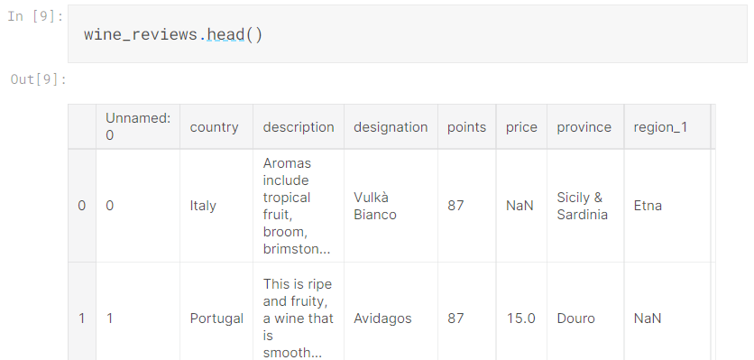
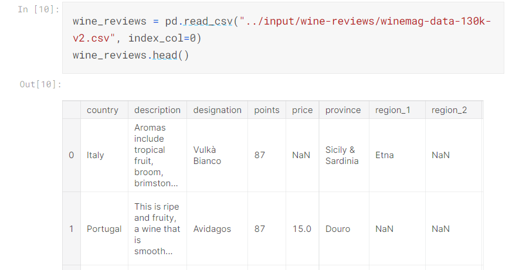
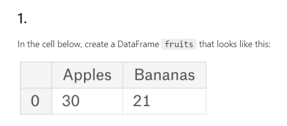
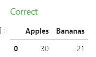
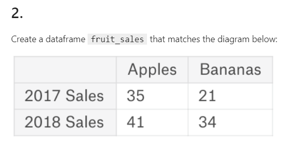
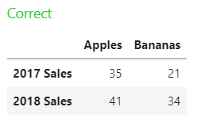
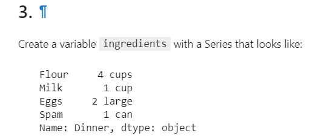
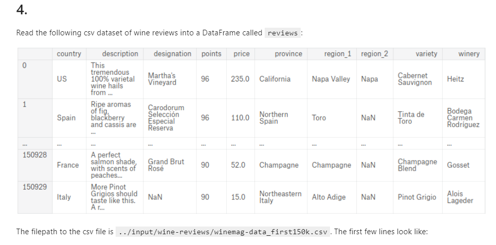
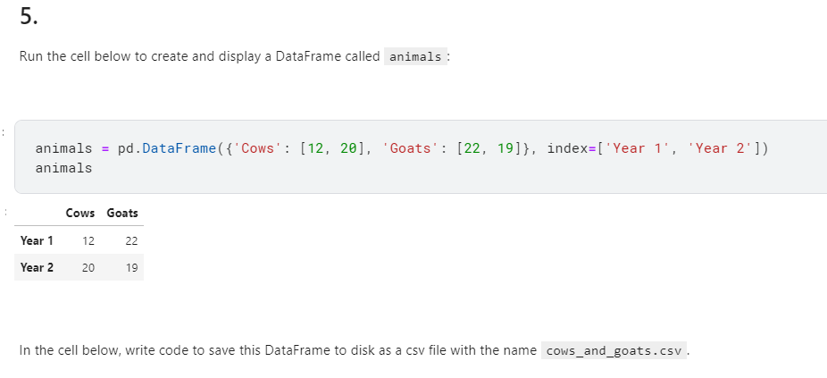

# Pandas 강의 1 - DataFrame, Series, 읽기, 저장하기


일단 import

```python
import pandas as pd
```


Pandas에는 **DataFrame** 과 **Series** 2가지 데이터 종류가 있다.


## 1.Data Frame


데이터베이스의 테이블과 같은 개념으로 행과 열로 이루어져있다.

```python
pd.DataFrame({'Yes': [50, 21], 'No': [131, 2]})
```

```
	Yes	No
0	50	131
1	21	2
```


데이터 프레임은 값의 제한 없이 활용 가능하다.

ex) 문자열, 숫자 어느쪽도 가능

```python
pd.DataFrame({'Bob': ['I liked it.', 'It was awful.'], 'Sue': ['Pretty good.', 'Bland.']})
```

```
	Bob	Sue
0	I liked it.	Pretty good.
1	It was awful.	Bland.
```


라벨(index)를 따로 설정해주는 것 도 가능하다.

```python
pd.DataFrame({'Bob': ['I liked it.', 'It was awful.'], 
              'Sue': ['Pretty good.', 'Bland.']},
             index=['Product A', 'Product B'])
```

```
				Bob			Sue
Product A	I liked it.	Pretty good.
Product B	It was awful.	Bland.
```


## 2.Series


시리즈는 연속적인 값으로, 데이터프레임이 테이블이라면 시리즈는 리스트와 같은 개념이다.

```python
pd.Series([1, 2, 3, 4, 5])
```

```
0    1
1    2
2    3
3    4
4    5
dtype: int64
```


시리즈도 데이터프레임과 같이 인덱스를 붙여줄 수 있다.

```python
pd.Series([30, 35, 40], index=['2015 Sales', '2016 Sales', '2017 Sales'], name='Product A')
```

```
2015 Sales    30
2016 Sales    35
2017 Sales    40
Name: Product A, dtype: int64
```


## 3. csv 읽기


데이터 분석을 위해서는 보통 csv 엑셀 파일을 이용하여 데이터를 읽어들인 뒤, 분석을 진행한다.

```python
wine_reviews = pd.read_csv("../input/wine-reviews/winemag-data-130k-v2.csv")
```


그 후, shape이나 head와 같은 명령어를 사용하여 해당 csv파일의 데이터들을 간략하게 확인해본다.


```python
wine_reviews.shape
```

```
(129971, 14)
```


```python
wine_reviews.head()
```

```
 Unnamed: 0	country	description	designation	points
0	0	Italy	Aromas include tropical fruit, broom, brimston...	
1	1	Portugal	This is ripe and fruity, a wine that is smooth...	
2	2	US	Tart and snappy, the flavors of lime flesh and..
```


shape의 해석은 130,000개의 records와 14개의 columns으로 이루어져있다는 의미이며,

head는 가장 앞 쪽에 있는 데이터의 형태를 간략하게 보여준다.




사진 처럼 index 컬럼이 따로 있을 때는, read를 할 때 따로 index를 지정해줄 수 있다.


```python
wine_reviews = pd.read_csv("../input/wine-reviews/winemag-data-130k-v2.csv", index_col=0)
wine_reviews.head()
```




**index_col=0** 구문을 넣어주면 가장 첫번째 컬럼을 인덱스로 지정해줄 수 있다.


## Exercise


### 1.그림과 같이 Dataframe fruits를 만드시오




풀이 :

```python
# Your code goes here. Create a dataframe matching the above diagram and assign it to the variable fruits.
fruits = pd.DataFrame({'Apples':[30], 'Bananas':[21]})
# ( { [] }) 순서
```




### 2. 그림과 같이 데이터프레임 fruit_sales 변수를 만드시오




풀이 :

```python
# Your code goes here. Create a dataframe matching the above diagram and assign it to the variable fruit_sales.
fruit_sales = pd.DataFrame({'Apples' : [35,41], 'Bananas':[21,34]}, index=['2017 Sales', '2018 Sales'])
```





### 3. 그림과 같이 시리즈 ingredients 변수를 만드시오




풀이 : 

```python
ingredients = pd.Series(['4 cups', '1 cup', '2 large', '1 can'], index = ['Flour', 'Milk', 'Eggs', 'Spam'], name = 'Dinner')
```


이렇게 풀어도 정답은 맞긴 한데, 솔루션을 보니 더 깔끔한 풀이가 있긴 했다.


```python
quantities = ['4 cups', '1 cup', '2 large', '1 can']
items = ['Flour', 'Milk', 'Eggs', 'Spam']
recipe = pd.Series(quantities, index=items, name='Dinner')
```

위와 같이 아이템과 key 값들을 따로 밖에서 list 생성을 하고 할당하는 게 깔끔한듯


### 4. csv 파일 읽기





해당 위치에 있는 csv파일을 읽어서 reviews 변수에 할당


풀이 : 

```python
reviews = pd.read_csv("../input/wine-reviews/winemag-data_first150k.csv", index_col=0)
```


그냥 읽기를 하면 index가 중복이 되기 때문에 index_col = 0 으로 맞춰줬다.	


### 5. 해당 DataFrame을 csv 파일로 저장하라




```python
# Your code goes here
animals.to_csv("cows_and_goats.csv")
```


끝