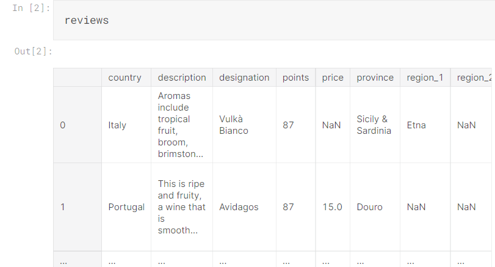
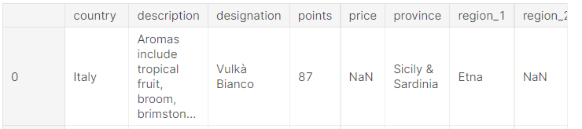
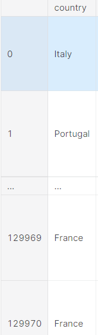
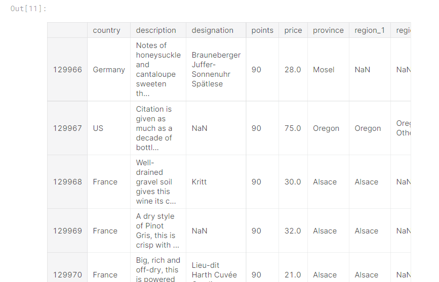
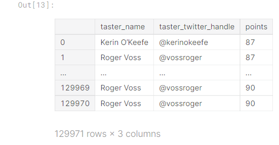
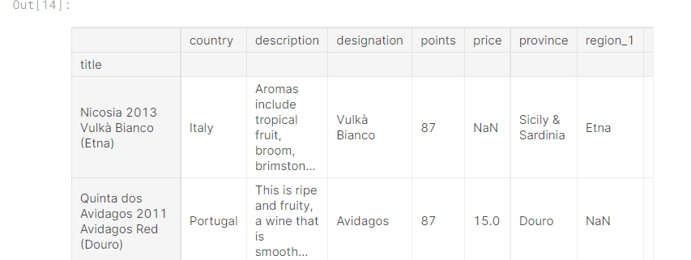
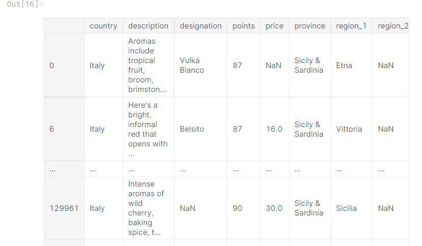
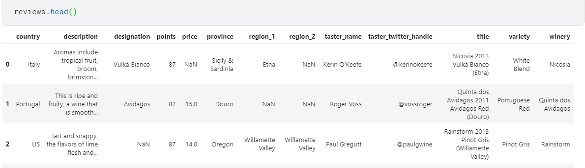
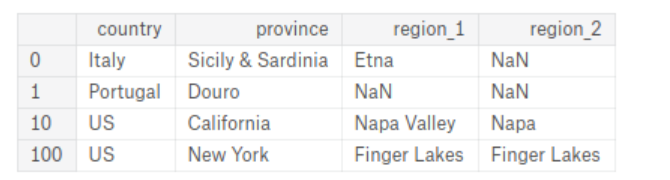

# Pandas 강의 2 - Indexing, Selecting & Assigning


셀렉팅은 데이터 포인트를 지정해줌으로써 더욱 빠르고 효과적으로 데이터들을 다룰 수 있게 해준다.


```python

```


아래와 같은 데이터프레임이 있다고 할 때, 




아래 코드를 이용해서 해당 컬럼만 추출해낼 수 있다.

```python
reviews.country
```

```python
0            Italy
1         Portugal
            ...   
129969      France
129970      France
Name: country, Length: 129971, dtype: object
```


딕셔너리처럼 바로 지정해서 추출하는 것도 가능

```python
reviews['country']
```

```python
0            Italy
1         Portugal
            ...   
129969      France
129970      France
Name: country, Length: 129971, dtype: object
```


아래 처럼 해당 컬럼의 특정한 값을 추출할 수 도 있다. 

```python
reviews['country'][0]
```

```python
'Italy'
```


## indexing


Pandas는 독자적인 operators를 가지고 있는데, 

##### 1.행번호(row number)로 선택하는 방법 (.iloc)

##### 2. label이나 조건표현으로 선택하는 방법 (.loc)


위와 같은 2가지로 나뉜다.


### iloc

이 중 iloc은 **index-based selection** 이며 사용법은 다음과 같다.

df.iloc.[추출할 행 , 추출할 열]


1.첫번째 행 추출

```python
reviews.iloc[0]
```

```python
country                                                    Italy
description    Aromas include tropical fruit, broom, brimston...
                                     ...                        
variety                                              White Blend
winery                                                   Nicosia
Name: 0, Length: 13, dtype: object
```


아래 사진과 같은 부분들을 추출함.




2.첫번째 열 추출

```python
reviews.iloc[:, 0]
```

```python
0            Italy
1         Portugal
            ...   
129969      France
129970      France
Name: country, Length: 129971, dtype: object
```


아래 사진과 같이 세로로 한 줄을 추출하는 방법이다.




3.첫번째 열을 0~2 번째 값만 추출

```python
reviews.iloc[:3, 0]
```

```python
0       Italy
1    Portugal
2          US
Name: country, dtype: object
```


3.1. 첫번째 열을 1~2 번째 값만 추출

```python
reviews.iloc[1:3, 0]
```

```python
1    Portugal
2          US
Name: country, dtype: object
```


3.2. 리스트 형태로 지정해서 추출도 가능

```python
reviews.iloc[[0, 1, 2], 0]
```

```python
0       Italy
1    Portugal
2          US
Name: country, dtype: object
```


4 . 마지막 행 5줄 출력하기

```python
reviews.iloc[-5:]
```




### loc

loc은 **label-based selection** 이며 사용법은 다음과 같다.


1.country 컬럼의 첫번째 값을 가져오기

```python
reviews.loc[0, 'country']
```

```python
'Italy'
```


2.특정 컬럼 값만 가져오기

```python
reviews.loc[:, ['taster_name', 'taster_twitter_handle', 'points']]
```




### loc과 iloc의 차이점

loc은 특정 label을 기준으로 추출함으로

`df.loc['Apples':'Potatoes']`와 같이 입력을 하면 Apples부터 Potatoes까지의 값을 출력하게 된다.


같은 의미로 `df.loc[0:1000]` 으로 값을 추출하게 되면 df[0] ~ df[1000] 까지의 값이 모두 추출이 되므로 1001 개의 값이 return이 된다.


하지만 iloc같은 경우는 index 범위를 제한하므로, 

`df.iloc[0:1000]` 와 같이 입력하면 `df[1000]` 값은 추출이 안되고 1000개의 값이 return이 된다.


### 인덱스 추가하기 - set_index


```python
reviews.set_index("title")
```




만약 새로운 index가 필요하면 해당 방식으로 추가할 수 있다.


# Selecting


특정 조건을 만족하는 값들만을 추출하는 방식


##### 먼저 True, False 판별

```python
reviews.country == 'Italy'
```

```python
0          True
1         False
          ...  
129969    False
129970    False
Name: country, Length: 129971, dtype: bool
```


##### 특정 값 추출

만약 country가 Italy인 값만을 추출하고 싶다면?

loc를 사용해야 한다.

```python
reviews.loc[reviews.country == 'Italy']
```




&나 |을 이용해서 and , or 조건문을 추가할 수 있다.


```python
reviews.loc[(reviews.country == 'Italy') & (reviews.points >= 90)]
```

```python
reviews.loc[(reviews.country == 'Italy') | (reviews.points >= 90)]
```


##### isin, isnull, notnull


해당 값이 속해있는지, 널인지, 널이 아닌 지 등을 체크하는 구문들


```python
reviews.loc[reviews.country.isin(['Italy', 'France'])]
```

```python
reviews.loc[reviews.price.notnull()]
```

```python
reviews.loc[reviews.price.isnull()]
```


## Assigning data

새로운 열을 추가or 할당 할 수 있다.


1.같은 값 할당하기


```python
reviews['critic'] = 'everyone'
reviews['critic']
```

```python
0         everyone
1         everyone
            ...   
129969    everyone
129970    everyone
Name: critic, Length: 129971, dtype: object
```


2.각각 다른 값 할당하기

```python
reviews['index_backwards'] = range(len(reviews), 0, -1)
reviews['index_backwards']
```

```python
0         129971
1         129970
           ...  
129969         2
129970         1
Name: index_backwards, Length: 129971, dtype: int64
```


## Exercise





### 1.reviews에서 description 컬럼의 값만 따로 할당

```python
# Your code here
desc = reviews.description
```


### 2.reviews에서 description 컬럼의 값의 첫 번째 값만 추출

```python
first_description = reviews.loc[0,"description"]
```


다른 답 들도 있음

`first_description = reviews.description.iloc[0]`

`reviews.description.loc[0]`

`reviews.description[0]`


### 3.reviews에서 첫 번째 행만 추출

```python
first_row = reviews.iloc[0]
```


### 4.reviews에서 description 컬럼의 0~10번째 값만 추출

```python
first_descriptions = reviews.description.iloc[:10]
```


`desc.head(10)` 

`reviews.loc[:9, "description"]`

와 같은 방식도 가능


### 5.reviews에서 1,2,3,5,8 번째 행만 추출

```python
sample_reviews = reviews.iloc[[1,2,3,5,8],]
```


iloc은 [추출할 행, 추출할 열] 이므로


모든 열을 추출하는데 행을 리스트로 주어서 1,2,3,5,8 번째 행만 추출하는 구문


### 6.reviews에서 특정 값들을 추출하여 다음 그림과 같은 df를 만들어라




```python
df = reviews.loc[[0,1,10,100],["country","province","region_1","region_2"]]
```


한 줄로 안 될 것 같았는데 의외로 loc 한번에 가능했다.


### 7.reviews에서 `country` 와 `variety` 두 컬럼을 100개 까지 할당

```python
df = reviews.loc[0:99,['country', 'variety']]
```

loc은 마지막 포함

iloc은 마지막 포함 x

다른 정답 :

```python
cols = ['country', 'variety']
df = reviews.loc[:99, cols]
```

or

```python
cols_idx = [0, 11]
df = reviews.iloc[:100, cols_idx]
```


### 8.reviews에서 country가 Italy인 행들을 추출

```python
italian_wines = reviews.loc[reviews.country=="Italy"]
```


### 9.reviews에서 country가 Australia거나 New Zealand이면서 points가 95이상인 값만 추출

```python
top_oceania_wines = reviews.loc[((reviews.country=="Australia") | (reviews.country=="New Zealand")) & (reviews.points >= 95) ]
```


조건문을 여러개 넣을 때는 괄호에 주의!

