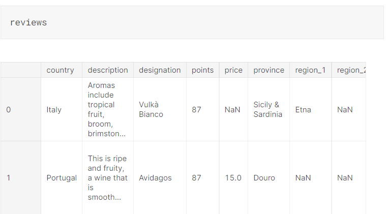
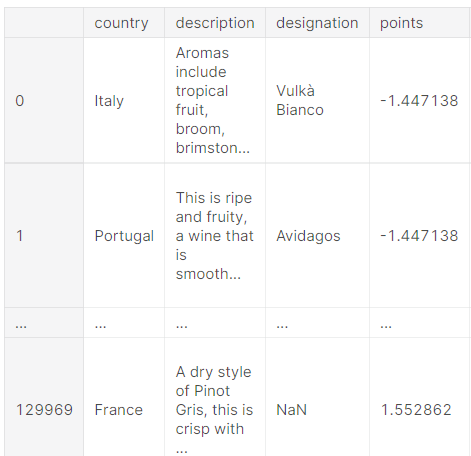
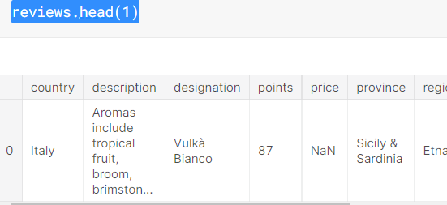
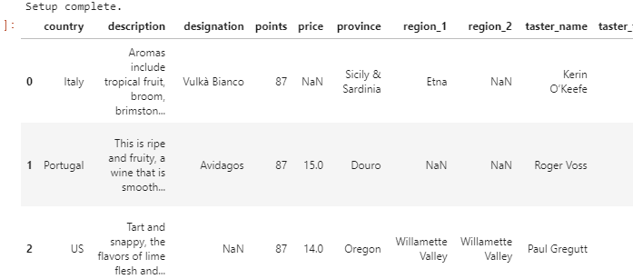
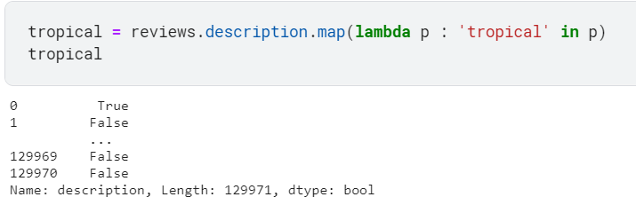

# Pandas 강의 3 - Summary Functions and Maps


사용할 데이터 셋 :



와인 관련 데이터베이스 = reviews


## 1.Summary Functions


데이터 구조를 쉽게 파악하기 위한 명령어로 `describe()`가 있다.

```python
reviews.points.describe()
```

```python
count    129971.000000
mean         88.447138
             ...      
75%          91.000000
max         100.000000
Name: points, Length: 8, dtype: float64
```


int형과 str형의 요약 결과는 각각 다르다.

```python
reviews.taster_name.describe()
```

```python
count         103727
unique            19
top       Roger Voss
freq           25514
Name: taster_name, dtype: object
```


int형의 describe에서 원하는 값만 추출하려면 해당 명령어를 입력해주면 된다.

```python
reviews.points.mean()
```

```python
88.44713820775404
```


str형의 Unique 값도 확인 가능

```python
reviews.taster_name.unique()
```

```
array(['Kerin O’Keefe', 'Roger Voss', 'Paul Gregutt',
       'Alexander Peartree', 'Michael Schachner', 'Anna Lee C. Iijima',
       'Virginie Boone', 'Matt Kettmann', nan, 'Sean P. Sullivan',
       'Jim Gordon', 'Joe Czerwinski', 'Anne Krebiehl\xa0MW',
       'Lauren Buzzeo', 'Mike DeSimone', 'Jeff Jenssen',
       'Susan Kostrzewa', 'Carrie Dykes', 'Fiona Adams',
       'Christina Pickard'], dtype=object)
```


str형에서 각각 몇개의 데이터가 있는 지 확인하고 싶다면 `value_counts()`메소드를 사용하면 된다.

```python
reviews.taster_name.value_counts()
```

```
Roger Voss           25514
Michael Schachner    15134
                     ...  
Fiona Adams             27
Christina Pickard        6
Name: taster_name, Length: 19, dtype: int64
```


## 2.Maps


Maps는 데이터 구조를 새로 만들거나 변형을 해야할 때, 유용한 방식이다.


예시를 보면서 이해하면 쉬움


ex) 점수 - 평균점수의 값을 가진 데이터 생성

```python
review_points_mean = reviews.points.mean()
reviews.points.map(lambda p: p - review_points_mean)
```

```
0        -1.447138
1        -1.447138
            ...   
129969    1.552862
129970    1.552862
Name: points, Length: 129971, dtype: float64
```


##### 계산한 값을 DF에 적용한 모습 출력 - Apply 사용 (실제 적용은 X)

```python
def remean_points(row):
    row.points = row.points - review_points_mean
    return row

reviews.apply(remean_points, axis='columns')
```




함수를 이용해서 모든 row에 point 값을 업데이트 시켜 주는 구문


#### map이나 apply는 실제 DF를 바꾸지 않는다.

head로 확인을 해보면

```python
reviews.head(1)
```



포인트 값이 변하지 않았음을 확인할 수 있다.


Pandas는 여러가지 mapping operations를 빌트인으로 제공한다.


##### 길이와 형식이 맞는 데이터라면 그냥 단순히 + , - 을 해도 계산이 됨.

```python
review_points_mean = reviews.points.mean()
reviews.points - review_points_mean
```

```
0        -1.447138
1        -1.447138
            ...   
129969    1.552862
129970    1.552862
Name: points, Length: 129971, dtype: float64
```


##### int형 말고 string도 다룰 수 있다.

```python
reviews.country + " - " + reviews.region_1
```

```
0            Italy - Etna
1                     NaN
               ...       
129969    France - Alsace
129970    France - Alsace
Length: 129971, dtype: object
```


## Exercise


이번에도 같은 csv 파일 사용 




### 1.reviews DF의 points컬럼의 중앙값은?


```python
median_points = reviews.points.median()
```

```
88.0
```


### 2.reviews DF의 country는 어떤 값들을 가지고 있나? (중복 값 제외)

```python
countries = reviews.country.unique()
```

```
array(['Italy', 'Portugal', 'US', 'Spain', 'France', 'Germany',
       'Argentina', 'Chile', 'Australia', 'Austria', 'South Africa',
       'New Zealand', 'Israel', 'Hungary', 'Greece', 'Romania', 'Mexico',
       'Canada', nan, 'Turkey', 'Czech Republic', 'Slovenia',
       'Luxembourg', 'Croatia', 'Georgia', 'Uruguay', 'England',
       'Lebanon', 'Serbia', 'Brazil', 'Moldova', 'Morocco', 'Peru',
       'India', 'Bulgaria', 'Cyprus', 'Armenia', 'Switzerland',
       'Bosnia and Herzegovina', 'Ukraine', 'Slovakia', 'Macedonia',
       'China', 'Egypt'], dtype=object)
```


### 3.reviews DF의 country는 각각 얼마나 많은 값들을 가지고 있는가?

```python
reviews_per_country = reviews.country.value_counts()
```

```
US        54504
France    22093
          ...  
China         1
Egypt         1
Name: country, Length: 43, dtype: int64
```


### 4.reviews DF의 price 값에서 평균값을 뺀 값으로 바꾸시오 (중복 값 제외)

```python
price_mean = reviews.price.mean()
centered_price = reviews.price - price_mean

centered_price
```

```
0               NaN
1        -20.363389
            ...    
129969    -3.363389
129970   -14.363389
Name: price, Length: 129971, dtype: float64
```


### 5.reviews DF에서 가성비가 가장 좋은 와인의 title을 출력하시오 


이 문제는 `idxmax()` / `idxmin()` 함수를 사용할 필요가 있다.

각각 최대값 최소값을 구하는 pandas의 내부함수


```python
best_wine = (reviews.points / reviews.price).idxmax()
bargain_wine = reviews.loc[best_wine,'title']

bargain_wine
```

```
'Bandit NV Merlot (California)'
```


가성비를 구하는 문제이기 때문에, point를 price로 나눌 필요가 있다. (아무리 좋은 point라도 가격이 높으면 낮은 값이 나오게)


### 6.reviews DF의 description에서 tropical' , 'fruity 라는 설명을 포함한 와인들의 갯수를 구하시오

```python
tropical = reviews.description.map(lambda p : 'tropical' in p).sum()
fruity = reviews.description.map(lambda p : 'fruity' in p).sum()

descriptor_counts = pd.Series([tropical, fruity], index =['tropical', 'fruity'] )

descriptor_counts
```

```
tropical    3607
fruity      9090
dtype: int64
```


이 문제는 좀 어려워서 해설추가함




map을 사용하면 해당 사진처럼 129970개의 True, False값을 return을 하게 되는데, 우리는 총 갯수가 필요한 것 이므로 sum으로 총 합을 구해준다. (True면 1, False면 0이기 때문에 True인 개수대로 합이 나옴)


그래서 각각 구한 3607, 9090이라는 숫자를 

Series에 넣고 index로 이름을 붙여주면 끝


### 7.reviews DF에서 95점이상 3 stars, 85점 이상 2  stars, 그 외 1 stars로 등급을 새로 정하되,  캐나다산 와인은 무조건 3 stars로 만들어라


```python
def star_points(row):
    
    if row.points >= 95 :
        row.points = 3
    elif row.points >= 85 & row.points < 95 :
        row.points = 2
    else :
        row.points = 1
        
    if row.country == "Canada" :
        row.points = 3
    return row

star_ratings_df = reviews.apply(star_points, axis='columns')
star_ratings = star_ratings_df.points

print(star_ratings)
star_ratings.value_counts()
```

```
0         2
1         2
         ..
129969    2
129970    2
Name: points, Length: 129971, dtype: int64

2    127298
3      2673
Name: points, dtype: int64
```


솔루션은 아래와 같다.

```python
def stars(row):
    if row.country == 'Canada':
        return 3
    elif row.points >= 95:
        return 3
    elif row.points >= 85:
        return 2
    else:
        return 1

star_ratings = reviews.apply(stars, axis='columns')
```


더 간결하게 짤 수 있는데, if문을 두개로 나눠서 길이 차이가 생긴 것 같다.