# Pandas 강의 4 - Grouping and Sorting


## Grouping 


Pandas에서 제공하는 `groupby()` operation을 사용하면 예전에 배웠던 `value_counts()` 함수와 같은 기능을 수행할 수 있다.

```python
reviews.groupby('points').points.count()
```

```
points
80     397
81     692
      ... 
99      33
100     19
Name: points, Length: 21, dtype: int64
```


##### count() , max() , mean() , size() describe()  등이 groupby와 함께 쓰인다.


같은 기능을 수행하지만 `value_counts`()은  `groupby()`의 shortcut 같은 느낌이고, **groupby**는 더 다양한 방식으로 사용할 수 있다.

예를 들면 단순 count가 아닌, point별로 그룹을 나눈 뒤 다른 컬럼의 최소 값을 구할 수 있다.

```python
reviews.groupby('points').price.min()
```

```
points
80      5.0
81      5.0
       ... 
99     44.0
100    80.0
Name: price, Length: 21, dtype: float64
```


전에 배웠던 apply를 활용해서 복잡한 selection 구문을 활용할 수도 있다.

```python
reviews.groupby('winery').apply(lambda df: df.title.iloc[0])
```

```
winery
1+1=3                          1+1=3 NV Rosé Sparkling (Cava)
10 Knots                 10 Knots 2010 Viognier (Paso Robles)
                                  ...                        
àMaurice    àMaurice 2013 Fred Estate Syrah (Walla Walla V...
Štoka                         Štoka 2009 Izbrani Teran (Kras)
Length: 16757, dtype: object
```


위의 구문 이해를 돕기 위한 winery의 groupby 형태

```python
reviews.groupby('winery').country.count()
```

```
winery
1+1=3                   6
10 Knots                4
100 Percent Wine        3
1000 Stories            2
1070 Green              1
                       ..
Órale                   1
Öko                     2
Ökonomierat Rebholz     4
àMaurice               40
Štoka                   3
Name: country, Length: 16757, dtype: int64
```


아래 사진처럼 winery의 이름 대로 그룹핑을 하면 이런 식으로 묶인다.

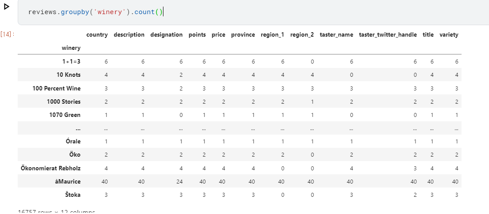


groupby는 한 컬럼 이상에서도 사용할 수 있다.

```python
reviews.groupby(['country', 'province']).apply(lambda df: df.loc[df.points.idxmax()])
```

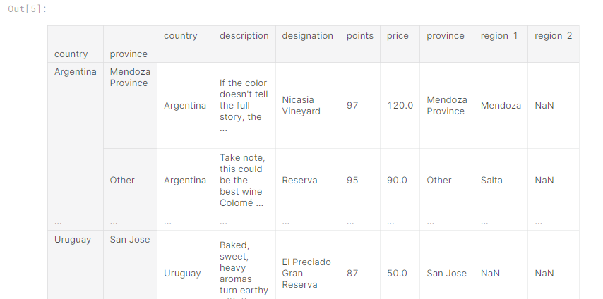


#### groupby - agg

groupby는 agg라는 함수를 가지고 있는데, agg 안에 적용하는 함수를 각각 다른 경우의 수로 시뮬레이션을 하는 기능을 가지고 있다.


예를들면

```python
reviews.groupby(['country']).price.agg([len, min, max])
```

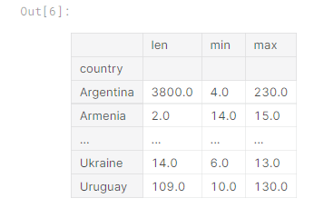


## Multi-index

DF나 Series는 single index를 가지지만, groupby의 경우에는 operation에 따라 multi index가 생긴다.


```python
countries_reviewed = reviews.groupby(['country', 'province']).description.agg([len])
countries_reviewed
```

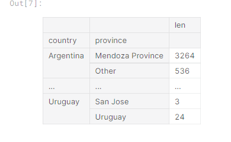

위와 같은 groupby 구문에서 

```python
mi = countries_reviewed.index
type(mi)
```

```
pandas.core.indexes.multi.MultiIndex
```


index의 type을 확인해보면 MultiIndex로 변한 것을 확인할 수 있다.

@참고 

실제 mi는 이렇게 생김

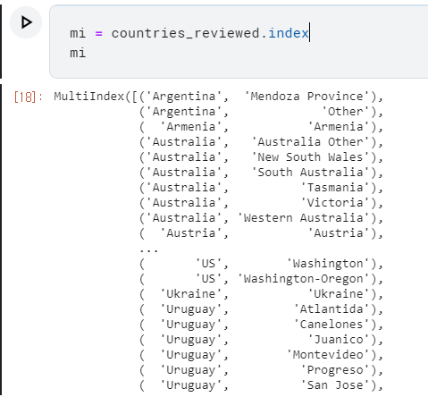

##### country와 province 두가지를 가지고 있는 index라서 multi index이다.


만약 multi index를 보통의 index로 바꾸고 싶다면?

`reset_index()`구문을 사용하면 된다.

```python
countries_reviewed.reset_index()
```

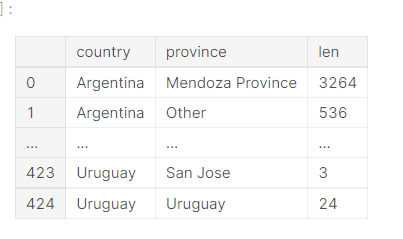


## Sorting

DF의 내용의 순서는 보통 index의 순서대로 정해진다.


만약 내용을 원하는 순으로 정렬하고 싶다면 `sort_values` 함수를 사용하면 된다.


```python
countries_reviewed = countries_reviewed.reset_index()
countries_reviewed.sort_values(by='len')
```

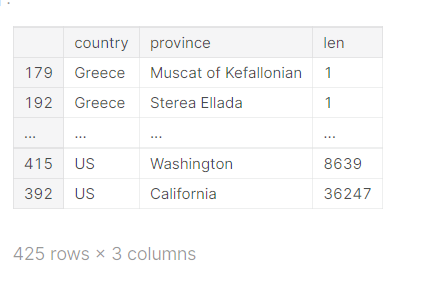


보통은 올림차순이 기본이지만, ascending 옵션을 줘서 내림차순으로 바꿀 수 도 있다.

```python
countries_reviewed.sort_values(by='len', ascending=False)
```

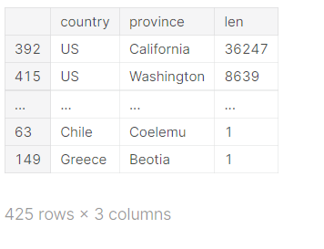


#### sort_values의 by에는 여러개를 사용 가능

```python
sorted_varieties = price_extremes.sort_values(by=['min','max'],ascending=False)
```


만약 내용 순이 아니라 원래대로 index 순으로 정렬을 하고 싶을 때에는 `sort_index()` 함수를 사용하면 된다.


```python
countries_reviewed.sort_index()
```

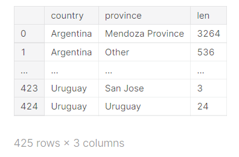


## Exercise


### 1.가장 리뷰를 많이 한 사람의 아이디는?


```python
reviews_written = reviews.groupby('taster_twitter_handle').title.count()
```

```
taster_twitter_handle
@AnneInVino          3685
@JoeCz               5147
@bkfiona               27
@gordone_cellars     4177
@kerinokeefe        10776
@laurbuzz            1835
@mattkettmann        6332
@paulgwine           9532
@suskostrzewa        1085
@vboone              9537
@vossroger          25514
@wawinereport        4966
@wineschach         15134
@winewchristina         6
@worldwineguys       1005
Name: title, dtype: int64
```


아래의 두 코드도 같은 기능을 한다. `.size()` 쪽이 더 사용하기 편한듯.

```python
reviews_written = reviews.groupby('taster_twitter_handle').size()
reviews_written = reviews.groupby('taster_twitter_handle').taster_twitter_handle.count()
```


### 2.가격이 싼 순으로 정렬하고, 가장 높은 점수를 기록한 Series를 만들어라


```python
best_rating_per_price = reviews.groupby('price').points.max()
```


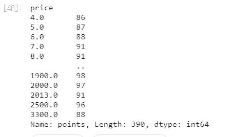


기본이 가격 싼 순으로 정렬이라 이번에는 필요 없었지만, sort_index() 라는 구문을 사용하면 index은 가격을 올림차순으로 만들 수 있다.


### 3. variety를 기준으로 그룹핑을 한 뒤, 가격의 최대값, 최소값을 DF로 표현해라


```python
reviews.groupby(['variety']).price.agg([min, max])
```

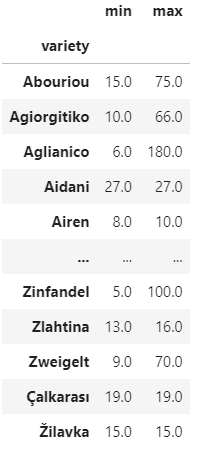


agg를 쓰면 간단하게 해결되는 문제지만, agg를 까먹고 다른 방식으로 풀었다.


```python
a = reviews.groupby('variety').price.min()
b = reviews.groupby('variety').price.max()

price_extremes = pd.DataFrame([a,b], index = ["min", "max"]).transpose()
```


위에가 내가 처음 시도한 코드, 답은 맞게 나오지만 간결하게 보이기 위해서는 agg를 사용하는 것이 좋았을 것 같다.


### 4. 가장 비싼 와인은?

(최소 가격을 기준으로 내림차순으로 정렬 된 다음 최대 가격)


```python
sorted_varieties = price_extremes.sort_values(by=['min','max'],ascending=False)
```

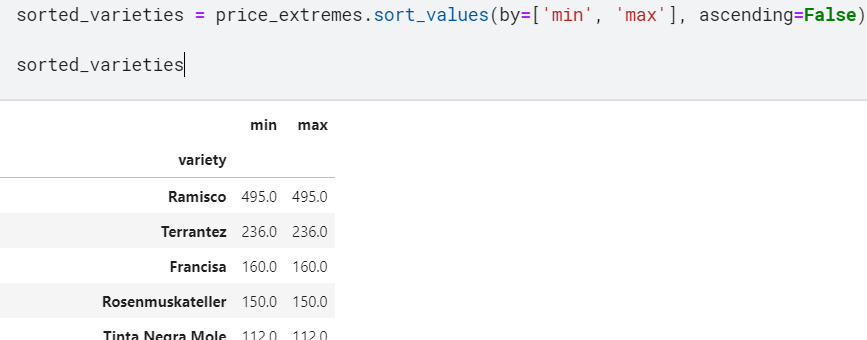


가장 비싼 와인을 찾는데 왜 min max 둘다 sort에 넣었는지 몰랐는데, 직접 데이터를 확인해보니 이런 차이가 있었다.


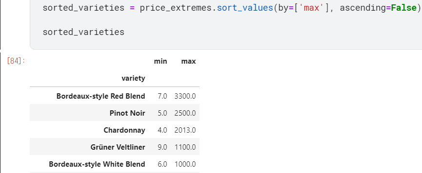


일단 문제의 1 조건이 min을 내림차순으로 바꾼 뒤 max가 큰 값을 찾는 것 이므로,

결국 variety에서 min = max 인 와인들만 출력이 되는 결과였다.


### 5. 테스터의 이름으로 그룹핑, 평균 점수를 구하여라

```python
reviewer_mean_ratings = reviews.groupby("taster_name").points.mean()
```

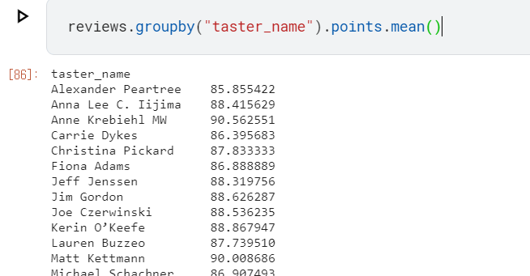


이번 Exercise에서 가장 빨리 푼 문제


앞에 것들이 어려웠어서 그런지 쉬운 문제가 나왔다.


### 6. 멀티인덱스로 count된 Series를 만들고, 내림차순으로 정렬하라

```python
country_variety_counts = reviews.groupby(["country","variety"]).size().sort_values(ascending = False)
```

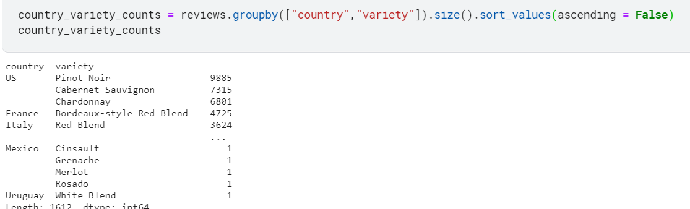


count된 갯수를 셀 때에는 count("title") 같은 방식이 아니라 size()를 쓰는게 훨씬 효율적이다.


