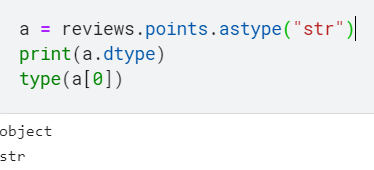

# Pandas 강의 5 - Data Types and Missing Values


5장에서는 DF와 Series에서 어떻게 Data Type을 발견하고, 엔트리를 대체하는 방법을 배우게 된다.


## Dtypes


DF의 column의 Data Type은 **Dtpyes** 으로 알 수 있다.

예를 들어 우리가 계속 써왔던 와인 DF의 price column은 type을 알고 싶을 때, Dtypes라는 함수를 사용한다.

```python
reviews.price.dtype
```

```
dtype('float64')
```


일반적으로 DF에서 나타나는 타입들은 float64 , int64, object가 있는데

이 중 object는 String들을 다루는 타입이다.

float은 실수

int는 정수만을 다룬다.


만약 column의 데이터 타입을 바꿔주고 싶을 때에는 `astype()` 명령어를 사용한다.

```python
reviews.points.astype('float64')
```

```
0         87.0
1         87.0
          ... 
129969    90.0
129970    90.0
Name: points, Length: 129971, dtype: float64
```

정수에서 실수로 바뀐 것을 확인할 수 있다.


DF나 Series의 index도 type을 가지고 있으며, dtype으로 확인을 하면 int64가 나온다.

```python
reviews.index.dtype
```

```
dtype('int64')
```


# Missing data

우리가 흔히 봐 왔던 NaN(Not a Number)를 Misssing data, Missing value라고 한다.

Dtype은 float64이고, 이러한 NaN값을 찾거나 제외하는 명령어는 `pd.isnull()` 이나 `pd.notnull()`이 있다.


아래는 contry가 NaN인 row들을 찾는 코드

```python
reviews[pd.isnull(reviews.country)]
```

pd.isnull에서 pd는 생략하고 df.isnull() 이라고 써도 된다.

ex)

```python
reviews.price.isnull()
```


그럼 Missing Values을 어떻게 대체하면 좋을까?

그건 Pandas의 내장함수인 `.fillna()`를 사용하면 된다.

괄호 안에 대체할 값을 넣으면 되는데 사용법은 아래와 같다.

```python
reviews.region_2.fillna("Unknown")
```

```
0         Unknown
1         Unknown
           ...   
129969    Unknown
129970    Unknown
Name: region_2, Length: 129971, dtype: object
```


만약 NaN값 대체가 아니라 원래 있던 값을 다른 값으로 바꾸고 싶을 때에는?

`.replace()`를 사용하면 된다. 

```python
reviews.taster_twitter_handle.replace("@kerinokeefe", "@kerino")
```

```
0            @kerino
1         @vossroger
             ...    
129969    @vossroger
129970    @vossroger
Name: taster_twitter_handle, Length: 129971, dtype: object
```

kerinokeefe라는 아이디를 kerino로 바꾸는 과정


## Exercise


### 1.reviews DF의 points 컬럼의 dtype은?

```python
dtype = reviews.points.dtype
```

```
dtype('int64')
```


### 2.points 컬럼을 str으로 변경한 시리즈를 할당하라

```python
point_strings = reviews.points.astype("str")
```


object와 str이 같은 개념인줄 알았는데... 다른 값인가 보다.


#### str의 경우




#### object의 경우


astype으로 object로 바꿔버리면 이상하게 그 안의 값은 int값을 유지한다.

그냥 str을 쓰는게 맘편할듯


string?


str이랑 string은 또 다른 모양이다.

;;;;


### 3. pirce가 Missing Value인 값은 몇 개 인가?

```python
n_missing_prices = len(reviews[pd.isnull(reviews.price)].price)
```


아래 3개도 같은 의미이다.

```python
len(reviews[reviews.price.isnull()])
reviews.price.isnull().sum()
pd.isnull(reviews.price).sum()
```


### 4. region_1의 null 값을 Unknown으로 대체하고, region_1로 그룹핑 된 count값을 내림차순으로 출력하라

```python
a = reviews

a.region_1 = reviews.region_1.fillna("Unknown")
b = a.groupby("region_1").size()

reviews_per_region = b.sort_values(ascending = False)
```


솔루션 : 

```python
reviews.region_1.fillna('Unknown').value_counts().sort_values(ascending=False)
```


한 줄로도 가능했었다.

그냥 count로 안되길래 안되는 줄 알았는데... 

`.value_counts()`를 사용해야 했나보다