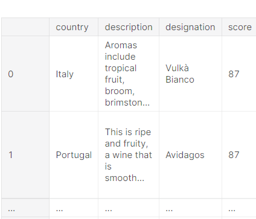
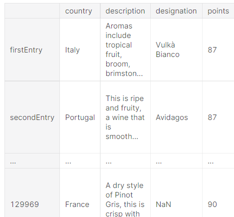
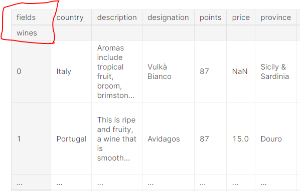
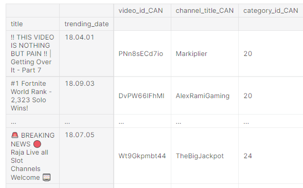
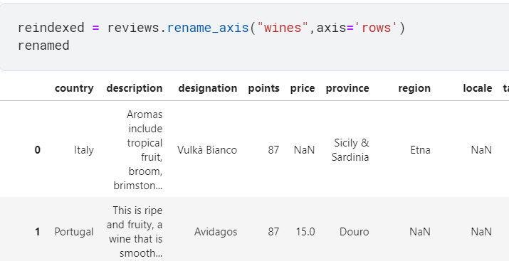
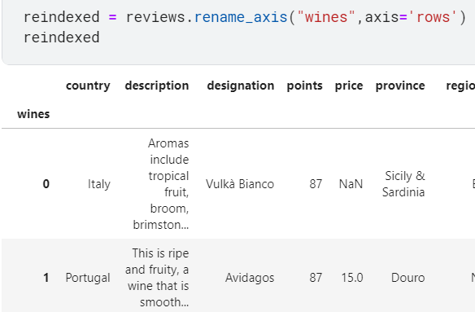
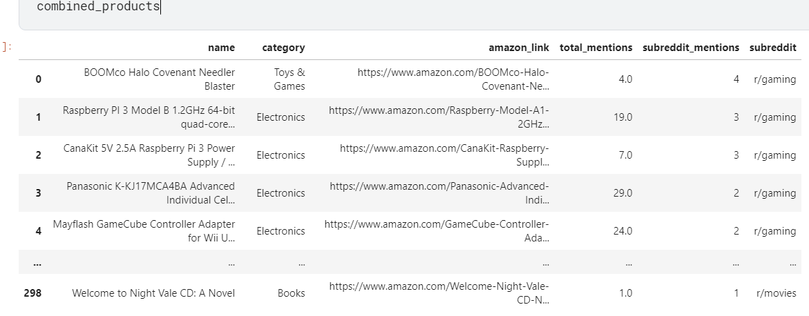

# Pandas 강의 6 - Renaming and Combining


6장에서는 DF와 Series의 column 이름을 변경하거나, 각각 다른 csv파일 혹은 df들을 합치는 방법(join)을 배운다.


## Renaming 

`rename()`함수를 이용하면 column의 이름을 맘대로 바꿀 수 있다.


```python
reviews.rename(columns={'points': 'score'})
```

points 컬럼을 score로 바꾸는 코드





rename은 index나 column value역시 바꿀 수 있다.

index나 column value를 바꾸고 싶을 때는 index : / column : 같은 방식으로 지정을 해주면 된다.


##### 인덱스 변경 

```python
reviews.rename(index={0: 'firstEntry', 1: 'secondEntry'})
```




##### rows와 column의 이름 설정하기

```python
reviews.rename_axis("wines", axis='rows').rename_axis("fields", axis='columns')
```




rename_axis을 사용하면 왼쪽 맨 위에 index에 대한 이름을 rows와 columns로 나눠서 설정 가능하다.


## Combining

csv파일이나 df를 합칠 때에는 3가지 방법이 있다.

`concat()` , `join()`, `merge()` 의 방식인데


concat은 단순 이어붙이기, join은 index값을 기준으로 합치기, merge는 고유값을 기준으로 합치기다.


보통 merge의 기능은 join과 비슷하기 때문에 이 강의에서는 join을 주로 다룬다.


### concat

```python
df1 = pd.DataFrame({'a':['a0','a1','a2','a3'],
                   'b':['b0','b1','b2','b3'],
                   'c':['c0','c1','c2','c3']},
                  index = [0,1,2,3])

df2 = pd.DataFrame({'a':['a2','a3','a4','a5'],
                   'b':['b2','b3','b4','b5'],
                   'c':['c2','c3','c4','c5'],
                   'd':['d2','d3','d4','d5']},
                   index = [2,3,4,5])

result1 = pd.concat([df1,df2])
print(result1)
```

```python
[Output]
    a   b   c    d
0  a0  b0  c0  NaN
1  a1  b1  c1  NaN
2  a2  b2  c2  NaN
3  a3  b3  c3  NaN
2  a2  b2  c2   d2
3  a3  b3  c3   d3
4  a4  b4  c4   d4
5  a5  b5  c5   d5 
```


df1이 먼저 위에 출력되고 그 뒤에 df2가 그대로 이어붙었다.


ignore index 옵션으로 index 순서를 다시 줄 수 있다.

```python
result2 = pd.concat([df1,df2], ignore_index=True)
print(result2)
```

```
[Output]
    a   b   c    d
0  a0  b0  c0  NaN
1  a1  b1  c1  NaN
2  a2  b2  c2  NaN
3  a3  b3  c3  NaN
4  a2  b2  c2   d2
5  a3  b3  c3   d3
6  a4  b4  c4   d4
7  a5  b5  c5   d5 
```


행방향이 아닌 열방향 결합은 axis=1을 주면 된다.

```python
result3 = pd.concat([df1,df2],axis=1)
print(result3)
```

```
[Output]
     a    b    c    a    b    c    d
0   a0   b0   c0  NaN  NaN  NaN  NaN
1   a1   b1   c1  NaN  NaN  NaN  NaN
2   a2   b2   c2   a2   b2   c2   d2
3   a3   b3   c3   a3   b3   c3   d3
4  NaN  NaN  NaN   a4   b4   c4   d4
5  NaN  NaN  NaN   a5   b5   c5   d5 
```


inner join 옵션을 주면 NaN값이 없는, 행과 열에 모두 데이터가 있는 부분만 추출이 가능하다.

```python
result3_in = pd.concat([df1,df2],axis=1, join='inner')   #열방향(axis=1), 교집합(inner)
print(result3_in)
```

```
[Output]
    a   b   c   a   b   c   d
2  a2  b2  c2  a2  b2  c2  d2
3  a3  b3  c3  a3  b3  c3  d3 
```


### join

```python
left = canadian_youtube.set_index(['title', 'trending_date'])
right = british_youtube.set_index(['title', 'trending_date'])

left.join(right, lsuffix='_CAN', rsuffix='_UK')
```




각각의 index를 title과 treding_date로 설정한 뒤, join

lsuffix와 rsuffix를 사용하면 column의 이름에 문자를 추가하여 어디서 가져온 컬럼인지 확인할 수 있게 해준다.


서로 같은 이름의 컬럼을 가지고 있는 경우가 있으므로 중요함.


## Exercise

### 1.region_1을 region으로, region_2를 locale로 이름을 변경해라

```python
renamed = reviews.rename(columns={'region_1': 'region', 'region_2':'locale'})
```




### 2.index의 이름을 wines로 변경해라

```python
reindexed = reviews.rename_axis("wines",axis='rows')
```




### 3.두 DF의 subreddit가 각각 남아있도록 합쳐라

```python
gaming_products = pd.read_csv("../input/things-on-reddit/top-things/top-things/reddits/g/gaming.csv")
gaming_products['subreddit'] = "r/gaming"
movie_products = pd.read_csv("../input/things-on-reddit/top-things/top-things/reddits/m/movies.csv")
movie_products['subreddit'] = "r/movies"

combined_products = pd.concat([gaming_products,movie_products])
```




subreddit에 gaming, movies가 각각 따로 남게 합쳐졌다.


### 4.두 개의 DF를 MeetID 기준으로 합쳐라

```python
powerlifting_meets = pd.read_csv("../input/powerlifting-database/meets.csv")
powerlifting_competitors = pd.read_csv("../input/powerlifting-database/openpowerlifting.csv")


left = powerlifting_meets.set_index("MeetID")
right = powerlifting_competitors.set_index("MeetID")

powerlifting_combined = left.join(right)

```


left, right 변수 선언 필요 없이 한 줄로도 가능했다.

```python
powerlifting_combined = powerlifting_meets.set_index("MeetID").join(powerlifting_competitors.set_index("MeetID"))
```


일단 join에서 중요한건 set_index로 서로 index가 같게 만들어주어야 한다는 것.

