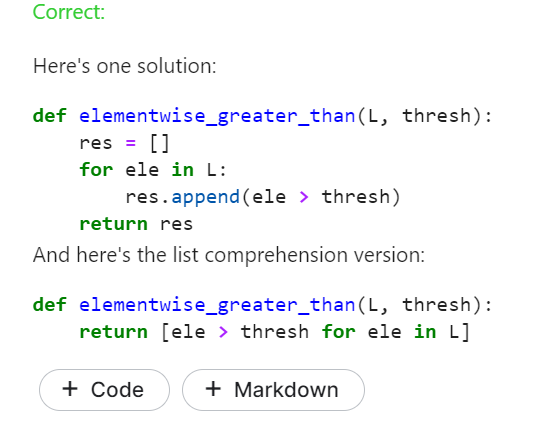

# 파이썬 팁 - Loop, List Comprehensions, 몬테 카를로


## Loop


### 기본 출력

```python
planets = ['Mercury', 'Venus', 'Earth', 'Mars', 'Jupiter', 'Saturn', 'Uranus', 'Neptune']
for planet in planets:
    print(planet, end=' ') # print all on same line
   #print(planet, end="\n") # print all on same line (줄바꿈)
```


```
Mercury Venus Earth Mars Jupiter Saturn Uranus Neptune 
```


for, in 사용

end 로 끝나는 방식 설정 가능


### 대문자 빼오기

```python
s = 'steganograpHy is the practicE of conceaLing a file, message, image, or video within another fiLe, message, image, Or video.'
msg = ''
# print all the uppercase letters in s, one at a time
for char in s:
    if char.isupper():
        print(char, end='')  
```

isupper()로 대문자만 추출 

반대는 islower()


### range() - 해당 범위까지 반복

```python
for i in range(5):
    print("Doing important work. i*i =", i*i)
```


```
Doing important work. i*i = 0
Doing important work. i*i = 1
Doing important work. i*i = 4
Doing important work. i*i = 9
Doing important work. i*i = 16
```


5번 반복하라는 의미


### while문


```python
i = 0
while i < 10:
    print(i, end=' ')
    i += 1 # increase the value of i by 1
```

```
0 1 2 3 4 5 6 7 8 9 
```


# List comprehensions


리스트 연산 비슷한 느낌


```python
squares = [n**2 for n in range(10)]
squares
```

```
[0, 1, 4, 9, 16, 25, 36, 49, 64, 81]
```


```python
squares = []
for n in range(10):
    squares.append(n**2)
squares
```

```
[0, 1, 4, 9, 16, 25, 36, 49, 64, 81]
```


### if 조건문 

```python
short_planets = [planet for planet in planets if len(planet) < 6]
short_planets
```

```
['Venus', 'Earth', 'Mars']
```


planets라는 리스트에서 planet을 꺼내오는데, 조건문으로 len 6 보다 작은 행성만 short_planets 리스트에 추가하도록 하는 구문


```python
# str.upper() returns an all-caps version of a string
loud_short_planets = [planet.upper() + '!' for planet in planets if len(planet) < 6]
loud_short_planets
```

```
['VENUS!', 'EARTH!', 'MARS!']
```


planet.upper() + '!' 가 기본으로 넣어지는 구문에다가 for 문으로 조건문을 넣음

조건문은 SQL의 where 문과 같다고 생각하면 된다.


```python
[
    planet.upper() + '!' 
    for planet in planets 
    if len(planet) < 6
]
```


한줄이 아니라 이렇게 여러 줄로 표현해도 가능


### List comprehensions은 왜 중요한가?


```python
n_negative = 0
    for num in nums:
        if num < 0:
            n_negative = n_negative + 1
    return n_negative
```


위의 코드가


```python
def count_negatives(nums):
    return len([num for num in nums if num < 0])
```


위처럼 간결하게 바뀐다.


코드의 간결성을 위해 알아두는 게 좋음


## Excercise


### 1.코드 에러 해결

```python
def has_lucky_number(nums):
    """Return whether the given list of numbers is lucky. A lucky list contains
    at least one number divisible by 7.
    """
    for num in nums:
        if num % 7 == 0:
            return True
        else:
            return False
```


해당 코드의 버그 수정 


풀이 ->

```python
def has_lucky_number(nums):
    """Return whether the given list of numbers is lucky. A lucky list contains
    at least one number divisible by 7.
    """
    for num in nums:
        if num % 7 == 0:
            return True
            break
        else:
            pass
    return False

"""
솔루션은 
   for num in nums:
        if num % 7 == 0:
            return True
    return False
임
break나 pass 안써도 더 간결히 가능
"""


nums = [5,7,10]
nums2 = [5,10]
print(has_lucky_number(nums))
#True
print(has_lucky_number(nums2))
#False
```


### 2.리스트 크기 비교


```python
#[1, 2, 3, 4] > 2
```

해당 코드는 실행될 것 같아 보이지만 에러가 나옴


그럼 해당 함수는 어떻게 만드는가?

내 답 ->

```python
def elementwise_greater_than(L, thresh):
    """Return a list with the same length as L, where the value at index i is 
    True if L[i] is greater than thresh, and False otherwise.
    
    >>> elementwise_greater_than([1, 2, 3, 4], 2)
    [False, False, True, True]
    """
    FL = [T > thresh for T in L ]
    
    return FL

```


솔루션은



변수 명 말고는 같은 풀이였다.

### 3. 이틀 연속 같은 메뉴가 나올 경우 계산


```python
def menu_is_boring(meals):
    """Given a list of meals served over some period of time, return True if the
    same meal has ever been served two days in a row, and False otherwise.
    """
    i=0
    for m in meals :
        if i > 0 :
            for a in range(2) :
                #print("m : ", m)
                #print("meals : ", meals[i-a-1])
                if m == meals[i-a-1] and (i-a-1)>=0: return True
        
        i += 1
                
                        
    return False
```


**two days in a 는 이틀 연속** 이라는 의미였다.

하루 2일 안에 같은 메뉴가 중복되면 안된다는 의미로 코드를 구현했는데 

정답은 맞게 나오긴 했지만 훨씬 더 간단하게 구현할 수 있는 코드였다.


```python
def menu_is_boring(meals):
    """Given a list of meals served over some period of time, return True if the
    same meal has ever been served two days in a row, and False otherwise.
    """
    i=0
    for m in meals :
        if i > 0 :
            if m == meals[i-1] :return True 
        i += 1
                             
    return False

```


이틀 연속이면 range(2) 필요없이 그냥 meals[i-1] 해서 전날 메뉴랑만 비교하면 끝

너무 어렵게 생각했나보다


솔루션 : 


### 슬롯머신 평균 이득 계산하기


어떤 알고리즘으로 운영되는지 모르는 슬롯 머신이지만, 우리는 **몬테 카를로 메소드** 를 이용해 

평균 이득을 계산할 수 있다.


#### 몬테카를로?

난수 계산을 위해 시행 횟수를 늘려서 원하는 함수 값을 찾는 시뮬레이션

```python
def estimate_average_slot_payout(n_runs):
    """Run the slot machine n_runs times and return the average net profit per run.
    Example calls (note that return value is nondeterministic!):
    >>> estimate_average_slot_payout(1)
    -1
    >>> estimate_average_slot_payout(1)
    0.5
    """
    lis = []
    i = n_runs
    while i > 0:
        lis.append(play_slot_machine()-1)
        i -= 1
    return sum(lis)

```

슬롯 머신을 한번 돌리는 데 필요한 가격을 1달러라고 할 때, 결과 값에 -1을 한 값을 리스트에 추가해줌


1억번의 시행을 한 뒤 평균 이득 값을 계산하니 시행 횟수가 매우 높아졌을 경우 0.026 달러의 이득을 기대할 수 있다.


솔루션 :


솔루션에선 시행 횟수를 몇 으로 설정했는진 모르겠지만 0.025라는 값이 나왔다.

솔루션과 같은 정확한 값을 얻기 위해서는 1억번 보다 더 높은 시행횟수를 가져야 하는 것 같지만 CPU 문제 상 1억번에서 시험 종료


## 분자분모 확인

```
x = 0.125
x.as_integer_ratio()
```

```
(1,8)
```


```python
numerator, denominator = x.as_integer_ratio()
print(numerator / denominator)
```

```
0.125
```


numerator = 분자

denominator = 분모


## 리스트(변경가능, [] )

### 합

```python
primes = [2, 3, 5, 7]
sum(primes)
```


#### 요소 확인

```python
# Is Earth a planet?
"Earth" in planets
```


## 스왑

```python
a = 1
b = 0
a, b = b, a
print(a, b)
```

```
0 1
```


temp 필요없이 걍 a, b = b,a  하면 스왑


## Exercises


#### 1. 리스트의 2번째 요소 빼오기

```python
def select_second(L):
    """Return the second element of the given list. If the list has no second
    element, return None.
    """
    if len(L) > 2 : return L[1]
    else : return None
```


#### 2. 마지막 팀의 주장(2번째 플레이어) 빼오기

```python
def losing_team_captain(teams):
    """Given a list of teams, where each team is a list of names, return the 2nd player (captain)
    from the last listed team
    """
    return teams[-1][1]
   
```


#### 3. 마리오 카트 아이템 - 퍼플쉘 (첫 주자와 마지막 주자 바꾸기)

```python
def purple_shell(racers):
    """Given a list of racers, set the first place racer (at the front of the list) to last
    place and vice versa.
    
    >>> r = ["Mario", "Bowser", "Luigi"]
    >>> purple_shell(r)
    >>> r
    ["Luigi", "Bowser", "Mario"]
    """
    racers[0],racers[-1] = racers[-1],racers[0]
 # Check your answer
```


@@@

```python
r = ["a","b","c"]

r[0],r[-1] = r[-1],r[0]

print(r)
```

실행 결과는 

```python
['c', 'b', 'a']
```


#### 4.len 함수 없이 길이 예측하기

```python
a = [1, 2, 3]
b = [1, [2, 3]]
c = []
d = [1, 2, 3][1:]

# Put your predictions in the list below. Lengths should contain 4 numbers, the
# first being the length of a, the second being the length of b and so on.
lengths = [3,2,0,2]

```


#### 5. 리스트의 인덱스가 중간 이상이면서 끝이 아닌 사람 찾기

```python
def fashionably_late(arrivals, name):
    """Given an ordered list of arrivals to the party and a name, return whether the guest with that
    name was fashionably late.
    """
    return len(arrivals)/2 <= arrivals.index(name) and arrivals.index(name) is not len(arrivals) -1 

"""
첫번째 조건에서 크거나 같다는 표시를 하는 이유는 
홀수의 경우(길이5, index는 4까지) 2.5 < index -> 3번째 무사히 출력 )
짝수의 경우(길이4, index는 3까지) 2 < index -> 출력 X 이므로 짝수 길이의 list 출력을 위해 <= 로 표시해야함.

두번째 조건 역시 index와 len의 길이가 1이 차이가 나기 때문에 -1을 해주어야한다.(아래 참고)
"""
```


@@@

```python
a = ["일","이","삼","사","오"]

a.index("오")
#4

len(a)
#5
```


len과 index를 사용할때는 index는 0부터 카운트 하는 점을 주의.