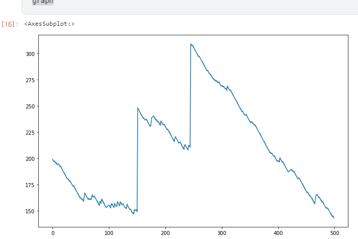
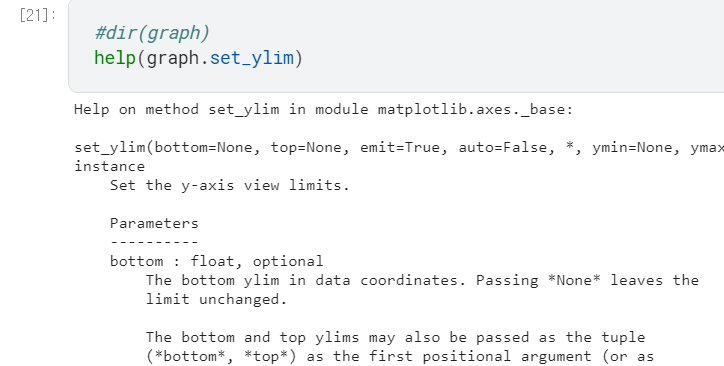
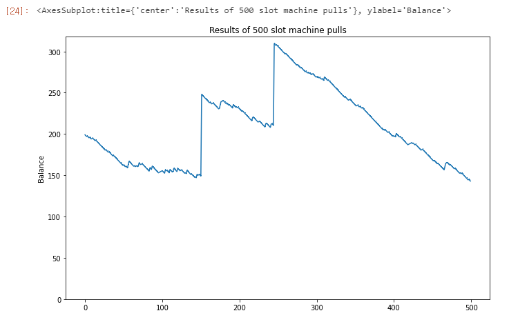
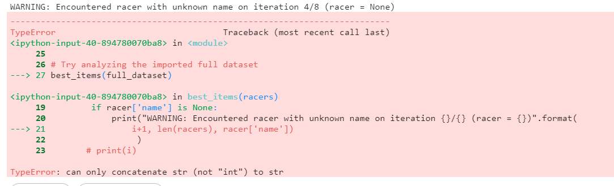
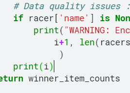
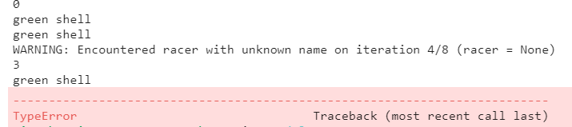
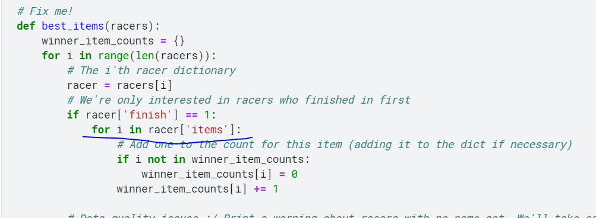
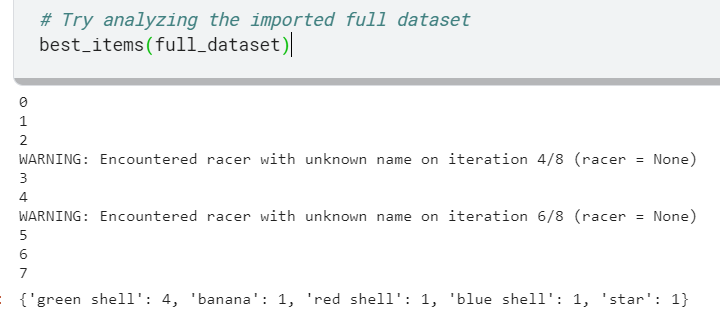
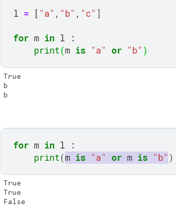

# 파이썬 팁 - 외부 Libraries


## import


#### 기본

```python
import math
```


#### 이름 부여

```python
import math as mt
```


#### 모듈에서 꺼내오는게 아니라 모든 기능 directly 사용 가능

```python
from math import *
print(pi, log(32, 2))
```


##### 해당 direct import는 같은 모듈 함수가 있으면 충돌하기 때문에 조심해야함!

ex)

```python
from math import *
from numpy import *
print(pi, log(32, 2))
```

```python
---------------------------------------------------------------------------
TypeError                                 Traceback (most recent call last)
<ipython-input-10-5045b296ad83> in <module>
      1 from math import *
      2 from numpy import *
----> 3 print(pi, log(32, 2))

TypeError: return arrays must be of ArrayType
```


해당 에러를 방지하기 위해서 특정 기능만 import 하거나 이름을 부여해야함.

```python
from math import log, pi
from numpy import asarray
```


## math


수학 관련 기능 library


```python
import math 

print("pi to 4 significant digits = {:.4}".format(math.pi))
```

```
pi to 4 significant digits = 3.142
```


```python
print("It's math! It has type {}".format(type(math)))
```

```
It's math! It has type <class 'module'>
```


library들의 type은 module이다.


```python
math.log(32, 2)
#사용법 : log(x, [base = 생략가능])
```

```
5.0
```


## numpy


```python
import numpy
print("numpy.random is a", type(numpy.random))
print("it contains names such as...",
      dir(numpy.random)[-15:]
     )
```


numpy도 module이지만, numpy library의 random이라는 함수도 module이다.


이런 경우를 모듈 안에 모듈이 있다고 해서 submodule 이라고 한다.


### random

```python
# Roll 10 dice
rolls = numpy.random.randint(low=1, high=6, size=10)
rolls
```

```
array([4, 4, 3, 1, 5, 1, 5, 2, 1, 2])
```


1~6에서 값을 10개까지 랜덤을 돌림


### numpy array (ndarray)

위에 만든 rolls의 type은

```
type(rolls)
```

```
numpy.ndarray
```


numpy의 ndarray라고 나온다.


```
print(dir(rolls))
```

```
['T', '__abs__', '__add__', '__and__', '__array__', '__array_finalize__', '__array_function__', '__array_interface__', '__array_prepare__', '__array_priority__', '__array_struct__', '__array_ufunc__', '__array_wrap__', '__bool__', '__class__', '__complex__', '__contains__', '__copy__', '__deepcopy__', '__delattr__', '__delitem__', '__dir__', '__divmod__', '__doc__', '__eq__', '__float__', '__floordiv__', '__format__', '__ge__', '__getattribute__', '__getitem__', '__gt__', '__hash__', '__iadd__', '__iand__', '__ifloordiv__', '__ilshift__', '__imatmul__', '__imod__', '__imul__', '__index__', '__init__', '__init_subclass__', '__int__', '__invert__', '__ior__', '__ipow__', '__irshift__', '__isub__', '__iter__', '__itruediv__', '__ixor__', '__le__', '__len__', '__lshift__', '__lt__', '__matmul__', '__mod__', '__mul__', '__ne__', '__neg__', '__new__', '__or__', '__pos__', '__pow__', '__radd__', '__rand__', '__rdivmod__', '__reduce__', '__reduce_ex__', '__repr__', '__rfloordiv__', '__rlshift__', '__rmatmul__', '__rmod__', '__rmul__', '__ror__', '__rpow__', '__rrshift__', '__rshift__', '__rsub__', '__rtruediv__', '__rxor__', '__setattr__', '__setitem__', '__setstate__', '__sizeof__', '__str__', '__sub__', '__subclasshook__', '__truediv__', '__xor__', 'all', 'any', 'argmax', 'argmin', 'argpartition', 'argsort', 'astype', 'base', 'byteswap', 'choose', 'clip', 'compress', 'conj', 'conjugate', 'copy', 'ctypes', 'cumprod', 'cumsum', 'data', 'diagonal', 'dot', 'dtype', 'dump', 'dumps', 'fill', 'flags', 'flat', 'flatten', 'getfield', 'imag', 'item', 'itemset', 'itemsize', 'max', 'mean', 'min', 'nbytes', 'ndim', 'newbyteorder', 'nonzero', 'partition', 'prod', 'ptp', 'put', 'ravel', 'real', 'repeat', 'reshape', 'resize', 'round', 'searchsorted', 'setfield', 'setflags', 'shape', 'size', 'sort', 'squeeze', 'std', 'strides', 'sum', 'swapaxes', 'take', 'tobytes', 'tofile', 'tolist', 'tostring', 'trace', 'transpose', 'var', 'view']
```


이러한 ndarray는 내부에 많은 내부함수들을 가지고 있으며, 이를 이용하면 간단한 내부 연산이 가능하다.


#### ndarray 내부 함수

평균

```python
# If I want the average roll, the "mean" method looks promising...
rolls.mean()
```

```
2.8
```


array를 list로 출력

```python
# Or maybe I just want to turn the array into a list, in which case I can use "tolist"
rolls.tolist()
```

```
[4, 4, 3, 1, 5, 1, 5, 2, 1, 2]
```


help


```python
# That "ravel" attribute sounds interesting. I'm a big classical music fan.
help(rolls.ravel)
```

```
Help on built-in function ravel:

ravel(...) method of numpy.ndarray instance
    a.ravel([order])
    
    Return a flattened array.
    
    Refer to `numpy.ravel` for full documentation.
    
    See Also
    --------
    numpy.ravel : equivalent function
    
    ndarray.flat : a flat iterator on the array.
```


help(array.함수이름) 으로 해당 내부함수의 사용법을 볼 수 있다.


#### numpy array의 장점?


```python
[3, 4, 1, 2, 2, 1] + 10
```

```
---------------------------------------------------------------------------
TypeError                                 Traceback (most recent call last)
<ipython-input-20-a2508fc27c2b> in <module>
----> 1 [3, 4, 1, 2, 2, 1] + 10

TypeError: can only concatenate list (not "int") to list
```


원래는 list에 바로 연산을 할 순 없지만, numpy array는 가능하다.

```python
rolls + 10
```

```
array([14, 14, 13, 11, 15, 11, 15, 12, 11, 12])
```


부등호로 True, False 리턴도 가능

```python
# At which indices are the dice less than or equal to 3?
rolls <= 3
```

```
array([False, False, True, True, False, True, False, True, True, True])
```


list -> array로 바꾸기


```python
xlist = [[1,2,3],[2,4,6],]
# Create a 2-dimensional array
x = numpy.asarray(xlist)
print("xlist = {}\nx =\n{}".format(xlist, x))
```

```
xlist = [[1, 2, 3], [2, 4, 6]]
x =
[[1 2 3]
 [2 4 6]]
```


123, 246의 list 2개를 가지고 있던 list를 하나의 배열로 만드는 과정.


2x3의 배열이 만들어졌고 numpy의 array는 원하는 요소를 아래처럼 빼올 수 있다.


```python
x[1,-1]
```

```
6
```


```python
x[1,1]
```

```
4
```


```python
x[0,2]
```

```
3
```


하지만 list의 경우 내부 list의 요소를 빼낼 수 없음.

```python
# Get the last element of the second sublist of our nested list?
xlist[1,-1]
```

```python
---------------------------------------------------------------------------
TypeError                                 Traceback (most recent call last)
<ipython-input-25-e2f4c7f35788> in <module>
      1 # Get the last element of the second sublist of our nested list?
----> 2 xlist[1,-1]

TypeError: list indices must be integers or slices, not tuple
```


이런 식으론 가능

```python
# Get the last element of the second sublist of our nested list?
xlist[1][0]
```

```
2
```


## pandas

pandas는 DataFrame을 사용해 데이터를 다루는 Library다.


인구가 10의6승(1000000) 이상이며,  대륙이 남아메리카인 df를 출력하는 코드

```python
# Get the rows with population over 1m in South America
df[(df['population'] > 10**6) & (df['continent'] == 'South America')]
```


## Exercise


### 1.matplotlib 을 사용한 그래프


```python
# Import the jimmy_slots submodule
from learntools.python import jimmy_slots
# Call the get_graph() function to get Jimmy's graph
graph = jimmy_slots.get_graph()
graph
```




해당 그래프의 

1.Title

2.y축 시작 0부터

3.y축 이름 설정

을 하는게 문제.


dir(graph)를 하면 해당 graph의 내부 함수들이 보인다.

이번에 사용할 내부 함수들은 `.set_title()`, `.set_ylim()`, and `.set_ylabel()`.


내부함수들을 확인하면 이번에는 help로 해당 함수의 사용법 체크




풀이 :

```python
def prettify_graph(graph):
    """Modify the given graph according to Jimmy's requests: add a title, make the y-axis
    start at 0, label the y-axis. (And, if you're feeling ambitious, format the tick marks
    as dollar amounts using the "$" symbol.)
    """
    graph.set_title("Results of 500 slot machine pulls")
    graph.set_ylim(bottom=0)
    graph.set_ylabel("Balance")
    

graph = jimmy_slots.get_graph()
prettify_graph(graph)
graph
```




+@ 각 틱에 $표시 추가하기

```python
ticks = graph.get_yticks()
# Format those values into strings beginning with dollar sign
new_labels = ['${}'.format(int(amt)) for amt in ticks]
# Set the new labels
graph.set_yticklabels(new_labels)
```

해당 3줄을 추가하면 됨


### 2. 잘못된 함수 수정하기(딕셔너리, 리스트 데이터 분석)


```python
# Import luigi's full dataset of race data
from learntools.python.luigi_analysis import full_dataset

# Fix me!
def best_items(racers):
    winner_item_counts = {}
    for i in range(len(racers)):
        # The i'th racer dictionary
        racer = racers[i]
        # We're only interested in racers who finished in first
        if racer['finish'] == 1:
            for i in racer['items']:
                # Add one to the count for this item (adding it to the dict if necessary)
                if i not in winner_item_counts:
                    winner_item_counts[i] = 0
                winner_item_counts[i] += 1

        # Data quality issues :/ Print a warning about racers with no name set. We'll take care of it later.
        if racer['name'] is None:
            print("WARNING: Encountered racer with unknown name on iteration {}/{} (racer = {})".format(
                i+1, len(racers), racer['name'])
                 )
         #print(i)
    return winner_item_counts

# Try analyzing the imported full dataset
best_items(full_dataset)
```


해당 코드 실행시 아래와 같은 에러가 발생




예외처리를 하는 구문에서 can only concatenate str (not "int") to str 라는 에러가 나온다.


그래서 해당 에러가 난 줄에서 i값을 체크해봄







원래는 0,1,2,3,4 순으로 값만 리턴을 해야하는데 item의 이름 str을 그대로 가져오는 경우가 있다.


이는 racer의 순위가 1등일 경우 



아래 반복문에서 i값을 다시 바꿔버리기 때문인데, 해당 i값만 다른 값으로 바꿔주면 에러가 해결이 된다.


풀이 :

```python
# Import luigi's full dataset of race data
from learntools.python.luigi_analysis import full_dataset

# Fix me!
def best_items(racers):
    winner_item_counts = {}
    for i in range(len(racers)):
        # The i'th racer dictionary
        racer = racers[i]
        # We're only interested in racers who finished in first
        if racer['finish'] == 1:
            for i2 in racer['items']:
                # Add one to the count for this item (adding it to the dict if necessary)
                if i2 not in winner_item_counts:
                    winner_item_counts[i2] = 0
                winner_item_counts[i2] += 1

        # Data quality issues :/ Print a warning about racers with no name set. We'll take care of it later.
        if racer['name'] is None:
            print("WARNING: Encountered racer with unknown name on iteration {}/{} (racer = {})".format(
                i+1, len(racers), racer['name'])
                 )
        print(i)
    return winner_item_counts

# Try analyzing the imported full dataset
best_items(full_dataset)
```





내부 반복문을 i2로 설정하니 간단하게 해결


### 3.블랙잭 함수 만들기


```python
def blackjack_hand_greater_than(hand_1, hand_2):
    """
    Return True if hand_1 beats hand_2, and False otherwise.
    
    In order for hand_1 to beat hand_2 the following must be true:
    - The total of hand_1 must not exceed 21
    - The total of hand_1 must exceed the total of hand_2 OR hand_2's total must exceed 21
    
    Hands are represented as a list of cards. Each card is represented by a string.
    
    When adding up a hand's total, cards with numbers count for that many points. Face
    cards ('J', 'Q', and 'K') are worth 10 points. 'A' can count for 1 or 11.
    
    When determining a hand's total, you should try to count aces in the way that 
    maximizes the hand's total without going over 21. e.g. the total of ['A', 'A', '9'] is 21,
    the total of ['A', 'A', '9', '3'] is 14.
    
    Examples:
    >>> blackjack_hand_greater_than(['K'], ['3', '4'])
    True
    >>> blackjack_hand_greater_than(['K'], ['10'])
    False
    >>> blackjack_hand_greater_than(['K', 'K', '2'], ['3'])
    False
    """
    
    
    def score_sum(hand_list) :
        hand1_sum = 0
        hand1_A = 0
        
        for h1 in hand_list :
            if h1 is 'J'or h1 is 'Q'or h1 is 'K' :
                hand1_sum += 10
            elif h1 is 'A' : 
                hand1_A += 1
            else : 
                hand1_sum += int(h1)        
       
        i=0
        while(i < hand1_A) :
            if hand1_sum <= 11-hand1_A : 
                hand1_sum += 11
            else :
                hand1_sum += 1
            
            hand1_A -= 1
        
        if hand1_sum > 21 : 
            hand1_sum = 0
            
        return hand1_sum

    H1 = score_sum(hand_1)
    H2 = score_sum(hand_2) 

    return H1>H2
           
```


hand1과 hand2 두번의 연산을 해야하기 때문에 반복되는 코드를 없애고자 내부 함수를 또 만들어서 작성


A가 여러개 나올 경우의 계산이 복잡했는데, 예를들어


A A A 8 이면 11, 1, 1, 8 으로 하나만 11계산을 해야하고

A A A 9 면 1, 1, 1, 8 로 낮은 값은 11을 택해야한다.

즉 A의 갯수 + A가 아닌 다른 숫자 가 11보다 크면 무조건 작은 값만을 택해야하는 상황

고민을 하다가

##### A가 아닌 다른 숫자들의 합 <= 11-A의 숫자

일 경우에만 +11을 하는 식을 만들었다. (A가 5개면 다른 숫자의 합이 6이하일 경우에만 +11)

ex) A,A,A,A,A 6 = 11,4, 6 = 21

​      A,A,A,A,A,8 = 5,6 = 11


그리고 중요한점



is문에서 or을 활용할때에는 is를 생략하면 안된다.


