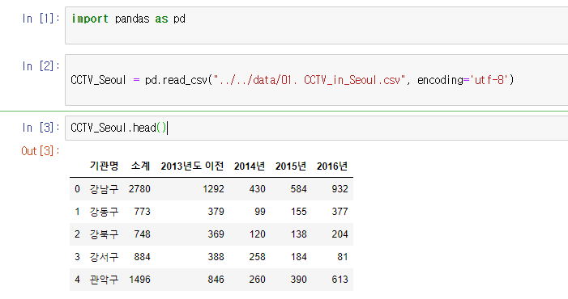
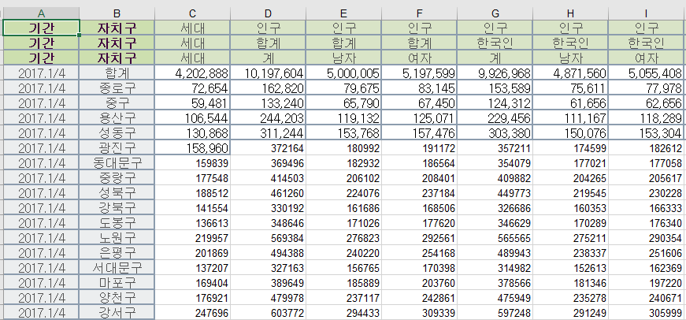
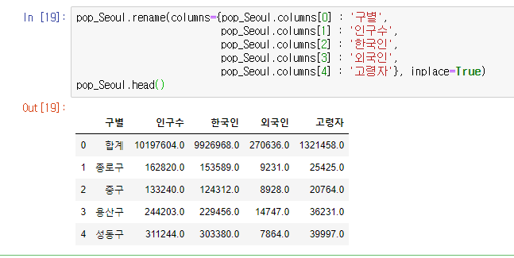

# 1장. 서울시 CCTV 데이터 다루기

## 1. 데이터 불러오기

### 1.1 pandas 모듈 import

pandas는 엑셀과 같은 csv 파일을 읽어오는데 필요한 모듈이다.

pandas.read_csv("위치", encoding=''utf-8") 이 csv파일을 읽어오는 명령어이며

읽어온 변수에 .head를 사용하면 첫 5행을 보여주라는 명령어가 된다.

### 1.2 pandas의 columns

columns 는 위의 그림에서 기관명,소계 등등 과 같은 제일 첫 줄을 의미하며 pandas를 이용해서 

이런 식으로 출력할 수 도 있다.

### 1.3 pandas의 rename

rename을 사용하여 기관명 -> 구별로 열의 이름을 바꾸었다.

##### inplace=True는 CCTV_Seoul의 변수의 내용을 실제로 바꾸라는 옵션이다.

### 1.4 xls 파일 다루기

엑셀파일은 read.excel 명령어로 불러오면 되는데 위처럼 필요없는 행,열 데이터들이 존재할 경우 옵션을 이용해서 제거할 수 있다.

실제 엑셀 파일의 상태

이 중 특정 열만 추출해보도록 하자

행은 3번째(0,1,2 순) / 열은 B D G J N번째 열만을 추출하여 변수에 넣어주었다.

여기서 열의 이름이 계1 계2가 되어있는데 사실 이 이름은

한국인 합계 외국인 합계 등이 1번째 행이기 때문에 중복이 되어버린 것이다.

이제 열의 이름도 같이 변경을 해주자

이제 엑셀 데이터 불러오기의 기초가 끝났다.

