# pandas 기초 익히기

## 1. import

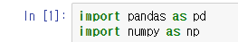

pandas는 numpy와 활용되는 경우가 많기 때문에 둘을 함께 import 해준다.

## 2. pandas의 data 형식

### 2.1 Series (=파이썬의 list)

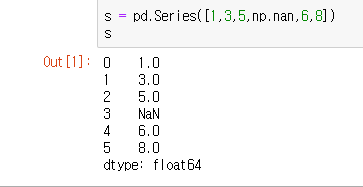

파이썬의 list 처럼 대괄호로 만들어주는 Series 형식의 데이터.

NaN은 Not A Number 라는 의미로 숫자가 아닌 값이라는 의미다.

### 2.2 date_range (=날짜형 데이터)

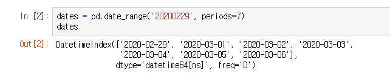

date_range는 기본 날짜를 지정해주고 periods 옵션으로 기본 날짜에서 설정한 값만큼의 일간 데이터를 가져온다.

### 2.3 Data_frame (행렬 형식의 데이터)

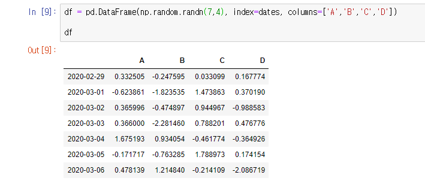

데이터 프레임

N행 M열의 데이터를 만들고 다룰때 사용한다.

위에서 만들었던 dates 데이터를 이용하여 random.randn(행,열) 명령어로 7행 4열의 데이터 프레임을 만들었고, 각 열에는 A,B,C,D의 이름을 붙여주었다.

### 2.3.1 Data_frame의 명령어 - head() (=미리보기)

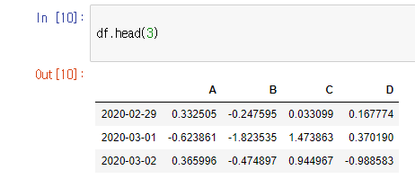

열 이름을 제외하고 위에서 3행 만큼의 데이터들을 보여준다.

### 2.3.2 index (=행, 가로 데이터의 이름)

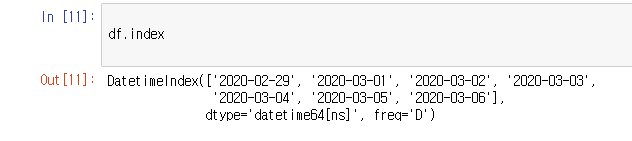

데이터 프레임의 정보를 보여준다.

열의 정보가 아닌 행의 이름만을 보여줌.

### 2.3.3 columns (=열, 세로 데이터의 이름)

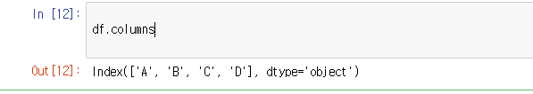

index와 비슷하지만 columns는 열 이름만을 보여준다.

### 2.3.4 values (= 값 정보)

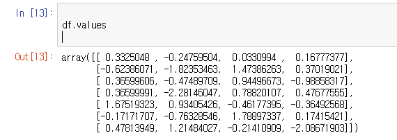

행, 열의 이름이 아니라 들어있는 값을 확인시켜주는 명령어 

##### 참고)

실제 데이터 프레임은 이렇게 생겼다.

### 2.3.5 info() (=개요)

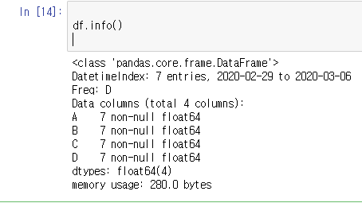

해당 데이터 프레임의 간략한 개요를 보여주는 명령어

7행 4열의 데이터 프레임이고 

200229~200306의 날짜 데이터를 담고 있으며 용량은 어느정도인지 등등 유용한 정보가 나온다.

### 2.3.6 describe() (=통개적 개요)

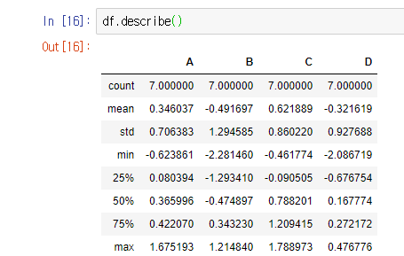

해당 열의 데이터 수, 

평균값, 

최소값,

최대값,

25,50,75%의 값, 

표준편차

까지 확인할 수 있다.

#### 꽤 유용할듯 

### 2.3.7 sort_values() (=값 정렬)

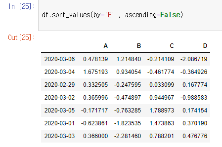

by 로 정렬시킬 열을 설정, ascending으로 오름차순,내림차순 등을 설정해줄 수 있다.

해당 결과를 보면 날짜는 뒤죽박죽이지만 B의 값을 기준으로 큰 수의 순서로 나열되어있다.

##### 참고 )

오름차순 = False이므로 저 그림은 내림차순의 값이다.

### 2.3.8 변수명['컬럼명'] (=간략실행)

#### 변수명[0:3] 과 같이 [시작할 행 : 끝날 행]도 가능하다.

정상실행 : 

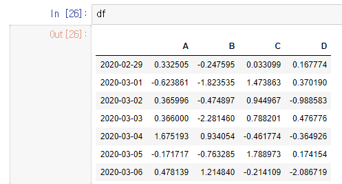

**간략실행** :

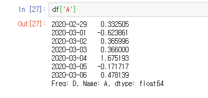

보고싶은 열의 데이터만 간략하게 보여준다.

##### 행의 데이터를 보고 싶을 때 :

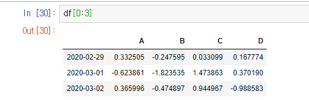

0:3 으로 하면 된다.

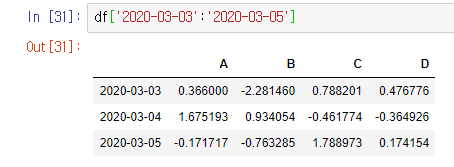

이렇게 직접 행 이름을 넣어줘도 가능.

### 2.3.9 loc[dates[0]] (=슬라이싱)

dates는 date_range 형식의 날짜 범위 데이터, 0은 0번째 행을 의미한다.

결과)

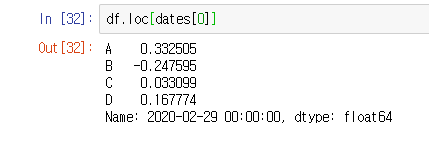

0번째 행인지 확인 하려면 바로 위의 In [30] 데이터를 확인.

20-02-29의 데이터들을 성공적으로 잘라냈다.

##### 행이 아니라 열의 데이터를 잘라내려면? 

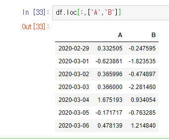

앞에 행은 비워두고 : 뒤에 열 이름을 주면 된다.

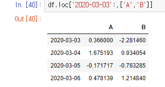

이런 식으로 03-03이후의 데이터만 추출하는 것도 가능.

#### 지정한 행, 열의 데이터만 추출하기

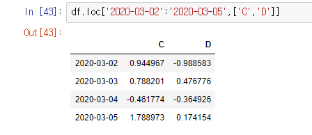

앞에 행의 범위를 입력해주고 열의 이름은 []안에 입력해준다.

참고) 

##### 날짜 데이터는 하이픈(-) 없이 해도 가능

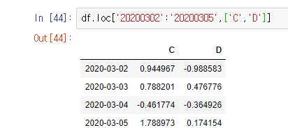

#### loc 추가 테스트

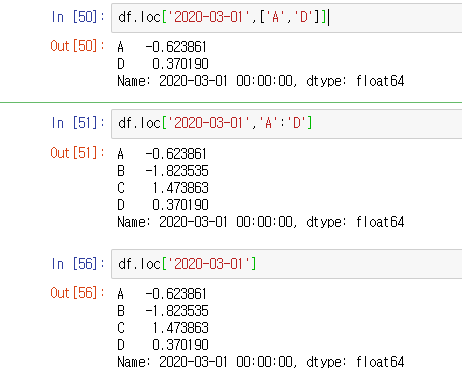

특정 행(3월1일, 3월3일)의 데이터를 뽑아보려했는데 열과 달리 행에서는 잘 모르겠다.

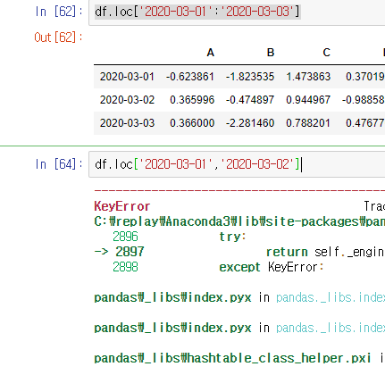

콜론(:) 은 되는데 콤마(,)는 안먹힌다.

뭐지...

### 2.3.10 iloc (=행,열번호로 슬라이싱)

##### 행 번호로 슬라이싱

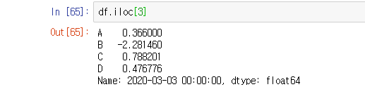

단순히 숫자만 넣어주면 됨

##### 열 번호로 슬라이싱

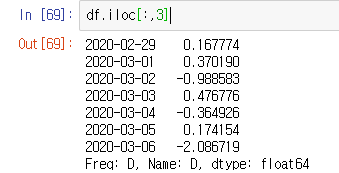

앞에 변수를 :(모든) 으로 두고 콤마(,) 뒤에 원하는 열 번호를 입력한다.

df['D']와 같은 의미 (숫자가 0,1,2,3 이라서 가장 마지막에있는 D가 3과 같은 값이다.)

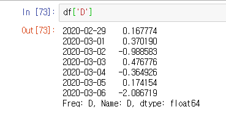

##### 특정 행번호와 특정 열번호로 데이터 뽑기 1

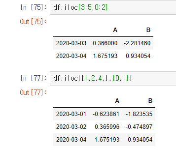

앞,뒤 에 전부 행 번호를 입력하는 방법이 1

##### 특정 행번호와 특정 열번호로 데이터 뽑기 2

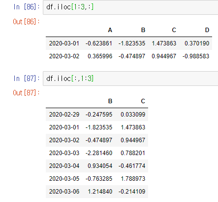

앞이나 뒤를 :(모든) 으로 넣어줘서 뽑는 방법이 2다.

86은 열 모두 선택,

87은 행 모두 선택이다.

## 2.3.11 data-frame에 조건문 걸기

데이터 원형 :

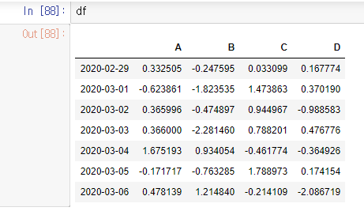

여기서 조건문을 걸어서 A의 값이 양수인 데이터만 행들만 뽑아보자.

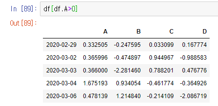

매우 간단하게 조건문이 수행된다.

##### 특정 행이나 열이 아니라 전체에 조건문을 걸수도 있다.

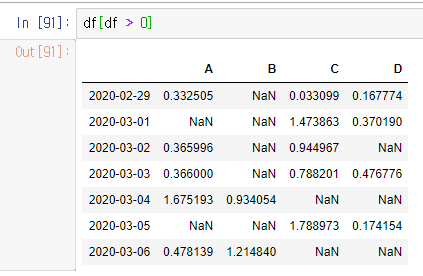

## 2.3.12 .copy() (=data frame 복사)

데이터 프레임을 복사할 때에는

단순히 df2 = df 같은 식으로 데이터를 주면 데이터를 주는게 아니라 **'위치'** 만 주게 되기 때문에, copy 명령어를 사용해서 동일한 데이터를 만들어야 한다.

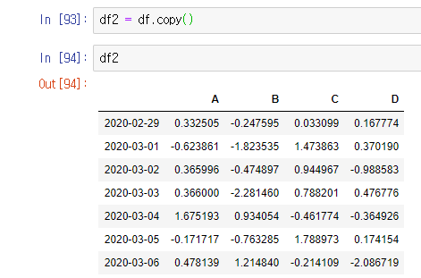

## 2.3.13 data frame에 데이터 추가하기

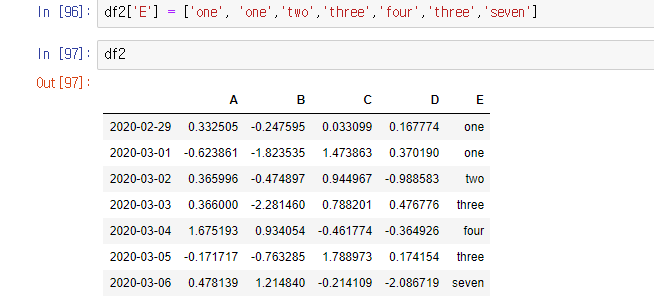

복사한 df2에 E열, 영어 숫자 데이터를 추가하였다.

### 2.3.14 isin (=bool 형식 결과 보기 [True, False])

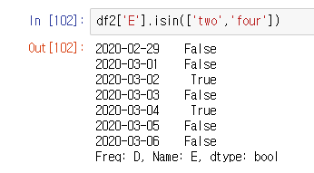

2일과 4일의 데이터에 two와 four가 들어가있으므로 둘만이 true가 뜬다.

또한 isin의 결과값은 true,false로 리턴이 되기 때문에 이를 바로 이용해서 조건에 맞는 데이터를 볼 수 있다.

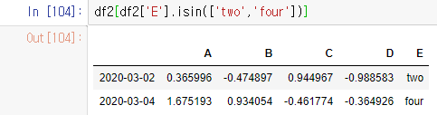

df2[] 안에 isin문을 넣은결과.

### 2.3.15 .apply(np.cumsum) (=누적합 계산하기)

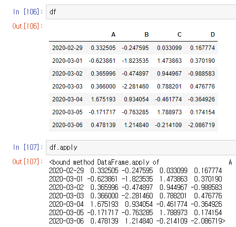

apply 는 통계 함수를 다루기 위해서 사용하는 명령어로, cumsum을 사용하지 않으면 누적합이 계산되지 않는다.

##### 누적합)

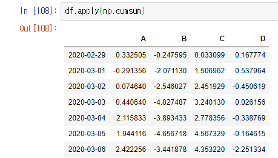

맨 아래값들을 비교해보면 쭉 누적합이 된 걸 볼 수 있다.

### 2.3.16 .apply(lambda x: x.max() - x.min()) 

### (=람다 함수를 이용한 최대값 - 최소값 구하기)

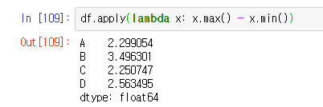

apply와 함께 사용을 해 주면 이런 식의 값도 구할 수 있다.