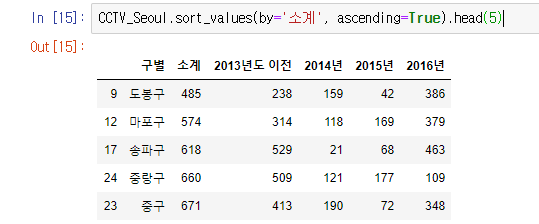
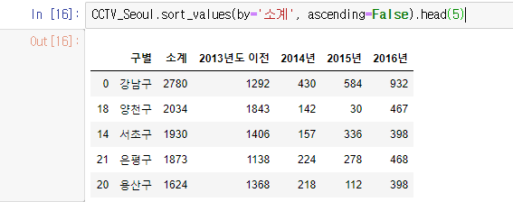
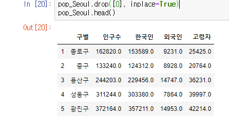
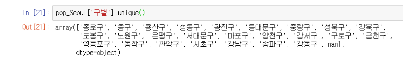
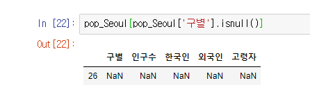
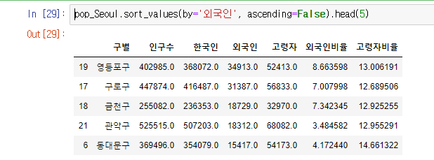
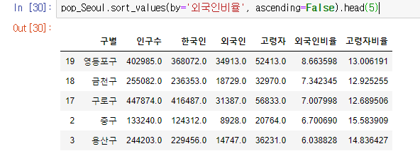

## 1-2 CCTV 데이터 분석(1-1 pandas 기초에 이어서)

이어 하기 전에 먼저 전에 선언한 CCTV 데이터의 변수를 확인해보자

### 1.1 간단한 정렬 (CCTV 데이터)

합계를 중심으로 오름차순 정렬을 해보았다. 

(Ascending = 오름차순)

내림차순은 False로 주면된다.

##### .head(5) 를 빼버리면 전체 데이터들이 나온다.

### 1.2 새로운 열 만들기 (CCTV 데이터)

## 2. 인구 데이터 분석

### 2.1 인구 데이터 다루기 (인구 데이터)

전에 사용하던 pop 변수를 그대로 사용한다.

### 2.2 행 지우기, nan데이터 삭제 (인구데이터)

0번째 행에 있는 '합계' 데이터는 이번 분석에서 사용하지 않기 때문에 제거해준다.

구별 데이터에 존재하는 값들을 찾아보니 nan 데이터가 있다. 

isnull() 명령어를 통해 nan데이터가 위치한 행의 번호를 찾아냈다.(26)

pop 명령어로 26번째 행을 지워주자

### 2.3 비율 계산 (인구 데이터)

새로 2개의 열을 만들어준 뒤, head 명령어로 확인해보자

비율이 정상적으로 나옴을 확인 할 수 있다.

### 2.4 정렬 및 확인

##### 2.4.1 인구수 기준 내림차순

##### 2.4.2 외국인 수 기준 내림차순

##### 2.4.3 외국인 비율 기준 내림차순

전체 인구수도 관련이 있기 때문에 2.4.2의 외국인 수와는 다른 결과가 나온다.

##### 2.4.4 고령자 수 기준 내림차순

##### 2.4.5 고령자 비율 기준 내림차순

외국인 수와 비율과 비슷한 결과가 나왔다.

#### 이제 인구데이터 + CCTV데이터의 병합을 해야한다.

