# 1장. 서울시 CCTV 데이터 다루기

## 1. 데이터 불러오기

### 1.1 pandas 모듈 import

pandas는 엑셀과 같은 csv 파일을 읽어오는데 필요한 모듈이다.

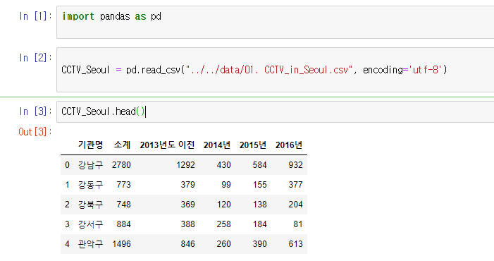

pandas.read_csv("위치", encoding=''utf-8") 이 csv파일을 읽어오는 명령어이며

읽어온 변수에 .head를 사용하면 첫 5행을 보여주라는 명령어가 된다.

### 1.2 pandas의 columns

columns 는 위의 그림에서 기관명,소계 등등 과 같은 제일 첫 줄을 의미하며 pandas를 이용해서 

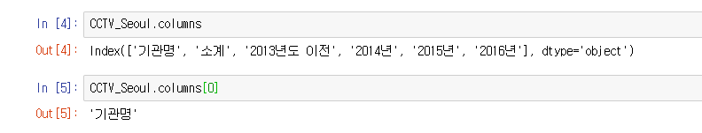

이런 식으로 출력할 수 도 있다.

### 1.3 pandas의 rename

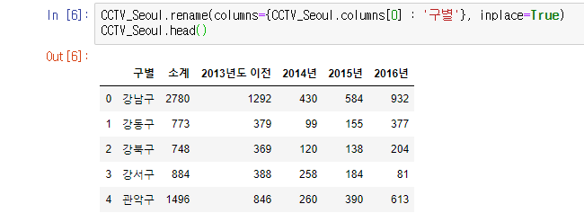

rename을 사용하여 기관명 -> 구별로 열의 이름을 바꾸었다.

##### inplace=True는 CCTV_Seoul의 변수의 내용을 실제로 바꾸라는 옵션이다.

### 1.4 xls 파일 다루기

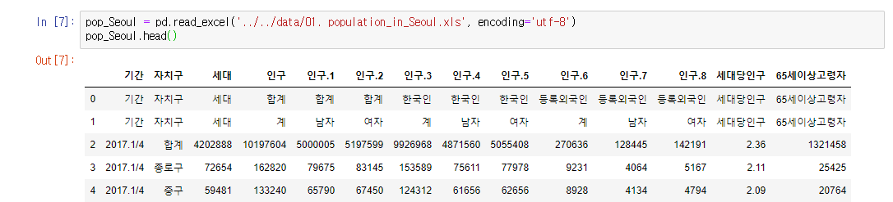

엑셀파일은 read.excel 명령어로 불러오면 되는데 위처럼 필요없는 행,열 데이터들이 존재할 경우 옵션을 이용해서 제거할 수 있다.

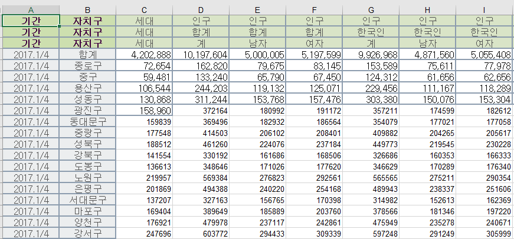

실제 엑셀 파일의 상태

이 중 특정 열만 추출해보도록 하자

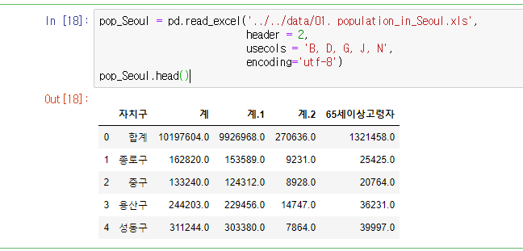

행은 3번째(0,1,2 순) / 열은 B D G J N번째 열만을 추출하여 변수에 넣어주었다.

여기서 열의 이름이 계1 계2가 되어있는데 사실 이 이름은

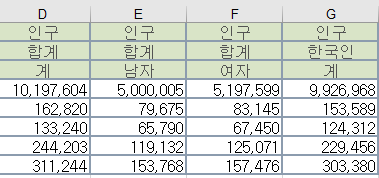

한국인 합계 외국인 합계 등이 1번째 행이기 때문에 중복이 되어버린 것이다.

이제 열의 이름도 같이 변경을 해주자

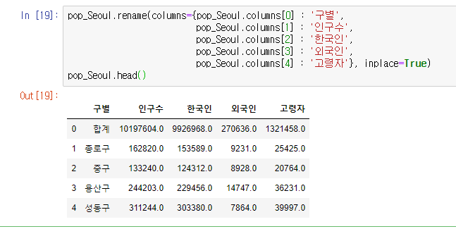

이제 엑셀 데이터 불러오기의 기초가 끝났다.

## 2. CCTV 데이터 분석(1-1 pandas 기초에 이어서)

이어 하기 전에 먼저 전에 선언한 CCTV 데이터의 변수를 확인해보자

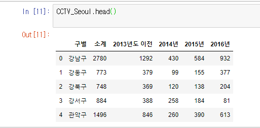

### 2.1 간단한 정렬 (CCTV 데이터)

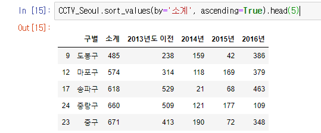

합계를 중심으로 오름차순 정렬을 해보았다. 

(Ascending = 오름차순)

내림차순은 False로 주면된다.

##### .head(5) 를 빼버리면 전체 데이터들이 나온다.

### 2.2 새로운 열 만들기 (CCTV 데이터)

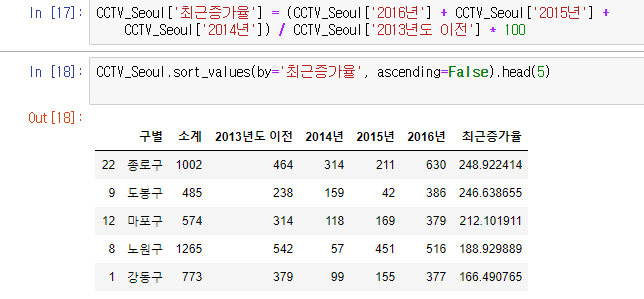

## 3. 인구 데이터 분석

### 3.1 인구 데이터 다루기 (인구 데이터)

전에 사용하던 pop 변수를 그대로 사용한다.

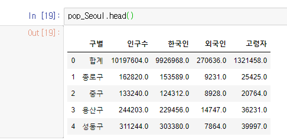

### 3.2 행 지우기, nan데이터 삭제 (인구데이터)

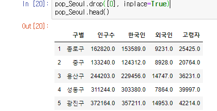

0번째 행에 있는 '합계' 데이터는 이번 분석에서 사용하지 않기 때문에 제거해준다.

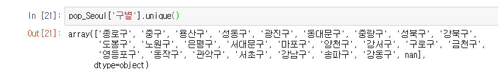

구별 데이터에 존재하는 값들을 찾아보니 nan 데이터가 있다. 

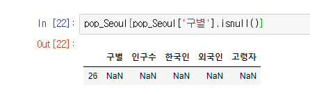

isnull() 명령어를 통해 nan데이터가 위치한 행의 번호를 찾아냈다.(26)

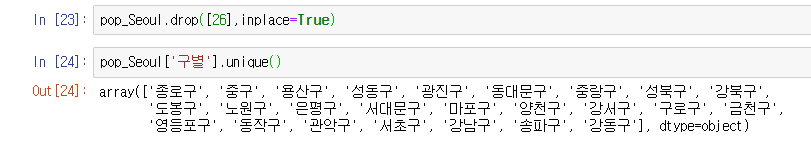

pop 명령어로 26번째 행을 지워주자

### 3.3 비율 계산 (인구 데이터)

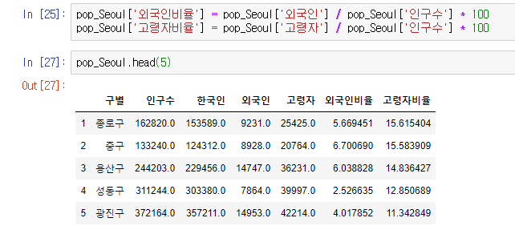

새로 2개의 열을 만들어준 뒤, head 명령어로 확인해보자

비율이 정상적으로 나옴을 확인 할 수 있다.

### 3.4 정렬 및 확인

##### 3.4.1 인구수 기준 내림차순

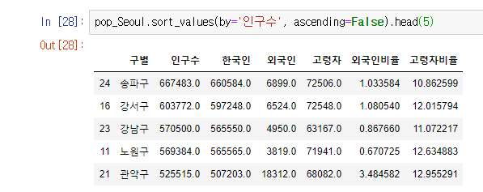

##### 3.4.2 외국인 수 기준 내림차순

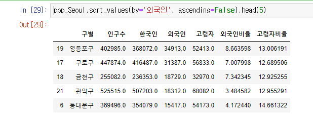

##### 3.4.3 외국인 비율 기준 내림차순

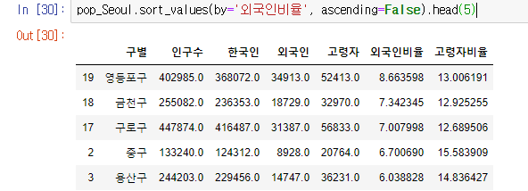

전체 인구수도 관련이 있기 때문에 3.4.2의 외국인 수와는 다른 결과가 나온다.

##### 3.4.4 고령자 수 기준 내림차순

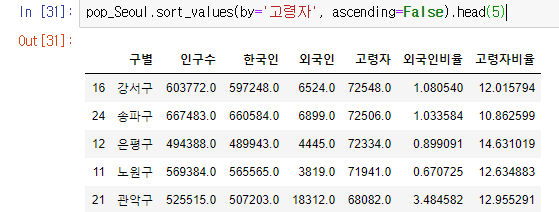

##### 3.4.5 고령자 비율 기준 내림차순

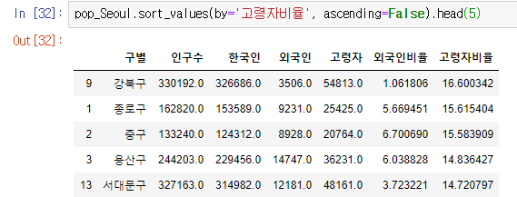

외국인 수와 비율과 비슷한 결과가 나왔다.

#### 이제 인구데이터 + CCTV데이터의 병합을 해야한다.

