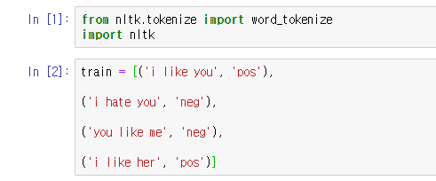
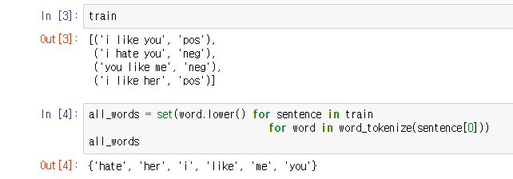
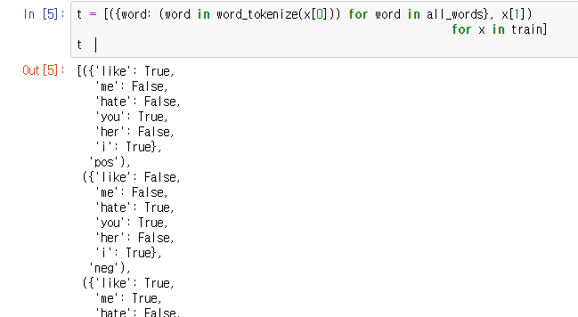
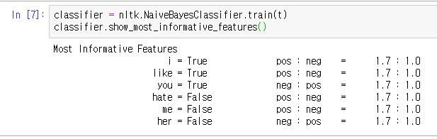
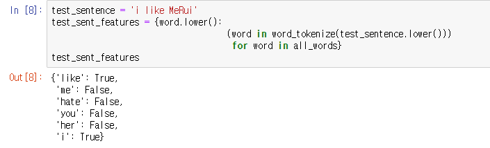
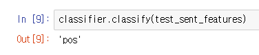

## 8-5 Naive Bayes (긍 부정 분석)


### 특정 문장들의 긍,부정 을 학습시키고 판단하는 분류방법


## 실습

### 0. 필요한 모듈 import, 학습 데이터 입력 




### 1 ~ 2. 데이터 확인, 사용된 단어 정리




### 3. 사용된 단어들이 train 문장에 속해있는지 판단





ex)  train 데이터는 

```
[('i like you', 'pos'),
('i hate you', 'neg'),
('you like me', 'neg'),
('i like her', 'pos')]
```

이며,

i like you 라는 문장에 all_words의 전체 단어들을 하나하나 반복문으로 있는지 체크하는 과정


### 4. NaiveBayes 분류기를 이용하여 긍,부정 비교




##### like는 사용될 경우 긍정의 확률이 1.7:1로 높게 나타났고

##### hate는 사용되지 않을 경우가 긍정일 확률이 1.7:1로 나타났다.


### 5. 테스트 문장 생성, 단어 여부 확인



'i like MeRui' 라는 문장을 위에서 만든 분류기를 이용해 판정해보는 과정 

해당 문장에는 like, i 가 들어가있기 때문에 True로 분류된다.


### 6. 위에서 만든 테스트 문장 미리만들어둔 분류기로 판정




## 정리 

### 분류기 만들기

#### 1. 학습 데이터 만들기(=train)

#### 2. 단어 뭉치 만들기 (=all_words)

#### 3. 2에서 만든 단어뭉치들이 1의 train 문장에 속해있는지 확인(t)

#### 4. 1의 학습데이터(=train)와 3의 판별여부(=t)를 이용해서 긍,부정 분류기 생성(=classifier)


#### @ 4까지 다 끝내야 자신이 원하는 문장을 판별할 수 있음.


### 테스트 문장 판정

#### 5. 2에서 만든 단어뭉치들(=all_words)이 새로운 문장(=test_sentence)에 들어가 있는지 확인.(=test_sent_features)

#### 6. 5에서 확인한 데이터들로 분류기에 입력 (=classifier.classify(test_sent_features))


