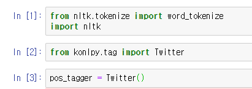
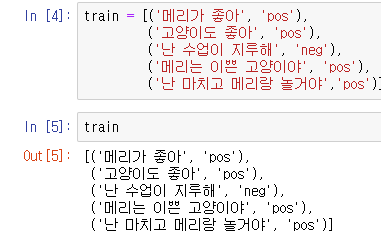
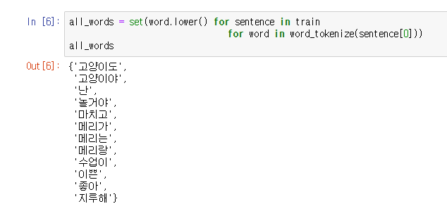
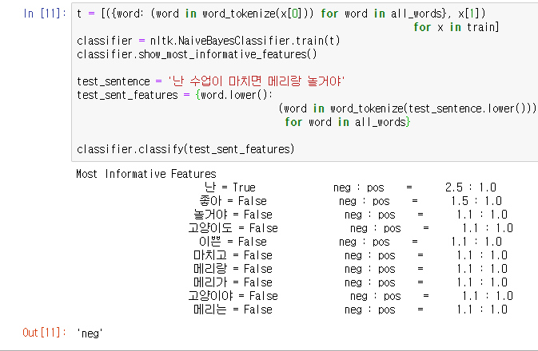
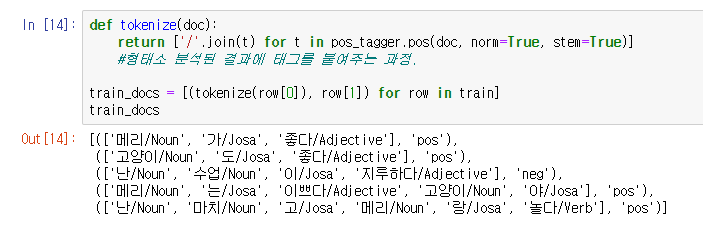
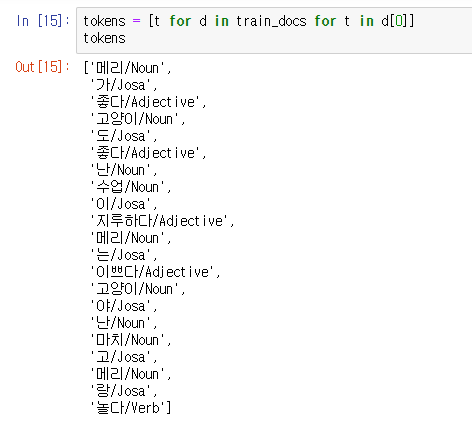
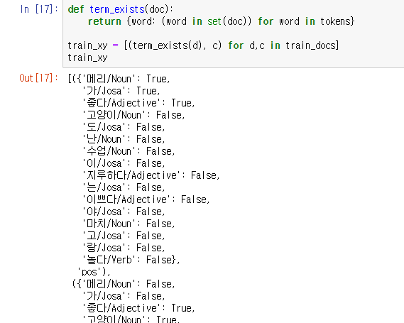
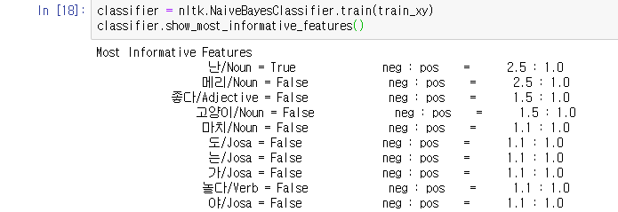
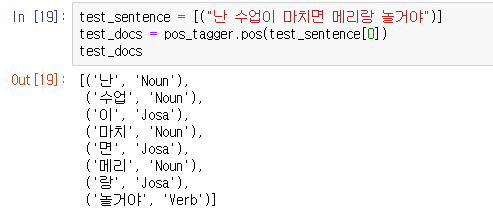

## 8-5 Naive Bayes (긍 부정 분석) 2


### 특정 문장들의 긍,부정 을 학습시키고 판단하는 분류방법


#### 영문을 먼저 하고 그 후에 한글  


## 실습

### 0. 필요한 모듈 import, 학습 데이터 입력 




### 1. 데이터 확인




### 2. 사용된 단어(말뭉치) 정리




영어와 달리 '고양이도' 와 '고양이야'가 다른 단어로 잡혔으며, 

```
메리가 , 메리는, 메리랑
```

과 같이 명사+조사가 합쳐진 상태로 전부 다른 단어로 인식되어있다.


## 2-2. 말뭉치 정리를 안했을 경우




##### 전에 영어로 만들었던 분류기의 과정(3,4,5,6)을 그대로 따라서 적용을 하니

##### '난 수업이 마치면 메리랑 놀거야' 라는 긍정문이 부정으로 인식되었다.


#### 단어의 의미 파악을 위한 형태소 분석이 안 되었기 때문!


## 2-3. 형태소 분석





Twiiter에서 만든 Konlpy 형태소 분석기를 사용하여 단어를 형태소 분석하고 태깅한 결과


### 2-4. 새로운 말뭉치 생성




### 3. 사용된 단어들이 train 문장에 속해있는지 판단




### 4. NaiveBayes 분류기를 이용하여 긍,부정 비교



##### '좋다' 라는 형용사가 사용될 경우 긍정의 확률이 1.5:1, 

##### '고양이' 라는 명사가 사용되면 2.5:1로 긍정적인 문장이 되었다.


### 5. 테스트 문장 생성, 형태소 분석



'난 수업이 마치면 메리랑 놀거야' 라는 문장을

#### 형태소 분석을 


### 5.5 테스트 문장의 단어 여부 확인


### @@@@@@@@@@@@@ 책 오류 발견


### 직접 수정해보기로함 -> 다른 MD파일


