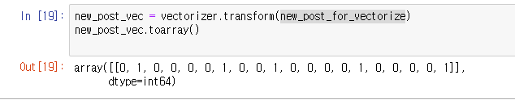

# 8-7 벡터화로 문장 유사도 측정하기

### 원리 : 문장을 벡터로 표현할 수 있다면 벡터 간 거리를 구하는 방법으로 유사한 문장들을 찾아낼 수 있다.

## 실습 

### 1. 필요한 모듈 import

### 

### 2. 문장 입력

###  

### 3.  벡터화 - 형태소 분석 X

#### 3-1. 문장을 단어 자체로 feature로 잡아서 말뭉치화

####  2에서 입력해준 문장들을 말뭉치화(feature_names) 한 것이다.

#### 3-2. 말뭉치에 대한 해당 문장을 벡터화

#### 해당 array들의 판단 방식은 아래에

이 array의 첫번째 줄이 의미하는 것은 바로 

##### '메리랑 놀러가고 싶지만 바쁜데 어떡하죠?' 라는 첫번째 문장이다.

3에서 말뭉치화 된 순서대로 첫번째 문장에 사용되었는지를 비교하여 사용되었으면 1, 아니면 0을 나타나게 한다. 

예를 들면 8,11 번째 첫번째 줄의 8,11번째가 1인데 해당 순서를 말뭉치에서 확인해 보면

##### '놀러가고', '메리랑' 이라는 단어라는 것을 확인할 수 있다.

#### 즉 이러한 벡터화를 하게 되면 1,2,3,4 줄을 비교하여 비슷한 문장을 판단할 수 있게 된다.

### 4. 벡터화 - 형태소 분석 O

위에서 해 보았던 벡터화를 이번엔 **형태소 분석**까지 더해서 좀 더 합리적으로 실습해 보겠다.

#### 4.1 필요한 모듈 import

기존에 써왔던 트위터 형태소 분석기를 계속 사용.

#### 4.2 토큰화

문장별로 형태소 분석을 하여 토큰화 하였다.

#### 4.3 벡터화를 위해 토큰들을 하나의 문장으로 합쳐준다.

형태소 분석된 결과를 띄어쓰기로 구분하여 하나의 문장으로 합침

##### vectorizer 에서 사용하기 위해 형태를 바꿔주는 과정이다.

#### 4.4  분석된 결과를 vectorizer에 넣어서 feature들을 확인한다.

(4,20) 이 의미하는건 3에서 미리 해보았던 벡터화를 기준으로 4줄, 20단어를 의미함.

#### 4.5 문장의 단어들을 말뭉치(feature)화 (3.1에서 했던 작업)

#### 4.6 말뭉치에 대한 해당 문장을 벡터화

##### '메리랑 놀러가고 싶지만 바쁜데 어떡하죠?' 

라는 문장이 첫번째 줄이므로 첫번째 줄을 확인하면 1,5,7번째 단어가 1로 표시되어있다.

이 순서를 4.5의 말뭉치에서 확인해보면 '가고', '놀러', '메리'

라는 단어임을 확인할 수 있으므로 말뭉치화, 벡터화가 정상적으로 수행이 되었음을 알 수 있다.

### 5. 새로운 문장을 벡터화해서 테스팅

new_post를 만들고 

새로운 문장에 대해서 4.2의 토큰화, 4.3의 문장화 과정을 한번에 수행하였다.

#### 5-1.  4.5에서 만들었던 말뭉치를 기준으로 다시 벡터화 

### 6. 두 문장 사이의 거리 구하기 - 벡터화 X

새로운 문장 : new_post_vec

비교해야할 문장 : contents

두 문장 사이의 거리를 구해보자

#### 6.1 scipy 모듈을 사용, 두 문장 사이의 거리를 구하는 함수를 따로 만들어준다.

#### 6.2 비교를 위한 변수들을 선언해준다.

#### 6.3 반복문을 사용, 거리를 비교해준다.

##### @@@@ 이해를 돕기 위한 데이터 형식

X 에서 한줄씩 꺼내 post_vec에 넣어주는데 , 이러면 new_post_vec과 같은 형식의 numpy array가 되기 때문에 거리 비교가 가능하다. 

참고로 numpy 데이터 형식은 이런 꼴

#### 6.4 결과 확인

new_post_vec 인 **'메리랑 공원에서 산책하고 놀고 싶어요'** 와 가장 비슷한 문장은 

contents의 두번째 문장인 **'메리는 공원에서 산책하고 노는 것을 싫어해요'** 라는 결과가 나왔다.

서로 사용된 단어들이 매우 비슷하기 때문에 이러한 결과가 나왔다고 볼 수 있다.

### 7. 두 문장 사이의 거리 구하기 - 벡터화 O

이번엔 7에서 했던 과정을 단순 문장 비교가 아니라 벡터화를 통해서 비교를 해보고자 한다.

#### 벡터화 명령어 : toarray()

기존 4문장의 벡터와 신규 문장의 벡터를 미리 확인.

이제 각 벡터 사이의 거리를 구해보자

#### 7.1 거리 구하는 함수 만들기

각 벡터에 norm을 나눠준 후 거리를 구한다.

#### 7.2 거리 계산 (6.3 반복문 변수를 바꿔서 사용)

거리를 구한 결과가 조금 달라졌지만 가장 가까운 문장에 대한 결과는 바뀌지 않았다.

#### 7.3 결과 확인(6.4 결과 확인 그대로 사용)

역시 같은 결과가 나왔다.

## 8. TF-IDF

여기서 더 정확한 분석을 위해 TF-IDF 를 적용.

#### TF란? 한 문서내에 특정 단어가 자주 등장하는 **빈도**

#### IDF란? 모든 문서 내에 특정 단어가 얼마나 자주 사용되는지에 대한 빈도

(특정 문서에서만 A라는 단어가 많이 사용된다면 그 특정 문서에서의 핵심단어가 A라는 것을 알게 해 준다.)

##### IDF는 빈도에 대한 역함수이기 때문에, 높을수록 유니크한, 핵심 단어라는 의미고 값이 낮을수록 그만큼 많이 사용된다는 의미다.

### 8.1 TF-IDF 함수 생성

#### 8.1.1 TF-IDF 함수 테스트

해당 함수에 a문서를 가지고 비교를 했을 때, 

a문서에는 'a'라는 단어 하나만 존재하므로  tf가 1 , 

a,abb,abc 모든 문서에 'a' 가 속해있으므로 idf는 0이 나왔다.

두 번째 예제를 보면 b는 abb라는 문서에 2번이 들어가 있으므로 tf의 비중은0.66

a,abb,abc 전체 문서에서 사용된 비중은 0.4054이며, IDF가 1.09가 나온 'c' 다음으로 유니크한 단어임을 알 수 있다.

### 8.2 필요한 모듈 import

sklearn의 TfidfVectorizer를 사용한다.

### 8.3  4.에서 했던 벡터화를 그대로 동일하게 진행

contents 문장을 다듬고(토큰화, 형태소분석 후 다시 문장화) 

벡터화 하는 과정.

### 8.4 다듬어진 말뭉치 확인

### 8.5 테스트 문장 만들기

##### 5와 6에서 했던 과정의 반복.

#### 달라진 점은 

#### new_post의 문장이 바뀌었고,

#### Vectorizer 역시 기존의 CountVectorizer 대신

#### sklearn의 TfidfVectorizer를 사용한다.

### 8.6 벡터화, 거리구하기

TF-IDF 값이 적용된 결과가 나왔다. 

#### 기존 벡터화로 문장의 유사도를 측정하는 과정에서 TF-IDF Vectorizer를 이용하여 가중치를 더해준 뒤 계산한 결과.