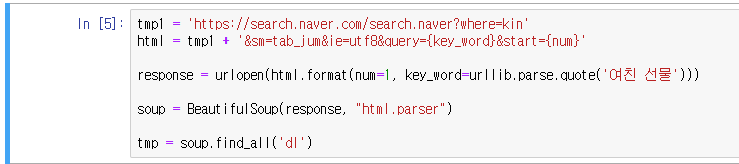

# 8-8 종합실습-선물추천_1(웹크롤링,형태소분석)

### 1. 태그 추출

크롬 개발자 도구를 이용해서 지식IN의 내용이 담긴 태그를 확인한다 

-> dl 태그

### 2. 파이썬으로 dl태그 내용 추출(웹크롤링)

#### 2.1 필요한 모듈 import, 폰트설정

#### 2.2 주소창(URL)설정

#### 2.3 한 페이지의 테스트 추출 결과 확인

#### 2.4 전체 페이지에서 접근, 텍스트 추출

약 1만개 정도의 검색 결과를 읽어오는 코드

실행 시간이 14분 정도가 나왔는데, 네이버 개발자용 API를 이용할 경우 속도가 더 빨라질 수 있다.

##### @@@@@ 

##### 형태소 분석시 1만개의 데이터를 넣으니 노트북의 성능때문에 분석에 매우 오랜 시간이 걸려 데이터를 1000개로 축소

#### 2.5 추출된 데이터 확인

### 3. 형태소 분석

#### 3.1 형태소 분석기 import

#### 3.2 하나의 변수로 만들고 형태소 분석.

#### 3.3 단어 갯수 확인

##### 전체 단어 갯수 71984개

##### 중복을 제외한 단어 갯수 415개

#### 3.4 불용어 제거

상위 100개의 단어들을 보니 의미 없는 단어들이 많이 보인다.

이것들을 직접 제거해준다.

#### md가 길어져서 선물추천_2 파일로 분할