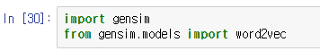
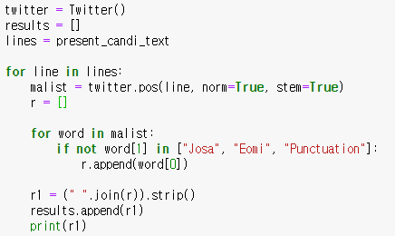
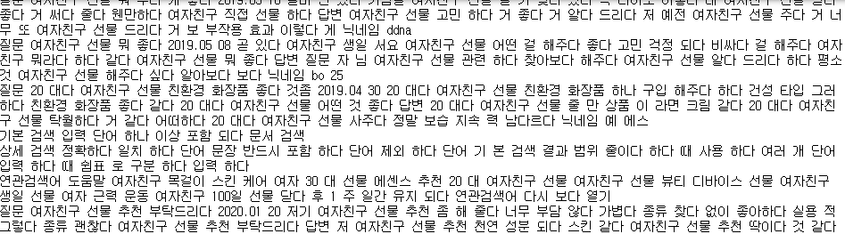
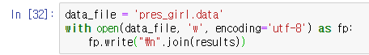
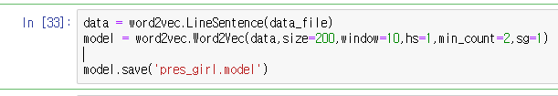
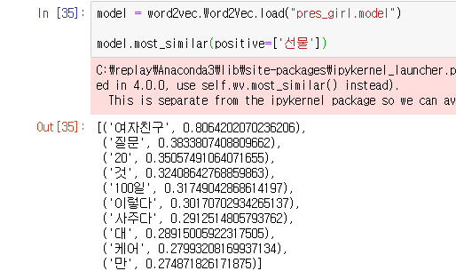
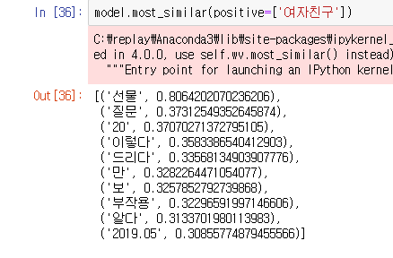
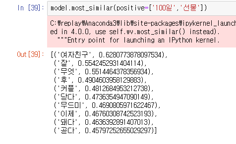
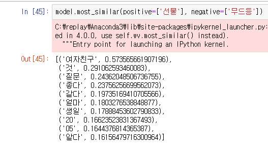

# 8-8 종합실습-선물추천_2(시각화,word2vec)

##### 선물추천_1에서 md가 길어져서 분할

### 4. 시각화

#### 4.1 등장 빈도에 따른 그래프 그리기

matplotlib의 pyplot을 이용해서 그래프를 그려준다.

#### 4.2 워드클라우드

필요한 모듈 import 해준 뒤

폰트 설정 후 

pyplot의 plt변수를 이용해서 워드클라우드를 보여준다.

##### 결과화면 : 

#### 4.3 사진 파일을 이용한 워드클라우드

##### 4.3.1 마스크 생성

덮어 씌울 마스크, 이미지를 설정하는 부분

##### 4.3.2 폰트,색깔 설정

위에서 워드클라우드를 그릴 때 사용한 설정들을 가져오고 몇가지를 추가해주었다.

##### 4.3.3 그리기

사진 파일의 형태대로 워드클라우드가 생성 되었다.

### 5.word2vec

gensim 모듈을 사용해서 word2vec을 실습해본다.

#### 5.1 필요한 모듈 import

#### 5.2 조사, 어미등을 제거 

##### 결과 화면 :

이제 조사와 어미를 제외한 단어뭉치들을 저장시킨 후, word2vec을 실행시켜보자.

#### 5.3 데이터, 모델 설정

데이터 :

모델 :

5.2에서 만들었던 결과 데이터(results)를 줄 단위 변경 및 word2vec에서 사용하기 위한 데이터,모델 형식으로 만들어준다.

### 5.4 데이터 읽기

word2vec을 이용하여 전체적인 문장의 흐름 속에서 '선물' 이라는 단어와 유사한 단어를 찾은 결과

'여자친구', '질문','100일','사주다' 등의 결과가 나왔다.

'여자친구' 라는 단어를 검색해도 선물이라는 단어와 유사하다는 결과가 나왔다.

단어 2가지를 넣어서 찾는 것도 가능하다.

#### @ 결과에 대한 고찰 :

기존 candi_text 파일은 전체 텍스트를 담고 있어서 형태소 분석이 되질 않은 상태이며, 단순히 어미, 조사만 제거를 했기 때문에 단순한 숫자나 글자 하나 같은 더미 결과값들이 존재하게 되었다.

이는 5.2에서 result를 만들 때, 조건문으로 필터링이 가능할 것 같은데... 정확히는 잘 모르겠다.

전체 결과에서 특정 단어가 안 들어간 경우의 유사성도 비교를 할 수 있는데 이 역시 결과가 영...

word2vec은 나중에 따로 공부를 더 해 봐야 할 것 같다.

