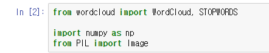

# 8. 자연어처리


## KoNLPy 사용하기

cmd 창에서

```
pip install konlpy
pip install jpype1
```


그 후 python 접속 후

```python
import nltk
nltk.download()
```

로 다운로드창 접속.


##### ALL Package -> stopwords, punkt 다운로드


그 후 워드클라우드 처리를 위한 2개의 모듈 추가 설치

```python
pip install wordcloud
pip install gensim
```


그 후 프롬프트에서 jupyter notebook으로 접속


## KoNLPy - Kkma(꼬꼬마)

##### 임포트 + sentence로 문장 분석


##### 명사, 형태소 분석


## KoNLPy - Hannanum(한나눔)


## KoNLPy - Twitter(지금은 Okt라는 이름)


#### 참고 : 


##### 반환되는 값들은 `리스트` 타입이다.


pos로 품사 추출한 값은 리스트로 가져오지만 리스트의 요소들은 튜플 형식이다.


## WordCloud

#### 1. 필요한 모듈 임포트




#### 2. 텍스트, 이미지 파일 불러오고 said라는 단어 제거하기


#### 3. matplot 한글 폰트 설정하기

```python
import matplotlib.pyplot as plt
import platform

path = "c:/Windows/Fonts/malgun.ttf"
from matplotlib import font_manager, rc
if platform.system() == "Darwin":
    rc('font', family='AppleGothic')
elif platform.system() == "Windows":
    font_name = font_manager.FontProperties(fname=path).get_name()
    rc('font', family=font_name)
else:
    print('Unknown System... sorry~~~')
    
%matplotlib inline
```


#### 4. matplot 에서 그림 열기


##### 2에서 설정한 alice_mask값을 넣어주고 사이즈, 축(axis) 옵션등을 설정한 뒤, show로 보여준다.


#### 5. 워드클라우드 적용해보기


단어 카운팅을 하면 Alice가 가장 많고 little, one know 등의 단어 순으로 언급이 많았다.


#### 6. 워드클라우드를 이미지랑 합치기

코드 :

```python
plt.figure(figsize=(12,12))
plt.imshow(wc, interpolation='bilinear')
plt.axis('off')
plt.show()
```


실행 결과 : 

