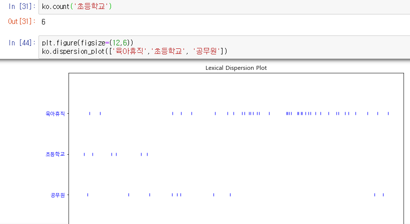

# 8. 자연어처리


## KoNLPy 사용하기

cmd 창에서

```
pip install konlpy
pip install jpype1
```


그 후 python 접속 후

```python
import nltk
nltk.download()
```

로 다운로드창 접속.


##### ALL Package -> stopwords, punkt 다운로드


그 후 워드클라우드 처리를 위한 2개의 모듈 추가 설치

```python
pip install wordcloud
pip install gensim
```


그 후 프롬프트에서 jupyter notebook으로 접속


## KoNLPy - Kkma(꼬꼬마)

##### 임포트 + sentence로 문장 분석


##### 명사, 형태소 분석


## KoNLPy - Hannanum(한나눔)


## KoNLPy - Twitter(지금은 Okt라는 이름)


#### 참고 : 


##### 반환되는 값들은 `리스트` 타입이다.


pos로 품사 추출한 값은 리스트로 가져오지만 리스트의 요소들은 튜플 형식이다.


## WordCloud

#### 1. 필요한 모듈 임포트


#### 2. 텍스트, 이미지 파일 불러오고 said라는 단어 제거하기


#### 3. matplot 한글 폰트 설정하기

```python
import matplotlib.pyplot as plt
import platform

path = "c:/Windows/Fonts/malgun.ttf"
from matplotlib import font_manager, rc
if platform.system() == "Darwin":
    rc('font', family='AppleGothic')
elif platform.system() == "Windows":
    font_name = font_manager.FontProperties(fname=path).get_name()
    rc('font', family=font_name)
else:
    print('Unknown System... sorry~~~')
    
%matplotlib inline
```


#### 4. matplot 에서 그림 열기


##### 2에서 설정한 alice_mask값을 넣어주고 사이즈, 축(axis) 옵션등을 설정한 뒤, show로 보여준다.


#### 5. 워드클라우드 적용해보기


단어 카운팅을 하면 Alice가 가장 많고 little, one know 등의 단어 순으로 언급이 많았다.


#### 6. 워드클라우드를 이미지랑 합치기

코드 :

```python
plt.figure(figsize=(12,12))
plt.imshow(wc, interpolation='bilinear')
plt.axis('off')
plt.show()
```


실행 결과 : 


## WordCloud2

#### 1. 텍스트 불러오기, 대소문자 변경, 이미지 불러오기

```python
text = open('../data/09. a_new_hope.txt').read()

text = text.replace('HAN', 'Han')
text = text.replace("LUKE`S", 'Luke')

mask = np.array(Image.open('../data/09. stormtrooper_mask.png'))
```


#### 2. 불용어 제거

```
stopwords = set(STOPWORDS)
stopwords.add("int")
stopwords.add("ext")
```


#### 3. 워드클라우드 생성

```
wc = WordCloud(max_words=1000, mask=mask, stopwords=stopwords, margin=10,
random_state=1).generate(text)

default_colors = wc.to_array()
```


#### 4. 색상 변경을 위한 함수 구현

```
import random

def grey_color_func(word, font_size, position, orientation,
                    random_state=None, **kwargs):
                    return 'hsl(0, 0%%, %d%%)' % random.randint(60,100)
```


#### 5. 워드 클라우드 출력

```
plt.figure(figsize=(12,12))
plt.imshow(wc.recolor(color_func=grey_color_func,random_state=3),
            interpolation='bilinear')
plt.axis('off')        
plt.show()
```


실행 결과 :

 


## 텍스트 전처리, 워드카운팅

#### 1. 분석을 위한 기본 모듈 설치

```python
import nltk
from wordcloud import WordCloud, STOPWORDS
```


#### 2. 맷플롭 import, 및 폰트 경로 설정

```python
import matplotlib.pyplot as plt
from matplotlib import font_manager, rc
import platform

path = "c:/Windows/Fonts/malgun.ttf"

if platform.system() == "Darwin":
    rc('font', family='AppleGothic')
elif platform.system() == "Windows":
    font_name = font_manager.FontProperties(fname=path).get_name()
    rc('font', family=font_name)
else:
    print('Unknown System... sorry~~~')
```


#### 3. KoNLPy의 내부 문서 읽기

```python
from konlpy.corpus import kobill

files_ko = kobill.fileids()
doc_ko = kobill.open('1809890.txt').read()
```


#### 4. 트위터 분석기로 명사 분석

```python
from konlpy.tag import Twitter; t = Twitter()

tokens_ko = t.nouns(doc_ko)
tokens_ko
```


#### 5. 수집된 단어의 횟수, 고유한 횟수를 확인

```python
ko = nltk.Text(tokens_ko, name='대한민국 국회 의안 제 1809890호')

print(len(ko.tokens)) #수집된 단어의 횟수
print(len(set(ko.tokens))) #고유한 횟수를 확인
ko.vocab()
```


#### 6. 맷플롭 1차 출력

```python
plt.figure(figsize=(12,6))
ko.plot(50)
plt.show()
```


#### 7. 텍스트 불용어 제거(case-by-case)

```python
stop_words = ['.', '(', ')', "'", '%', '-', 'X', ').','x','의','자','에','안','번','호','을',
'이','다','만','로','가','를']

ko = [each_word for each_word in ko if each_word not in stop_words]

ko
```


#### 8. 맷플롭 2차 출력


```python
ko = nltk.Text(ko, name='대한민국 국회 의안 제 1809890호')

plt.figure(figsize=(12,6))
ko.plot(50)
plt.show()
```


#### 9. 단어의 언급 빈도, 단어의 위치와 분량을 찾기

```python
ko.count('초등학교') # 언급 빈도

plt.figure(figsize=(12,6))
ko.dispersion_plot(['육아휴직','초등학교', '공무원']) #위치와 분량 찾기
```





#### 10.  주변부 단어 확인, 연이은 단어 확인(collocation,  추후 수정 필요 )

```python
ko.concordance('초등학교')

ko.collocations()
```


@ ko.collocations() 은 에러남, 다른 컴퓨터에서 돌려봐야할듯


#### 11. 워드 클라우드

```python
data = ko.vocab().most_common(150)

# for mac : font_path='/Library/Fonts/AplleGothic.ttf'
wordcloud = WordCloud(font_path='c:/Windows/Fonts/malgun.ttf',
                        relative_scaling = 0.2,
                        background_color='white',).generate_from_frequencies(dict(data))
plt.figure(figsize=(10,6))
plt.imshow(wordcloud)
plt.axis("off")
plt.show()
```


실행 결과 : 

