## 8.5 Naive Bayes 책 오류 

#### 책 속의 코드를 실행한 결과

##### 결과는 긍정으로 맞게 나왔지만 단어가 속해있는지 판단하는 과정[20] 전부 false처리됨.

즉 제대로 분석 처리가 안 되었음을 의미함.

## 원래 정상 결과

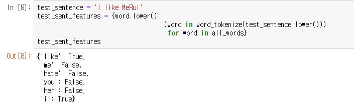

이렇게 단어장을 만들고 테스트 문장 속 단어가 그 단어장안에 속해있으면 [8]처럼 True가 나와야 정상.

## 책 코드 결과

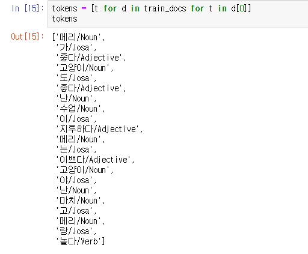

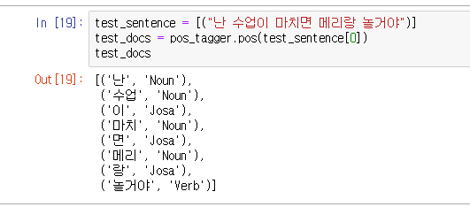

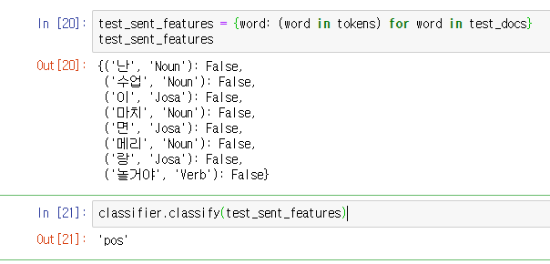

애초에 단어뭉치를 생성할때 **단어/태깅** 형태로 **tokens**에 넣어놨으면서 정작 테스트문장을 확인할 때는 

**'단어' , '태깅'** 형태로 넣어버렸다.

그래서 features는 모두 False가 떠버렸고, 결과는 pos가 나왔지만 과정이 정확하지가 않다.

결과만 맞으면 장땡이라는 식으로 책 제대로 수정 안한 느낌

## 오류 직접 수정 해보기

태깅을 해주는 함수를 테스트 문장에선 사용 안했으므로 

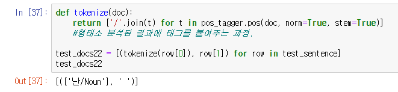

해당 def를 뜯어보자

test_sentence를 넣으면 저런 식의 결과가 나온다.

정상 결과 :

여기서 train의 형태를 확인하고 test_sentence를 train과 같은 형태로 맞춰주면 적용 가능.

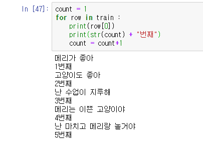

row[0]이 str 문장이라는 것을 확인함. 

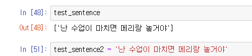

but 기존 test_sentence는 딕셔너리 형태였기 때문에, 단순 str인 sentence2를 만들어주었다.

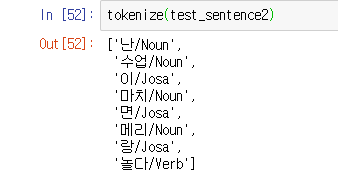

tokenize 성공

##### 이제 이 단어들이 train 데이터의 단어뭉치에 있는지 확인하면 된다

## 단어뭉치 확인 과정

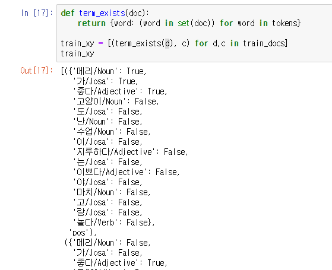

기존 책의 코드.

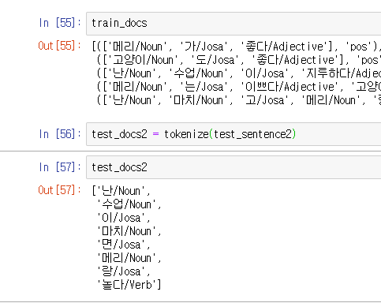

직접 만든 test_docs2와 비교해보자.

기존 train_docs는 투플의 첫번째 항목이 test_docs2와 같은 형태이다.

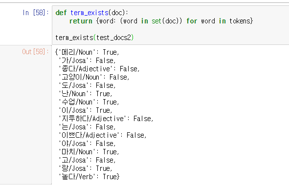

적용시 

드디어 맞게 결과가 나왔다.

감동 ㅠㅠ

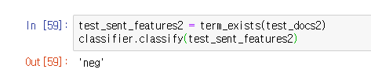

이제 위 결과를 test_sent_feature2에 저장하고 그대로 사용하면 다른 분석 결과가 나온다

"나는 수업이 마치면 메리랑 놀거야" 라는 문장이 부정이 나온건 

기다림에 대한 부정일 수 도 있고, train 데이터 상의 문제일 수도 있다.

### 다른 예시 테스트

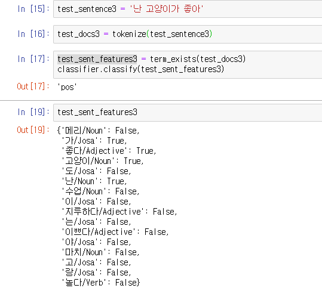

'난 고양이가 좋아' 라는 문장이 긍정으로 분석되었다.

단어뭉치에 있는지 확인하는 과정도 정상 작동

뿌듯하다...ㅎㅎ

## 정리 

### 분류기 만들기

#### 1. 학습 데이터 만들기(=train)

#### 2. 학습 데이터 형테소 분석하기 (=train_docs)

#### 3. 2를 기반으로 단어 뭉치 만들기 (=tokens)

#### 4. 3에서 만든 단어뭉치들이 2의 train_docs 형태소 분석 결과에 속해있는지 확인(train_xy)

#### 5. 1의 학습데이터(=train)와 4의 판별여부(=train_xy)를 이용해서 긍,부정 분류기 생성(=classifier)

#### @ 5까지 다 끝내야 자신이 원하는 문장을 판별할 수 있음.

### 테스트 문장 판정

#### 6. str의 문장을 하나 만들어준다. (=test_sentence2)

#### 7. 6에서 만든 문장을 형태소 분석한다. (=test_docs2, tokenize 함수 사용)

#### 8. 7에서 분석한 형태소들이 train 데이터의 단어뭉치(tokens)에 존재하는지 확인(=test_sent_feature2, term_exists함수 사용)

#### 9. 존재하는 단어들의 값으로 분석기 가동  (=classifier.classify(test_sent_features2))

