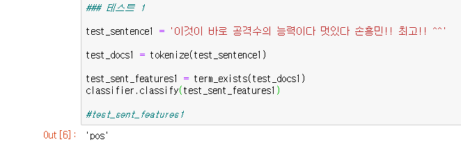

# 8장 개인프로젝트 - 네이버 댓글 긍부정 분석

## 1. 개요 및 개발 구상

베스트 댓글들을 추출하여 긍 부정을 입력시키고 전체 댓글을 웹 크롤링하여 배운 내용을 이용한 텍스트 분석을 해볼 예정.

## 2. 초기 점검

긍정에 10개의 학습데이터, 부정에 10개의 데이터를 넣어서 테스트를 해 보았다.

선플의 경우에는 이름을 함께 언급하며 칭찬하는 경우가 많았고 악플의 경우에는 이름을 명시하지 않거나 '손징징' 등과 같은 부정적인 의미를 가진 별명으로 지칭하고 있었기 때문에 

손흥민을 이름으로 부르는 경우는 대부분 긍정으로 나타났다.

그래서 긍정의 결과는 괜찮게 나오는데 부정의 경우에는 판단이 잘 되지 않았다.

이 경우에는 악플이 워낙 다양한 단어들을 사용해서 선수를 까내리는 경우가 많았기 때문에 악플의 train 데이터를 늘려서 다시 테스트를 해보기로 하였다.

## 3. 학습데이터 수 증가

부정형 덧글의 학습 데이터를 10 -> 30개로 늘리고 다시 테스트 해 보았다.

이제 어느정도 긍,부정 판단이 되는 것 같다.

## 4. 댓글 크롤링

이제 본격적으로 해당 기사의 댓글들을 대량으로 가져와서 한꺼번에 분석을 해보고자 한다.

네이버 개발자의 뉴스전용API가 없기 때문에 BeautifulSoup를 이용하여 추출을 해보자.

### @@@@@@@

네이버 뉴스의 경우 동적 페이지이기 때문에 BeautifulSoup로는 모든 댓글을 가져올 수 없었고

**selenium** 과 **크롬드라이브**를 이용하여  동적 페이지에서 댓글을 가져왔다.

참고 블로그 :

https://blog.pignu.kr/2018/03/26/naver_crawling.html

https://wikidocs.net/61223

댓글 추출 결과

추출하는데 좀 많이 애먹었다...

크롬드라이브와 크롬 버전을 맞추어주어야 하고 pip도 업그레이드 해주어야 사용 가능하다.

## 5. 크롤링한 댓글 분석

총 1933개의 댓글을 수집했다. (더보기를 100번 눌렀을 때의 댓글 갯수)

해당 리스트들을 반복문을 돌려서 긍부정 판독기에 넣은 결과

이제 긍,부정이 어느정도씩 나왔는지만 확인하면 끝난다.

## 6. 전체 긍부정 비율 계산

코드에 긍부정 카운트를 넣는 변수를 추가하였다.

전체 결과

현재 학습 데이터의 갯수는 pos 10 , neg 30인데

아마 학습 데이터의 비율을 30 : 30으로 맞추면 부정 긍정 갯수도 달라질것이라고 예상함.

하지만 크롤링 + 긍부정 판정을 완전히 구현 해봤다는 것에 의의를 두고 학습데이터를 추가하여 정밀성을 높이는 과정은 생략하겠다.