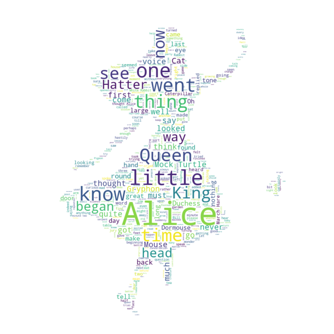

```python
from wordcloud import WordCloud, STOPWORDS

import numpy as np
from PIL import Image
```


```python
text = open('../data/09. alice.txt').read()
alice_mask = np.array(Image.open('../data/09. alice_mask.png'))

stopwords = set(STOPWORDS)
stopwords.add("said")
```


```python
import matplotlib.pyplot as plt
import platform

path = "c:/Windows/Fonts/malgun.ttf"
from matplotlib import font_manager, rc
if platform.system() == "Darwin":
    rc('font', family='AppleGothic')
elif platform.system() == "Windows":
    font_name = font_manager.FontProperties(fname=path).get_name()
    rc('font', family=font_name)
else:
    print('Unknown System... sorry~~~')
    
%matplotlib inline
```


```python
plt.figure(figsize=(8,8))
plt.imshow(alice_mask, cmap=plt.cm.gray, interpolation='bilinear')
plt.axis('off')
plt.show()
```


```python
wc = WordCloud(background_color="white", max_words=2000, mask=alice_mask, stopwords = stopwords)
wc = wc.generate(text)
wc.words_
```


    {'Alice': 1.0,
     'little': 0.2958904109589041,
     'one': 0.2602739726027397,
     'know': 0.2465753424657534,
     'went': 0.2273972602739726,
     'thing': 0.2191780821917808,
     'time': 0.21095890410958903,
     'Queen': 0.20821917808219179,
     'see': 0.18356164383561643,
     'King': 0.17534246575342466,
     'now': 0.1643835616438356,
     'began': 0.1589041095890411,
     'way': 0.15616438356164383,
     'Hatter': 0.15616438356164383,
     'head': 0.15342465753424658,
     'Mock Turtle': 0.15342465753424658,
     'say': 0.1506849315068493,
     'Gryphon': 0.1506849315068493,
     'well': 0.14794520547945206,
     'think': 0.14520547945205478,
     'quite': 0.14246575342465753,
     'much': 0.13972602739726028,
     'first': 0.13972602739726028,
     'go': 0.136986301369863,
     'thought': 0.13424657534246576,
     'come': 0.13150684931506848,
     'never': 0.12876712328767123,
     'voice': 0.12602739726027398,
     'looked': 0.1232876712328767,
     'got': 0.1232876712328767,
     'must': 0.12054794520547946,
     'Cat': 0.12054794520547946,
     'Mouse': 0.12054794520547946,
     'Duchess': 0.11506849315068493,
     'round': 0.11232876712328767,
     'back': 0.1095890410958904,
     'Dormouse': 0.1095890410958904,
     'make': 0.10410958904109589,
     'tone': 0.10136986301369863,
     'eye': 0.09863013698630137,
     'Oh': 0.0958904109589041,
     'came': 0.0958904109589041,
     'last': 0.09315068493150686,
     'nothing': 0.09315068493150686,
     'tell': 0.09315068493150686,
     'day': 0.09041095890410959,
     'large': 0.09041095890410959,
     'great': 0.09041095890410959,
     'hand': 0.09041095890410959,
     'found': 0.08767123287671233,
     'long': 0.08767123287671233,
     'door': 0.08767123287671233,
     'looking': 0.08767123287671233,
     'word': 0.08493150684931507,
     'March Hare': 0.08493150684931507,
     'made': 0.0821917808219178,
     'heard': 0.0821917808219178,
     'look': 0.07945205479452055,
     'replied': 0.07945205479452055,
     'put': 0.07671232876712329,
     'two': 0.07671232876712329,
     'Caterpillar': 0.07671232876712329,
     'seemed': 0.07397260273972603,
     'going': 0.07397260273972603,
     'right': 0.07397260273972603,
     'thought Alice': 0.07397260273972603,
     'away': 0.07123287671232877,
     'without': 0.07123287671232877,
     'moment': 0.07123287671232877,
     'course': 0.07123287671232877,
     'Rabbit': 0.0684931506849315,
     'next': 0.0684931506849315,
     'rather': 0.0684931506849315,
     'soon': 0.0684931506849315,
     'yet': 0.0684931506849315,
     'take': 0.06575342465753424,
     'sure': 0.06575342465753424,
     'sort': 0.06301369863013699,
     'felt': 0.06301369863013699,
     'added': 0.06301369863013699,
     'getting': 0.06027397260273973,
     'dear': 0.06027397260273973,
     'three': 0.06027397260273973,
     'find': 0.06027397260273973,
     'White Rabbit': 0.06027397260273973,
     'took': 0.057534246575342465,
     'upon': 0.057534246575342465,
     'wish': 0.057534246575342465,
     'question': 0.057534246575342465,
     'till': 0.057534246575342465,
     'arm': 0.057534246575342465,
     'use': 0.0547945205479452,
     'anything': 0.0547945205479452,
     'end': 0.0547945205479452,
     'good': 0.0547945205479452,
     'half': 0.0547945205479452,
     'face': 0.0547945205479452,
     'cried': 0.0547945205479452,
     'minute': 0.0547945205479452,
     'tried': 0.052054794520547946,
     'even': 0.052054794520547946,
     'house': 0.052054794520547946,
     'tea': 0.052054794520547946,
     'might': 0.052054794520547946,
     'curious': 0.052054794520547946,
     'wonder': 0.049315068493150684,
     'table': 0.049315068493150684,
     'enough': 0.049315068493150684,
     'something': 0.049315068493150684,
     'jury': 0.049315068493150684,
     'another': 0.04657534246575343,
     'Let': 0.04657534246575343,
     'spoke': 0.04657534246575343,
     'perhaps': 0.04657534246575343,
     'talking': 0.04657534246575343,
     'begin': 0.04657534246575343,
     'sat': 0.04657534246575343,
     'asked': 0.04657534246575343,
     'Bill': 0.04657534246575343,
     'ran': 0.043835616438356165,
     'air': 0.043835616438356165,
     'bit': 0.043835616438356165,
     'turned': 0.043835616438356165,
     'garden': 0.043835616438356165,
     'indeed': 0.043835616438356165,
     'hastily': 0.043835616438356165,
     'seen': 0.0410958904109589,
     'idea': 0.0410958904109589,
     'eat': 0.0410958904109589,
     'saying': 0.0410958904109589,
     'low': 0.0410958904109589,
     'side': 0.0410958904109589,
     'leave': 0.0410958904109589,
     'gave': 0.0410958904109589,
     'speak': 0.0410958904109589,
     'done': 0.0410958904109589,
     'called': 0.0410958904109589,
     'mean': 0.0410958904109589,
     'mad': 0.0410958904109589,
     'court': 0.0410958904109589,
     'may': 0.038356164383561646,
     'beginning': 0.038356164383561646,
     'hear': 0.038356164383561646,
     'feet': 0.038356164383561646,
     'saw': 0.038356164383561646,
     'please': 0.038356164383561646,
     'remember': 0.038356164383561646,
     'trying': 0.038356164383561646,
     'certainly': 0.038356164383561646,
     'game': 0.038356164383561646,
     'left': 0.038356164383561646,
     'anxiously': 0.038356164383561646,
     'everything': 0.038356164383561646,
     'knew': 0.038356164383561646,
     'sea': 0.038356164383561646,
     'suppose': 0.038356164383561646,
     'talk': 0.038356164383561646,
     'us': 0.038356164383561646,
     'Ye': 0.038356164383561646,
     'turn': 0.038356164383561646,
     'baby': 0.038356164383561646,
     'creature': 0.038356164383561646,
     'book': 0.03561643835616438,
     'suddenly': 0.03561643835616438,
     'close': 0.03561643835616438,
     'happen': 0.03561643835616438,
     'still': 0.03561643835616438,
     'seem': 0.03561643835616438,
     'people': 0.03561643835616438,
     'behind': 0.03561643835616438,
     'really': 0.03561643835616438,
     'will': 0.03561643835616438,
     'grow': 0.03561643835616438,
     'far': 0.03561643835616438,
     'kept': 0.03561643835616438,
     'used': 0.03561643835616438,
     'lesson': 0.03561643835616438,
     'always': 0.03561643835616438,
     'Dodo': 0.03561643835616438,
     'whole': 0.03561643835616438,
     'better': 0.03561643835616438,
     'room': 0.03561643835616438,
     'gone': 0.03561643835616438,
     'remark': 0.03561643835616438,
     'cook': 0.03561643835616438,
     'CHAPTER': 0.03287671232876712,
     'many': 0.03287671232876712,
     'near': 0.03287671232876712,
     'among': 0.03287671232876712,
     'name': 0.03287671232876712,
     'Dinah': 0.03287671232876712,
     'afraid': 0.03287671232876712,
     'every': 0.03287671232876712,
     'finished': 0.03287671232876712,
     'best': 0.03287671232876712,
     'hardly': 0.03287671232876712,
     'life': 0.03287671232876712,
     'queer': 0.03287671232876712,
     'try': 0.03287671232876712,
     'tail': 0.03287671232876712,
     'live': 0.03287671232876712,
     'change': 0.03287671232876712,
     'turning': 0.03287671232876712,
     'bird': 0.03287671232876712,
     'serpent': 0.03287671232876712,
     'Pigeon': 0.03287671232876712,
     'tree': 0.03287671232876712,
     'minute two': 0.03287671232876712,
     'sister': 0.030136986301369864,
     'conversation': 0.030136986301369864,
     'mind': 0.030136986301369864,
     'whether': 0.030136986301369864,
     'hurried': 0.030136986301369864,
     'though': 0.030136986301369864,
     'glad': 0.030136986301369864,
     'ask': 0.030136986301369864,
     'matter': 0.030136986301369864,
     'read': 0.030136986301369864,
     'waited': 0.030136986301369864,
     'tears': 0.030136986301369864,
     'child': 0.030136986301369864,
     'growing': 0.030136986301369864,
     'pool': 0.030136986301369864,
     'want': 0.030136986301369864,
     'thinking': 0.030136986301369864,
     'nearly': 0.030136986301369864,
     'silence': 0.030136986301369864,
     'trial': 0.030136986301369864,
     'slate': 0.030136986301369864,
     'keep': 0.030136986301369864,
     'pig': 0.030136986301369864,
     'Footman': 0.030136986301369864,
     'ear': 0.030136986301369864,
     'soldier': 0.030136986301369864,
     'poor Alice': 0.030136986301369864,
     'give': 0.0273972602739726,
     'sitting': 0.0273972602739726,
     'either': 0.0273972602739726,
     'answer': 0.0273972602739726,
     'sight': 0.0273972602739726,
     'walked': 0.0273972602739726,
     'small': 0.0273972602739726,
     'opened': 0.0273972602739726,
     'bottle': 0.0273972602739726,
     'children': 0.0273972602739726,
     'foot': 0.0273972602739726,
     'mine': 0.0273972602739726,
     'party': 0.0273972602739726,
     'explain': 0.0273972602739726,
     'rest': 0.0273972602739726,
     'reason': 0.0273972602739726,
     'place': 0.0273972602739726,
     'mouth': 0.0273972602739726,
     'repeated': 0.0273972602739726,
     'remarked': 0.0273972602739726,
     'Soup': 0.0273972602739726,
     'hedgehog': 0.0273972602739726,
     'lobster': 0.0273972602739726,
     'Oh dear': 0.0273972602739726,
     'coming': 0.024657534246575342,
     'top': 0.024657534246575342,
     'hall': 0.024657534246575342,
     'rate': 0.024657534246575342,
     'waiting': 0.024657534246575342,
     'feeling': 0.024657534246575342,
     'size': 0.024657534246575342,
     'help': 0.024657534246575342,
     'different': 0.024657534246575342,
     'sit': 0.024657534246575342,
     'old': 0.024657534246575342,
     'continued': 0.024657534246575342,
     'believe': 0.024657534246575342,
     'piece': 0.024657534246575342,
     'call': 0.024657534246575342,
     'angrily': 0.024657534246575342,
     'least': 0.024657534246575342,
     'together': 0.024657534246575342,
     'shouted': 0.024657534246575342,
     'timidly': 0.024657534246575342,
     'puzzled': 0.024657534246575342,
     'interrupted': 0.024657534246575342,
     'moral': 0.024657534246575342,
     'poor little': 0.024657534246575342,
     'might well': 0.024657534246575342,
     'join dance': 0.024657534246575342,
     'feel': 0.021917808219178082,
     'making': 0.021917808219178082,
     'watch': 0.021917808219178082,
     'slowly': 0.021917808219178082,
     'noticed': 0.021917808219178082,
     'four': 0.021917808219178082,
     'opportunity': 0.021917808219178082,
     'distance': 0.021917808219178082,
     "it'll": 0.021917808219178082,
     'sound': 0.021917808219178082,
     'dry': 0.021917808219178082,
     'bright': 0.021917808219178082,
     'fact': 0.021917808219178082,
     'tart': 0.021917808219178082,
     'followed': 0.021917808219178082,
     'lying': 0.021917808219178082,
     'set': 0.021917808219178082,
     'ready': 0.021917808219178082,
     'hard': 0.021917808219178082,
     'changed': 0.021917808219178082,
     'Five': 0.021917808219178082,
     'eagerly': 0.021917808219178082,
     'meaning': 0.021917808219178082,
     'running': 0.021917808219178082,
     'everybody': 0.021917808219178082,
     'exactly': 0.021917808219178082,
     'nobody': 0.021917808219178082,
     'direction': 0.021917808219178082,
     'window': 0.021917808219178082,
     'appeared': 0.021917808219178082,
     'wood': 0.021917808219178082,
     'mushroom': 0.021917808219178082,
     'pepper': 0.021917808219178082,
     'fish': 0.021917808219178082,
     'verse': 0.021917808219178082,
     'shoulder': 0.021917808219178082,
     'rule': 0.021917808219178082,
     'whiting': 0.021917808219178082,
     'beautiful Soup': 0.021917808219178082,
     'almost': 0.019178082191780823,
     'English': 0.019178082191780823,
     'tired': 0.019178082191780823,
     'hot': 0.019178082191780823,
     'world': 0.019178082191780823,
     'deep': 0.019178082191780823,
     'somebody': 0.019178082191780823,
     'fall': 0.019178082191780823,
     'listen': 0.019178082191780823,
     'fancy': 0.019178082191780823,
     'manage': 0.019178082191780823,
     'begun': 0.019178082191780823,
     'dream': 0.019178082191780823,
     'middle': 0.019178082191780823,
     'wondering': 0.019178082191780823,
     'glass': 0.019178082191780823,
     'open': 0.019178082191780823,
     'high': 0.019178082191780823,
     'larger': 0.019178082191780823,
     'poor': 0.019178082191780823,
     'happened': 0.019178082191780823,
     'neck': 0.019178082191780823,
     'drink': 0.019178082191780823,
     'hold': 0.019178082191780823,
     'generally': 0.019178082191780823,
     'surprised': 0.019178082191780823,
     'kind': 0.019178082191780823,
     'nonsense': 0.019178082191780823,
     'fan': 0.019178082191780823,
     'hair': 0.019178082191780823,
     'goes': 0.019178082191780823,
     'repeat': 0.019178082191780823,
     'grin': 0.019178082191780823,
     'learn': 0.019178082191780823,
     'frightened': 0.019178082191780823,
     'chin': 0.019178082191780823,
     'history': 0.019178082191780823,
     'fetch': 0.019178082191780823,
     'Lory': 0.019178082191780823,
     'important': 0.019178082191780823,
     'others': 0.019178082191780823,
     'chimney': 0.019178082191780823,
     'grown': 0.019178082191780823,
     'business': 0.019178082191780823,
     'puppy': 0.019178082191780823,
     'paw': 0.019178082191780823,
     'nose': 0.019178082191780823,
     'silent': 0.019178082191780823,
     'pleased': 0.019178082191780823,
     'song': 0.019178082191780823,
     'treacle': 0.019178082191780823,
     'Heart': 0.019178082191780823,
     'good deal': 0.019178082191780823,
     'Soo oop': 0.019178082191780823,
     'Adventures': 0.01643835616438356,
     'stupid': 0.01643835616438356,
     'trouble': 0.01643835616438356,
     'late': 0.01643835616438356,
     'fell': 0.01643835616438356,
     'nice': 0.01643835616438356,
     'written': 0.01643835616438356,
     'jumped': 0.01643835616438356,
     'roof': 0.01643835616438356,
     'along': 0.01643835616438356,
     'forgotten': 0.01643835616438356,
     'ten': 0.01643835616438356,
     'box': 0.01643835616438356,
     'cake': 0.01643835616438356,
     'care': 0.01643835616438356,
     'pair': 0.01643835616438356,
     'stop': 0.01643835616438356,
     'sir': 0.01643835616438356,
     'Seven': 0.01643835616438356,
     'stay': 0.01643835616438356,
     'understand': 0.01643835616438356,
     'sentence': 0.01643835616438356,
     'animal': 0.01643835616438356,
     'dog': 0.01643835616438356,
     'politely': 0.01643835616438356,
     'melancholy': 0.01643835616438356,
     'liked': 0.01643835616438356,
     'hour': 0.01643835616438356,
     'chorus': 0.01643835616438356,
     'prize': 0.01643835616438356,
     'executed': 0.01643835616438356,
     'full': 0.01643835616438356,
     'write': 0.01643835616438356,
     'shriek': 0.01643835616438356,
     'loud': 0.01643835616438356,
     'sharp': 0.01643835616438356,
     'Lizard': 0.01643835616438356,
     'stand': 0.01643835616438356,
     'sleep': 0.01643835616438356,
     'egg': 0.01643835616438356,
     'sneezing': 0.01643835616438356,
     'told': 0.01643835616438356,
     'dreadfully': 0.01643835616438356,
     'sing': 0.01643835616438356,
     'exclaimed': 0.01643835616438356,
     'Knave': 0.01643835616438356,
     'procession': 0.01643835616438356,
     'Majesty': 0.01643835616438356,
     'executioner': 0.01643835616438356,
     'school': 0.01643835616438356,
     'Adventures Wonderland': 0.01643835616438356,
     'little girl': 0.01643835616438356,
     'one side': 0.01643835616438356,
     'golden key': 0.01643835616438356,
     'set work': 0.01643835616438356,
     'great hurry': 0.01643835616438356,
     'beg pardon': 0.01643835616438356,
     'Cheshire Cat': 0.01643835616438356,
     'bread butter': 0.01643835616438356,
     'three gardeners': 0.01643835616438356,
     'please Majesty': 0.01643835616438356,
     'Will will': 0.01643835616438356,
     'guinea pig': 0.01643835616438356,
     'eBook': 0.0136986301369863,
     'twice': 0.0136986301369863,
     'sleepy': 0.0136986301369863,
     'pocket': 0.0136986301369863,
     'across': 0.0136986301369863,
     'curiosity': 0.0136986301369863,
     'passed': 0.0136986301369863,
     'home': 0.0136986301369863,
     'likely': 0.0136986301369863,
     'aloud': 0.0136986301369863,
     'walk': 0.0136986301369863,
     'new': 0.0136986301369863,
     'asking': 0.0136986301369863,
     'night': 0.0136986301369863,
     'sometimes': 0.0136986301369863,
     'walking': 0.0136986301369863,
     'corner': 0.0136986301369863,
     'sadly': 0.0136986301369863,
     'shut': 0.0136986301369863,
     'hurry': 0.0136986301369863,
     'simple': 0.0136986301369863,
     'cut': 0.0136986301369863,
     'nervous': 0.0136986301369863,
     'altogether': 0.0136986301369863,
     'remembered': 0.0136986301369863,
     'person': 0.0136986301369863,
     'deal': 0.0136986301369863,
     'nine': 0.0136986301369863,
     'dropped': 0.0136986301369863,
     'usual': 0.0136986301369863,
     'morning': 0.0136986301369863,
     'Ah': 0.0136986301369863,
     'wrong': 0.0136986301369863,
     'sounded': 0.0136986301369863,
     'strange': 0.0136986301369863,
     'sudden': 0.0136986301369863,
     'case': 0.0136986301369863,
     'number': 0.0136986301369863,
     'swam': 0.0136986301369863,
     'nearer': 0.0136986301369863,
     'speaking': 0.0136986301369863,
     'shrill': 0.0136986301369863,
     'angry': 0.0136986301369863,
     'offended': 0.0136986301369863,
     'crowded': 0.0136986301369863,
     'tale': 0.0136986301369863,
     'argument': 0.0136986301369863,
     'notice': 0.0136986301369863,
     'dare': 0.0136986301369863,
     'confusion': 0.0136986301369863,
     'reply': 0.0136986301369863,
     'story': 0.0136986301369863,
     'shook': 0.0136986301369863,
     'impatiently': 0.0136986301369863,
     'sighed': 0.0136986301369863,
     'temper': 0.0136986301369863,
     'moved': 0.0136986301369863,
     'swim': 0.0136986301369863,
     'interesting': 0.0136986301369863,
     'become': 0.0136986301369863,
     'taking': 0.0136986301369863,
     'drew': 0.0136986301369863,
     'sky': 0.0136986301369863,
     'instantly': 0.0136986301369863,
     'surprise': 0.0136986301369863,
     'stick': 0.0136986301369863,
     'height': 0.0136986301369863,
     'quietly': 0.0136986301369863,
     'present': 0.0136986301369863,
     'man': 0.0136986301369863,
     'often': 0.0136986301369863,
     'follow': 0.0136986301369863,
     'draw': 0.0136986301369863,
     'sob': 0.0136986301369863,
     'ground': 0.0136986301369863,
     'meant': 0.0136986301369863,
     'waving': 0.0136986301369863,
     'asleep': 0.0136986301369863,
     'knee': 0.0136986301369863,
     'whispered': 0.0136986301369863,
     'execution': 0.0136986301369863,
     'flamingo': 0.0136986301369863,
     'friend': 0.0136986301369863,
     'Turtle': 0.0136986301369863,
     'Tis': 0.0136986301369863,
     'picture': 0.0136986301369863,
     'juror': 0.0136986301369863,
     'witness': 0.0136986301369863,
     'teacup': 0.0136986301369863,
     'unimportant': 0.0136986301369863,
     'mile': 0.0136986301369863,
     'another moment': 0.0136986301369863,
     'came upon': 0.0136986301369863,
     'little golden': 0.0136986301369863,
     'right size': 0.0136986301369863,
     'feet high': 0.0136986301369863,
     'white kid': 0.0136986301369863,
     'kid gloves': 0.0136986301369863,
     'trembling voice': 0.0136986301369863,
     'offended tone': 0.0136986301369863,
     'play croquet': 0.0136986301369863,
     'Twinkle twinkle': 0.0136986301369863,
     'evening Beautiful': 0.0136986301369863,
     'next witness': 0.0136986301369863,
     'March': 0.010958904109589041,
     'bank': 0.010958904109589041,
     'worth': 0.010958904109589041,
     'natural': 0.010958904109589041,
     'fear': 0.010958904109589041,
     'managed': 0.010958904109589041,
     'true': 0.010958904109589041,
     'fallen': 0.010958904109589041,
     'earth': 0.010958904109589041,
     'several': 0.010958904109589041,
     'Miss': 0.010958904109589041,
     'catch': 0.010958904109589041,
     'passage': 0.010958904109589041,
     'except': 0.010958904109589041,
     'tiny': 0.010958904109589041,
     'alas': 0.010958904109589041,
     'second': 0.010958904109589041,
     'led': 0.010958904109589041,
     'telescope': 0.010958904109589041,
     'paper': 0.010958904109589041,
     'taught': 0.010958904109589041,
     'deeply': 0.010958904109589041,
     'ventured': 0.010958904109589041,
     'reach': 0.010958904109589041,
     'sharply': 0.010958904109589041,
     'severely': 0.010958904109589041,
     'fond': 0.010958904109589041,
     'shoes': 0.010958904109589041,
     'savage': 0.010958904109589041,
     'violently': 0.010958904109589041,
     'age': 0.010958904109589041,
     'Mabel': 0.010958904109589041,
     'besides': 0.010958904109589041,
     'puzzling': 0.010958904109589041,
     'twelve': 0.010958904109589041,
     'capital': 0.010958904109589041,
     'alone': 0.010958904109589041,
     'escape': 0.010958904109589041,
     'water': 0.010958904109589041,
     'digging': 0.010958904109589041,
     'French': 0.010958904109589041,
     'William': 0.010958904109589041,
     'fire': 0.010958904109589041,
     'pale': 0.010958904109589041,
     'shore': 0.010958904109589041,
     'Duck': 0.010958904109589041,
     'uncomfortable': 0.010958904109589041,
     'wanted': 0.010958904109589041,
     'frowning': 0.010958904109589041,
     'solemnly': 0.010958904109589041,
     'pointing': 0.010958904109589041,
     'confused': 0.010958904109589041,
     'short': 0.010958904109589041,
     'bowed': 0.010958904109589041,
     'noise': 0.010958904109589041,
     'whisper': 0.010958904109589041,
     'judge': 0.010958904109589041,
     'breath': 0.010958904109589041,
     'particular': 0.010958904109589041,
     'vanished': 0.010958904109589041,
     'run': 0.010958904109589041,
     'stood': 0.010958904109589041,
     'elbow': 0.010958904109589041,
     'chance': 0.010958904109589041,
     'answered': 0.010958904109589041,
     'outside': 0.010958904109589041,
     'hearing': 0.010958904109589041,
     'master': 0.010958904109589041,
     'Thank': 0.010958904109589041,
     'doubt': 0.010958904109589041,
     'lay': 0.010958904109589041,
     'crowd': 0.010958904109589041,
     'held': 0.010958904109589041,
     'plan': 0.010958904109589041,
     'difficulty': 0.010958904109589041,
     'grass': 0.010958904109589041,
     'perfectly': 0.010958904109589041,
     'none': 0.010958904109589041,
     'stuff': 0.010958904109589041,
     'decidedly': 0.010958904109589041,
     'thoughtfully': 0.010958904109589041,
     'green': 0.010958904109589041,
     'screamed': 0.010958904109589041,
     'indignantly': 0.010958904109589041,
     'taken': 0.010958904109589041,
     'letter': 0.010958904109589041,
     'dish': 0.010958904109589041,
     'kitchen': 0.010958904109589041,
     'sneeze': 0.010958904109589041,
     'jumping': 0.010958904109589041,
     'carried': 0.010958904109589041,
     'growl': 0.010958904109589041,
     'busily': 0.010958904109589041,
     'beat': 0.010958904109589041,
     'grunted': 0.010958904109589041,
     'less': 0.010958904109589041,
     'writing': 0.010958904109589041,
     'crumbs': 0.010958904109589041,
     'twinkling': 0.010958904109589041,
     'sigh': 0.010958904109589041,
     'bottom': 0.010958904109589041,
     'flower': 0.010958904109589041,
     'rose': 0.010958904109589041,
     'arches': 0.010958904109589041,
     'players': 0.010958904109589041,
     'week': 0.010958904109589041,
     'figure': 0.010958904109589041,
     'porpoise': 0.010958904109589041,
     'evidence': 0.010958904109589041,
     'suppressed': 0.010958904109589041,
     'jurymen': 0.010958904109589041,
     'fit': 0.010958904109589041,
     'Lewis Carroll': 0.010958904109589041,
     'Project Gutenberg': 0.010958904109589041,
     'rabbit hole': 0.010958904109589041,
     'eat bat': 0.010958904109589041,
     'inches high': 0.010958904109589041,
     'change subject': 0.010958904109589041,
     'one finger': 0.010958904109589041,
     'shook head': 0.010958904109589041,
     'Mary Ann': 0.010958904109589041,
     'yer honour': 0.010958904109589041,
     'old fellow': 0.010958904109589041,
     'hookah mouth': 0.010958904109589041,
     'FATHER WILLIAM': 0.010958904109589041,
     'Wow wow': 0.010958904109589041,
     'Lobster Quadrille': 0.010958904109589041,
     'dance Will': 0.010958904109589041,
     'will join': 0.010958904109589041,
     'Beau ootiful': 0.010958904109589041,
     'ootiful Soo': 0.010958904109589041,
     'jury box': 0.010958904109589041,
     'Date': 0.00821917808219178,
     'peeped': 0.00821917808219178,
     'reading': 0.00821917808219178,
     'considering': 0.00821917808219178,
     'White': 0.00821917808219178,
     'hedge': 0.00821917808219178,
     'dark': 0.00821917808219178,
     'filled': 0.00821917808219178,
     'past': 0.00821917808219178,
     'stairs': 0.00821917808219178,
     'somewhere': 0.00821917808219178,
     'knowledge': 0.00821917808219178,
     'grand': 0.00821917808219178,
     'funny': 0.00821917808219178,
     'listening': 0.00821917808219178,
     'hope': 0.00821917808219178,
     'bat': 0.00821917808219178,
     'hurt': 0.00821917808219178,
     'lost': 0.00821917808219178,
     'whiskers': 0.00821917808219178,
     'longer': 0.00821917808219178,
     'hanging': 0.00821917808219178,
     'key': 0.00821917808219178,
     'belong': 0.00821917808219178,
     'lock': 0.00821917808219178,
     'delight': 0.00821917808219178,
     'impossible': 0.00821917808219178,
     'marked': 0.00821917808219178,
     'red': 0.00821917808219178,
     'knife': 0.00821917808219178,
     'certain': 0.00821917808219178,
     'taste': 0.00821917808219178,
     'finding': 0.00821917808219178,
     'apple': 0.00821917808219178,
     'candle': 0.00821917808219178,
     'decided': 0.00821917808219178,
     'possibly': 0.00821917808219178,
     'legs': 0.00821917808219178,
     'bring': 0.00821917808219178,
     'smaller': 0.00821917808219178,
     'holding': 0.00821917808219178,
     'remained': 0.00821917808219178,
     'expecting': 0.00821917808219178,
     'dull': 0.00821917808219178,
     'work': 0.00821917808219178,
     'opening': 0.00821917808219178,
     'love': 0.00821917808219178,
     'cry': 0.00821917808219178,
     'pattering': 0.00821917808219178,
     'gloves': 0.00821917808219178,
     'muttering': 0.00821917808219178,
     'timid': 0.00821917808219178,
     'yesterday': 0.00821917808219178,
     'twenty': 0.00821917808219178,
     'doth': 0.00821917808219178,
     'crossed': 0.00821917808219178,
     'hoarse': 0.00821917808219178,
     'spread': 0.00821917808219178,
     'gently': 0.00821917808219178,
     'play': 0.00821917808219178,
     'putting': 0.00821917808219178,
     'guess': 0.00821917808219178,
     'cause': 0.00821917808219178,
     'worse': 0.00821917808219178,
     'slipped': 0.00821917808219178,
     'general': 0.00821917808219178,
     'notion': 0.00821917808219178,
     'show': 0.00821917808219178,
     'nurse': 0.00821917808219178,
     'subject': 0.00821917808219178,
     'throw': 0.00821917808219178,
     'passion': 0.00821917808219178,
     'Eaglet': 0.00821917808219178,
     'race': 0.00821917808219178,
     'fur': 0.00821917808219178,
     'sulky': 0.00821917808219178,
     'allow': 0.00821917808219178,
     'frog': 0.00821917808219178,
     'crown': 0.00821917808219178,
     'move': 0.00821917808219178,
     'pressed': 0.00821917808219178,
     'handed': 0.00821917808219178,
     'gravely': 0.00821917808219178,
     'thimble': 0.00821917808219178,
     'speech': 0.00821917808219178,
     'cheered': 0.00821917808219178,
     'grave': 0.00821917808219178,
     'simply': 0.00821917808219178,
     'solemn': 0.00821917808219178,
     'choked': 0.00821917808219178,
     'sad': 0.00821917808219178,
     'sighing': 0.00821917808219178,
     'Fury': 0.00821917808219178,
     'met': 0.00821917808219178,
     'attending': 0.00821917808219178,
     'pleaded': 0.00821917808219178,
     'easily': 0.00821917808219178,
     'joined': 0.00821917808219178,
     'pity': 0.00821917808219178,
     'Crab': 0.00821917808219178,
     'venture': 0.00821917808219178,
     'carefully': 0.00821917808219178,
     'suit': 0.00821917808219178,
     'bed': 0.00821917808219178,
     'mentioned': 0.00821917808219178,
     'guessed': 0.00821917808219178,
     'hunting': 0.00821917808219178,
     'mistake': 0.00821917808219178,
     'plate': 0.00821917808219178,
     'knocking': 0.00821917808219178,
     'real': 0.00821917808219178,
     'broken': 0.00821917808219178,
     'floor': 0.00821917808219178,
     'effect': 0.00821917808219178,
     'whatever': 0.00821917808219178,
     'ordered': 0.00821917808219178,
     'stopped': 0.00821917808219178,
     'crash': 0.00821917808219178,
     'Pat': 0.00821917808219178,
     'em': 0.00821917808219178,
     'kick': 0.00821917808219178,
     'sense': 0.00821917808219178,
     'moving': 0.00821917808219178,
     'hungry': 0.00821917808219178,
     'picked': 0.00821917808219178,
     'edge': 0.00821917808219178,
     'immediately': 0.00821917808219178,
     'folded': 0.00821917808219178,
     'confusing': 0.00821917808219178,
     'brought': 0.00821917808219178,
     'youth': 0.00821917808219178,
     'Pray': 0.00821917808219178,
     'jaw': 0.00821917808219178,
     'eel': 0.00821917808219178,
     'blow': 0.00821917808219178,
     'free': 0.00821917808219178,
     'shaking': 0.00821917808219178,
     'succeeded': 0.00821917808219178,
     'tasted': 0.00821917808219178,
     'settled': 0.00821917808219178,
     'nibbling': 0.00821917808219178,
     'bringing': 0.00821917808219178,
     'considered': 0.00821917808219178,
     'loudly': 0.00821917808219178,
     'order': 0.00821917808219178,
     'staring': 0.00821917808219178,
     'howling': 0.00821917808219178,
     'instance': 0.00821917808219178,
     'repeating': 0.00821917808219178,
     'nursing': 0.00821917808219178,
     'courage': 0.00821917808219178,
     'grinned': 0.00821917808219178,
     'faster': 0.00821917808219178,
     'advantage': 0.00821917808219178,
     'line': 0.00821917808219178,
     'boy': 0.00821917808219178,
     'tossing': 0.00821917808219178,
     'caught': 0.00821917808219178,
     'shaped': 0.00821917808219178,
     'proper': 0.00821917808219178,
     'sobbing': 0.00821917808219178,
     'explanation': 0.00821917808219178,
     'instead': 0.00821917808219178,
     'civil': 0.00821917808219178,
     'fun': 0.00821917808219178,
     'breathe': 0.00821917808219178,
     'butter': 0.00821917808219178,
     "o'clock": 0.00821917808219178,
     'year': 0.00821917808219178,
     'riddle': 0.00821917808219178,
     'cautiously': 0.00821917808219178,
     'fly': 0.00821917808219178,
     'lived': 0.00821917808219178,
     'upset': 0.00821917808219178,
     'manner': 0.00821917808219178,
     'muchness': 0.00821917808219178,
     'beheaded': 0.00821917808219178,
     'watching': 0.00821917808219178,
     'checked': 0.00821917808219178,
     'eager': 0.00821917808219178,
     'guests': 0.00821917808219178,
     "needn't": 0.00821917808219178,
     'unfortunate': 0.00821917808219178,
     'Hush': 0.00821917808219178,
     'tucked': 0.00821917808219178,
     'alive': 0.00821917808219178,
     'anxious': 0.00821917808219178,
     'mustard': 0.00821917808219178,
     'sorrow': 0.00821917808219178,
     'Tortoise': 0.00821917808219178,
     'Drawling': 0.00821917808219178,
     'advance': 0.00821917808219178,
     'toes': 0.00821917808219178,
     'mark': 0.00821917808219178,
     'snail': 0.00821917808219178,
     'obliged': 0.00821917808219178,
     'part': 0.00821917808219178,
     'around': 0.00821917808219178,
     'Owl': 0.00821917808219178,
     'Panther': 0.00821917808219178,
     'pie': 0.00821917808219178,
     'pencil': 0.00821917808219178,
     'wrote': 0.00821917808219178,
     'prove': 0.00821917808219178,
     'Wonderland Lewis': 0.00821917808219178,
     'half hoping': 0.00821917808219178,
     'marked poison': 0.00821917808219178,
     'fan gloves': 0.00821917808219178,
     'Caucus race': 0.00821917808219178,
     'finish story': 0.00821917808219178,
     'Hold tongue': 0.00821917808219178,
     'stood near': 0.00821917808219178,
     'quite forgetting': 0.00821917808219178,
     'broken glass': 0.00821917808219178,
     'dead silence': 0.00821917808219178,
     'took hookah': 0.00821917808219178,
     'OLD FATHER': 0.00821917808219178,
     'old youth': 0.00821917808219178,
     'footman livery': 0.00821917808219178,
     'fast asleep': 0.00821917808219178,
     'young lady': 0.00821917808219178,
     'croquet ground': 0.00821917808219178,
     'rose tree': 0.00821917808219178,
     'Knave Hearts': 0.00821917808219178,
     'pack cards': 0.00821917808219178,
     'BOOTS SHOES': 0.00821917808219178,
     'oop evening': 0.00821917808219178,
     'put spectacles': 0.00821917808219178,
     'Consider verdict': 0.00821917808219178,
     'Give evidence': 0.00821917808219178,
     'officers court': 0.00821917808219178,
     'Gutenberg': 0.005479452054794521,
     'anywhere': 0.005479452054794521,
     'cost': 0.005479452054794521,
     'terms': 0.005479452054794521,
     'pleasure': 0.005479452054794521,
     'chain': 0.005479452054794521,
     'picking': 0.005479452054794521,
     'remarkable': 0.005479452054794521,
     'afterwards': 0.005479452054794521,
     'occurred': 0.005479452054794521,
     'started': 0.005479452054794521,
     'straight': 0.005479452054794521,
     'dipped': 0.005479452054794521,
     'falling': 0.005479452054794521,
     'plenty': 0.005479452054794521,
     'cupboards': 0.005479452054794521,
     'shelves': 0.005479452054794521,
     'jar': 0.005479452054794521,
     'tumbling': 0.005479452054794521,
     'thousand': 0.005479452054794521,
     'learnt': 0.005479452054794521,
     'showing': 0.005479452054794521,
     'Presently': 0.005479452054794521,
     'downward': 0.005479452054794521,
     "Dinah'll": 0.005479452054794521,
     'milk': 0.005479452054794521,
     'mice': 0.005479452054794521,
     'earnestly': 0.005479452054794521,
     'thump': 0.005479452054794521,
     'wind': 0.005479452054794521,
     'row': 0.005479452054794521,
     'legged': 0.005479452054794521,
     'inches': 0.005479452054794521,
     'rat': 0.005479452054794521,
     'longed': 0.005479452054794521,
     'shutting': 0.005479452054794521,
     'label': 0.005479452054794521,
     'wise': 0.005479452054794521,
     'unpleasant': 0.005479452054794521,
     'burn': 0.005479452054794521,
     'usually': 0.005479452054794521,
     'sooner': 0.005479452054794521,
     'mixed': 0.005479452054794521,
     'brightened': 0.005479452054794521,
     'lovely': 0.005479452054794521,
     'crying': 0.005479452054794521,
     'advice': 0.005479452054794521,
     'playing': 0.005479452054794521,
     'Curiouser': 0.005479452054794521,
     'forgot': 0.005479452054794521,
     'bye': 0.005479452054794521,
     '_I_': 0.005479452054794521,
     'sending': 0.005479452054794521,
     'struck': 0.005479452054794521,
     'ashamed': 0.005479452054794521,
     'trotting': 0.005479452054794521,
     'ringlets': 0.005479452054794521,
     'six': 0.005479452054794521,
     'Paris': 0.005479452054794521,
     'Rome': 0.005479452054794521,
     'lap': 0.005479452054794521,
     'neatly': 0.005479452054794521,
     'claws': 0.005479452054794521,
     'smiling': 0.005479452054794521,
     'shrinking': 0.005479452054794521,
     'narrow': 0.005479452054794521,
     'declare': 0.005479452054794521,
     'bad': 0.005479452054794521,
     'railway': 0.005479452054794521,
     'conclusion': 0.005479452054794521,
     'wherever': 0.005479452054794521,
     'sand': 0.005479452054794521,
     'splashing': 0.005479452054794521,
     'swimming': 0.005479452054794521,
     'wink': 0.005479452054794521,
     'Conqueror': 0.005479452054794521,
     'clear': 0.005479452054794521,
     'ago': 0.005479452054794521,
     'ma': 0.005479452054794521,
     'fright': 0.005479452054794521,
     'beg': 0.005479452054794521,
     'quiet': 0.005479452054794521,
     'purring': 0.005479452054794521,
     'nicely': 0.005479452054794521,
     'brown': 0.005479452054794521,
     'dinner': 0.005479452054794521,
     'useful': 0.005479452054794521,
     'sorrowful': 0.005479452054794521,
     'hate': 0.005479452054794521,
     'assembled': 0.005479452054794521,
     'wet': 0.005479452054794521,
     'older': 0.005479452054794521,
     ...}


```python
plt.figure(figsize=(12,12))
plt.imshow(wc, interpolation='bilinear')
plt.axis('off')
plt.show()
```





```python

```
