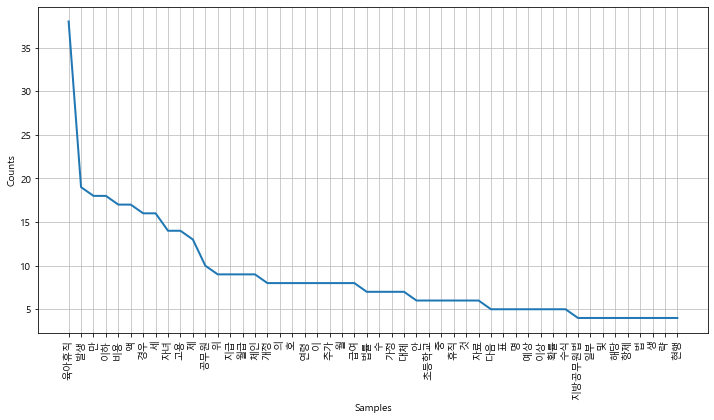
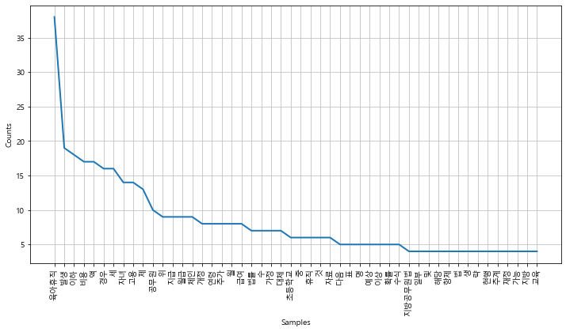
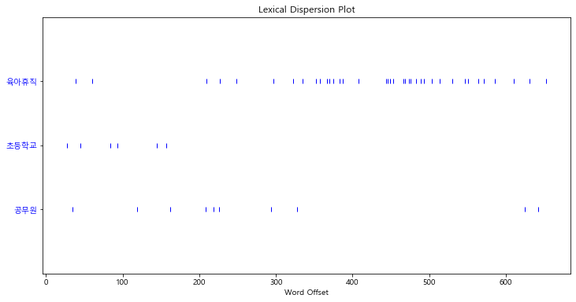
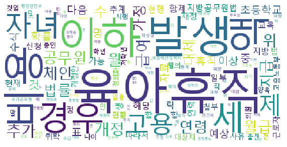

```python
import nltk
from wordcloud import WordCloud, STOPWORDS
```


```python
import matplotlib.pyplot as plt
from matplotlib import font_manager, rc
import platform

path = "c:/Windows/Fonts/malgun.ttf"

if platform.system() == "Darwin":
    rc('font', family='AppleGothic')
elif platform.system() == "Windows":
    font_name = font_manager.FontProperties(fname=path).get_name()
    rc('font', family=font_name)
else:
    print('Unknown System... sorry~~~')
```


```python
from konlpy.corpus import kobill

files_ko = kobill.fileids()
doc_ko = kobill.open('1809890.txt').read()
```


```python
doc_ko
```


    '지방공무원법 일부개정법률안\n\n(정의화의원 대표발의 )\n\n 의 안\n 번 호\n\n9890\n\n발의연월일 : 2010.  11.  12.  \n\n발  의  자 : 정의화․이명수․김을동 \n\n이사철․여상규․안규백\n\n황영철․박영아․김정훈\n\n김학송 의원(10인)\n\n제안이유 및 주요내용\n\n  초등학교 저학년의 경우에도 부모의 따뜻한 사랑과 보살핌이 필요\n\n한 나이이나, 현재 공무원이 자녀를 양육하기 위하여 육아휴직을 할 \n\n수 있는 자녀의 나이는 만 6세 이하로 되어 있어 초등학교 저학년인 \n\n자녀를 돌보기 위해서는 해당 부모님은 일자리를 그만 두어야 하고 \n\n이는 곧 출산의욕을 저하시키는 문제로 이어질 수 있을 것임.\n\n  따라서 육아휴직이 가능한 자녀의 연령을 만 8세 이하로 개정하려\n\n는 것임(안 제63조제2항제4호).\n\n- 1 -\n\n\x0c법률  제        호\n\n지방공무원법 일부개정법률안\n\n지방공무원법 일부를 다음과 같이 개정한다.\n\n제63조제2항제4호 중 “만 6세 이하의 초등학교 취학 전 자녀를”을 “만 \n\n8세 이하(취학 중인 경우에는 초등학교 2학년 이하를 말한다)의 자녀를”\n\n로 한다.\n\n부      칙\n\n이 법은 공포한 날부터 시행한다.\n\n- 3 -\n\n\x0c신 ·구조문대비표\n\n현      행\n\n개   정   안\n\n제63조(휴직) ① (생  략)\n\n제63조(휴직) ① (현행과 같음)\n\n  ② 공무원이 다음 각 호의 어\n\n  ② -------------------------\n\n느 하나에 해당하는 사유로 휴\n\n----------------------------\n\n직을 원하면 임용권자는 휴직\n\n----------------------------\n\n을 명할 수 있다. 다만, 제4호\n\n-------------.---------------\n\n의 경우에는 대통령령으로 정\n\n----------------------------\n\n하는 특별한 사정이 없으면 휴\n\n----------------------------\n\n직을 명하여야 한다.\n\n--------------.\n\n  1. ∼ 3. (생  략)\n\n  1. ∼ 3. (현행과 같음)\n\n  4. 만 6세 이하의 초등학교 취\n\n  4. 만 8세 이하(취학 중인 경우\n\n학 전 자녀를 양육하기 위하\n\n에는 초등학교 2학년 이하를 \n\n여 필요하거나 여자공무원이 \n\n말한다)의 자녀를 ----------\n\n임신 또는 출산하게 되었을 \n\n---------------------------\n\n때\n\n---------------------------\n\n  5.⋅6. (생  략)\n\n  ③⋅④ (생  략)\n\n--------\n\n  5.⋅6. (현행과 같음)\n\n  ③⋅④ (현행과 같음)\n\n- 5 -\n\n\x0c지방공무원법 일부개정법률안 등 비용추계서 미첨부사유서\n1.  재정수반요인\n\n개정안에서 ｢국가공무원법｣  제71조제2항제4호 중 국가공무원의 육아\n\n휴직 가능 자녀의 연령을 만6세 이하에서 만8세 이하로 하고, ｢지방공\n\n무원법｣ 제63조제2항제4호 중 지방공무원의 육아휴직 가능 자녀의 연\n\n령을 만6세 이하에서 만8세 이하로 하고, ｢교육공무원법｣ 제44조제1항\n\n제7조 중 교육공무원의 육아휴직 가능 자녀의 연령을 만6세 이하에서 \n\n만8세 이하로 하고, ｢남녀고용평등과 일․가정 양립지원에 관한 법률｣ \n\n제19조제1항 중 근로자 육아휴직 가능 자녀연령을 만6세 이하에서 만\n\n8세 이하로 조정함에 따라 추가 재정소요가 예상됨.\n\n2.  미첨부  근거  규정\n｢의안의 비용추계에 관한 규칙｣ 제3조제1항 단서 중 제1호(예상되는 비용이 연평균  10억원 미만\n이거나  한시적인  경비로서  총  30억원  미만인  경우)에  해당함.\n\n3.  미첨부  사유\n\n개정안에서 국가․지방․교육공무원 및 근로자가 육아휴직을 신청할 \n\n수 있는 자녀의 연령을 만6세 이하에서 만8세 이하로 상향조정함에 \n\n따라 추가 재정소요가 예상된다. 동 법률 개정안이 2011년에 시행된다\n\n고 가정한 경우, 2010년 현재 자녀의 연령이 7세이고 육아휴직을 신청\n\n- 7 -\n\n\x0c- 8 -\n\n하지 않은 국가․지방․교육공무원 및 근로자가 대상이 된다.\n\n대상연령의 확대됨에 따라 육아휴직신청자의 수가 어느 정도 늘어날 \n\n것으로 예상된다. 이 경우 발생하는 비용은 현행법에 따르면 월50만원\n\n이나 현재 관련법령 개정이 추진되고 있으며, 이에 따라 2011년에는 \n\n육아휴직자가 지급받는 월급여액에 비례하여 육아휴직급여가 지급되\n\n기 때문에 법령개정을 가정하고 추계한다. 이러한 경우 육아휴직급여\n\n액은 육아휴직자가 지급받는 월급여의 40%에 해당한다. 육아휴직자가 \n\n발생한 경우 발생하는 비용은 대체인력 고용인건비와 육아휴직자가 \n\n받는 월급여액의 40%이다. 이와 대비하여 육아휴직자에게 지급하던 \n\n임금은 더 이상 발생하지 않는다. 따라서 실제 발생하는 순비용은 육\n\n아휴직자에게 지급하던 월 급여액과 연령 확대에 따라 발생하는 비용\n\n인 육아휴직자가 받던 월급여액의 40%와 대체인력 고용인건비의 차\n\n액인데 이 값이 0보다 크면 추가 재정소요는 발생하지 않는다고 볼 \n\n수 있다.\n\n추가비용 발생여부를 정확하게 알아보기 위하여 비용에 대한 수리모\n\n델을 만들고 이에 따라 비용발생 여부를 알아보기로 하자. 모델에 사\n\n용되는 변수를 다음과 같이 정의한다.\n\n발생비용 : N×p×X + N×육아휴직급여액 - N×P\n\nN\n\nP\n\n: 육아휴직대상자의 수\n\n: 육아휴직대상자의 월급여액\n\n\x0cp\n\nX\n\n: 육아휴직자가 발생한 경우 대체 고용할 확률\n\n: 대체 고용한 인력에게 지급하는 월급여액\n\n위의 수식에서 육아휴직급여액은 육아휴직자 월급여액의 40%까지 지\n\n급할 예정이므로 육아휴직급여액은 P×40%이다. 육아휴직자가 발생한 \n\n경우 대체 고용할 확률 p는 고용노동부의 육아휴직 관련 자료를 이용\n\n한다. 고용노동부에 따르면 2011년의 경우 육아휴직급여 대상자는 \n\n40,923명이며, 육아휴직에 따른 대체인력 고용 예상인원은 2,836명이\n\n다. 2007년부터 2011년까지의 현황을 정리하면 다음의 [표]와 같다.\n\n[표]  육아휴직급여  수급자의  수  및  대체인력  고용  현황:  2007~2011년\n\n(단위:  명,  % )\n\n2007\n\n2008\n\n2009\n\n2010\n\n2011\n\n평균\n\n육아휴직급여  수급자(A)\n\n21,185\n\n29,145\n\n35,400\n\n41,291\n\n43,899\n\n34,184\n\n대체인력  채용(B)\n\n796\n\n1,658\n\n1,957\n\n2,396\n\n2,836\n\n1,929\n\n비  율(B/A)\n\n3.8\n\n5.7\n\n5.5\n\n5.8\n\n6.5\n\n5.6\n\n자료: 고용노동부  자료를  바탕으로  국회예산정책처  작성\n\n위의 [표]의 자료에 따라 육아휴직자가 발생한 경우 대체 고용할 확률 \n\np의 값은 5.6%라고 가정한다. 그리고 비용이 발생한다고 가정하여 위\n\n의 수식을 다시 작성하면 다음의 수식과 같다.\n\nN×p×X + N×육아휴직급여액 - N×P > 0\n\n(1)\n\n- 9 -\n\n\x0c- 10 -\n\nN×5.6%×X + N×P×40% - N×P > 0\n\n0.056×X > 0.6P\n\nX > 10.7×P\n\n(2)\n\n(3)\n\n(5)\n\n위의 수식에 육아휴직자가 받는 월 급여액을 대입하여 대체고용인력\n\n자에게 지급하는 월 급여액을 추정하여 보자. 육아휴직자가 월 200만\n\n원을 받는다고 가정하면, 대체고용인력자에게 육아휴직자가 받는 월 \n\n급여액의 10.7배에 달하는 월 21,428,571원 이상을 지급해야 추가 비용\n\n이 발생한다. 대체고용인력자에게 육아휴직자보다 더 많은 월급여액을 \n\n주지는 않을 것이고 그리고 10여배 이상 월급을 주지도 않을 것이기 \n\n때문에 추가 비용이 발생한다고 보기 힘들다. 위의 수식에서 대체인력 \n\n고용확률 p를 20%로 가정하더라도(이 경우 X > 3×P) 200만원 받는 \n\n육아휴직자 대체인력에게 월 600만원 이상을 지급해야 추가 비용이 \n\n발생한다.\n\n행정안전부의 통계자료(행정안전부 통계연감)에서는 지방공무원의 육\n\n아휴직 현황자료를 보여주고 있다. 여기서 육아휴직자가 발생한 경우 \n\n대체인력을 주로 임용대기자 또는 일용직을 활용하는 것으로 보인다. \n\n따라서 공무원의 경우에도 [표]에서 보여주는 일반기업체의 대체인력 \n\n고용확률과 차이는 크지 않을 것으로 보인다.\n\n이상의 논의를 바탕으로 육아휴직기간을 만6에서 만8세로 연장하더라\n\n도 법률 개정에 따른 추가 비용은 발생하지 않을 것으로 예상된다.\n\n\x0c4.  작성자\n\n국회예산정책처 법안비용추계1팀\n\n팀      장   정 문 종\n\n예산분석관   김 태 완\n\n(02-788-4649, tanzania@assembly.go.kr)\n\n- 11 -\n\n\x0c'


```python
from konlpy.tag import Twitter; t = Twitter()

tokens_ko = t.nouns(doc_ko)
tokens_ko
```


    ['지방공무원법',
     '일부',
     '개정',
     '법률',
     '안',
     '정의화',
     '의원',
     '대표',
     '발의',
     '의',
     '안',
     '번',
     '호',
     '발의',
     '연월일',
     '발',
     '의',
     '자',
     '정의화',
     '이명수',
     '김을동',
     '이사철',
     '여상규',
     '안규백',
     '황영철',
     '박영아',
     '김정훈',
     '김학송',
     '의원',
     '인',
     '제안',
     '이유',
     '및',
     '내용',
     '초등학교',
     '저학년',
     '경우',
     '부모',
     '사랑',
     '필요',
     '나이',
     '현재',
     '공무원',
     '자녀',
     '양육',
     '위',
     '육아휴직',
     '수',
     '자녀',
     '나이',
     '만',
     '세',
     '이하',
     '초등학교',
     '저학년',
     '자녀',
     '위',
     '해당',
     '부모님',
     '일자리',
     '곧',
     '출산',
     '의욕',
     '저하',
     '문제',
     '수',
     '것임',
     '따라서',
     '육아휴직',
     '자녀',
     '연령',
     '만',
     '세',
     '이하',
     '개정',
     '것임',
     '안',
     '제',
     '항제',
     '호',
     '법률',
     '제',
     '호',
     '지방공무원법',
     '일부',
     '개정',
     '법률',
     '안',
     '지방공무원법',
     '일부',
     '다음',
     '개정',
     '제',
     '항제',
     '호',
     '중',
     '만',
     '세',
     '이하',
     '초등학교',
     '취학',
     '전',
     '자녀',
     '만',
     '세',
     '이하',
     '취학',
     '중인',
     '경우',
     '초등학교',
     '학년',
     '이하',
     '말',
     '의',
     '자녀',
     '로',
     '부',
     '칙',
     '이',
     '법',
     '공포',
     '날',
     '시행',
     '신',
     '구조',
     '문대비',
     '표',
     '현',
     '행',
     '개',
     '정',
     '안',
     '제',
     '휴직',
     '생',
     '략',
     '제',
     '휴직',
     '현행',
     '공무원',
     '다음',
     '각',
     '호의',
     '느',
     '하나',
     '해당',
     '사유',
     '직',
     '임용',
     '휴직',
     '명',
     '수',
     '다만',
     '제',
     '호',
     '의',
     '경우',
     '대통령령',
     '정',
     '사정',
     '직',
     '명',
     '생',
     '략',
     '현행',
     '만',
     '세',
     '이하',
     '초등학교',
     '취',
     '만',
     '세',
     '이하',
     '취학',
     '중인',
     '경우',
     '학',
     '전',
     '자녀',
     '양육',
     '위',
     '초등학교',
     '학년',
     '이하',
     '여',
     '여자',
     '공무원',
     '말',
     '의',
     '자녀',
     '임신',
     '출산',
     '때',
     '생',
     '략',
     '생',
     '략',
     '현행',
     '현행',
     '지방공무원법',
     '일부',
     '개정',
     '법률',
     '안',
     '등',
     '비용',
     '추계',
     '첨부',
     '사유',
     '재정',
     '요인',
     '개정안',
     '국가공무원',
     '법',
     '제',
     '항제',
     '호',
     '중',
     '국가공무원',
     '육아',
     '휴직',
     '가능',
     '자녀',
     '연령',
     '만',
     '세',
     '이하',
     '만',
     '세',
     '이하',
     '방공',
     '무',
     '법',
     '제',
     '항제',
     '호',
     '중',
     '지방',
     '공무원',
     '육아휴직',
     '가능',
     '자녀',
     '연',
     '령',
     '만',
     '세',
     '이하',
     '만',
     '세',
     '이하',
     '교육',
     '공무원',
     '법',
     '제',
     '항',
     '제',
     '중',
     '교육',
     '공무원',
     '육아휴직',
     '가능',
     '자녀',
     '연령',
     '만',
     '세',
     '이하',
     '만',
     '세',
     '이하',
     '남녀',
     '고용',
     '평등',
     '일',
     '가정',
     '양립',
     '지원',
     '관',
     '법률',
     '제',
     '항',
     '중',
     '근로자',
     '육아휴직',
     '가능',
     '자녀',
     '연령',
     '만',
     '세',
     '이하',
     '만',
     '세',
     '이하',
     '조정',
     '함',
     '추가',
     '재정',
     '요가',
     '예상',
     '첨부',
     '근거',
     '규정',
     '의안',
     '비용',
     '추계',
     '관',
     '규칙',
     '제',
     '항',
     '단서',
     '중',
     '제',
     '호',
     '예상',
     '비용',
     '평균',
     '미만',
     '거나',
     '한시',
     '경비',
     '로서',
     '총',
     '미만',
     '경우',
     '해당',
     '함',
     '첨부',
     '사유',
     '개정안',
     '국가',
     '지방',
     '교육',
     '공무원',
     '및',
     '근로자',
     '육아휴직',
     '신청',
     '수',
     '자녀',
     '연령',
     '만',
     '세',
     '이하',
     '만',
     '세',
     '이하',
     '상향',
     '조정',
     '함',
     '추가',
     '재정',
     '요가',
     '예상',
     '법률',
     '개정안',
     '시행',
     '고',
     '가정',
     '경우',
     '현재',
     '자녀',
     '연령',
     '세이',
     '육아휴직',
     '신청',
     '국가',
     '지방',
     '교육',
     '공무원',
     '및',
     '근로자',
     '대상',
     '대상',
     '연령',
     '확대',
     '육아휴직',
     '신청',
     '수가',
     '정도',
     '것',
     '예상',
     '이',
     '경우',
     '발생',
     '비용',
     '현행법',
     '월',
     '이나',
     '현재',
     '관련',
     '법령',
     '개정',
     '추진',
     '이',
     '육아휴직',
     '지급',
     '월급',
     '액',
     '비례',
     '육아휴직',
     '여가',
     '지급',
     '기',
     '때문',
     '법령',
     '개정',
     '가정',
     '추계',
     '경우',
     '육아휴직',
     '급여',
     '액',
     '육아휴직',
     '지급',
     '월급',
     '여의',
     '해당',
     '육아휴직',
     '발생',
     '경우',
     '발생',
     '비용',
     '체인',
     '고용',
     '인건비',
     '육아휴직',
     '월급',
     '액',
     '이',
     '대비',
     '육아휴직',
     '지급',
     '임금',
     '더',
     '이상',
     '발생',
     '따라서',
     '실제',
     '발생',
     '비용',
     '육',
     '휴직',
     '지급',
     '월',
     '급여',
     '액',
     '연령',
     '확대',
     '발생',
     '비용',
     '인',
     '육아휴직',
     '월급',
     '액',
     '체인',
     '고용',
     '인건비',
     '차',
     '액',
     '이',
     '값',
     '추가',
     '재정',
     '소요',
     '발생',
     '볼',
     '수',
     '추가',
     '비용',
     '발생',
     '여부',
     '위',
     '비용',
     '대한',
     '리모',
     '델',
     '이',
     '비용',
     '발생',
     '여부',
     '하자',
     '모델',
     '사',
     '용',
     '변수',
     '다음',
     '정의',
     '발생',
     '비용',
     '육아휴직',
     '액',
     '육아휴직',
     '대상자',
     '수',
     '육아휴직',
     '대상자',
     '월급',
     '액',
     '육아휴직',
     '발생',
     '경우',
     '대체',
     '고용',
     '확률',
     '대체',
     '고용',
     '인력',
     '지급',
     '월급',
     '액',
     '위',
     '수식',
     '육아휴직',
     '액',
     '육아휴직',
     '월급',
     '액',
     '예정',
     '므',
     '육아휴직',
     '액',
     '육아휴직',
     '발생',
     '경우',
     '대체',
     '고용',
     '확률',
     '고용노동부',
     '육아휴직',
     '관련',
     '자료',
     '이용',
     '고용노동부',
     '경우',
     '육아휴직',
     '급여',
     '대상자',
     '명',
     '육아휴직',
     '체인',
     '고용',
     '상인',
     '명',
     '현황',
     '정리',
     '다음',
     '표',
     '표',
     '육아휴직',
     '급여',
     '수급',
     '수',
     '및',
     '체인',
     '고용',
     '현황',
     '단위',
     '명',
     '평균',
     '육아휴직',
     '급여',
     '수급',
     '체인',
     '채용',
     '비',
     '율',
     '자료',
     '고용노동부',
     '자료',
     '바탕',
     '국회예산정책처',
     '작성',
     '위',
     '표',
     '의',
     '자료',
     '육아휴직',
     '발생',
     '경우',
     '대체',
     '고용',
     '확률',
     '의',
     '값',
     '가정',
     '비용',
     '발생',
     '가정',
     '위',
     '의',
     '수식',
     '다시',
     '작성',
     '다음',
     '수식',
     '육아휴직',
     '액',
     '위',
     '수식',
     '육아휴직',
     '월',
     '급여',
     '액',
     '대입',
     '대체',
     '고용',
     '인력',
     '자',
     '지급',
     '월',
     '급여',
     '액',
     '추정',
     '육아휴직',
     '월',
     '원',
     '가정',
     '대체',
     '고용',
     '인력',
     '육아휴직',
     '월',
     '급여',
     '액',
     '배',
     '달',
     '월',
     '이상',
     '지급',
     '추가',
     '비용',
     '이',
     '발생',
     '대체',
     '고용',
     '인력',
     '육아휴직',
     '더',
     '월급',
     '액',
     '주지',
     '것',
     '배',
     '이상',
     '월급',
     '주지',
     '것',
     '이기',
     '때문',
     '추가',
     '비용',
     '발생',
     '보기',
     '위',
     '수식',
     '체인',
     '고용',
     '확률',
     '를',
     '로',
     '가정',
     '이',
     '경우',
     '육아휴직',
     '체인',
     '월',
     '이상',
     '지급',
     '추가',
     '비용',
     '발생',
     '행정안전부',
     '통계',
     '자료',
     '행정안전부',
     '통계',
     '연감',
     '지방',
     '공무원',
     '육',
     '휴직',
     '현황',
     '자료',
     '여기',
     '육아휴직',
     '발생',
     '경우',
     '체인',
     '주로',
     '임용',
     '기자',
     '일용직',
     '활용',
     '것',
     '따라서',
     '공무원',
     '경우',
     '표',
     '기업체',
     '체인',
     '고용',
     '확률',
     '것',
     '이상',
     '논의',
     '바탕',
     '육아휴직',
     '기간',
     '만',
     '만',
     '세로',
     '연장',
     '도',
     '법률',
     '개정',
     '추가',
     '비용',
     '발생',
     '것',
     '예상',
     '작성자',
     '국회예산정책처',
     '법안',
     '비용',
     '추계',
     '팀',
     '팀',
     '장',
     '정',
     '문',
     '종',
     '예산',
     '분석관',
     '김',
     '태',
     '완']


```python
ko = nltk.Text(tokens_ko, name='대한민국 국회 의안 제 1809890호')
```


```python
print(len(ko.tokens))
print(len(set(ko.tokens)))
ko.vocab()
```

    735
    250
    


    FreqDist({'육아휴직': 38, '발생': 19, '만': 18, '이하': 18, '비용': 17, '액': 17, '경우': 16, '세': 16, '자녀': 14, '고용': 14, ...})


```python
plt.figure(figsize=(12,6))
ko.plot(50)
plt.show()
```





```python
stop_words = ['.', '(', ')', "'", '%', '-', 'X', ').','x','의','자','에','안','번','호','을',
'이','다','만','로','가','를']

ko = [each_word for each_word in ko if each_word not in stop_words]

ko
```


    ['지방공무원법',
     '일부',
     '개정',
     '법률',
     '정의화',
     '의원',
     '대표',
     '발의',
     '발의',
     '연월일',
     '발',
     '정의화',
     '이명수',
     '김을동',
     '이사철',
     '여상규',
     '안규백',
     '황영철',
     '박영아',
     '김정훈',
     '김학송',
     '의원',
     '인',
     '제안',
     '이유',
     '및',
     '내용',
     '초등학교',
     '저학년',
     '경우',
     '부모',
     '사랑',
     '필요',
     '나이',
     '현재',
     '공무원',
     '자녀',
     '양육',
     '위',
     '육아휴직',
     '수',
     '자녀',
     '나이',
     '세',
     '이하',
     '초등학교',
     '저학년',
     '자녀',
     '위',
     '해당',
     '부모님',
     '일자리',
     '곧',
     '출산',
     '의욕',
     '저하',
     '문제',
     '수',
     '것임',
     '따라서',
     '육아휴직',
     '자녀',
     '연령',
     '세',
     '이하',
     '개정',
     '것임',
     '제',
     '항제',
     '법률',
     '제',
     '지방공무원법',
     '일부',
     '개정',
     '법률',
     '지방공무원법',
     '일부',
     '다음',
     '개정',
     '제',
     '항제',
     '중',
     '세',
     '이하',
     '초등학교',
     '취학',
     '전',
     '자녀',
     '세',
     '이하',
     '취학',
     '중인',
     '경우',
     '초등학교',
     '학년',
     '이하',
     '말',
     '자녀',
     '부',
     '칙',
     '법',
     '공포',
     '날',
     '시행',
     '신',
     '구조',
     '문대비',
     '표',
     '현',
     '행',
     '개',
     '정',
     '제',
     '휴직',
     '생',
     '략',
     '제',
     '휴직',
     '현행',
     '공무원',
     '다음',
     '각',
     '호의',
     '느',
     '하나',
     '해당',
     '사유',
     '직',
     '임용',
     '휴직',
     '명',
     '수',
     '다만',
     '제',
     '경우',
     '대통령령',
     '정',
     '사정',
     '직',
     '명',
     '생',
     '략',
     '현행',
     '세',
     '이하',
     '초등학교',
     '취',
     '세',
     '이하',
     '취학',
     '중인',
     '경우',
     '학',
     '전',
     '자녀',
     '양육',
     '위',
     '초등학교',
     '학년',
     '이하',
     '여',
     '여자',
     '공무원',
     '말',
     '자녀',
     '임신',
     '출산',
     '때',
     '생',
     '략',
     '생',
     '략',
     '현행',
     '현행',
     '지방공무원법',
     '일부',
     '개정',
     '법률',
     '등',
     '비용',
     '추계',
     '첨부',
     '사유',
     '재정',
     '요인',
     '개정안',
     '국가공무원',
     '법',
     '제',
     '항제',
     '중',
     '국가공무원',
     '육아',
     '휴직',
     '가능',
     '자녀',
     '연령',
     '세',
     '이하',
     '세',
     '이하',
     '방공',
     '무',
     '법',
     '제',
     '항제',
     '중',
     '지방',
     '공무원',
     '육아휴직',
     '가능',
     '자녀',
     '연',
     '령',
     '세',
     '이하',
     '세',
     '이하',
     '교육',
     '공무원',
     '법',
     '제',
     '항',
     '제',
     '중',
     '교육',
     '공무원',
     '육아휴직',
     '가능',
     '자녀',
     '연령',
     '세',
     '이하',
     '세',
     '이하',
     '남녀',
     '고용',
     '평등',
     '일',
     '가정',
     '양립',
     '지원',
     '관',
     '법률',
     '제',
     '항',
     '중',
     '근로자',
     '육아휴직',
     '가능',
     '자녀',
     '연령',
     '세',
     '이하',
     '세',
     '이하',
     '조정',
     '함',
     '추가',
     '재정',
     '요가',
     '예상',
     '첨부',
     '근거',
     '규정',
     '의안',
     '비용',
     '추계',
     '관',
     '규칙',
     '제',
     '항',
     '단서',
     '중',
     '제',
     '예상',
     '비용',
     '평균',
     '미만',
     '거나',
     '한시',
     '경비',
     '로서',
     '총',
     '미만',
     '경우',
     '해당',
     '함',
     '첨부',
     '사유',
     '개정안',
     '국가',
     '지방',
     '교육',
     '공무원',
     '및',
     '근로자',
     '육아휴직',
     '신청',
     '수',
     '자녀',
     '연령',
     '세',
     '이하',
     '세',
     '이하',
     '상향',
     '조정',
     '함',
     '추가',
     '재정',
     '요가',
     '예상',
     '법률',
     '개정안',
     '시행',
     '고',
     '가정',
     '경우',
     '현재',
     '자녀',
     '연령',
     '세이',
     '육아휴직',
     '신청',
     '국가',
     '지방',
     '교육',
     '공무원',
     '및',
     '근로자',
     '대상',
     '대상',
     '연령',
     '확대',
     '육아휴직',
     '신청',
     '수가',
     '정도',
     '것',
     '예상',
     '경우',
     '발생',
     '비용',
     '현행법',
     '월',
     '이나',
     '현재',
     '관련',
     '법령',
     '개정',
     '추진',
     '육아휴직',
     '지급',
     '월급',
     '액',
     '비례',
     '육아휴직',
     '여가',
     '지급',
     '기',
     '때문',
     '법령',
     '개정',
     '가정',
     '추계',
     '경우',
     '육아휴직',
     '급여',
     '액',
     '육아휴직',
     '지급',
     '월급',
     '여의',
     '해당',
     '육아휴직',
     '발생',
     '경우',
     '발생',
     '비용',
     '체인',
     '고용',
     '인건비',
     '육아휴직',
     '월급',
     '액',
     '대비',
     '육아휴직',
     '지급',
     '임금',
     '더',
     '이상',
     '발생',
     '따라서',
     '실제',
     '발생',
     '비용',
     '육',
     '휴직',
     '지급',
     '월',
     '급여',
     '액',
     '연령',
     '확대',
     '발생',
     '비용',
     '인',
     '육아휴직',
     '월급',
     '액',
     '체인',
     '고용',
     '인건비',
     '차',
     '액',
     '값',
     '추가',
     '재정',
     '소요',
     '발생',
     '볼',
     '수',
     '추가',
     '비용',
     '발생',
     '여부',
     '위',
     '비용',
     '대한',
     '리모',
     '델',
     '비용',
     '발생',
     '여부',
     '하자',
     '모델',
     '사',
     '용',
     '변수',
     '다음',
     '정의',
     '발생',
     '비용',
     '육아휴직',
     '액',
     '육아휴직',
     '대상자',
     '수',
     '육아휴직',
     '대상자',
     '월급',
     '액',
     '육아휴직',
     '발생',
     '경우',
     '대체',
     '고용',
     '확률',
     '대체',
     '고용',
     '인력',
     '지급',
     '월급',
     '액',
     '위',
     '수식',
     '육아휴직',
     '액',
     '육아휴직',
     '월급',
     '액',
     '예정',
     '므',
     '육아휴직',
     '액',
     '육아휴직',
     '발생',
     '경우',
     '대체',
     '고용',
     '확률',
     '고용노동부',
     '육아휴직',
     '관련',
     '자료',
     '이용',
     '고용노동부',
     '경우',
     '육아휴직',
     '급여',
     '대상자',
     '명',
     '육아휴직',
     '체인',
     '고용',
     '상인',
     '명',
     '현황',
     '정리',
     '다음',
     '표',
     '표',
     '육아휴직',
     '급여',
     '수급',
     '수',
     '및',
     '체인',
     '고용',
     '현황',
     '단위',
     '명',
     '평균',
     '육아휴직',
     '급여',
     '수급',
     '체인',
     '채용',
     '비',
     '율',
     '자료',
     '고용노동부',
     '자료',
     '바탕',
     '국회예산정책처',
     '작성',
     '위',
     '표',
     '자료',
     '육아휴직',
     '발생',
     '경우',
     '대체',
     '고용',
     '확률',
     '값',
     '가정',
     '비용',
     '발생',
     '가정',
     '위',
     '수식',
     '다시',
     '작성',
     '다음',
     '수식',
     '육아휴직',
     '액',
     '위',
     '수식',
     '육아휴직',
     '월',
     '급여',
     '액',
     '대입',
     '대체',
     '고용',
     '인력',
     '지급',
     '월',
     '급여',
     '액',
     '추정',
     '육아휴직',
     '월',
     '원',
     '가정',
     '대체',
     '고용',
     '인력',
     '육아휴직',
     '월',
     '급여',
     '액',
     '배',
     '달',
     '월',
     '이상',
     '지급',
     '추가',
     '비용',
     '발생',
     '대체',
     '고용',
     '인력',
     '육아휴직',
     '더',
     '월급',
     '액',
     '주지',
     '것',
     '배',
     '이상',
     '월급',
     '주지',
     '것',
     '이기',
     '때문',
     '추가',
     '비용',
     '발생',
     '보기',
     '위',
     '수식',
     '체인',
     '고용',
     '확률',
     '가정',
     '경우',
     '육아휴직',
     '체인',
     '월',
     '이상',
     '지급',
     '추가',
     '비용',
     '발생',
     '행정안전부',
     '통계',
     '자료',
     '행정안전부',
     '통계',
     '연감',
     '지방',
     '공무원',
     '육',
     '휴직',
     '현황',
     '자료',
     '여기',
     '육아휴직',
     '발생',
     '경우',
     '체인',
     '주로',
     '임용',
     '기자',
     '일용직',
     '활용',
     '것',
     '따라서',
     '공무원',
     '경우',
     '표',
     '기업체',
     '체인',
     '고용',
     '확률',
     '것',
     '이상',
     '논의',
     '바탕',
     '육아휴직',
     '기간',
     '세로',
     '연장',
     '도',
     '법률',
     '개정',
     '추가',
     '비용',
     '발생',
     '것',
     '예상',
     '작성자',
     '국회예산정책처',
     '법안',
     '비용',
     '추계',
     '팀',
     '팀',
     '장',
     '정',
     '문',
     '종',
     '예산',
     '분석관',
     '김',
     '태',
     '완']


```python
ko = nltk.Text(ko, name='대한민국 국회 의안 제 1809890호')

plt.figure(figsize=(12,6))
ko.plot(50)
plt.show()
```





```python
ko.count('초등학교')
```


    6


```python
plt.figure(figsize=(12,6))
ko.dispersion_plot(['육아휴직','초등학교', '공무원'])
```





```python
ko.concordance('초등학교')
```

    Displaying 6 of 6 matches:
     안규백 황영철 박영아 김정훈 김학송 의원 인 제안 이유 및 내용 초등학교 저학년 경우 부모 사랑 필요 나이 현재 공무원 자녀 양육 위 육아
     나이 현재 공무원 자녀 양육 위 육아휴직 수 자녀 나이 세 이하 초등학교 저학년 자녀 위 해당 부모님 일자리 곧 출산 의욕 저하 문제 수 
    일부 개정 법률 지방공무원법 일부 다음 개정 제 항제 중 세 이하 초등학교 취학 전 자녀 세 이하 취학 중인 경우 초등학교 학년 이하 말 자
    항제 중 세 이하 초등학교 취학 전 자녀 세 이하 취학 중인 경우 초등학교 학년 이하 말 자녀 부 칙 법 공포 날 시행 신 구조 문대비 표 
     수 다만 제 경우 대통령령 정 사정 직 명 생 략 현행 세 이하 초등학교 취 세 이하 취학 중인 경우 학 전 자녀 양육 위 초등학교 학년 
     이하 초등학교 취 세 이하 취학 중인 경우 학 전 자녀 양육 위 초등학교 학년 이하 여 여자 공무원 말 자녀 임신 출산 때 생 략 생 략 
    


```python
ko.collocations()
```


    ---------------------------------------------------------------------------

    ValueError                                Traceback (most recent call last)

    <ipython-input-45-3298cf9043ac> in <module>
    ----> 1 ko.collocations()
    

    C:\replay\Anaconda3\lib\site-packages\nltk\text.py in collocations(self, num, window_size)
        442 
        443         collocation_strings = [
    --> 444             w1 + " " + w2 for w1, w2 in self.collocation_list(num, window_size)
        445         ]
        446         print(tokenwrap(collocation_strings, separator="; "))
    

    C:\replay\Anaconda3\lib\site-packages\nltk\text.py in <listcomp>(.0)
        442 
        443         collocation_strings = [
    --> 444             w1 + " " + w2 for w1, w2 in self.collocation_list(num, window_size)
        445         ]
        446         print(tokenwrap(collocation_strings, separator="; "))
    

    ValueError: too many values to unpack (expected 2)


```python
data = ko.vocab().most_common(150)

# for mac : font_path='/Library/Fonts/AplleGothic.ttf'
wordcloud = WordCloud(font_path='c:/Windows/Fonts/malgun.ttf',
                        relative_scaling = 0.2,
                        background_color='white',).generate_from_frequencies(dict(data))
plt.figure(figsize=(10,6))
plt.imshow(wordcloud)
plt.axis("off")
plt.show()
```





```python

```
