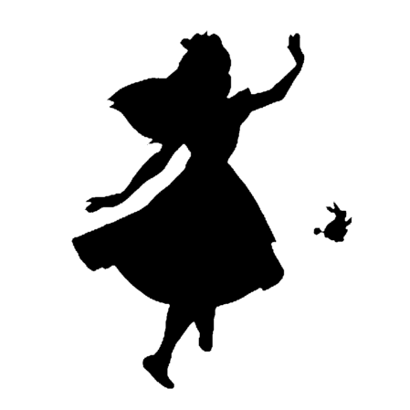
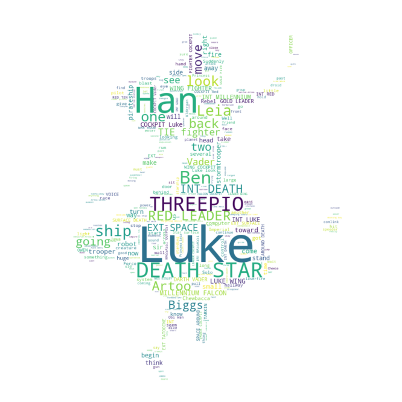
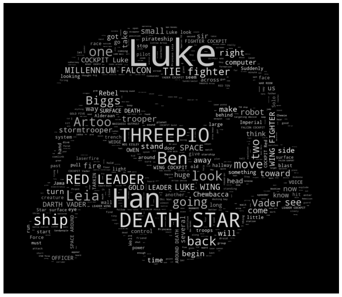

```python
from wordcloud import WordCloud, STOPWORDS

import numpy as np
from PIL import Image
```


```python
text = open('../data/09. alice.txt').read()
alice_mask = np.array(Image.open('../data/09. alice_mask.png'))

stopwords = set(STOPWORDS)
stopwords.add("said")
```


```python
import matplotlib.pyplot as plt
import platform

path = "c:/Windows/Fonts/malgun.ttf"
from matplotlib import font_manager, rc
if platform.system() == "Darwin":
    rc('font', family='AppleGothic')
elif platform.system() == "Windows":
    font_name = font_manager.FontProperties(fname=path).get_name()
    rc('font', family=font_name)
else:
    print('Unknown System... sorry~~~')
    
%matplotlib inline
```


```python
plt.figure(figsize=(8,8))
plt.imshow(alice_mask, cmap=plt.cm.gray, interpolation='bilinear')
plt.axis('off')
plt.show()
```





```python
wc = WordCloud(background_color="white", max_words=2000, mask=alice_mask, stopwords = stopwords)
wc = wc.generate(text)
wc.words_
```


    {'Luke': 1.0,
     'Han': 0.45904761904761904,
     'DEATH STAR': 0.4266666666666667,
     'THREEPIO': 0.37523809523809526,
     'Ben': 0.2914285714285714,
     'ship': 0.21523809523809523,
     'Leia': 0.2019047619047619,
     'one': 0.18285714285714286,
     'look': 0.16952380952380952,
     'RED LEADER': 0.16952380952380952,
     'Artoo': 0.16380952380952382,
     'back': 0.15619047619047619,
     'move': 0.14857142857142858,
     'going': 0.13904761904761906,
     'two': 0.13142857142857142,
     'Biggs': 0.13142857142857142,
     'INT DEATH': 0.1295238095238095,
     'TIE fighter': 0.1295238095238095,
     'EXT SPACE': 0.12761904761904763,
     'Vader': 0.12571428571428572,
     'see': 0.1219047619047619,
     'MILLENNIUM FALCON': 0.1219047619047619,
     'toward': 0.1180952380952381,
     'right': 0.1180952380952381,
     'LUKE WING': 0.1180952380952381,
     'come': 0.11619047619047619,
     'trooper': 0.11428571428571428,
     'robot': 0.10857142857142857,
     'small': 0.10666666666666667,
     'now': 0.09904761904761905,
     'WING FIGHTER': 0.09904761904761905,
     'take': 0.09714285714285714,
     'begin': 0.09714285714285714,
     'make': 0.09523809523809523,
     'away': 0.08952380952380952,
     'fire': 0.08952380952380952,
     'will': 0.08952380952380952,
     'INT MILLENNIUM': 0.08952380952380952,
     'turn': 0.08761904761904762,
     'stand': 0.08761904761904762,
     'stormtrooper': 0.08761904761904762,
     'INT LUKE': 0.08761904761904762,
     'way': 0.0838095238095238,
     'side': 0.08190476190476191,
     'pirateship': 0.08,
     'COCKPIT Luke': 0.08,
     'sir': 0.07809523809523809,
     'think': 0.07809523809523809,
     'head': 0.07809523809523809,
     'DARTH VADER': 0.07809523809523809,
     'GOLD LEADER': 0.07809523809523809,
     'huge': 0.0761904761904762,
     'got': 0.0761904761904762,
     'us': 0.0761904761904762,
     'time': 0.07428571428571429,
     'computer': 0.07238095238095238,
     'several': 0.07238095238095238,
     'Rebel': 0.07047619047619047,
     'know': 0.07047619047619047,
     'Chewbacca': 0.07047619047619047,
     'SURFACE DEATH': 0.07047619047619047,
     'long': 0.06857142857142857,
     'OFFICER': 0.06857142857142857,
     'across': 0.06857142857142857,
     'OWEN': 0.06857142857142857,
     'EXT': 0.06666666666666667,
     'something': 0.06666666666666667,
     'go': 0.06666666666666667,
     'control': 0.06666666666666667,
     'FIGHTER COCKPIT': 0.06666666666666667,
     'behind': 0.06476190476190476,
     'hit': 0.06476190476190476,
     'light': 0.06476190476190476,
     'EXT TATOOINE': 0.06476190476190476,
     'WING COCKPIT': 0.06476190476190476,
     'Imperial': 0.06285714285714286,
     'around': 0.06285714285714286,
     'Suddenly': 0.06285714285714286,
     'troops': 0.06285714285714286,
     'INT': 0.06095238095238095,
     'eye': 0.06095238095238095,
     'start': 0.06095238095238095,
     'TARKIN': 0.06095238095238095,
     'Luke look': 0.06095238095238095,
     'hand': 0.05904761904761905,
     'another': 0.05904761904761905,
     'hallway': 0.05904761904761905,
     'EXT SURFACE': 0.05904761904761905,
     'little': 0.05714285714285714,
     'VOICE': 0.05714285714285714,
     'face': 0.05523809523809524,
     'blast': 0.05523809523809524,
     'large': 0.05523809523809524,
     'wall': 0.05523809523809524,
     'creature': 0.05523809523809524,
     'give': 0.05333333333333334,
     'run': 0.05333333333333334,
     'pilot': 0.05333333333333334,
     'race': 0.05333333333333334,
     'seem': 0.05142857142857143,
     'Force': 0.05142857142857143,
     'SPACE AROUND': 0.05142857142857143,
     'INT RED': 0.05142857142857143,
     'AROUND DEATH': 0.05142857142857143,
     'door': 0.049523809523809526,
     'system': 0.049523809523809526,
     'stop': 0.049523809523809526,
     'Well': 0.049523809523809526,
     'Jawa': 0.049523809523809526,
     'looking': 0.049523809523809526,
     'Solo': 0.049523809523809526,
     'Star surface': 0.049523809523809526,
     'past': 0.047619047619047616,
     'laserfire': 0.047619047619047616,
     'Alderaan': 0.047619047619047616,
     'pull': 0.047619047619047616,
     'COCKPIT Red': 0.047619047619047616,
     'power': 0.045714285714285714,
     'old': 0.045714285714285714,
     'must': 0.045714285714285714,
     'MASSASSI OUTPOST': 0.045714285714285714,
     'Princess': 0.04380952380952381,
     'sound': 0.04380952380952381,
     'hold': 0.04380952380952381,
     'say': 0.04380952380952381,
     'INT MASSASSI': 0.04380952380952381,
     'WAR ROOM': 0.04380952380952381,
     'RED TEN': 0.04380952380952381,
     'want': 0.0419047619047619,
     'good': 0.0419047619047619,
     'droid': 0.0419047619047619,
     'continue': 0.0419047619047619,
     'dive': 0.0419047619047619,
     'INT DARTH': 0.0419047619047619,
     'GOLD FIVE': 0.0419047619047619,
     'sure': 0.04,
     'front': 0.04,
     'friend': 0.04,
     'wait': 0.04,
     'find': 0.04,
     'standing': 0.04,
     'speeder': 0.04,
     'gun': 0.04,
     'comlink': 0.04,
     'VADER COCKPIT': 0.04,
     'COCKPIT Vader': 0.04,
     'planet': 0.0380952380952381,
     'starship': 0.0380952380952381,
     'sit': 0.0380952380952381,
     'moment': 0.0380952380952381,
     'enter': 0.0380952380952381,
     'thing': 0.0380952380952381,
     'coming': 0.0380952380952381,
     'Obi Wan': 0.0380952380952381,
     'FALCON COCKPIT': 0.0380952380952381,
     'LEADER COCKPIT': 0.0380952380952381,
     'LEADER WING': 0.0380952380952381,
     'close': 0.03619047619047619,
     'group': 0.03619047619047619,
     'let': 0.03619047619047619,
     'attack': 0.03619047619047619,
     'Chewie': 0.03619047619047619,
     'Princess Leia': 0.03619047619047619,
     'MOS EISLEY': 0.03619047619047619,
     'INT GOLD': 0.03619047619047619,
     'targeting device': 0.03619047619047619,
     'short': 0.03428571428571429,
     'much': 0.03428571428571429,
     'watches': 0.03428571428571429,
     'work': 0.03428571428571429,
     'help': 0.03428571428571429,
     'put': 0.03428571428571429,
     'Oh': 0.03428571428571429,
     'father': 0.03428571428571429,
     'position': 0.03428571428571429,
     'point': 0.03428571428571429,
     'trench': 0.03428571428571429,
     'docking bay': 0.03428571428571429,
     'OUTPOST WAR': 0.03428571428571429,
     'weapon': 0.03238095238095238,
     'along': 0.03238095238095238,
     'hear': 0.03238095238095238,
     'shut': 0.03238095238095238,
     'heard': 0.03238095238095238,
     'last': 0.03238095238095238,
     'even': 0.03238095238095238,
     'guard': 0.03238095238095238,
     'laserbolt': 0.03238095238095238,
     'appear': 0.03238095238095238,
     'Artoo Detoo': 0.03238095238095238,
     'far': 0.030476190476190476,
     'Empire': 0.030476190476190476,
     'enough': 0.030476190476190476,
     'explosion': 0.030476190476190476,
     'floor': 0.030476190476190476,
     'follow': 0.030476190476190476,
     'four': 0.030476190476190476,
     'kid': 0.030476190476190476,
     'Sandpeople': 0.030476190476190476,
     'open': 0.030476190476190476,
     'Jabba': 0.030476190476190476,
     'screen': 0.030476190476190476,
     'plan': 0.030476190476190476,
     'explode': 0.030476190476190476,
     'Dodonna': 0.030476190476190476,
     'zoom': 0.030476190476190476,
     'INTERCOM VOICE': 0.030476190476190476,
     'COCKPIT Gold': 0.030476190476190476,
     'firing': 0.02857142857142857,
     'streak': 0.02857142857142857,
     'electronic': 0.02857142857142857,
     'boy': 0.02857142857142857,
     'next': 0.02857142857142857,
     'minute': 0.02857142857142857,
     'goes': 0.02857142857142857,
     'Commander': 0.02857142857142857,
     'laser': 0.02857142857142857,
     'man': 0.02857142857142857,
     'almost': 0.02857142857142857,
     'tell': 0.02857142857142857,
     'area': 0.02857142857142857,
     'watch': 0.02857142857142857,
     'WEDGE': 0.02857142857142857,
     'formation': 0.02857142857142857,
     'little Artoo': 0.02857142857142857,
     'slowly': 0.02666666666666667,
     'first': 0.02666666666666667,
     'station': 0.02666666666666667,
     'tiny': 0.02666666666666667,
     'giant': 0.02666666666666667,
     'better': 0.02666666666666667,
     'DAY': 0.02666666666666667,
     'speak': 0.02666666666666667,
     'dead': 0.02666666666666667,
     'thought': 0.02666666666666667,
     'big': 0.02666666666666667,
     'second': 0.02666666666666667,
     'really': 0.02666666666666667,
     'three': 0.02666666666666667,
     'Sandcrawler': 0.02666666666666667,
     'beep': 0.02666666666666667,
     'Stay': 0.02666666666666667,
     'arm': 0.02666666666666667,
     'Wookiee': 0.02666666666666667,
     'moon': 0.02666666666666667,
     'battle station': 0.02666666666666667,
     'LUKE Well': 0.02666666666666667,
     'looks around': 0.02666666666666667,
     'beeping sound': 0.02666666666666667,
     'laser cannon': 0.02666666666666667,
     'outside': 0.024761904761904763,
     'corridor': 0.024761904761904763,
     'feet': 0.024761904761904763,
     'place': 0.024761904761904763,
     'subhallway': 0.024761904761904763,
     'rushes': 0.024761904761904763,
     'found': 0.024761904761904763,
     'great': 0.024761904761904763,
     'Rebellion': 0.024761904761904763,
     'cut': 0.024761904761904763,
     'spot': 0.024761904761904763,
     'jump': 0.024761904761904763,
     'Listen': 0.024761904761904763,
     'trying': 0.024761904761904763,
     'never': 0.024761904761904763,
     'need': 0.024761904761904763,
     'Okay': 0.024761904761904763,
     'reaches': 0.024761904761904763,
     'year': 0.024761904761904763,
     'still': 0.024761904761904763,
     'try': 0.024761904761904763,
     'speaker': 0.024761904761904763,
     'THREEPIO Artoo': 0.024761904761904763,
     'laser pistol': 0.024761904761904763,
     'Artoo beeps': 0.024761904761904763,
     'Wan Kenobi': 0.024761904761904763,
     'Imperial TIE': 0.024761904761904763,
     'FALCON GUNPORT': 0.024761904761904763,
     "BIGGS' COCKPIT": 0.024761904761904763,
     'STAR Three': 0.024761904761904763,
     'main': 0.022857142857142857,
     'battle': 0.022857142857142857,
     'battered': 0.022857142857142857,
     'aim': 0.022857142857142857,
     'moving': 0.022857142857142857,
     'Hey': 0.022857142857142857,
     'ROOM': 0.022857142857142857,
     'lot': 0.022857142857142857,
     'keep': 0.022857142857142857,
     'anything': 0.022857142857142857,
     'leave': 0.022857142857142857,
     'canyon': 0.022857142857142857,
     'quite': 0.022857142857142857,
     'speed': 0.022857142857142857,
     'table': 0.022857142857142857,
     'disappear': 0.022857142857142857,
     'use': 0.022857142857142857,
     'Five': 0.022857142857142857,
     'board': 0.022857142857142857,
     'target': 0.022857142857142857,
     'grab': 0.022857142857142857,
     'R2 unit': 0.022857142857142857,
     'Aunt Beru': 0.022857142857142857,
     'Ben Kenobi': 0.022857142857142857,
     'toward Death': 0.022857142857142857,
     'TIE ship': 0.022857142857142857,
     'STAR MAIN': 0.022857142857142857,
     'FORWARD BAY': 0.022857142857142857,
     'Imperial stormtrooper': 0.022857142857142857,
     "INT BIGGS'": 0.022857142857142857,
     'Rebel fighter': 0.022857142857142857,
     'STAR TRENCH': 0.022857142857142857,
     'struggle': 0.02095238095238095,
     'smoke': 0.02095238095238095,
     'near': 0.02095238095238095,
     'horizon': 0.02095238095238095,
     'air': 0.02095238095238095,
     'smile': 0.02095238095238095,
     'sight': 0.02095238095238095,
     'distance': 0.02095238095238095,
     'direction': 0.02095238095238095,
     'approaching': 0.02095238095238095,
     'hatch': 0.02095238095238095,
     'narrow': 0.02095238095238095,
     'life': 0.02095238095238095,
     'bad': 0.02095238095238095,
     'uncle': 0.02095238095238095,
     'blaster': 0.02095238095238095,
     'seen': 0.02095238095238095,
     'line': 0.02095238095238095,
     'shoulder': 0.02095238095238095,
     'master': 0.02095238095238095,
     'become': 0.02095238095238095,
     'range': 0.02095238095238095,
     'cell': 0.02095238095238095,
     'port': 0.02095238095238095,
     'wingmen': 0.02095238095238095,
     'REBEL BLOCKADE': 0.02095238095238095,
     'BLOCKADE RUNNER': 0.02095238095238095,
     'shakes head': 0.02095238095238095,
     'old Ben': 0.02095238095238095,
     'Rebel base': 0.02095238095238095,
     'CONTROL ROOM': 0.02095238095238095,
     'COCKPIT TRAVELING': 0.02095238095238095,
     'new': 0.01904761904761905,
     'home': 0.01904761904761905,
     'half': 0.01904761904761905,
     'Hurry': 0.01904761904761905,
     'young': 0.01904761904761905,
     'end': 0.01904761904761905,
     'soldier': 0.01904761904761905,
     'getting': 0.01904761904761905,
     'course': 0.01904761904761905,
     'worry': 0.01904761904761905,
     'fight': 0.01904761904761905,
     'part': 0.01904761904761905,
     'approaches': 0.01904761904761905,
     'sand': 0.01904761904761905,
     'whistle': 0.01904761904761905,
     'distant': 0.01904761904761905,
     'left': 0.01904761904761905,
     'might': 0.01904761904761905,
     'bit': 0.01904761904761905,
     'shoot': 0.01904761904761905,
     'followed': 0.01904761904761905,
     'Uh': 0.01904761904761905,
     'hangar': 0.01904761904761905,
     'able': 0.01904761904761905,
     'blow': 0.01904761904761905,
     'bartender': 0.01904761904761905,
     'fast': 0.01904761904761905,
     'check': 0.01904761904761905,
     'GREEDO': 0.01904761904761905,
     'green': 0.01904761904761905,
     'crew': 0.01904761904761905,
     'flame': 0.01904761904761905,
     'tower': 0.01904761904761905,
     'headset': 0.01904761904761905,
     'Uncle Owen': 0.01904761904761905,
     'HOLD AREA': 0.01904761904761905,
     'TATOOINE MOS': 0.01904761904761905,
     'Han Solo': 0.01904761904761905,
     'control panel': 0.01904761904761905,
     'Imperial fighter': 0.01904761904761905,
     'MAIN FORWARD': 0.01904761904761905,
     'three TIE': 0.01904761904761905,
     'galaxy': 0.017142857142857144,
     'aboard': 0.017142857142857144,
     'human': 0.017142857142857144,
     'rush': 0.017142857142857144,
     'filled': 0.017142857142857144,
     'morning': 0.017142857142857144,
     'seven': 0.017142857142857144,
     'Dark': 0.017142857142857144,
     'mission': 0.017142857142857144,
     'call': 0.017142857142857144,
     'talking': 0.017142857142857144,
     'rest': 0.017142857142857144,
     'background': 0.017142857142857144,
     'shot': 0.017142857142857144,
     'happened': 0.017142857142857144,
     'came': 0.017142857142857144,
     'low': 0.017142857142857144,
     'gets': 0.017142857142857144,
     'may': 0.017142857142857144,
     'HOMESTEAD': 0.017142857142857144,
     'quickly': 0.017142857142857144,
     'garage': 0.017142857142857144,
     'Yeah': 0.017142857142857144,
     'trouble': 0.017142857142857144,
     'tries': 0.017142857142857144,
     'gone': 0.017142857142857144,
     'yell': 0.017142857142857144,
     'closer': 0.017142857142857144,
     'step': 0.017142857142857144,
     'return': 0.017142857142857144,
     'lightsaber': 0.017142857142857144,
     'thousand': 0.017142857142857144,
     'together': 0.017142857142857144,
     'information': 0.017142857142857144,
     'readout': 0.017142857142857144,
     'ready': 0.017142857142857144,
     'burst': 0.017142857142857144,
     'enemy': 0.017142857142857144,
     'climb': 0.017142857142857144,
     'shadow': 0.017142857142857144,
     'adjust': 0.017142857142857144,
     'Dark Lord': 0.017142857142857144,
     'power station': 0.017142857142857144,
     'LARS HOMESTEAD': 0.017142857142857144,
     'old man': 0.017142857142857144,
     'Han Chewie': 0.017142857142857144,
     'Han Chewbacca': 0.017142857142857144,
     'SPACE TIE': 0.017142857142857144,
     'tractor beam': 0.017142857142857144,
     'GARBAGE ROOM': 0.017142857142857144,
     'exhaust port': 0.017142857142857144,
     'INT WEDGE': 0.017142857142857144,
     'COCKPIT Wedge': 0.017142857142857144,
     'ROOM Leia': 0.017142857142857144,
     'adjusts control': 0.017142857142857144,
     'control stick': 0.017142857142857144,
     'trench INT': 0.017142857142857144,
     'armored': 0.015238095238095238,
     'shaking': 0.015238095238095238,
     'scream': 0.015238095238095238,
     'creating': 0.015238095238095238,
     'desert': 0.015238095238095238,
     'white': 0.015238095238095238,
     'Landspeeder': 0.015238095238095238,
     'leaving': 0.015238095238095238,
     'quiet': 0.015238095238095238,
     'heading': 0.015238095238095238,
     'bring': 0.015238095238095238,
     'set': 0.015238095238095238,
     'told': 0.015238095238095238,
     'yelling': 0.015238095238095238,
     'easy': 0.015238095238095238,
     'nothing': 0.015238095238095238,
     'made': 0.015238095238095238,
     'reply': 0.015238095238095238,
     'pay': 0.015238095238095238,
     'best': 0.015238095238095238,
     'strange': 0.015238095238095238,
     'approach': 0.015238095238095238,
     'pop': 0.015238095238095238,
     'edge': 0.015238095238095238,
     'blue': 0.015238095238095238,
     'lost': 0.015238095238095238,
     'center': 0.015238095238095238,
     'mind': 0.015238095238095238,
     'bar': 0.015238095238095238,
     'massive': 0.015238095238095238,
     'view': 0.015238095238095238,
     'walk': 0.015238095238095238,
     'everything': 0.015238095238095238,
     'corner': 0.015238095238095238,
     'button': 0.015238095238095238,
     'transmission': 0.015238095238095238,
     'twenty': 0.015238095238095238,
     'round': 0.015238095238095238,
     'charge': 0.015238095238095238,
     'helmet': 0.015238095238095238,
     'copy': 0.015238095238095238,
     'cover': 0.015238095238095238,
     'Yavin': 0.015238095238095238,
     'peel': 0.015238095238095238,
     'Lord Vader': 0.015238095238095238,
     'TATOOINE ROCK': 0.015238095238095238,
     'EISLEY STREET': 0.015238095238095238,
     'cockpit window': 0.015238095238095238,
     'Two TIE': 0.015238095238095238,
     'LEADER headset': 0.015238095238095238,
     'WEDGE COCKPIT': 0.015238095238095238,
     'hope': 0.013333333333333334,
     'base': 0.013333333333333334,
     'evil': 0.013333333333333334,
     'entire': 0.013333333333333334,
     'craft': 0.013333333333333334,
     'tall': 0.013333333333333334,
     'understand': 0.013333333333333334,
     'escape': 0.013333333333333334,
     'making': 0.013333333333333334,
     'heavy': 0.013333333333333334,
     'hole': 0.013333333333333334,
     'holding': 0.013333333333333334,
     'barely': 0.013333333333333334,
     'lifepod': 0.013333333333333334,
     'flash': 0.013333333333333334,
     'captain': 0.013333333333333334,
     'loose': 0.013333333333333334,
     'soon': 0.013333333333333334,
     'stumbles': 0.013333333333333334,
     'believe': 0.013333333333333334,
     'senator': 0.013333333333333334,
     'dangerous': 0.013333333333333334,
     'send': 0.013333333333333334,
     'signal': 0.013333333333333334,
     'season': 0.013333333333333334,
     'CENTRAL': 0.013333333333333334,
     'join': 0.013333333333333334,
     'always': 0.013333333333333334,
     'feel': 0.013333333333333334,
     'powerful': 0.013333333333333334,
     'glow': 0.013333333333333334,
     'eight': 0.013333333333333334,
     'size': 0.013333333333333334,
     'beam': 0.013333333333333334,
     'metal': 0.013333333333333334,
     'chamber': 0.013333333333333334,
     'pick': 0.013333333333333334,
     'slimy': 0.013333333333333334,
     'stick': 0.013333333333333334,
     'grey': 0.013333333333333334,
     'spaceship': 0.013333333333333334,
     'laughing': 0.013333333333333334,
     'many': 0.013333333333333334,
     'afraid': 0.013333333333333334,
     'message': 0.013333333333333334,
     'bolt': 0.013333333333333334,
     'high': 0.013333333333333334,
     'deep': 0.013333333333333334,
     'lies': 0.013333333333333334,
     'Jedi': 0.013333333333333334,
     'nervously': 0.013333333333333334,
     'general': 0.013333333333333334,
     'precise': 0.013333333333333334,
     'fighter': 0.013333333333333334,
     'lock': 0.013333333333333334,
     'ramp': 0.013333333333333334,
     'lever': 0.013333333333333334,
     'number': 0.013333333333333334,
     'closing': 0.013333333333333334,
     'shaft': 0.013333333333333334,
     'bridge': 0.013333333333333334,
     'swing': 0.013333333333333334,
     'manage': 0.013333333333333334,
     'GUNPORT': 0.013333333333333334,
     'temple': 0.013333333333333334,
     'maneuver': 0.013333333333333334,
     'flying': 0.013333333333333334,
     'Flak': 0.013333333333333334,
     'little robot': 0.013333333333333334,
     'makes beeping': 0.013333333333333334,
     'Imperial Officer': 0.013333333333333334,
     'ROCK CANYON': 0.013333333333333334,
     'FIRST TROOPER': 0.013333333333333334,
     'THREEPIO Oh': 0.013333333333333334,
     'STAR INTERCOM': 0.013333333333333334,
     'STAR GARBAGE': 0.013333333333333334,
     'laser gun': 0.013333333333333334,
     'LEADER speaker': 0.013333333333333334,
     'Leia others': 0.013333333333333334,
     'Gold Two': 0.013333333333333334,
     'heavens': 0.011428571428571429,
     'hidden': 0.011428571428571429,
     'destroy': 0.011428571428571429,
     'awesome': 0.011428571428571429,
     'causing': 0.011428571428571429,
     'passageway': 0.011428571428571429,
     'metallic': 0.011428571428571429,
     'doomed': 0.011428571428571429,
     'loud': 0.011428571428571429,
     'nervous': 0.011428571428571429,
     'figure': 0.011428571428571429,
     'belt': 0.011428571428571429,
     'transport': 0.011428571428571429,
     'circle': 0.011428571428571429,
     'every': 0.011428571428571429,
     'break': 0.011428571428571429,
     'panic': 0.011428571428571429,
     'dome': 0.011428571428571429,
     'neck': 0.011428571428571429,
     'done': 0.011428571428571429,
     'scurry': 0.011428571428571429,
     'fear': 0.011428571428571429,
     'anger': 0.011428571428571429,
     'body': 0.011428571428571429,
     'dust': 0.011428571428571429,
     'dozen': 0.011428571428571429,
     'Fixer': 0.011428571428571429,
     'noise': 0.011428571428571429,
     'surprise': 0.011428571428571429,
     'hot': 0.011428571428571429,
     'working': 0.011428571428571429,
     'forget': 0.011428571428571429,
     'hard': 0.011428571428571429,
     'play': 0.011428571428571429,
     'respond': 0.011428571428571429,
     'rock': 0.011428571428571429,
     'fault': 0.011428571428571429,
     'mouth': 0.011428571428571429,
     'whole': 0.011428571428571429,
     'taken': 0.011428571428571429,
     'men': 0.011428571428571429,
     'beside': 0.011428571428571429,
     'carefully': 0.011428571428571429,
     'form': 0.011428571428571429,
     'thirty': 0.011428571428571429,
     'lead': 0.011428571428571429,
     'pointing': 0.011428571428571429,
     'Thank': 0.011428571428571429,
     'notice': 0.011428571428571429,
     'wonder': 0.011428571428571429,
     'either': 0.011428571428571429,
     'knew': 0.011428571428571429,
     'mean': 0.011428571428571429,
     'watching': 0.011428571428571429,
     'top': 0.011428571428571429,
     'laugh': 0.011428571428571429,
     'TAGGE': 0.011428571428571429,
     'Motti': 0.011428571428571429,
     'cantina': 0.011428571428571429,
     'remain': 0.011428571428571429,
     'TEN': 0.011428571428571429,
     'reach': 0.011428571428571429,
     'doorway': 0.011428571428571429,
     'alarm': 0.011428571428571429,
     'lose': 0.011428571428571429,
     'window': 0.011428571428571429,
     'seeker': 0.011428571428571429,
     'shudder': 0.011428571428571429,
     'clear': 0.011428571428571429,
     'exit': 0.011428571428571429,
     'already': 0.011428571428571429,
     'reward': 0.011428571428571429,
     'alert': 0.011428571428571429,
     'whip': 0.011428571428571429,
     'wave': 0.011428571428571429,
     'jungle': 0.011428571428571429,
     'Hang': 0.011428571428571429,
     'engine': 0.011428571428571429,
     'planet Tatooine': 0.011428571428571429,
     'Imperial Stardestroyer': 0.011428571428571429,
     'Laserbolts streak': 0.011428571428571429,
     'main passageway': 0.011428571428571429,
     'farm boy': 0.011428571428571429,
     'Artoo whistles': 0.011428571428571429,
     'side side': 0.011428571428571429,
     'little droid': 0.011428571428571429,
     'ROCK MESA': 0.011428571428571429,
     'Tusken Raider': 0.011428571428571429,
     'Moff Tarkin': 0.011428571428571429,
     'door slides': 0.011428571428571429,
     'old Jedi': 0.011428571428571429,
     'gantry officer': 0.011428571428571429,
     'BAY SERVICE': 0.011428571428571429,
     'SERVICE PANEL': 0.011428571428571429,
     'target screen': 0.011428571428571429,
     'headset Red': 0.011428571428571429,
     'vast': 0.009523809523809525,
     'bronze': 0.009523809523809525,
     'reactor': 0.009523809523809525,
     'destroyed': 0.009523809523809525,
     'trust': 0.009523809523809525,
     'oil': 0.009523809523809525,
     'six': 0.009523809523809525,
     'waiting': 0.009523809523809525,
     'throws': 0.009523809523809525,
     'Sith': 0.009523809523809525,
     'Everyone': 0.009523809523809525,
     'warrior': 0.009523809523809525,
     'opening': 0.009523809523809525,
     'broken': 0.009523809523809525,
     'bodies': 0.009523809523809525,
     'astro': 0.009523809523809525,
     'somebody': 0.009523809523809525,
     'carrying': 0.009523809523809525,
     'terrified': 0.009523809523809525,
     'CHIEF': 0.009523809523809525,
     'response': 0.009523809523809525,
     'empty': 0.009523809523809525,
     'STREET': 0.009523809523809525,
     'rugged': 0.009523809523809525,
     'Camie': 0.009523809523809525,
     'wildly': 0.009523809523809525,
     'sitting': 0.009523809523809525,
     'blasted': 0.009523809523809525,
     'Yes': 0.009523809523809525,
     'dune': 0.009523809523809525,
     'fall': 0.009523809523809525,
     'forth': 0.009523809523809525,
     'technical': 0.009523809523809525,
     'rather': 0.009523809523809525,
     'ridge': 0.009523809523809525,
     'frantically': 0.009523809523809525,
     'inside': 0.009523809523809525,
     'wide': 0.009523809523809525,
     'stunned': 0.009523809523809525,
     'sorry': 0.009523809523809525,
     'care': 0.009523809523809525,
     'shrouded': 0.009523809523809525,
     'fill': 0.009523809523809525,
     'alone': 0.009523809523809525,
     'slight': 0.009523809523809525,
     'flicker': 0.009523809523809525,
     'eerie': 0.009523809523809525,
     'onto': 0.009523809523809525,
     'middle': 0.009523809523809525,
     'conversation': 0.009523809523809525,
     'tracks': 0.009523809523809525,
     'bounce': 0.009523809523809525,
     'language': 0.009523809523809525,
     'real': 0.009523809523809525,
     'entry': 0.009523809523809525,
     'late': 0.009523809523809525,
     'muffled': 0.009523809523809525,
     'finally': 0.009523809523809525,
     'chrome': 0.009523809523809525,
     'remove': 0.009523809523809525,
     'cruiser': 0.009523809523809525,
     'twelve': 0.009523809523809525,
     'question': 0.009523809523809525,
     'data': 0.009523809523809525,
     'kind': 0.009523809523809525,
     'immediately': 0.009523809523809525,
     'concern': 0.009523809523809525,
     'fine': 0.009523809523809525,
     'agreement': 0.009523809523809525,
     'pushes': 0.009523809523809525,
     'entrance': 0.009523809523809525,
     'final': 0.009523809523809525,
     'furry': 0.009523809523809525,
     'wrong': 0.009523809523809525,
     'terror': 0.009523809523809525,
     'exotic': 0.009523809523809525,
     'piece': 0.009523809523809525,
     'chatter': 0.009523809523809525,
     'fool': 0.009523809523809525,
     'direct': 0.009523809523809525,
     'location': 0.009523809523809525,
     'alien': 0.009523809523809525,
     'hundred': 0.009523809523809525,
     'show': 0.009523809523809525,
     'drink': 0.009523809523809525,
     'ear': 0.009523809523809525,
     'sword': 0.009523809523809525,
     'paces': 0.009523809523809525,
     'attempt': 0.009523809523809525,
     'avoid': 0.009523809523809525,
     'fly': 0.009523809523809525,
     'money': 0.009523809523809525,
     'idea': 0.009523809523809525,
     'alleyway': 0.009523809523809525,
     'secure': 0.009523809523809525,
     'passing': 0.009523809523809525,
     'couple': 0.009523809523809525,
     'flashes': 0.009523809523809525,
     'quick': 0.009523809523809525,
     'pulled': 0.009523809523809525,
     'monitor': 0.009523809523809525,
     'socket': 0.009523809523809525,
     'level': 0.009523809523809525,
     'ball': 0.009523809523809525,
     'shake': 0.009523809523809525,
     "ain't": 0.009523809523809525,
     'camera': 0.009523809523809525,
     'crewmen': 0.009523809523809525,
     'worried': 0.009523809523809525,
     'guy': 0.009523809523809525,
     'leading': 0.009523809523809525,
     'lean': 0.009523809523809525,
     'READ': 0.009523809523809525,
     'draw': 0.009523809523809525,
     'technician': 0.009523809523809525,
     'TATOOINE DESERT': 0.009523809523809525,
     'Luke Skywalker': 0.009523809523809525,
     'nowhere sight': 0.009523809523809525,
     'know talking': 0.009523809523809525,
     'Yes sir': 0.009523809523809525,
     'dune sea': 0.009523809523809525,
     'far end': 0.009523809523809525,
     'astro droid': 0.009523809523809525,
     'Help Obi': 0.009523809523809525,
     'restraining bolt': 0.009523809523809525,
     'Jedi Knight': 0.009523809523809525,
     'Grand Moff': 0.009523809523809525,
     'giant Wookiee': 0.009523809523809525,
     'darkly clad': 0.009523809523809525,
     'slides open': 0.009523809523809525,
     'clad creature': 0.009523809523809525,
     'Governor Tarkin': 0.009523809523809525,
     'let go': 0.009523809523809525,
     'races past': 0.009523809523809525,
     'command office': 0.009523809523809525,
     'MAIN HanGAR': 0.009523809523809525,
     'firing laser': 0.009523809523809525,
     'blast door': 0.009523809523809525,
     'planet Yavin': 0.009523809523809525,
     'VOICE speaker': 0.009523809523809525,
     'targeting computer': 0.009523809523809525,
     'fire button': 0.009523809523809525,
     'Vader wingman': 0.009523809523809525,
     'sinister': 0.007619047619047619,
     'stolen': 0.007619047619047619,
     'save': 0.007619047619047619,
     'yellow': 0.007619047619047619,
     'spacecraft': 0.007619047619047619,
     'deadly': 0.007619047619047619,
     'bouncing': 0.007619047619047619,
     'radar': 0.007619047619047619,
     'equipment': 0.007619047619047619,
     'smaller': 0.007619047619047619,
     'tremendous': 0.007619047619047619,
     'duck': 0.007619047619047619,
     'known': 0.007619047619047619,
     'settle': 0.007619047619047619,
     'lone': 0.007619047619047619,
     'wind': 0.007619047619047619,
     'pipe': 0.007619047619047619,
     'sky': 0.007619047619047619,
     'electrobinoculars': 0.007619047619047619,
     'ground': 0.007619047619047619,
     'tight': 0.007619047619047619,
     'joint': 0.007619047619047619,
     'smoldering': 0.007619047619047619,
     'Emperor': 0.007619047619047619,
     'black': 0.007619047619047619,
     'sweeps': 0.007619047619047619,
     'woman': 0.007619047619047619,
     'attention': 0.007619047619047619,
     'alcove': 0.007619047619047619,
     'girl': 0.007619047619047619,
     'companion': 0.007619047619047619,
     'gruesome': 0.007619047619047619,
     'apart': 0.007619047619047619,
     'muted': 0.007619047619047619,
     'pod': 0.007619047619047619,
     'debris': 0.007619047619047619,
     'vehicle': 0.007619047619047619,
     'flies': 0.007619047619047619,
     'city': 0.007619047619047619,
     'sharp': 0.007619047619047619,
     'appearance': 0.007619047619047619,
     'hug': 0.007619047619047619,
     'slightly': 0.007619047619047619,
     'binoculars': 0.007619047619047619,
     'scanning': 0.007619047619047619,
     'freighter': 0.007619047619047619,
     'obvious': 0.007619047619047619,
     'squad': 0.007619047619047619,
     'killed': 0.007619047619047619,
     'snap': 0.007619047619047619,
     'meet': 0.007619047619047619,
     'frozen': 0.007619047619047619,
     'malfunctioning': 0.007619047619047619,
     'within': 0.007619047619047619,
     'trail': 0.007619047619047619,
     'Skyhopper': 0.007619047619047619,
     'gotten': 0.007619047619047619,
     'amazed': 0.007619047619047619,
     'chance': 0.007619047619047619,
     'learn': 0.007619047619047619,
     'starting': 0.007619047619047619,
     'wish': 0.007619047619047619,
     'Maybe': 0.007619047619047619,
     'gargantuan': 0.007619047619047619,
     'dim': 0.007619047619047619,
     'array': 0.007619047619047619,
     'simply': 0.007619047619047619,
     'mechanical': 0.007619047619047619,
     'bangs': 0.007619047619047619,
     'block': 0.007619047619047619,
     'covered': 0.007619047619047619,
     'choice': 0.007619047619047619,
     'sale': 0.007619047619047619,
     'similar': 0.007619047619047619,
     'box': 0.007619047619047619,
     'sparks': 0.007619047619047619,
     'damaged': 0.007619047619047619,
     'harvest': 0.007619047619047619,
     'answer': 0.007619047619047619,
     'recording': 0.007619047619047619,
     'Pardon': 0.007619047619047619,
     'anyone': 0.007619047619047619,
     'hurries': 0.007619047619047619,
     'name': 0.007619047619047619,
     "that'll": 0.007619047619047619,
     'deactivate': 0.007619047619047619,
     'foreground': 0.007619047619047619,
     'monstrous': 0.007619047619047619,
     'ride': 0.007619047619047619,
     'talk': 0.007619047619047619,
     'million': 0.007619047619047619,
     'react': 0.007619047619047619,
     'local': 0.007619047619047619,
     'frightened': 0.007619047619047619,
     'ancient': 0.007619047619047619,
     'yet': 0.007619047619047619,
     'belong': 0.007619047619047619,
     'remember': 0.007619047619047619,
     'pit': 0.007619047619047619,
     'switch': 0.007619047619047619,
     'listening': 0.007619047619047619,
     'operational': 0.007619047619047619,
     'chair': 0.007619047619047619,
     'gain': 0.007619047619047619,
     'bow': 0.007619047619047619,
     'suggest': 0.007619047619047619,
     'fortress': 0.007619047619047619,
     'Bantha': 0.007619047619047619,
     'burning': 0.007619047619047619,
     'stopped': 0.007619047619047619,
     'business': 0.007619047619047619,
     'rough': 0.007619047619047619,
     'giving': 0.007619047619047619,
     'quietly': 0.007619047619047619,
     'careful': 0.007619047619047619,
     'monster': 0.007619047619047619,
     'suit': 0.007619047619047619,
     'advance': 0.007619047619047619,
     'asking': 0.007619047619047619,
     'drop': 0.007619047619047619,
     'sign': 0.007619047619047619,
     'full': 0.007619047619047619,
     'locked': 0.007619047619047619,
     'visible': 0.007619047619047619,
     'insect': 0.007619047619047619,
     'grim': 0.007619047619047619,
     'type': 0.007619047619047619,
     'transmitter': 0.007619047619047619,
     'overhead': 0.007619047619047619,
     'scope': 0.007619047619047619,
     'hyperspace': 0.007619047619047619,
     'violently': 0.007619047619047619,
     'Dantooine': 0.007619047619047619,
     'remote': 0.007619047619047619,
     'anyway': 0.007619047619047619,
     'lighted': 0.007619047619047619,
     'crosses': 0.007619047619047619,
     'straight': 0.007619047619047619,
     'pirate': 0.007619047619047619,
     'running': 0.007619047619047619,
     'buzz': 0.007619047619047619,
     'NINE': 0.007619047619047619,
     'checked': 0.007619047619047619,
     'command': 0.007619047619047619,
     'howl': 0.007619047619047619,
     'rescue': 0.007619047619047619,
     'glance': 0.007619047619047619,
     'situation': 0.007619047619047619,
     'buzzing': 0.007619047619047619,
     'negative': 0.007619047619047619,
     'emerge': 0.007619047619047619,
     'rumble': 0.007619047619047619,
     'pressure': 0.007619047619047619,
     'relief': 0.007619047619047619,
     'abyss': 0.007619047619047619,
     'cloak': 0.007619047619047619,
     'spectacular': 0.007619047619047619,
     'ladder': 0.007619047619047619,
     'soars': 0.007619047619047619,
     'Willard': 0.007619047619047619,
     'activity': 0.007619047619047619,
     'lower': 0.007619047619047619,
     'mike': 0.007619047619047619,
     'rotate': 0.007619047619047619,
     'tail': 0.007619047619047619,
     'pursuit': 0.007619047619047619,
     'wingman': 0.007619047619047619,
     'presses': 0.007619047619047619,
     'mark': 0.007619047619047619,
     'repair': 0.007619047619047619,
     'DESERT WASTELAND': 0.007619047619047619,
     'utility belt': 0.007619047619047619,
     'end hallway': 0.007619047619047619,
     'beautiful young': 0.007619047619047619,
     'STATION DAY': 0.007619047619047619,
     'Imperial Senate': 0.007619047619047619,
     'Kenobi hope': 0.007619047619047619,
     'new droids': 0.007619047619047619,
     'laser rifle': 0.007619047619047619,
     'pushes button': 0.007619047619047619,
     'CONFERENCE ROOM': 0.007619047619047619,
     'TATOOINE WASTELAND': 0.007619047619047619,
     'EISLEY SPACEPORT': 0.007619047619047619,
     'speeder lot': 0.007619047619047619,
     'TARKIN Yes': 0.007619047619047619,
     'DETENTION AREA': 0.007619047619047619,
     'Chewbacca growls': 0.007619047619047619,
     ...}


```python
plt.figure(figsize=(12,12))
plt.imshow(wc, interpolation='bilinear')
plt.axis('off')
plt.show()
```





```python
text = open('../data/09. a_new_hope.txt').read()

text = text.replace('HAN', 'Han')
text = text.replace("LUKE`S", 'Luke')

mask = np.array(Image.open('../data/09. stormtrooper_mask.png'))
```


```python
stopwords = set(STOPWORDS)
stopwords.add("int")
stopwords.add("ext")
```


```python
wc = WordCloud(max_words=1000, mask=mask, stopwords=stopwords, margin=10,
random_state=1).generate(text)

default_colors = wc.to_array()
```


```python
import random

def grey_color_func(word, font_size, position, orientation,
                    random_state=None, **kwargs):
                    return 'hsl(0, 0%%, %d%%)' % random.randint(60,100)
```


```python
plt.figure(figsize=(12,12))
plt.imshow(wc.recolor(color_func=grey_color_func,random_state=3),
            interpolation='bilinear')
plt.axis('off')        
plt.show()
```





```python

```
