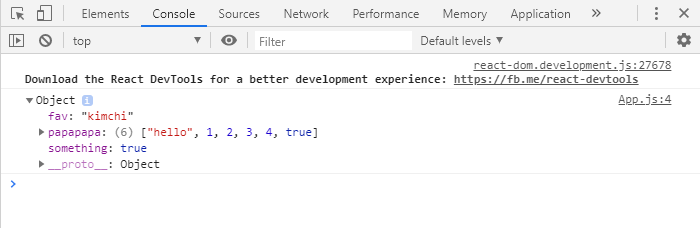
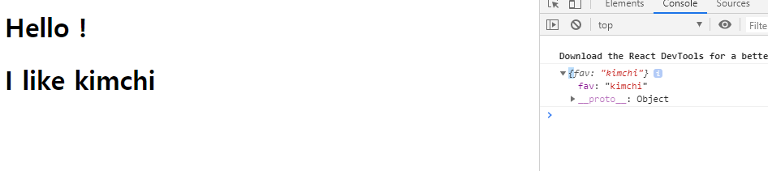

# 1. 리액트 기초


## JSX

#### component : html을 반환하는 함수


```react
ReactDOM.render(<App />, document.getElementById('abc'));
```


와 같은 형식으로 쓰임


<이름 /> 이 컴포넌트고


abc는 html상에 있는 항목의 id이다.


##### 이러한 js와 html을 연결해주는 리액트의 custom 개념을 JSX라고함.


리액트 어플리케이션은 render를 할 때에 하나의 컴포넌트만 접근 가능하다. 

ex)

```react
ReactDOM.render(<App />, <Potato /> document.getElementById('abc'));
```

는 불가능


즉 App component에 중첩해서 써야함. 


```react
import React from 'react';
import Potato from './Potato';

function App() {
  return <div> 
    <h1> Hello ! </h1>
    <Potato />
  
   </div>;
 
}

export default App;

```


이런느낌


### Property (prop)


```react
function Food() {
  return <h1> I like Potato </h1>;
}

function App() {
  return <div> 
    <h1> Hello ! </h1>
  <Food name="kimchi" />
   </div>;
 
}
```


Food 라는 component의 name property 를 kimchi 라는 value를 준 결과.


kimchi와 같은 value를 주었을 때 그 대상을

 

### **props**라고 부른다.


## props를 인자로 받아서 정보 전달하기


```react
function Food(props) {
  console.log(props)
  return <h1> I like Potato </h1>;
}

function App() {
  return <div> 
    <h1> Hello ! </h1>
  <Food 
   fav="kimchi" 
   something={true}
   papapapa ={["hello", 1,2,3,4,true]} 
   />
   </div>;
}
```


App 함수의 Food props들을 

Food 함수에서 인자로 받은 뒤, console log로 출력하는 코드.





결과는 이런식으로 나온다.


## es6( 자바스크립트의 최신버전 )


```react
function Food({fav}) {
  console.log({fav})
  return <h1> I like {fav} </h1>;
}

```


props는 기본적으로 있기 때문에 props.fav를 꺼내오기 위해서 {fav}를 입력함.


```react
function Food(props) {
  console.log(props.fav)
  return <h1> I like {props.fav} </h1>;
}
```


도 같은 결과이다.


결과 : 