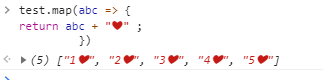
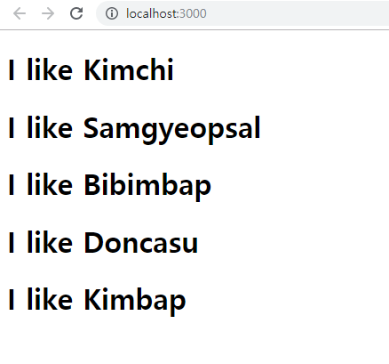

# 2.리액트 동적구현


1에서  푸드들의 배열을 관리하기 위해 const를 선언.


```react
const foodILike = [
  {
    name: "Kimchi",
    image:
      "http://aeriskitchen.com/wp-content/uploads/2008/09/kimchi_bokkeumbap_02-.jpg"
  },
  {
    name: "Samgyeopsal",
    image:
      "https://3.bp.blogspot.com/-hKwIBxIVcQw/WfsewX3fhJI/AAAAAAAAALk/yHxnxFXcfx4ZKSfHS_RQNKjw3bAC03AnACLcBGAs/s400/DSC07624.jpg"
  },
  {
    name: "Bibimbap",
    image:
      "http://cdn-image.myrecipes.com/sites/default/files/styles/4_3_horizontal_-_1200x900/public/image/recipes/ck/12/03/bibimbop-ck-x.jpg?itok=RoXlp6Xb"
  },
  {
    name: "Doncasu",
    image:
      "https://s3-media3.fl.yelpcdn.com/bphoto/7F9eTTQ_yxaWIRytAu5feA/ls.jpg"
  },
  {
    name: "Kimbap",
    image:
      "http://cdn2.koreanbapsang.com/wp-content/uploads/2012/05/DSC_1238r-e1454170512295.jpg"
  }
];

```


## * 참고 - map function 


const 에서 객체들 뺴오기 


const 객체 .map 을 한 뒤 변수 => { 

명령

}

을 하거나

function(변수)

를쓰면된다.





이런식으로 각 객체에 하트를 붙일 수도 있다.


*console 에서 이모지 찍는 방법은 윈도우 + . 

(윈도우 기준)


## Map 사용 예시


```react
function Food({props}) {
  console.log(props.name)
  return <h1> I like {props.name} </h1>;
}
```


```react
function App() {
  return <div> 
    {foodILike.map(dish => <Food name = {dish.name}/> )}
   </div>;
}

export default App;

```


dish라는 object에서 props들을 출력하는 component예제


결과 : 




## map으로 이름 + 이미지 같이 띄워주기


전체 코드 :

App.js

```react
function Food({name, picture}) {
  console.log({name})
  return <div>  
    <h2>I like {name} </h2> 
     </img>
     </div>;
}

const foodILike = [
  {
    name: "Kimchi",
    image:
      "http://aeriskitchen.com/wp-content/uploads/2008/09/kimchi_bokkeumbap_02-.jpg"
  },
  {
    name: "Samgyeopsal",
    image:
      "https://3.bp.blogspot.com/-hKwIBxIVcQw/WfsewX3fhJI/AAAAAAAAALk/yHxnxFXcfx4ZKSfHS_RQNKjw3bAC03AnACLcBGAs/s400/DSC07624.jpg"
  },
  {
    name: "Bibimbap",
    image:
      "http://cdn-image.myrecipes.com/sites/default/files/styles/4_3_horizontal_-_1200x900/public/image/recipes/ck/12/03/bibimbop-ck-x.jpg?itok=RoXlp6Xb"
  },
  {
    name: "Doncasu",
    image:
      "https://s3-media3.fl.yelpcdn.com/bphoto/7F9eTTQ_yxaWIRytAu5feA/ls.jpg"
  },
  {
    name: "Kimbap",
    image:
      "http://cdn2.koreanbapsang.com/wp-content/uploads/2012/05/DSC_1238r-e1454170512295.jpg"
  }
];


function App() {
  return <div> 
    {foodILike.map(dish => 
    <Food name = {dish.name} picture = {dish.image} /> )}
   </div>;
}

export default App;
```


결과 : 


함수를 따로 선언해주는 방법도 있다.


```react
function renderFood(dish) {
console.log(dish)
return <Food name = {dish.name} picture = {dish.image} />
}

function App() {
  return <div> 
    {foodILike.map(renderFood)}
   </div>;
}
```

